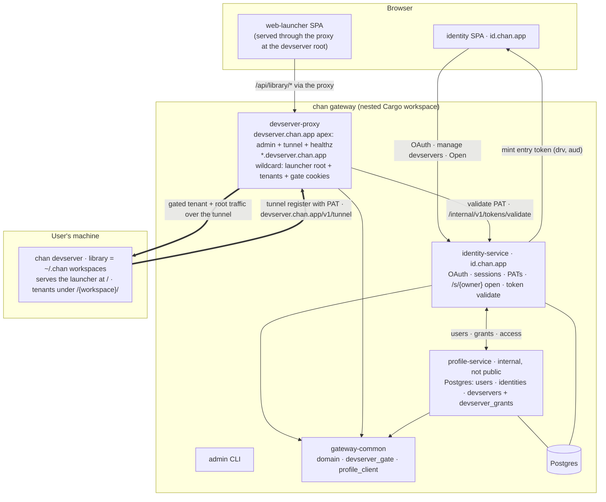

# Gateway

Contribution guidelines for agents and contributors working on the `gateway/` workspace. Source files live under `gateway/`; this file documents them from the shared `.agents/` home.

The gateway is what makes a local `chan devserver` reachable on a public URL with sign-in and sharing, without the user opening a port, configuring DNS, or running a TURN/STUN stack. It terminates the tunnel a devserver dials out, gates every request on the wildcard host, and hands a freshly authenticated browser off from the sign-in surface to the tenant content over a short-lived token. The unit it exposes, gates, and shares is the **devserver** (one per user, resolved from the owner's PAT), not an individual workspace; the `{workspace}` path segment is tenant routing inside that devserver, never a permission key.

## What this workspace is

The `gateway/` Cargo workspace runs the account, sign-in, and reverse-proxy surface for chan.app, a separate nested Cargo workspace. Its crates under `gateway/crates/` are the services in the Topology below, which names each one with the host it answers on and what it owns; each crate's `design.md` is the full surface. The ownership that is not obvious from the layout: `profile` is the only crate that touches the sharing tables (`devservers`, `devserver_grants`); `identity` holds the only cookie session, the PAT tables, and the `/internal/v1/tokens/validate` endpoint the proxy hits on every handshake; `devserver-proxy` holds no Postgres and ships no SPA; `gateway-common` is the single home of the `devserver_gate` JWT envelope and the cross-service clients.

Each public-facing crate ships two docs: `README.md` is the consumer-facing entry (pitch, install, build, route table, env vars) and `design.md` is the canonical design reference (problem, architecture, public surface, key decisions, invariants, error model). Update `design.md` in the same commit as any change that affects HTTP routes, the on-the-wire shape of a public response, the session contract, or the inter-service trust model.

### Topology



The gated path is the tenant traffic the proxy forwards over the tunnel to the wildcard host (the thick arrows): a browser only reaches the devserver after identity has minted an entry token for it and devserver-proxy has exchanged that token for `devserver_gate` plus `devserver_csrf` host-only cookies. devserver-proxy never talks to Postgres; it resolves identity over HTTP at handshake time and keeps the live-tunnel state in an in-process registry.

## Build & Test

```bash
cargo build
cargo test
cargo fmt --check
cargo clippy --all-targets -- -D warnings
```

The Rust toolchain is pinned in `rust-toolchain.toml`. The pre-push hook (`./scripts/install-hooks` to install) runs the same gate as CI; a passing local push will not fail in the cloud.

Database setup for tests (both `profile` and `identity` open a pool against the same gateway database):

```bash
createdb chan_gateway        # dev database
createdb chan_gateway_test   # test database used by integration tests
export DATABASE_URL=postgres://localhost/chan_gateway
```

Only identity-service ships a SPA. Its source is `@chan/profile` and the shared chrome is `@chan/web-shared`, both members of the `./web` npm workspace at the repo root:

```bash
cd web
npm install                          # one install for the whole workspace
npm run build -w @chan/profile       # build the identity SPA bundle (or: make gateway-spa)
```

Per-app dev:

```bash
cd web && npm run dev -w @chan/profile    # vite dev server for id.chan.app
```

A fresh checkout without `web/dist/` still builds; identity's SPA endpoint returns a "frontend not built" banner that points at the right command. devserver-proxy has no SPA.

## Writing Rules

- **No em dashes** in comments or documentation. Use commas, semicolons, parentheses, or separate sentences.
- **Tables**: pure ASCII, target 80 columns, left-aligned, no Unicode box-drawing.
- **Factual**: no marketing language ("just", "easy", "blazing"). Verify every claim against the implementation; flag drift.
- **Comments**: explain WHY, not WHAT. The code shows what; the comment explains the reasoning, the trade-off, or the constraint.

## Workspace Principles

These rules cut across every crate in the `gateway/` Cargo workspace. Per-crate specifics live in each crate's `design.md`.

### Constant-time secret comparisons

Every bearer token, OAuth state value, JWT signature compare, and CSRF-shaped check uses `subtle::ConstantTimeEq` (or an equivalent timing-safe operation). Plain `==` on a secret is never acceptable, even when the rest of the request gates require an authenticated session. The known leak (length inequality short-circuits) is acknowledged in a comment next to each compare.

### HTTP error mapping

Each request-handler crate (`profile`, `identity`, `devserver-proxy`) defines a `thiserror::Error` enum with an `IntoResponse` impl that maps every variant to a precise HTTP status code. Public-facing messages are short and intentionally generic (`unauthorized`, `internal error`, `upstream unreachable`); detailed context goes into the `tracing` log on the server side. `anyhow::Error` is acceptable in `main.rs` and in startup paths; request handlers return explicit thiserror variants.

`gateway_common::profile_client::ProfileError`, `gateway_common::workspace_admin_client::WorkspaceAdminError`, and `gateway_common::devserver_gate::DevserverGateError` are the cross-service client errors. Each consumer maps them onto its local error via a `From` impl so request handlers can `?` straight through.

### Session contract

identity-service owns the only session cookie in the suite: `id_session`, host-only on `id.chan.app` (no `Domain` attribute), `HttpOnly`, `SameSite=Lax`, 30-day inactivity expiry. `Secure` follows `COOKIE_SECURE`. devserver-proxy does not read this cookie.

devserver-proxy writes two host-only cookies on `{user}.devserver.chan.app`, both scoped `Path=/` and not shared with id. `devserver_gate` is HttpOnly, Secure, SameSite=Lax, has a 24h hard exp, and carries an HS256 JWT signed with `DEVSERVER_GATE_SECRET`. `devserver_csrf` is Secure, SameSite=Lax, readable by same-origin launcher JS, and must match `X-Chan-CSRF` on unsafe proxied HTTP methods.

This split is the load-bearing piece of the cross-tenant isolation: no `.chan.app`-scoped cookie exists, so a browser does not auto-attach an id session to a fetch on `evil.devserver.chan.app`. Cookie sharing across the two services is replaced by an explicit entry-token handoff (entry JWT in the URL `?t=`, gate cookies set by devserver-proxy on validation). The whole-host `Path=/` scope is safe precisely because the gate is per-devserver: a collaborator is granted the entire devserver, so there is no non-granted sub-tenant on the same host to isolate the cookie away from. User-to-user isolation rides the host-only `aud` claim, not the cookie path. Unsafe writes need the CSRF mirror because SameSite is site-based, and sibling `*.devserver.chan.app` origins are same-site.

### Reverse-proxy trust boundary

`devserver-proxy` strips hop-by-hop headers (RFC 7230 6.1) on both the request and response legs, **including every header named by the inbound `Connection` value** (also required by 6.1). It drops the inbound `Host`, `Cookie`, `Authorization`, and `X-Chan-CSRF` headers before forwarding (the gate cookies, CSRF mirror, and any user-presented PAT have no business at the tenant's upstream; auth on that leg is the entry handshake plus the tunnel trust boundary). It recomputes `X-Forwarded-For` as `<existing chain>, <peer ip>`, `X-Forwarded-Proto` from `FORWARDED_PROTO` (configured to match the terminator that fronts this listener; default `https`), and `X-Forwarded-Host` from the inbound `Host` header devserver-proxy itself routed on. Inbound `X-Forwarded-Host` / `X-Forwarded-Proto` from clients are NOT trusted; nginx may not scrub them and the gateway must not assume it does. Upstream is reached over a yamux substream owned by an authenticated tunnel; there is no SSRF risk because the upstream URL is never user-supplied. `Set-Cookie` is left intact on the response leg so tenant content can set its own host-only cookies.

Request bodies are bounded by `MAX_REQUEST_BYTES` (default 100 MiB). Response bodies are bounded by `MAX_RESPONSE_BYTES` (default 100 MiB). Setting either to `0` disables the cap. HTTP requests are bounded end-to-end by `REQUEST_TIMEOUT_SECS` (default 60s), including the response body stream (a slow-drip upstream is cut at the deadline via `DeadlineBody`); the same wrapper aborts the upstream conn task on client drop so a bailed request does not strand the yamux substream. WebSockets bypass the total-timeout and use a 300s per-half idle timeout instead.

### Database pools

`profile` and `identity` each open a Postgres pool capped at 4 connections, both against the same gateway database. Postgres non-superuser slots are a shared resource; running both services on a single dev Postgres alongside running tests can otherwise run the slot count out. The cap is documented at each pool-build site. `devserver-proxy`, `admin`, and `gateway-common` hold no DB connection: devserver-proxy resolves identity over HTTP at handshake and keeps its live-tunnel state in an in-process registry.

### Atomic upserts in profile-service

The user / identity / email triangle has a known concurrent first-time-login race (two providers, same email, same user, in the same second). `profile-service` resolves it in a single transaction (`POST /v1/users/upsert-by-identity`); identity-service calls only that endpoint. New code that reaches across users and identities should use the same atomic shape rather than reimplement a multi-step dance.

### Service-to-service bearers

Three distinct bearers, all `openssl rand -hex 32`:

- `PROFILE_AUTH_TOKEN`: identity-service -> profile-service service API. profile-service also accepts `PROFILE_ADMIN_TOKEN` here so a single-token deployment works; the middleware runs both checks unconditionally (`regular | admin`) so a wrong token never short-circuits on the first byte.
- `IDENTITY_INTERNAL_TOKEN`: devserver-proxy -> identity-service `/internal/v1/tokens/validate`. Required; no fallback to `PROFILE_AUTH_TOKEN`. Rotating one does not rotate the other.
- `DEVSERVER_ADMIN_TOKEN`: identity-service and profile-service -> devserver-proxy admin tree. profile uses it on admin block; identity uses it on revoke, delete, and dashboard reads. `DEVSERVER_ADMIN_TOKEN` is a generic cross-service name; the service it points at is devserver-proxy.

Plus one symmetric secret:

- `DEVSERVER_GATE_SECRET`: HS256 signing key shared by identity (mints entry JWTs) and devserver-proxy (verifies entry, mints session JWTs). The env-var name is generic because it is a cross-service shared secret; it names the signing key's role, not the `devserver_gate` cookie it ends up in.

## Contributor Patterns

Per-crate rules that come up often when editing this code. For the full design rationale, read the crate's `design.md`.

### profile

- **Two-tier auth.** Routes use `PROFILE_AUTH_TOKEN` for the service API (`/v1/users/*`, the grant routes, `/v1/auth-audit`) and `PROFILE_ADMIN_TOKEN` for the admin tree (`/v1/admin/*`). Single-token deployments may set them to the same value; the service-API middleware accepts either.
- **Placeholder usernames are deterministic.** New rows seed `username = 'u' || substr(replace(uuid::text, '-', ''), 1, 12)`. identity-service renames on first sign-in; the hard cap of 4 lifetime renames is enforced in `update_username` via a CAS update. Don't invent an alternate seeding scheme.
- **All SQL is parameterized.** Constants like `USER_COLS` are `format!`'d into queries; user input always goes through `.bind()` and `$N`.
- **The devserver is the sharing unit.** `devserver_access(owner, devserver, caller)` is the single per-request access decision: `owner` when caller is the owner, the grant's `role` (`viewer` / `editor`) for a claimed grant, and 404 in every other case (no-grant and unknown-devserver share one shape so the endpoint cannot enumerate shares). A grant gives the WHOLE devserver, not a single workspace; `create_devserver_grant` auto-bootstraps the parent `devservers` row so callers don't need a separate hop.
- **Block fans out server-side.** `POST /v1/admin/users/{id}/block` also calls devserver-proxy `kill_user_tunnels` (best-effort) when a `WorkspaceAdminClient` is configured, so the in-process yamux registrations drop at the same time the DB row changes.

### identity

- **OAuth providers are pluggable.** Each lives at `src/providers/<name>.rs` (github, gitlab, google) behind a small `Provider` trait. Registering a new provider requires one file plus wiring in `Config::from_env`.
- **PAT shape: `chan_pat_<32 random bytes, base64url, no pad>`.** Generated with `OsRng`; the database stores only the SHA-256(token) (base64url), so a table dump leaks no live secrets. Plaintext appears once on the create response.
- **The devserver id is the PAT digest.** `devserver_id_from_pat` is the lowercase-hex SHA-256 of the raw PAT (same digest as the stored hash, hex-encoded). One token identifies one devserver; this 64-char string is the cross-service handle the tunnel registry keys on and the `drv` claim carries. The raw PAT never leaves identity.
- **OAuth callback validates state before provider.** Plain `pending.provider != provider` runs only after a constant-time state compare so timing on the provider check can't be used to oracle the session's expected provider.
- **Session id rotates on login.** `session.cycle_id()` runs at the privilege boundary, before storing `user_id`. Closes session fixation.
- **Token revoke and account delete evict tunnels.** `DELETE /api/tokens/{id}` and profile delete fire devserver-proxy `kill_user_tunnels` best-effort after the DB update.
- **Entry-token mint is the share-landing route.** `GET /s/{owner}` (whole-devserver open) and `GET /s/{owner}/{workspace}` (per-tenant) resolve the owner's single live devserver, call `profile.devserver_access`, mint a 30s entry JWT (`drv` = that live `devserver_id`, `aud` = canonical `{owner}.devserver.chan.app`), and 303 to the proxy with `?t=<jwt>` so the token is minted at click time. `/s/{owner}` is owner-only until the proxy injects a signed caller / role header; grantees use the per-tenant landing.

### devserver-proxy

- **Apex vs wildcard.** `devserver.chan.app` (apex): tunnel + admin + healthz only. `*.devserver.chan.app` (wildcard): tenant content only. A single axum router dispatches on the raw `Host` header (never the `Host` extractor, which would honor a spoofable `X-Forwarded-Host`). The h2c tunnel endpoint runs on a separate internal listener; nginx `grpc_pass`es `/v1/tunnel` on the apex to it.
- **The gate is per-devserver, not per-workspace.** `proxy::handle` looks up the user's single live devserver by the `{user}` host label alone and verifies the cookie's / entry token's `drv` against that devserver id. The `{workspace}` path segment is tenant routing only: it is forwarded into the tunnel unchanged (a segment-preserving forward, only `?t=` stripped) and the devserver routes each tenant internally. There is no path-segment gate key.
- **Auth gate order on the wildcard** (`proxy::handle`): no live devserver for `{user}` -> 404; `/api/devserver/*` (the devserver's local-only management API) -> 404; `?t=<entry-jwt>` -> verify HS256 + exp + aud + drv, mint `devserver_gate` and `devserver_csrf`, 303 to the clean URL; a valid `devserver_gate` cookie (signature + aud + drv) -> pass through; unsafe HTTP methods also require `X-Chan-CSRF` matching `devserver_csrf`; anything else -> 404 or 403 for a failed CSRF check after auth. The same 404 shape covers "unknown devserver", "no token", and "wrong devserver in the cookie" so unauthenticated probes cannot enumerate registrations.
- **The proxy is not the access authority.** The gate never compares `sub` against the registry-cached `owner_id`: that would lock out every accepted grantee. identity already checked `devserver_access` before minting, so a validly-signed entry / session with the right `aud` and `drv` is the authorization assertion. The `aud` claim (= the inbound host) is what enforces user-to-user isolation.
- **Bare wildcard root depends on credentials.** A naked `{user}.devserver.chan.app/` with no `?t=` and no `devserver_gate` cookie redirects to `DASHBOARD_URL` (id.chan.app/workspaces) because devserver-proxy renders no UI. A root that carries a gate credential falls through to the gate and forwards `/` to the devserver root, where the launcher SPA is served.
- **Hop-by-hop stripping is complete.** `HOP_BY_HOP_NAMES` lists the static names; `connection_listed_headers` parses the inbound `Connection` value and strips every name it lists. Both applied on every leg.
- **Two listeners, one Registry.** The h2c tunnel listener and the axum HTTP listener share the in-process `Registry`. A registration on the tunnel listener is visible to the proxy handler on the very next request.
- **JWT alg hard-required.** `gateway_common::devserver_gate::decode` rejects anything other than HS256. No "alg: none" path exists in this codebase.

### admin

- **Three exit codes.** 0 success; 1 upstream/network error; 2 user input error (bad uuid, missing arg); 3 not found. Exit codes are part of the contract for shell wrappers.
- **`--json` everywhere.** TTY default is a `comfy_table` plain-text table; `--json` emits the same data as JSON for jq piping. Adding a new subcommand without `--json` is a regression.

### gateway-common

- **No axum / IntoResponse coupling in data-layer types.** `ProfileError`, `WorkspaceAdminError`, `DevserverGateError`, and `Claims` are plain thiserror / serde. Each consumer maps via `From` for its local error.
- **`User` is the superset.** The struct carries every field profile-service can return; consumers ignore the fields they don't need. Don't fork the struct per consumer.
- **`devserver_gate` is the single source of JWT shape.** Both identity (mint entry) and devserver-proxy (verify entry, mint + verify sessions) call through this module. The HS256 alg is hard-required on every decode, and the `aud` + `drv` claims are matched in-band by the caller. Gateway callers canonicalize `aud` as a lowercase host with default ports stripped and non-default ports preserved.

## Documentation

- **Workspace overview**: [`gateway/README.md`](../gateway/README.md)
- **Domain glossary**: [`gateway/CONTEXT.md`](../gateway/CONTEXT.md) fixes the devserver / library / workspace / tenant language; the decision behind the per-devserver model is [`gateway/docs/adr/0001-devserver-is-the-sharing-unit.md`](../gateway/docs/adr/0001-devserver-is-the-sharing-unit.md).
- **Crate design references** (canonical; `README.md` next to each is the consumer-facing entry):
  - [`gateway/crates/profile/design.md`](../gateway/crates/profile/design.md): schema, two-tier auth, atomic upsert, devserver grants, block fan-out.
  - [`gateway/crates/identity/design.md`](../gateway/crates/identity/design.md): OAuth providers, PAT lifecycle, session contract, entry-token mint, dashboard.
  - [`gateway/crates/devserver-proxy/design.md`](../gateway/crates/devserver-proxy/design.md): apex / wildcard split, devserver-gate verify, registry model, reverse-proxy hygiene.
  - [`gateway/crates/admin/design.md`](../gateway/crates/admin/design.md): command surface, output contract, exit codes.
  - [`gateway/crates/gateway-common/design.md`](../gateway/crates/gateway-common/design.md): why a shared crate, what belongs and what does not.
- **Issue tracker**: GitHub repo `fiorix/chan`.
