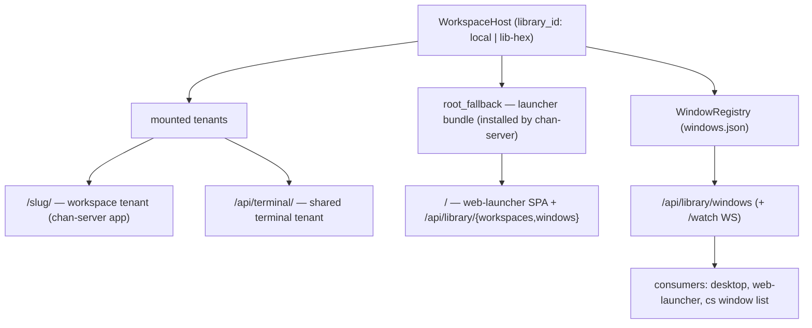

# chan-library — design

The orchestration layer that mounts many tenants under one server and is the single source of truth for
"what windows exist" — identical local or remote.

## What it provides

- **`WorkspaceHost`** mounts workspace tenants at `/{slug}/` and the shared terminal at `/api/terminal/`;
  `host_dispatch` routes by prefix. When no tenant prefix matches `/`, it serves an install-once
  **`root_fallback`** router — the higher layer (chan-server) installs the launcher bundle there
  (`install_root_fallback` / `install_launcher_root_fallback`), so the library root serves the
  `web-launcher` SPA + `/api/library/*` instead of 404ing. The hook keeps the frontend bundle out of this
  low-level crate while letting the root live in `host_dispatch` (chan-server depends on chan-library, not
  the reverse).
- **`WindowRegistry`** + the **window feed** `/api/library/windows` (+ `/watch` WS): the authoritative
  `WindowRecord` set, keyed by `library_id` (`local` vs `lib-<hex>`).
- **`/api/library/workspaces`** (list + add/on/off/rm) over the `WorkspaceHost` pub API
  (`open_registered_workspace`, `close_workspace`, …). Mutation is loopback-only (the desktop, single-user,
  token-gated); read-only over the tunnel (the proxy can't forward a verifiable role — grantee mutation
  awaits a signed role header, deferred).
- **Library-owned lifecycle**: first-open one-terminal marker, workspace on/off overlay
  (path-keyed + shared so standalone and devserver-restart reuse a persisted index — no rebuild),
  terminal persistence.

## Boundaries

- No HTTP frontend bundle lives here — chan-library exposes the `root_fallback` *slot*; chan-server (the
  higher layer) fills it. Same dependency direction as the rest of the stack.
- The on/off overlay + persistence are this crate's; consumers (the launcher routes in chan-server) go
  through the `WorkspaceHost` pub API rather than the persistence internals.
