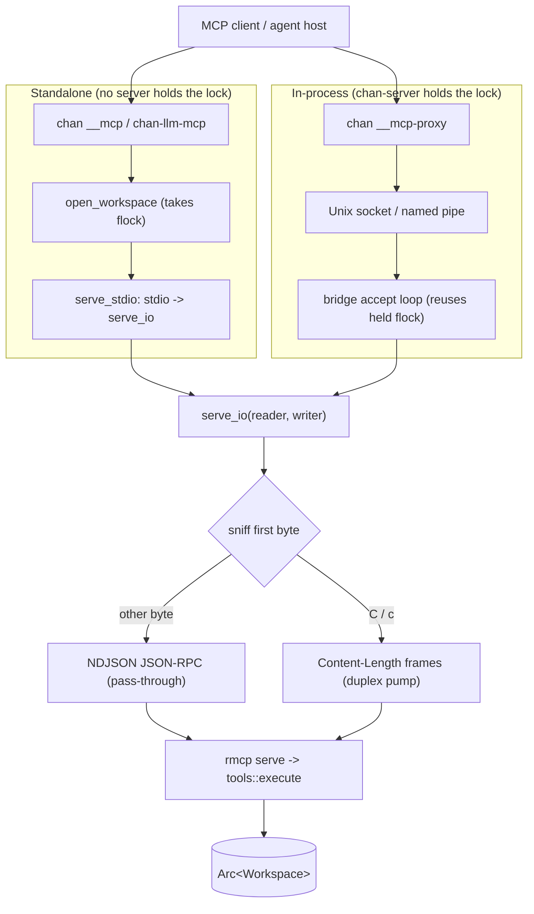

# chan-llm design

`chan-llm` is the MCP-facing tool sandbox for chan workspaces: shared prompt text, JSON tool dispatch, and an MCP server that exposes both to external agents. It does not own an in-app chat session, transcript persistence, agent subprocess management, or app settings.

## Scope

In scope:

  - Shared prompts and tool descriptions for chan workspace access (`prompts`): the default system prompt, a no-tools variant, a session directive for external MCP agents, and the per-tool description constants.
  - Direct tool dispatch through `tools::execute`.
  - MCP stdio / async-I/O hosting behind the optional `mcp` feature, including the standalone `chan-llm-mcp` binary.
  - Media reads for MCP clients, capped by server policy.
  - Typed error passthroughs for chan-workspace write conflicts, write-size limits, listing limits, and refused paths.

Out of scope:

  - HTTP routes, WebSocket events, and frontend state.
  - API key storage and model/provider configuration.
  - Agent transcript/history storage.
  - Spawning or supervising model CLIs.

## Architecture

Both transport entry paths converge on `serve_io`, which sniffs the framing and dispatches every tool call through `tools::execute` onto the shared `Arc<Workspace>`.

`mcp::Server` owns a `ToolContext`, which is just an `Arc<Workspace>`. Each JSON tool call goes through `tools::execute`. MCP handlers run workspace work on `spawn_blocking` so synchronous chan-workspace reads, writes, graph, search, and report work do not pin the async transport worker. The MCP-only `read_media` path still reads through `Workspace::read`, so it keeps the same path sandbox and regular-file checks that the editor uses.

`serve_stdio` is used by the standalone `chan-llm-mcp` binary and by `chan __mcp`. `serve_io` is used by chan-server's MCP bridge: the server already holds the workspace lock, so it hosts the MCP service in-process over a Unix-domain socket and lets child processes proxy stdio to that socket (`chan __mcp-proxy`).

Both transports sniff the first bytes of the stream and accept either newline-delimited JSON-RPC or LSP-style `Content-Length` framing; framed clients are adapted through an internal duplex pump, so clients of either convention connect without configuration.

## Tools

Text tools are defined as `StandardTool` and dispatched by name:

  - `read_file`
  - `write_file`
  - `list_files`
  - `resolve_path`
  - `search_content`
  - `repo_report`
  - `graph_neighbors`
  - `graph_tags`
  - `graph_files_with_tag`

`read_media` is exposed only by the MCP server because it returns MCP image content blocks or embedded PDF blob resources rather than a JSON text result. Supported media matches chan-workspace's Image and Pdf classes: `.png`, `.jpg`, `.jpeg`, `.gif`, `.webp`, `.svg`, `.avif`, and `.pdf`.

Writes are full-file replacements. `write_file` accepts `expected_mtime_ns` for compare-and-swap semantics and maps chan-workspace conflicts into `LlmError::WriteConflict`. `resolve_path` is metadata-only: it maps a chan public path to the physical host path (for shell tools that need a cwd) without reading or writing content.

Responses are capped so a runaway call cannot bloat a model turn: `read_file` truncates past 256 KiB (with a `truncated` marker), `list_files` caps at 2,000 entries, `search_content` clamps `limit` to 100, `repo_report` returns at most 200 per-file rows, and `write_file` rejects content above the 2 MiB chan-workspace text-write limit before crossing the dispatch boundary.

Tool descriptions live as constants in `prompts` and are duplicated as string literals inside the `#[tool(description = ...)]` attributes in `mcp.rs` (the rmcp macros only accept literals); the `mcp_descriptions_match_prompts` test pins the two copies together so drift breaks the build.

## Configuration

The library has no model/provider config. MCP media size is server policy:

  - default: `DEFAULT_MCP_MEDIA_MAX_BYTES` (10 MiB)
  - override: `Server::with_max_media_bytes(bytes)`
  - standalone binary: `--max-media-bytes <N>`

`chan-llm-mcp --config <path>` points at the chan-workspace registry config, not an LLM settings file.

## Error Boundary

`LlmError` is intentionally small:

  - `Tool`
  - `Core`
  - `WriteConflict`
  - `WriteTooLarge`
  - `ListingTooLarge`
  - `PathRefused`
  - `Io`
  - `Mcp`

Public error variants stay matchable for hosts while preserving the original chan-workspace display text for user-facing messages.

The MCP layer additionally scrubs outgoing error strings (`mcp_safe_message`): chan-workspace Display text can carry host absolute paths (`SpecialFile`, `SymlinkEscape`), and the MCP client may be a third-party process. Across that boundary errors surface as the variant category plus model-actionable numbers (sizes, mtimes, caps), never the host filesystem layout.
