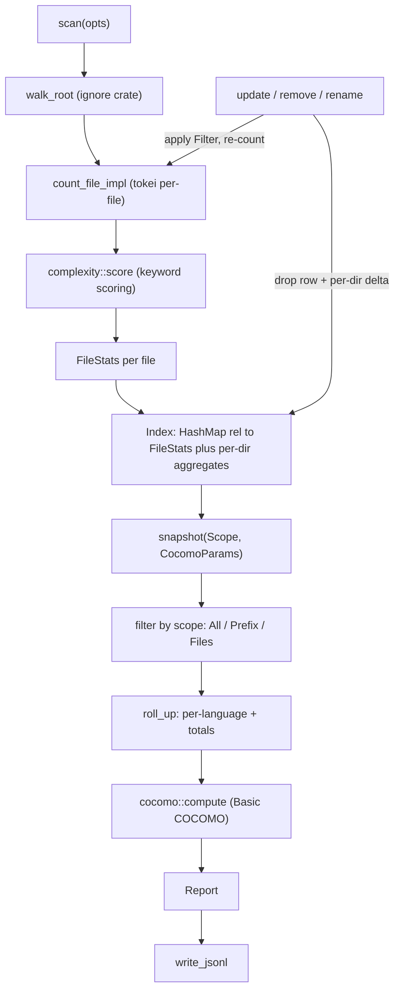

# chan-report design

Canonical design reference for `chan-report`. Update in the same commit as any change that affects the exported interface shape, the on-disk JSONL schema, the COCOMO model defaults, or the rules the walker applies.

## 1. Problem and scope

`chan-report` produces a structured report about the contents of a directory tree: per-file language, SLOC, comments, blanks, a keyword-based complexity score, plus per-language roll-ups and a Basic COCOMO summary computed from the totals. It is the data backend behind chan-workspace's per-workspace report (`Workspace::report()` and the watcher-fed incremental state) and, through it, the `repo_report` assistant tool and chan-server's report endpoints.

In scope:

  - Walk a directory with gitignore-aware filtering.
  - Identify language per file using `tokei`'s detector (extension + shebang).
  - Count code / comments / blanks per file.
  - Compute a cheap, language-aware complexity score (keyword counts: `if`, `for`, `while`, `case`, ...).
  - Roll up totals per language and across the whole tree, and maintain a per-directory aggregation for O(1) directory summaries.
  - Compute Basic COCOMO (Organic / Semi-Detached / Embedded).
  - Maintain an in-memory `Index` that supports per-file updates, removals, renames, and scoped snapshots.
  - Serialize / deserialize the index to a stable JSONL format.

Out of scope:

  - Persistence. The crate never writes to disk. The consumer (chan-workspace) atomically writes the JSONL the crate emits.
  - Filesystem watching. The consumer wires its own watcher to `Index::update` / `Index::remove` / `Index::rename`.
  - Cyclomatic or AST-level complexity. The complexity field is a keyword count, documented as such.
  - Git metadata (commits, blame, ranges). Walker respects `.gitignore` but never inspects git history.
  - Multi-root or cross-workspace aggregation. One root per `Index`.

## 2. Architecture overview

Index dataflow: `scan` walks and counts each file into the `Index`; incremental `update` / `remove` / `rename` re-count a single file and patch the per-directory aggregates; `snapshot` filters by scope, rolls up, and runs COCOMO into a `Report` for `write_jsonl`.

  - `Index` is the state. All mutating operations are O(1 file) plus an O(depth) ancestor walk for the directory cache, so a watcher can call them on every event.
  - `Report` is a pure value type computed from `Index` plus a `Scope` and `CocomoParams`. Snapshots never mutate state.
  - The walker is only used during `Index::scan`. Incremental updates take a relative path from the caller and skip the walker entirely.

## 3. Data model contracts

`Index` is the mutable state boundary: it owns the per-file rows, the per-directory aggregation cache, and the accept filter captured during the initial scan. Incremental updates must apply that same filter before changing rows so watcher-driven state converges with a full rescan.

`Report` is a pure snapshot derived from an `Index`, a scope, and COCOMO parameters. Scopes cover the whole tree, a prefix, or an explicit file set, but all produce the same report shape so consumers can render one model.

Update outcomes distinguish real changes from no-ops; chan-workspace uses that signal to debounce JSONL writes. Public data stays serde-friendly and FFI-shaped: owned fields, primitive payloads, one schema version, and one umbrella error type.

### File bucket axis

`FileStats::bucket` classifies each tracked file on a source-code-shaped axis: `Markdown` (notes) vs. `SourceCode { language }` (everything else tokei recognizes). This is the axis chan's graph rendering uses to colour notes differently from code; it is orthogonal to chan-workspace's `FileClass` (the IO-contract axis), which the graph indexer composes with this one for files chan-report does not track (media, binary, unknown). The field is optional and serde-skipped when `None` so JSONL files written without it load cleanly under the same `SCHEMA_VERSION`.

### Subdirectory and per-file queries

A prefix scope rolls up every file under that relative prefix; an explicit-file
scope rolls up only the listed files. Both go through the same `snapshot` path
so the same `Report` structure is returned regardless of scope, and the
`by_language` / `totals` / `cocomo` fields reflect only the scoped subset.
`Index::file(rel)` returns the raw `FileStats` for one file with no roll-up
cost.

`Index::dir_report(dir, params)` is the O(1) read side of a maintained per-directory aggregation: every file's stats contribute to each ancestor directory up to the root (key `""`), updated on each `update` / `remove` / `rename` with an O(depth) ancestor walk. The returned `Report` carries the directory's totals, per-language roll-up (same ordering as the whole-tree roll-up), and a COCOMO over the directory's code total; `files` stays empty because directory inspectors only render the summary. `None` means no tracked file lives at or under the directory. The cache is never persisted; `scan` and `load_jsonl` rebuild it from the file rows.

## 4. JSONL on-disk format

One record per line. `kind` is the discriminator. Records may appear in any order in a single file; consumers index by `kind` + `path` / `name`. Empty lines and lines beginning with `#` are ignored on load.

Rules:

  - Schema is integer-versioned. `load_jsonl` rejects files with a `meta.schema` that does not match the current build with `ChanReportError::SchemaMismatch`. Consumers (chan-workspace) treat that as "discard cache, rescan".
  - Path encoding is POSIX, workspace-relative, no leading slash, no `..`, no embedded `\`. The walker guarantees this on the write side; the loader trusts it.
  - Timestamps are RFC3339 in UTC.
  - `mtime` is optional on `file` records. When absent, the consumer can treat the row as "valid but freshness unknown". Writers populate it when the source mtime is readable.
  - `bucket` is optional on `file` records (see above).
  - Numeric fields are unsigned where possible. Floats appear only in `cocomo` records.
  - Unknown `kind` values are tolerated on load (newer writer, older reader); malformed JSON fails with `JsonlParse` and the offending line number.

The JSONL `file` records alone are sufficient to reconstruct the index; the `language` / `totals` / `cocomo` records are materialized roll-ups for consumers that only need the overview. `load_jsonl` recomputes those from the file records and ignores any persisted roll-ups (treats them as advisory).

## 5. Incremental model

`Index::update(rel)`:

  - Applies the cached `Filter` (hidden / gitignore / exclude_globs) to `rel`. If rejected and a row exists, drops the row and returns `Removed`; otherwise `Skipped`.
  - Calls `count_file` against the stored root. If the file vanished or the counter rejected it, removes any existing row (`Removed`) or returns `Skipped`.
  - Compares the new `FileStats` against the existing row. Returns `Unchanged` when identical; otherwise inserts or updates and returns `Inserted` / `Updated`.

`Index::remove(rel)` is unconditional: drops the row if present and returns `Removed`, else `Unchanged`.

`Index::rename(from, to)` is `remove(from)` plus `update(to)` in one call. When the source row existed but the destination update is `Unchanged` / `Skipped`, the call upgrades the result to `Removed` so the consumer's debouncer flushes.

Every mutation also applies its delta to the per-directory aggregation cache; subtraction saturates at zero so a bookkeeping bug degrades to drift (corrected by the next full rescan) rather than a panic.

`Unchanged` is the signal that lets the consumer skip writing a fresh JSONL. chan-workspace debounces a burst of updates and only calls `write_jsonl` + its atomic-write helper when any outcome was non-`Unchanged`.

## 6. Walker rules

The crate uses the `ignore` crate (same engine as ripgrep) with these settings derived from `ReportOptions`:

  - `respect_gitignore`: when true, honors `.gitignore`, `.ignore`, `.git/info/exclude`, global git excludes, and parent-directory ignore files. `.gitignore` is additionally registered as a custom ignore filename so it works in trees that are not git repos (chan workspaces often aren't); inside a real repo nested `.gitignore` files keep working as usual. Default true.
  - `include_hidden`: when false, skips dotfiles and dot-directories. Default false.
  - `follow_symlinks`: when false, symlinks are listed but not descended. Default false.
  - `exclude_globs`: extra gitignore-style patterns applied on top of the gitignore rules, both during the walk and by the cached incremental filter. chan-workspace passes its index-excluded directory basenames here (`node_modules/`, `target/`, ...) so the report never rolls up dependency trees.

The walker emits relative POSIX paths to the counter. Anything the counter can't classify (no recognized language) is dropped silently; binary content falls back to tokei's path-based parse and is dropped when that fails. Non-UTF-8 paths fail the walk with `ChanReportError::InvalidUtf8Path`.

One known asymmetry: the cached incremental `Filter` reapplies the ROOT `.gitignore` plus the exclude globs, but not nested ignore files deeper in the tree. Nested ignores take effect during a full `scan`; a watcher-driven `update` on a file only a nested `.gitignore` excludes can therefore insert a row that the next full rescan drops.

## 7. Complexity score

Per-file keyword count over a small, language-aware list. Cheap, deterministic, and documented as a heuristic. We deliberately do not implement cyclomatic complexity: the AST work is not worth it for a roll-up. The score is comparable within a language and roughly comparable across closely-related languages, but should never be treated as a defect signal.

The keyword list mirrors scc's: `if`, `else`, `elsif`, `elif`, `for`, `while`, `switch`, `case`, `match`, `do`, `goto`, `continue`, `break`, `try`, `catch`, `except`, `&&`, `||`, `and`, `or`. Alphabetic keywords match on word boundaries; symbolic operators are substring matches. The complexity scorer has a hook for per-language overrides, but every language currently uses the default list.

Files larger than 16 MiB skip the in-memory read: tokei still counts them via its streaming path, but the complexity score is recorded as 0 (the second pass over multi-MB content is not worth it for a heuristic). The same fallback applies to non-UTF-8 content.

## 8. COCOMO

Basic COCOMO is computed from total SLOC (sum of `code` across all included
files). The supported modes are Organic (default), Semi-Detached, and Embedded;
each mode supplies the standard Basic COCOMO coefficients for effort and
schedule. The cost estimate multiplies effort by the configured average monthly
salary and overhead multiplier.

`CocomoParams` defaults:

  - `model = Organic`
  - `avg_monthly_salary_usd = 8000.0`
  - `overhead_multiplier = 2.4`

These are documented in the same place they're read so users can override them per call without recompiling. The `model` field of the JSONL `cocomo` record is the stable label (`basic-organic`, `basic-semi-detached`, `basic-embedded`).

## 9. Tests

Integration coverage uses tempdir-built mixed-language trees and pins the behavioral contracts:

  - Walker: gitignore filtering during scan and update.
  - Counter: language detection, SLOC, and complexity vs. known fixtures written inline.
  - Incremental: distinct `UpdateOutcome`s, rename row movement, and ancestor-chain maintenance for the directory cache.
  - JSONL: write + load round-trips preserve file rows and the directory cache; schema mismatch returns `SchemaMismatch`.
  - Scope: `Prefix` and `Files` produce roll-ups consistent with the per-file rows they include; `dir_report` agrees with the equivalent `Prefix` snapshot.

## 10. Out of scope, explicitly

  - File watching. chan-workspace owns the watcher.
  - Atomic write to disk. chan-workspace owns persistence.
  - Cross-process locking. chan-workspace serializes access behind its own lock (an `RwLock` around the `Index`).
  - Threading. `scan`, `update`, and `snapshot` are synchronous; the consumer owns any worker threads.
  - i18n / non-UTF-8 paths. Walker rejects non-UTF-8 entries with `ChanReportError::InvalidUtf8Path`.
