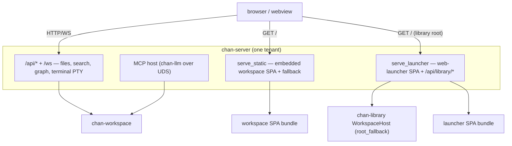

# chan-server — design

The serving layer: turns a workspace (or a terminal) into a web app, hosts the MCP sandbox, and builds
the devserver. Per tenant it builds `Router::new().merge(api).fallback(serve_static)`.

## What it provides

- **Per-tenant API**: files, search, graph, drafts, and the terminal PTY WebSocket — thin
  HTTP/WS over a `chan-workspace` handle.
- **`serve_static`**: serves the embedded workspace SPA per tenant with SPA
  fallback + `inject_chan_meta` (the `chan-prefix` / `settings-disabled` meta).
- **Launcher root**: embeds the launcher SPA and assembles the launcher bundle
  (the `/` SPA plus the `/api/library/{workspaces,windows}` data routes).
  `install_launcher_root_fallback` installs that bundle
  on the `chan-library` `WorkspaceHost` root fallback, so the library/devserver root serves the launcher
  instead of 404ing. The install is **per-surface**: the desktop loopback installs it bearer-`Some` (a
  minted loopback token) with full workspace mutation; the devserver/tunnel installs it bearer-`None`
  (tunnel-trust — the gateway proxy gates the public edge) with workspace mutation **read-only**.
- **MCP host**: hosts `chan-llm` in-process over a Unix socket (+ `chan __mcp-proxy`).
- **Devserver builder**: `build_devserver_app` composes the `WorkspaceHost` + per-tenant
  apps into one merged router for `run_devserver`; `chan devserver` and the desktop loopback run the same app.

## Boundaries

- chan-server depends on `chan-library`, so the launcher assets + handlers live here (the higher layer)
  and are injected into chan-library's root fallback — chan-library never references a frontend bundle.
- Launcher builds are wired into the root web build so clean CI/release builds
  embed a real launcher, not an empty bundle.
