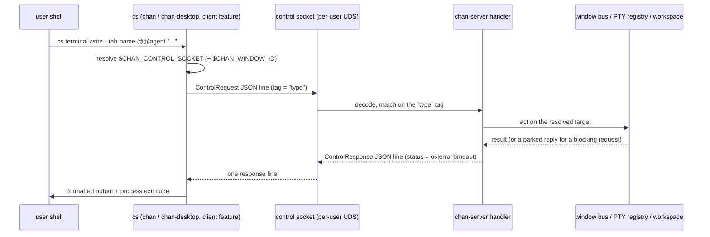
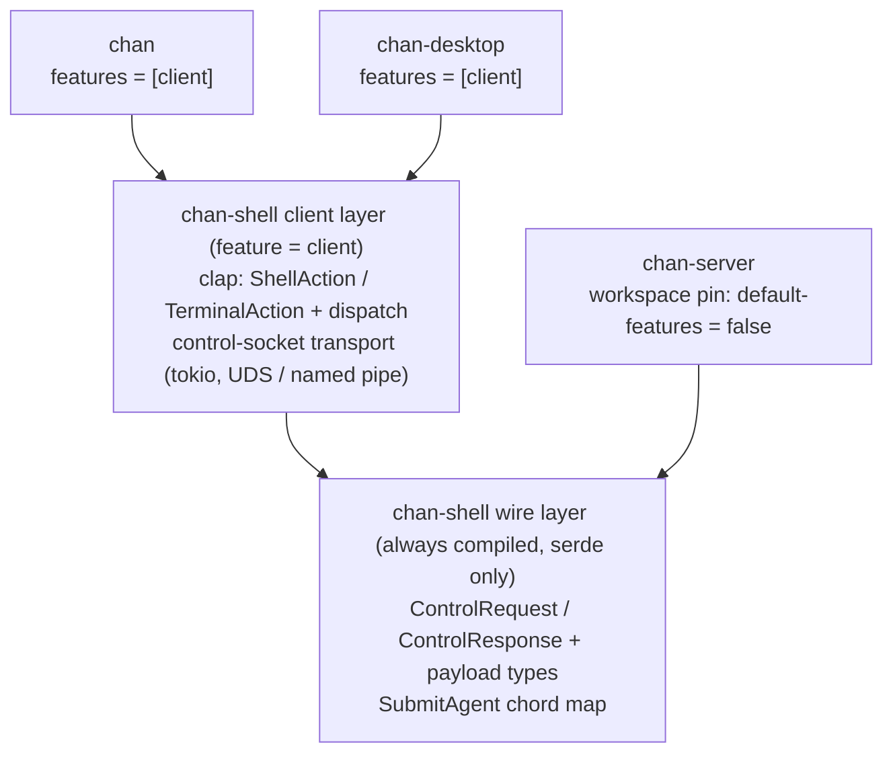
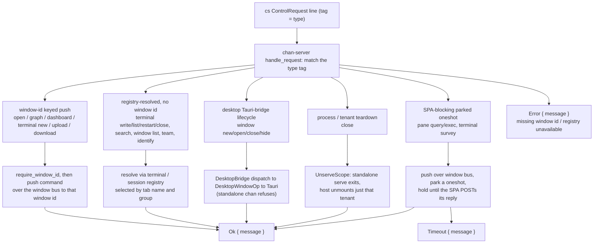

# chan-shell: design

## 1. Problem and scope

chan-shell is the crate behind `cs`, the control client a chan terminal uses to drive the chan-server it is running under. `cs open notes.md`, `cs terminal write`, `cs pane split`, `cs window list`, and `cs terminal survey` all reach the serving process over its control socket and act on the window, the live PTY sessions, or the workspace that process owns. The crate owns BOTH halves of that conversation: the wire contract (the request / response types) AND the client that speaks it. Defining the contract once is the point -- the same `ControlRequest` / `ControlResponse` types are linked by the `cs` client and by chan-server's socket handler, so a tag or field rename moves on both sides in one edit instead of compiling green on one side and breaking every `cs` command at runtime.

The second reason the crate exists is packaging: the `chan` binary and chan-desktop both ship `cs`. Lifting the `cs` CLI and transport out of the `chan` binary into chan-shell lets chan-desktop drive the identical `cs` command tree (and the MCP discovery it carries) without a separate `chan` install on PATH.

In scope:

  - The control-socket wire types: `ControlRequest` / `ControlResponse` and the payload types they carry (`PaneOp`, `SurveySpec`, `SurveyReply`, `SurveyFollowup`, `TeamOp`, `SplitDir`, `Identity`, `ServeKind`). serde-only, no transport, no clap, always compiled.
  - The `cs` clap surface (`ShellAction` / `TerminalAction` and their subcommand trees) and the `dispatch` that turns each parsed action into one control-socket round-trip.
  - The control-socket transport: connect, write one JSON request line, read one JSON response line, over a per-user Unix-domain socket on unix and a named pipe on windows.
  - The agent submit-chord map: the per-agent PTY byte sequences that make a coding agent submit its compose buffer hands-free, plus the spawn-command -> agent derivation. Compiled even without the client feature, because chan-server's team spawner applies the chord server-side.
  - Named client exit codes (the `cs terminal survey --timeout` 124 path) and the typed error that carries one to the dispatch edge.
  - The `arg0` stem checks (`invoked_as_cs` / `invoked_as_chan`) so the `cs` / `chan` alias rewrite is recognized identically by the `chan` binary and by chan-desktop, including under an AppImage `exec -a` shim.

Out of scope, owned by chan-server:

  - Every handler. chan-shell defines the request and response shapes; the server decodes a request, resolves the target window / PTY session / workspace, runs the work (window bus push, PTY write, content search, team generation), and encodes the reply. No handler logic, registry, or window bus lives here.
  - The PTY, the SPA window bus, the workspace store. `cs` is a thin client over them.
  - Control-socket creation, lifetime, and access. The server owns and binds the socket; `cs` only reads its path from the environment a chan terminal exports.

## 2. Architecture overview

A `cs` invocation is one synchronous line-framed round-trip. The client resolves the terminal environment, serializes a `ControlRequest`, writes it as a single JSON line, and reads back a single `ControlResponse` line, which it formats for the user.

  - The client reads two environment values a chan terminal sets: `$CHAN_CONTROL_SOCKET` (which server to reach) and `$CHAN_WINDOW_ID` (which window to act on). Window-targeting actions (`cs open`, `cs upload`, `cs terminal new`) need both; session-scoped actions (`cs terminal list`, `cs search`, `cs window list`) need only the socket, because the server resolves their target through its own registry.
  - Most requests return immediately: the server pushes a window command keyed by window id and acks. A few hold the connection open until a reply lands (a SPA layout query, a survey the user must answer, a window-close confirmation dialog). The single-round-trip transport is what makes the dedicated `Timeout` response shape necessary -- a parked request that never gets answered must surface as a typed timeout rather than a dropped connection.
  - Relative paths are absolutized against the client's cwd before they cross the wire, so `cs open .` and `cs upload sub/` resolve where the user typed them, not where the server runs.

## 3. The feature split: wire-only vs client

chan-shell has two layers behind one `client` Cargo feature. The wire types and the submit-chord map compile with serde alone; the `client` feature adds clap, tokio, and the rest of the CLI and transport stack.

The split exists so chan-server can share the wire contract WITHOUT linking clap or a control-socket client it never uses. The mechanics:

  - chan-shell's own `default` feature is `client`, so a standalone `cargo build -p chan-shell` and the crate's own tests get the full surface.
  - The workspace dependency pin sets `default-features = false`. Every consumer therefore starts wire-only and opts the client layer back in explicitly. chan-server depends with the bare workspace pin (`chan-shell = { workspace = true }`) and gets just the serde types; `chan` and chan-desktop add `features = ["client"]`.
  - The `client` feature gates the only heavy deps: clap, tokio, serde_json, anyhow, and toml. Wire-only chan-server pulls serde and nothing else, which keeps clap and the tokio transport out of the server binary.
  - The submit module is deliberately NOT behind `client`: `SubmitAgent`, `apply_submit_chord`, and `submit_writes` compile unconditionally, because chan-server's server-side team spawner applies the agent submit chord and must read the same map the `cs` client does. Only the `ValueEnum` parse impl for the `--submit` flag is `client`-gated, inside the module.

## 4. The wire model

`ControlRequest` is one internally-tagged enum (`#[serde(tag = "type", rename_all = "snake_case")]`); `ControlResponse` is another (`#[serde(tag = "status", ...)]`). The serde tags ARE the wire format: the JSON `"type"` string is what the server matches a request on, and the `"status"` string is what the client matches a reply on. Both sides are the same Rust type, so the tags move in lockstep, and a dedicated test module pins the exact bytes of a core set of variants so a rename that drifts those bytes is a failing test rather than a green build that breaks at runtime.

Rather than enumerate every variant, the requests group into a handful of families by how the server resolves their target:

Each family resolves its target a different way -- window-id push, registry lookup, a parked SPA round-trip, the desktop bridge, or teardown -- and only the SPA-blocking family can answer `Timeout`. The breakdown:

  - Open a UI tab or action in the originating window. Window-id keyed, non-blocking: the server pushes a window command to exactly that window and returns. `cs open` / `cs graph` / `cs dashboard` / `cs terminal new` / `cs upload` / `cs download`.
  - Act on or inspect live PTY sessions and tenant state through the server's registry. No window id; selected by tab name and/or group. `cs terminal write` / `list` / `restart` / `close` / `scrollback`, `cs search`, `cs window list`, `cs terminal team`, and `chan ps`'s `Identify`.
  - Blocking round-trips to a SPA window's frontend. The layout lives only in the browser, so the server pushes a query / exec over the window bus, parks a oneshot, and holds the connection until the SPA replies. `cs pane` (the read-only layout report and the focus / split / resize / close mutations), and `cs terminal survey` (which blocks until the user answers, defers, or dismisses).
  - Desktop window lifecycle through the in-process Tauri bridge the embedded server installs. `cs window new` / `open` / `rm` / `hide`. A standalone `chan open` has no desktop attached and refuses them.
  - Process and tenant teardown. `chan close` sends `Close { path, remove }`; the server decides scope from the path (a standalone serve exits; a multi-tenant host unmounts just that tenant).

The response side is intentionally narrow: `Ok { message }`, `Error { message }`, or `Timeout { message }`. Structured replies (the `Identity` JSON for `chan ps`, the window-list rows, the session roster rows and the `session self` whoami record, the search hits, the pane layout, the pane-exec result, the team bootstrap script) ride as JSON or raw text inside `Ok.message`, and the CLI formats them -- markdown by default, `--json [--pretty]` for machine output. `Timeout` is split out from `Error` so the client maps an elapsed reply window to its own exit code instead of inferring it from a generic failure or a dropped socket.

Two serde conventions recur because byte-compatibility with the SPA and the server matters. Optional request fields carry both `#[serde(default)]` (the server tolerates an omitted key) and `skip_serializing_if = "Option::is_none"` (the client omits `None`), keeping the emitted JSON minimal while staying loss-tolerant on decode. The SPA-facing payloads (`SurveySpec`, `SurveyReply`) use camelCase, but they differ on how they treat an absent nullable field. `SurveySpec` is the JSON the SPA renders, and its nullable fields (`title`, `followup`) carry `#[serde(default)]` with no `skip_serializing_if`, so they serialize as explicit `null` when unset, because the SPA's TypeScript type mirrors the struct field for field and expects a `string | null` shape. `SurveyReply` is camelCase too, but its one nullable field (`SurveyReply::Followup.followup_path`) keeps `skip_serializing_if = "Option::is_none"` and is omitted when absent: a follow-up with no file is a bare deferral whose `followupPath` key is simply not on the wire.

## 5. The control-socket transport

The client transport layer resolves the environment, makes paths absolute, and round-trips one request. `OpenEnv` carries the `($CHAN_WINDOW_ID, $CHAN_CONTROL_SOCKET)` pair a window-targeting action needs; `control_socket_env` resolves just the socket for a session-scoped action. The env lookups are split from the validation (`open_env_from`) so the validation is unit-testable without mutating the process environment.

`send_control_request` is platform-neutral over a small `transport` module -- the only `#[cfg]`-split surface. On unix it connects a `UnixStream`; on windows it opens a named-pipe client (retrying `ERROR_PIPE_BUSY` and a momentarily-absent pipe under a bounded deadline so a genuinely-missing server still fails fast). Above that split the protocol is identical: serialize the request, append a newline, write it, half-close the write side, then read one response line. The `\n` frames the request, so the half-close is belt-and-suspenders rather than load-bearing.

A `ControlResponse::Timeout` is converted into a typed `ControlTimeout` error instead of a generic `anyhow` bail. The dispatch edge downcasts it, prints the elapsed-window line, and exits `SURVEY_TIMEOUT` (124, matching GNU `timeout(1)`), so a caller can tell "no answer in time" apart from a real failure (exit 1) and a delivered answer (exit 0).

A connect that fails because the socket file is gone or refused means the chan window or server that spawned the terminal has exited, leaving a stale `$CHAN_CONTROL_SOCKET` (common after a devserver restart). The client reports that in plain words rather than surfacing a raw connect trace for a path the user never set by hand.

### Command availability by tenant

The control socket serves two server tenants, and a command's availability follows from what it needs. The server enforces it in one chokepoint (`terminal_tenant_refusal`) so the policy is table-testable in isolation:

- Standalone (runs on both a standalone terminal and a workspace window): `dashboard`, `upload`, `download`, `copy`, `paste`, pathless `terminal new`, `terminal write`/`list`/`restart`/`close`/`scrollback`/`survey`, `window list`, and `pane`. Uploads and downloads are cwd/shell-uid scoped on a standalone terminal and workspace-relative in a workspace window.
- Workspace-only (refused on a standalone terminal, which has no workspace): `open`, `graph`, `search`, `terminal new --path`, every `session` subcommand, and every `terminal team` form including `--script`. The refusals share one message family via `workspace_only_refusal`, and `cs open` additionally points at `chan open PATH`.
- Desktop-only (a separate axis): `window new`/`open`/`rm`/`hide` need the chan desktop app.

The server gate reaches old `cs` binaries immediately (it lives server-side); only the friendlier client wording for a stale socket needs the new binary.

## 6. The agent submit-chord map

A coding agent running inside a chan terminal submits its compose buffer on a different byte sequence depending on which agent it is, so the hands-free completion poke (`cs terminal write --submit=<agent>`) has to append the right one. The submit-chord layer owns that map and the command -> agent derivation, and is the single source of truth mirrored by the SPA's TypeScript detection; the server applies the chord.

`SubmitAgent::derive` maps a spawn command, with an optional `CHAN_AGENT` env override, to the agent whose encoding it uses. The override wins when it names a known agent or an explicit shell (`none` / `shell`); otherwise a loose whole-word sniff of the command recognizes `claude` / `codex` / `gemini` anywhere as a word, so `claude --resume` and `/usr/local/bin/codex-cli` resolve while `claudette` does not.

Each agent has a `{}`-templated chord whose built-in default reproduces the live-probed submit bytes: claude appends the xterm modifyOtherKeys Cmd+Enter CSI (`\x1b[27;9;13~`); codex wraps the text in bracketed paste then a CR (a bare trailing CR gets coalesced into codex's paste burst and lands as a literal newline, so the wrap is what makes it submit); gemini appends a plain CR. The template is overridable at runtime -- env `CHAN_SUBMIT_<AGENT>` beats a process-global map loaded from `<config>/chan/submit.toml`, which beats the default -- so a client that changes its submit behavior does not force a rebuild. Override strings carry C-style escapes (`\e`, `\xHH`, `\r`, ...) so a config value can express control bytes as text.

gemini is the one agent that needs the chord as a SEPARATE PTY write: gemini 0.42 coalesces a bulk `text + CR` write into one read and treats the trailing CR as a newline in its draft, not an Enter. `submit_writes` returns one write for every other agent and two for gemini (the body, then the bare chord), which the caller must deliver as distinct, idle-gated events so the CR registers as its own keypress.

## 7. Interface contracts

The serde wire contract is always compiled and independent of the `client` feature: request tags use `type`, responses use `status`, and the response vocabulary is intentionally only `ok`, `error`, or `timeout`. SPA-facing payloads keep their camelCase/nullability rules from section 4.

The submit-chord map is also wire-layer state, not client-only code. chan-server applies the same agent derivation and write splitting that the `cs` client exposes, so server-spawned teams and terminal-side `cs terminal write --submit` stay byte-compatible.

The `client` feature owns the clap surface and transport. Its flag names, `infer_subcommands` behavior, `$CHAN_CONTROL_SOCKET` / `$CHAN_WINDOW_ID` environment contract, path-absolutization before send, and alias detection for `cs` / `chan` are runtime-visible behavior. A control request returning `Timeout` maps to the dedicated survey-timeout exit code; `Ok.message` remains the carrier for formatted text or embedded JSON.
