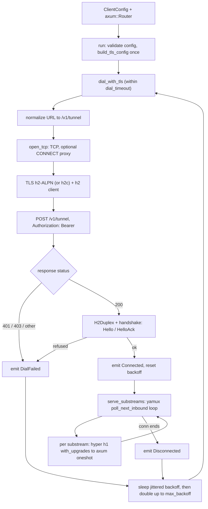

# chan-tunnel-client: design

## Cross-crate context

chan-tunnel has three boundaries: shared wire contracts, this dial-side client
embedded by `chan devserver`, and a terminator embedded by the gateway.

End-to-end shape: `chan devserver` calls `chan_tunnel_client::run(cfg, router)`; the terminator accepts the connection in `serve_tunnel_listener` and registers the devserver in its `Registry`. The dial / handshake / yamux flow is the section-2 diagram below, set in the cross-crate system diagram in [`chan-tunnel-proto/design.md`](../chan-tunnel-proto/design.md).

This document is the dial and handshake reference. The wire format itself lives in chan-tunnel-proto's design.md.

## 1. Problem and scope

A user running `chan devserver` on a box wants their library reachable on a public URL without opening a port or configuring DNS. The constraint is "dial out only, HTTPS only." The shape that fits is one long-lived `POST /v1/tunnel` carrying yamux frames after a short handshake.

This crate owns:

- The TLS + h2 dial path (rustls with native roots, ALPN h2).
- The h2c branch for local dev, restricted to literal loopback or `localhost`; non-loopback tunnel origins must use HTTPS.
- An optional outbound HTTP proxy leg: HTTP/1.1 CONNECT (with Basic auth from the proxy URL's userinfo) before TLS/h2.
- The Hello / HelloAck round-trip over the resulting duplex, including structured server refusals.
- yamux client mode over the post-handshake byte stream.
- Per-substream HTTP/1.1 service via hyper, fed by a user-supplied `axum::Router`.
- A reconnect loop with jittered exponential backoff and a per-attempt timeout.
- A `tokio::sync::mpsc` event channel for "connected / disconnected / dial failed" UI hooks.

Out of scope:

- The wire format (chan-tunnel-proto).
- Server-side validation, registry, or public routing (chan-tunnel-server).
- Token acquisition (the user fetches it; this crate consumes it).

## 2. Architecture overview

*Dial loop: validate, connect, handshake, then serve yamux substreams; any failure or disconnect backs off and re-dials.*

Connection lifecycle:

1. `run` validates the config (token present, workspace name valid, scheme https/http) and builds the rustls config once (caches native roots).
2. Loop: `dial_with_tls` opens TCP (optionally via an HTTP CONNECT proxy), runs TLS for https:// URLs, runs h2, sends `POST /v1/tunnel` with `Authorization: Bearer <token>`, awaits the 200 response, wraps `(SendStream, RecvStream)` in `H2Duplex`, runs `handshake()`.
3. On success: emits `Connected(Registration)`, resets backoff, calls `serve_substreams_with_limit` which polls the yamux connection until it ends, then emits `Disconnected`.
4. On failure: emits `DialFailed { error, retry_in }`.
5. Sleep a jittered backoff (+/- 20%), double the base (capped at `max_backoff`), loop.

## 3. Components / responsibilities

`handshake` and `serve_substreams` are free functions over a generic `S: AsyncRead + AsyncWrite + Unpin + Send + 'static` so wire tests can pass a duplex built from a raw h2 stream and exercise the Hello round-trip without standing up TLS. The same generic lets `dial` pass an `H2Duplex` produced from a real h2 stream.

### Per-substream serving

Before polling an inbound yamux substream, the loop acquires a concurrency permit. This ordering is security-relevant: yamux cannot hand the client an arbitrary backlog of already-accepted streams while every handler slot is busy. A 32-stream, one-permit flood regression pins the bound. For each accepted substream:

1. Wrap the futures-io stream into tokio via `compat()`, then into hyper's IO via `TokioIo::new`.
2. Run `hyper::server::conn::http1::Builder::serve_connection(io, service).with_upgrades()`. The `with_upgrades()` is required so WebSocket 101 responses keep the substream alive.
3. The service is a `tower::service_fn` that converts hyper's `Request<Incoming>` into `Request<axum::body::Body>` and runs the user's router via `tower::ServiceExt::oneshot`.

Each substream is one logical HTTP request from the public side. Stacking h2 here would be mux-on-mux; h1 over yamux is the right shape.

`serve_substreams` caps concurrent handler tasks at `DEFAULT_MAX_CONCURRENT_SUBSTREAMS` (128) via a semaphore. `run` uses `ClientConfig::max_concurrent_substreams` (clamped to >= 1), and direct callers can use `serve_substreams_with_limit`. When the cap is full, the client holds no inbound permit and does not poll yamux for another stream, so floods backpressure at the mux instead of becoming either unbounded accepted streams or unbounded h1 tasks.

### Admission-lease refresh

After registration, the client retains the PAT and periodically opens one outbound yamux control stream containing `LeaseRefreshRequest`. The server revalidates that PAT for the existing registration and replies `Refreshed` or `Refused`; refresh retries use bounded jittered backoff. This is the only client-opened stream. It keeps admission authority shorter-lived than the data connection without placing the PAT in controller state or logs. The request's `Debug` implementation is redacted.

### Reconnect loop and backoff

Exponential, doubled per attempt, capped at `max_backoff`. Reset to `initial_backoff` after a successful registration (not after just the TCP connect, so a server that 200s and then immediately closes still backs off). Each sleep is jittered by +/- 20% so a fleet of clients disconnected by the same server restart does not synchronise into a thundering herd; the jitter source is the low bits of the system clock, which avoids a `rand` dependency.

`dial_timeout` wraps the entire single attempt; without it, an unreachable host hangs each attempt for the OS TCP timeout (minutes), defeating the backoff. Default 30s covers trans-pacific with margin.

### Outbound HTTP proxy (CONNECT)

When `ClientConfig::proxy` is set, `open_tcp` connects to the proxy and issues an HTTP/1.1 `CONNECT host:port`, with `Proxy-Authorization: Basic ...` derived from the proxy URL's userinfo when present. The response headers are read byte-by-byte up to the `\r\n\r\n` terminator (hard-capped at 16 KiB) so no bytes belonging to the tunnelled upstream -- the TLS ClientHello or h2 preface -- are over-read by a buffered reader. Only 2xx CONNECT responses proceed. Only `http://` proxies are supported (plain CONNECT); HTTPS-to-proxy and SOCKS are out of scope. `HTTP_PROXY` / `NO_PROXY` env vars are not honoured automatically so embedders get a deterministic surface.

### TunnelEvent channel

`ClientConfig::events` is an `Option<mpsc::Sender<TunnelEvent>>`. Backpressure: `run` uses `try_send`, so a slow consumer drops events rather than blocking the dial loop. The events are tee material for logs and a UI; missing one isn't load-bearing.

## 4. Runtime contracts

`run` is the long-lived future. Dropping it cancels everything (yamux, the h2 driver task, the in-flight dial). It returns only on configuration errors that retrying cannot recover from (empty token, invalid workspace name, unsupported URL scheme, no native CA roots available).

The config boundary carries connection policy, identity, retry policy, optional proxy settings, the event channel, and the substream concurrency cap. Defaults point at the production tunnel host; callers that bypass `run` can still reuse the same dial / handshake / serve phases for tests and embedded integrations.

A successful registration carries only the public prefix, user, and workspace name assigned by the terminator. Event delivery is best-effort: connected, disconnected, and dial-failed events are useful for UI/logs but never block reconnect progress.

The error surface is intentionally flat. Structured remote refusals preserve the server's stable code for UI matching; transport, TLS, frame, and serialization details collapse before crossing this crate boundary.

## 5. Wire format / framing

The wire format is owned by chan-tunnel-proto. See [`chan-tunnel-proto/design.md`](../chan-tunnel-proto/design.md) sections 2 and 5 for the byte layout, the JSON envelope rationale, the 64 KiB cap, and `H2Duplex`.

Client-specific notes:

- URL normalization: when the configured URL has no path (or just `/`), the dial path substitutes `chan_tunnel_proto::TUNNEL_PATH`, so callers can pass a bare `http://host:port` base and the wire constant stays single-sourced. A non-trivial path is preserved verbatim, so a typo like `/v2/tunnel` still surfaces as a visible 404 instead of being silently corrected.
- Request: `POST {tunnel_url}` with `Authorization: Bearer <token>`, empty body. The "body" is the bidirectional h2 stream the handshake then runs over.
- Response codes that `dial` recognises:
  - `200 OK`: handshake proceeds.
  - `401 UNAUTHORIZED`: bad token. Mapped to `ClientError::Handshake("unauthorized (bad token)")`.
  - `403 FORBIDDEN`: token missing tunnel scope. Mapped to `ClientError::Handshake("forbidden (token missing tunnel scope)")`.
  - anything else: `ClientError::Handshake("unexpected status ...")`.
- After the response headers arrive, `H2Duplex::new(send, recv)` becomes the duplex; `handshake` writes the `Hello` and reads the `HelloAck`. A `HelloAck::Refused` becomes `ClientError::RemoteRefusal { code, message }`; the codes are the `chan_tunnel_proto::error_code` strings, so callers can match known refusals and fall back to the message for unknown codes. A non-V1 ack protocol is a `Handshake` error.
- yamux client mode (`Mode::Client`) over the duplex. Data substreams are inbound; the only outbound stream is the admission-lease refresh protocol.

## 6. Trust boundaries / validation

- **Server certificate**: rustls with `rustls-native-certs` for the trust store, ALPN forced to `h2`. `run` builds the TLS config once and reuses it across reconnects (the macOS keychain walk is expensive); `dial_with_tls` lets other callers do the same.
- **URL scheme gate**: only `https://` and `http://` are accepted, and cleartext is restricted to loopback. A private DNS name is not treated as proof of a protected route. Tunnel URL userinfo is forbidden because authentication is the separate PAT; accepting both would create an ambiguous credential channel and could forward userinfo through URI construction. Userinfo remains supported only on the separately configured loopback HTTP CONNECT proxy URL.
- **Workspace name** (`is_valid_workspace_name` from chan-tunnel-proto): checked before sending `Hello`. The server checks again, but catching it locally avoids a round-trip and surfaces a config error to the user.
- **Token**: empty token is rejected by `run` before the first dial. The token itself is opaque to this crate; the server's `Validator` decides whether it's valid.
- **Proxy credentials**: taken from the proxy URL's userinfo and sent only as the Basic CONNECT header. CONNECT failure messages carry the numeric status but never echo proxy-supplied response text, so a hostile proxy cannot reflect credentials into logs.

## 7. Error model

Single umbrella enum `ClientError` with six variants (see section 4). `From` impls flatten `chan_tunnel_proto::FrameError` and `IoFrameError` through `Display` so the crate boundary stays free of `h2::Error`, `serde_json::Error`, and `rustls::Error`. `RemoteRefusal` is the one structured variant: it preserves the server's stable refusal code for UI matching.

`run` itself returns `Result<(), ClientError>` and only errors on non-recoverable misconfiguration; transient failures (TLS, h2, 401, network) loop with backoff and are surfaced through `TunnelEvent::DialFailed` instead.

## 8. Open questions / future extensions

- Per-leg dial timeouts. Today `dial_timeout` is a single global cap on proxy CONNECT + TCP + TLS + h2 + Hello. Splitting into legs would give better diagnostics (which step stalled) but multiplies the config surface; punted until operators ask.
- TLS session resumption. `build_tls_config` does not configure a session store; every reconnect re-runs the full TLS handshake. For a host that flaps frequently, a small in-process resumption store would shave a round trip.
- HTTP/2 keep-alive (PING). Long idle periods can stall behind intermediaries that drop quiet TCP; today we rely on traffic. Add explicit pings if idle-NAT becomes an issue.
