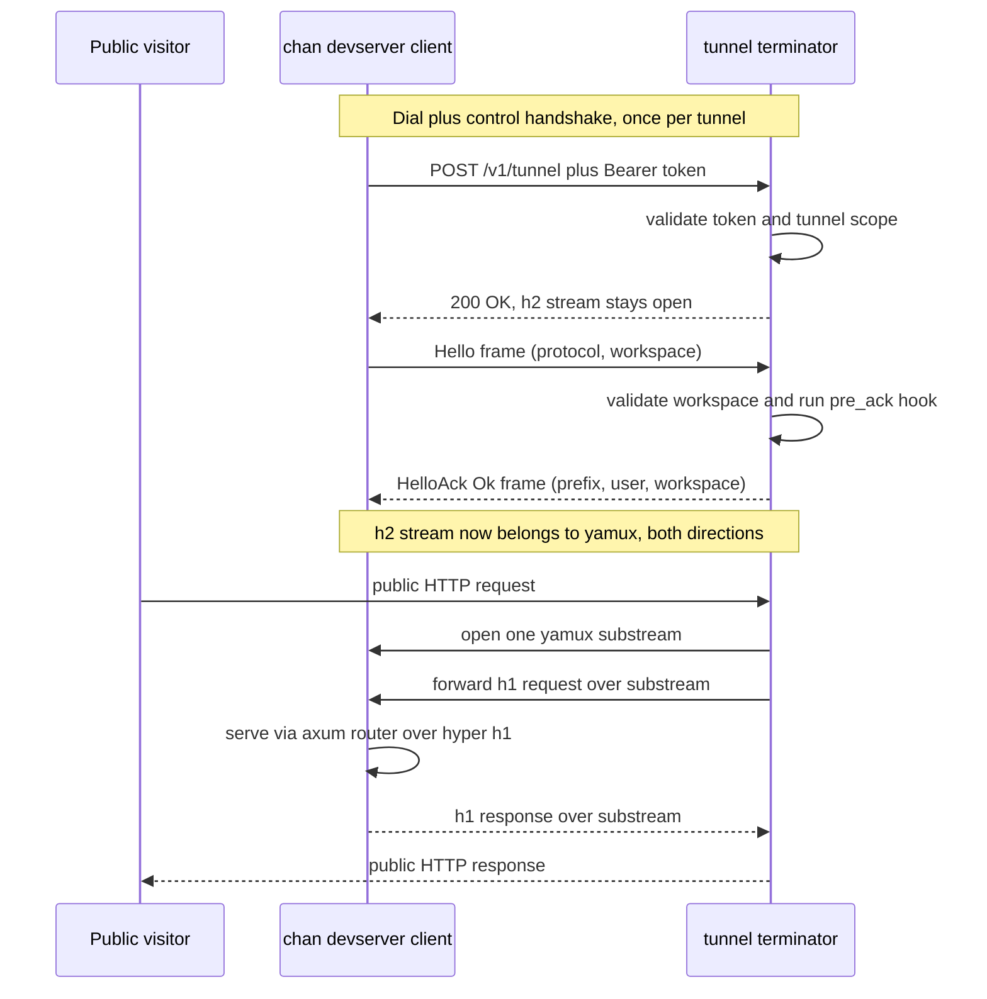

# chan-tunnel-proto: design

## Cross-crate context

chan-tunnel is split into three crates under `crates/`:

- `chan-tunnel-proto` (this crate): the wire types, the sync framing codec, the validators, and the `H2Duplex` adapter. No runtime state.
- `chan-tunnel-client`: the dial side. Embedded in `chan-server`, driven by `chan devserver`.
- `chan-tunnel-server`: the terminator. Owns the `Validator` seam, the live-tunnel `Registry`, and per-request substream forwarding. Embedded by the gateway's `devserver-proxy`.

End to end, `chan devserver` embeds the client and dials the terminator at `POST {tunnel-host}/v1/tunnel`; after the control handshake the single h2 stream becomes a yamux session, and the terminator opens one substream per public request:



The control + data path: one control handshake per tunnel, then a yamux substream per public request.

This document is the canonical reference for the wire format and framing. The client and server design.md files reference back here for any byte-level detail.

## 1. Problem and scope

A chan user wants their local workspace reachable on a public URL without opening a port, configuring DNS, or running a TURN/STUN stack. The constraint is "works through corporate NAT and HTTP-only egress." The shape that fits is one long-lived HTTPS request.

This crate owns:

- Control frames (`Hello`, `HelloAck`) and their JSON serde shape, including the structured refusal codes in `error_code`.
- Length-prefixed framing (`[u32 BE len][json bytes]`) used only for the two control messages.
- Workspace-name and username validators applied identically by client and server (defense-in-depth gate against URL-unsafe identifiers), plus `sanitize_workspace_name`.
- `H2Duplex`: an `AsyncRead + AsyncWrite + Unpin` over an h2 `(SendStream<Bytes>, RecvStream)` pair, feeding the post-handshake byte stream into yamux on both ends.
- `TUNNEL_PATH` and `MAX_CONTROL_FRAME_BYTES`.

Out of scope here, owned by the I/O crates:

- TLS, h2 client/server setup, request routing.
- yamux multiplexing, substream lifecycle.
- Token validation, registry of live tunnels.
- HTTP-level rewriting, X-Forwarded-* injection, upgrade bridging.

## 2. Architecture overview

The end-to-end control and data path is the sequence diagram above (Cross-crate context). This section covers the on-wire framing the two control frames share.

Framing for the two control messages is identical in both directions:

```
+--------+----------------------------+
|  u32   | json bytes                 |
|  BE    | length given by the prefix |
+--------+----------------------------+
0        4                            4 + len
```

After `HelloAck` is fully read on the client and fully written on the server, the byte stream belongs to yamux. The codec in this crate is not used again on that connection.

## 3. Components / responsibilities

The split between the sync codec (`BytesMut`-based `encode_frame` / `decode_frame`) and the async helpers (tokio `read_frame` / `write_frame` over `AsyncRead`/`AsyncWrite`) is deliberate: the sync codec is self-contained and reusable from any I/O loop. The async helpers exist because both real callers run on tokio; a caller on a different runtime would consume the sync codec directly.

## 4. Public API surface

```rust
// Constants
pub const TUNNEL_PATH: &str = "/v1/tunnel";
pub const MAX_CONTROL_FRAME_BYTES: usize = 64 * 1024;

// Control frames
pub struct ProtocolVersion(pub u16); // #[serde(transparent)]
impl ProtocolVersion { pub const V1: ProtocolVersion = ProtocolVersion(1); }

pub struct Hello {
    pub protocol: ProtocolVersion,
    pub client_version: String, // logs only, not routing
    pub workspace: String,
}

#[serde(tag = "kind", rename_all = "snake_case")]
pub enum HelloAck {
    Ok(HelloAckOk),
    Refused(HelloAckErr),
}

pub struct HelloAckOk {
    pub protocol: ProtocolVersion,
    pub prefix: String, // "/{workspace}"
    pub user: String,
    pub workspace: String,
}

pub struct HelloAckErr {
    pub protocol: ProtocolVersion,
    pub code: String,    // stable, machine-readable; see error_code
    pub message: String, // human-readable, safe to surface
}

pub mod error_code {
    pub const TOO_MANY_WORKSPACES: &str = "too_many_workspaces";
    pub const INVALID_WORKSPACE_NAME: &str = "invalid_workspace_name";
    pub const UNSUPPORTED_PROTOCOL: &str = "unsupported_protocol";
    pub const INTERNAL: &str = "internal";
}

// Sync codec
pub fn encode_frame<T: Serialize>(value: &T, out: &mut BytesMut)
    -> Result<(), FrameError>;
pub fn decode_frame<T: DeserializeOwned>(buf: &mut BytesMut)
    -> Result<T, FrameError>;
pub enum FrameError { TooLarge(u32), Incomplete { need: usize }, Json(_) }

// Async helpers (tokio)
pub async fn read_frame<R, T>(r: &mut R) -> Result<T, IoFrameError>
    where R: AsyncRead + Unpin, T: DeserializeOwned;
pub async fn write_frame<W, T>(w: &mut W, value: &T)
    -> Result<(), IoFrameError>
    where W: AsyncWrite + Unpin, T: Serialize;
pub enum IoFrameError { Frame(FrameError), Io(std::io::Error) }

// Workspace + username rules
pub const MAX_WORKSPACE_NAME_LEN: usize = 32;
pub const MAX_USERNAME_LEN: usize = 64;
pub fn is_valid_workspace_name(s: &str) -> bool;
pub fn is_valid_username(s: &str) -> bool;
pub fn sanitize_workspace_name(input: &str) -> Option<String>;

// h2 duplex adapter
pub struct H2Duplex { /* ... */ }
impl H2Duplex {
    pub fn new(send: SendStream<Bytes>, recv: RecvStream) -> Self;
}
// implements AsyncRead + AsyncWrite + Unpin
```

All public types are owned (`String`, plain enums); no borrowed lifetimes. Errors flatten to primitives on `Display` so client and server can surface them through their own umbrella enums without re-exporting `h2::Error` or `serde_json::Error`.

## 5. Wire format / framing

### Why a length-prefixed JSON envelope, not HTTP headers

The handshake fields could in theory ride on the request line or custom headers (`X-Chan-Workspace: notes`, etc.). They don't, for three reasons:

1. The production terminator runs behind nginx with `grpc_pass`. nginx will strip or rewrite arbitrary request headers on h2-to-h2 forwarding depending on configuration; the body is opaque to it. Putting the contract in the body is invariant under proxy churn.
2. The reverse direction (`HelloAck`) needs to carry structured data back to the client (success with `prefix` / `user` / `workspace`, or a refusal with `code` / `message`). HTTP responses could use headers, but then the schemas are asymmetric and adding a field on the response side is a header-name fight rather than a serde additive change.
3. JSON in the body is symmetric, evolvable (`#[serde(default)]`), and trivially testable without standing up h2.

### Why JSON

The control frames are exchanged once per tunnel lifetime; encode cost is irrelevant. JSON is debuggable on the wire, additive-friendly via serde, and avoids a transitive dep on a binary codec the rest of the workspace doesn't already use. A frame costs on the order of 200 B.

### Length prefix

`u32` big-endian. The decoder reads the prefix first so it can size the read buffer before allocating. Without a prefix the decoder would have to scan for end-of-JSON, which is fragile (escaped quotes, embedded objects).

`u32` instead of varint to keep the cap check trivial: any value above `MAX_CONTROL_FRAME_BYTES` is rejected immediately, before any body bytes hit memory.

### MAX_CONTROL_FRAME_BYTES

64 KiB. Real frames are well under 1 KiB. The cap exists because a malicious or buggy peer could send `0xFFFFFFFF` followed by no data; without a cap, the receiver would either OOM trying to allocate a 4 GiB buffer or hang reading a non-existent body. 64 KiB is small enough that even the worst-case allocation is harmless on every target, and large enough for any plausible additive growth.

`encode_frame` checks the cap before writing; `decode_frame` checks it before allocating. Both refuse frames over the cap with `FrameError::TooLarge(len)`.

### No `public` bit (always authenticated)

Earlier revisions carried a `Hello.public` flag (`#[serde(default)]`, so absence decoded as `false`) that asked the terminator to skip its sign-in check for a public workspace; `true` was a privilege-escalation request, gated server-side on an extra token scope (`TUNNEL_PUBLIC_SCOPE`) and refused with `missing_public_scope` when the scope was absent. The per-devserver model removed all of it: the tunnel is always authenticated and there is no anonymous-readable path, so `Hello.public`, `TUNNEL_PUBLIC_SCOPE`, and the `missing_public_scope` refusal are gone. The gateway authorizes a viewer with a single `devserver_access(owner, devserver, caller)` check, where one grant covers the whole library; see `chan-tunnel-server/design.md` and the gateway's `devserver-proxy/design.md`. A legacy client that still sends a `public` key is harmless: `Hello` decoding ignores unknown fields.

### HelloAck: Ok or Refused

`HelloAck` is a `kind`-tagged enum. The success arm carries the registration; the `Refused` arm carries a stable machine-readable `code` plus a human-readable `message`, written into the same stream the success ack would have used. Without it, every pre-ack refusal (cap reached, bad workspace name, unsupported protocol) would surface to the client as a bare transport disconnect, indistinguishable from a network failure. Clients match on known codes and fall back to the `message` for unknown ones, keeping the refusal vocabulary additive.

### HelloAckOk.prefix

Server-assigned public path prefix, shape `/{workspace}` -- one leading slash, no trailing slash. The username is not in the path: the production fronting proxy routes per-user wildcard subdomains (`{user}.devserver.chan.app`), so the host carries the user and the path carries the workspace. chan-server embeds the prefix as `<meta name="chan-prefix">` so the SPA's relative URLs resolve under the workspace without the operator passing a prefix flag.

### ProtocolVersion negotiation

Carried inside `Hello` as a transparent `u16`. The path (`/v1/tunnel`) is a stable mount point and does not bump on version changes; bumping `ProtocolVersion` is reserved for incompatible changes, while additive ones use serde defaults. Only `V1` is defined; the server refuses anything else with the `unsupported_protocol` code, and the client rejects a non-V1 ack.

### H2Duplex

`h2` exposes a request/response as a `SendStream<Bytes>` plus a `RecvStream`. yamux wants a single `AsyncRead + AsyncWrite + Unpin`. `H2Duplex` is the glue:

- `poll_read` pulls a `Bytes` chunk from `RecvStream::poll_data` into an internal pending buffer, copies into the caller's buffer piecemeal, and calls `release_capacity` for the chunk's length so the peer's flow-control window keeps moving. The release is best-effort: a stream the peer already reset errors here and the error is ignored; the next read surfaces it.
- `poll_write` sends up to the currently granted capacity. At zero capacity it calls `reserve_capacity` and loops on `poll_capacity`: h2 can resolve that poll with a zero grant, and returning `Pending` then would hang the writer (the consumed waker is gone), so the loop re-polls until the grant is non-zero, the stream errors, or `poll_capacity` itself returns `Pending`.
- `poll_flush` is a no-op; h2 has no explicit flush.
- `poll_shutdown` issues `send_data(Bytes::new(), true)` once to half-close the write side; subsequent calls are no-ops.

Symmetric: server side's `RecvStream` is the request body and `SendStream` is the response body; client side is the reverse. The adapter doesn't care which.

## 6. Trust boundaries / validation

This crate is the validator surface for two values that flow into public routing: the workspace name (from the client's `Hello`) and the username (from the server's `Validated`).

### Workspace name (`is_valid_workspace_name`)

Rules: 1..=32 ASCII bytes; characters `[a-z0-9-]`; first and last character alphanumeric (no leading/trailing hyphen). Both sides call it: the client refuses to send an invalid name, and the server refuses to accept one (`invalid_workspace_name` refusal). The duplication is intentional -- the server does not trust clients, and the client check surfaces a config error locally without a round-trip.

`sanitize_workspace_name` is a best-effort transform from a free-form string (often the workspace directory's basename) into a valid name: lowercase ASCII, collapse non-alnum runs to single `-`, trim, truncate. Returns `None` when the result would be empty so the caller can prompt the user instead of inventing a name.

### Username (`is_valid_username`)

Slightly looser than the workspace validator because real identity services emit mixed-case names with underscores: ASCII alphanumerics, `-`, `_`; first character alphanumeric (no leading punctuation); 1..=64. Applied by chan-tunnel-server after the validator returns, to keep `Validated::username` from carrying `..` / `alice/bob` / whitespace into public routing.

### Frame-size cap

64 KiB, enforced in both `encode_frame` and `decode_frame` (see section 5).

## 7. Error model

Two enums, both flat:

```rust
pub enum FrameError {
    TooLarge(u32),
    Incomplete { need: usize },
    Json(serde_json::Error),
}

pub enum IoFrameError {
    Frame(FrameError),
    Io(std::io::Error),
}
```

`FrameError::Incomplete` is recoverable: the caller leaves the `BytesMut` untouched, reads at least `need` more bytes, and tries again. Every other variant is terminal for the handshake; the caller closes the stream.

The async helpers return `IoFrameError`; the sync codec returns `FrameError`. Client and server both convert into their own umbrella enums via `From`, flattening through `Display` so `h2::Error` and `serde_json::Error` never appear in their public surfaces.

## 8. Consumers

- `chan-tunnel-client` (this workspace): runtime dep. Imports the control types, `read_frame` / `write_frame`, `is_valid_workspace_name`, `MAX_WORKSPACE_NAME_LEN`, `TUNNEL_PATH`, and `H2Duplex`.
- `chan-tunnel-server` (this workspace): runtime dep. Imports the same control types plus `error_code` and `is_valid_username`.

Transitively:

- `crates/chan-server`: depends on chan-tunnel-client and re-exports `is_valid_workspace_name`, `sanitize_workspace_name`, and `MAX_WORKSPACE_NAME_LEN` (module `chan_server::tunnel`) so the `chan` CLI can validate the user-typed workspace name before dialing.
- `gateway/crates/devserver-proxy` (separate Cargo workspace): chan-tunnel-server at runtime; chan-tunnel-client and this crate as dev-deps for the end-to-end test in `tests/api.rs`.

## 9. Open questions / future extensions

- Multi-workspace over a single tunnel -- already met above the protocol, so no wire change is planned. `chan devserver` registers one tunnel (keyed on its token-resolved devserver id) and the gateway's devserver-proxy routes workspaces by the preserved `{workspace}` path segment, so a whole library rides one h2/yamux session without a `Hello { workspaces: Vec<...> }` shape or a per-workspace registry rework.
- Negotiated frame cap. Both sides hard-code 64 KiB; a larger cap negotiated inside `Hello` would let future versions carry richer initial metadata without a protocol bump.
