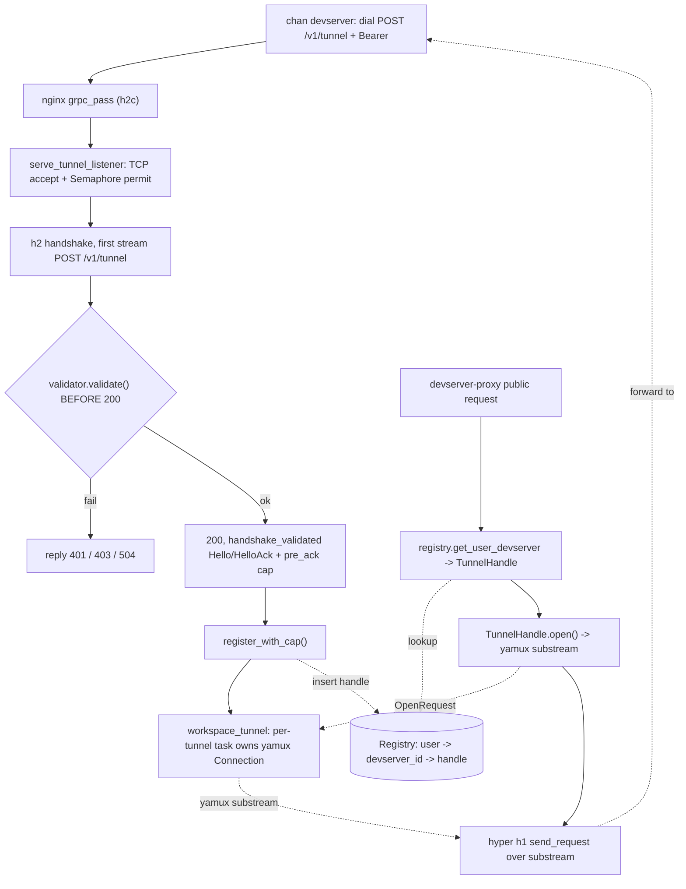
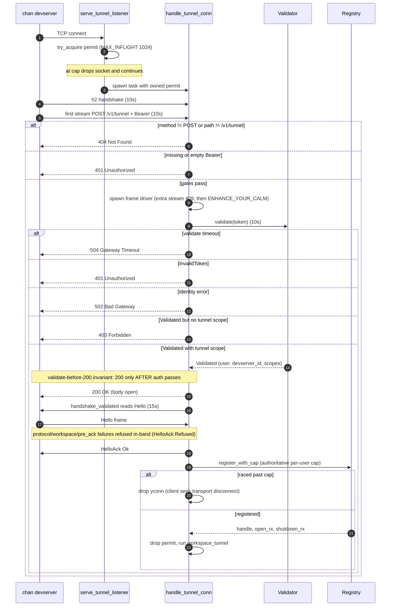

# chan-tunnel-server: design

## Keying and authentication model

The tunnel is per-DEVSERVER and always authenticated:

- The registry's second key is the token-resolved `devserver_id` (`Validated.devserver_id`, lowercase hex SHA-256 of the PAT), not the client's `Hello.workspace` (an ignored `"devserver"` placeholder). One devserver per user carries the whole library through one registration; the `{workspace}` path segment is tenant routing only. The code keeps the historical `workspace` name on the registry's inner key, exported types, and the `workspace_tunnel` task; the value it carries is the `devserver_id`.
- There is no `public` bit anywhere: `Hello.public`, `TUNNEL_PUBLIC_SCOPE`, `ServerError::MissingPublicScope`, the `missing_public_scope` refusal, and the `public` field on `TunnelHandle` / `WorkspaceInfo` / `TunnelInfo` do not exist. A viewer is authorized by the gateway's one `devserver_access(owner, devserver, caller)` check (a grant is the whole library).
- The gateway consumer is `devserver-proxy`; the public host is `{user}.devserver.chan.app`; it mounts its own segment-preserving reverse proxy. The forwarding, cap, and upgrade hygiene lives in that gateway layer; the public-side controls in section 6 document the contract it meets.

## Cross-crate context

chan-tunnel has three boundaries: shared wire contracts, a dial-side client
driven by `chan devserver`, and this terminator embedded by the gateway.

This document covers terminator-side design. The wire format is in chan-tunnel-proto's design.md.

## 1. Problem and scope

The terminator side of chan-tunnel needs to:

- Accept long-lived h2c POSTs from arbitrary `chan devserver` clients.
- Authenticate the bearer token before committing to the body, so bad-token failures return 401 / 403 distinctly (not as a generic handshake error after a 200).
- Run the Hello / HelloAck round-trip and bind the registration to `(validated_user, requested_workspace)`, emitting structured `HelloAck::Refused` frames for policy failures.
- Multiplex per-public-request substreams over the resulting yamux session.
- Expose live tunnels to a public-facing axum router so the host can route public requests at the registered peer.
- Tolerate flap (a `chan devserver` restart should reclaim its registration without waiting for a TCP timeout).

Out of scope:

- TLS termination. The gateway's nginx does it. This crate runs h2c.
- Token issuance / identity. The `Validator` trait is the seam.
- Persistence. The registry is in-memory; a restart drops every tunnel and clients reconnect.
- Wire format (chan-tunnel-proto).

## 2. Architecture overview

*Terminator data path: dial through nginx to the listener, the validate-before-200 handshake into the registry, and the public request path through devserver-proxy back over a yamux substream.*

## 3. Components / responsibilities

### Listener flow

*Listener handshake ordering and the validate-before-200 invariant; the numbered steps below carry the per-stage contracts.*

`serve_tunnel_listener(listener, validator, registry, max_workspaces_per_user)`:

1. `TcpListener::accept`. Try to acquire one permit from a per-listener `Semaphore::new(MAX_INFLIGHT_HANDSHAKES)` (1024). If the semaphore is empty, the TCP socket is dropped and the loop continues; this bounds memory against floods of half-open peers that have not yet hit a per-stage timeout. Otherwise spawn `handle_tunnel_conn` carrying the owned permit.
2. `h2::server::handshake(tcp)` under `H2_HANDSHAKE_TIMEOUT` (10s).
3. First `conn.accept()` under `FIRST_STREAM_TIMEOUT` (10s).
4. Reject `(method != POST) || (path != TUNNEL_PATH)` with 404.
5. Parse `Authorization: Bearer ...` (case-insensitive scheme, SP/HTAB separator, trimmed token); reject missing / empty with
   401.
6. Spawn an h2 frame driver task BEFORE awaiting the validator: the validator may be a network round-trip and h2 only progresses while polled. The task rejects any subsequent stream on the same connection with 409 (clients must only ever open one) and `abrupt_shutdown(ENHANCE_YOUR_CALM)` after `MAX_DRAINER_REJECTIONS` (16) rejections.
7. Call `validator.validate(token).await` under `VALIDATE_TIMEOUT` (10s, independent of any timeout the `Validator` impl enforces internally). On timeout, reply 504. On error: 401 (`InvalidToken`), 502 (`Identity`), or 500. Bare 401 / 403 responses arrive at the client as distinct errors; the validator runs before the 200 precisely so auth failures are not collapsed into generic transport failures.
8. Verify the validated token's `scopes` contains `"tunnel"`; 403 otherwise.
9. Send 200 (response headers, body open). Wrap `(SendStream, recv_body)` in `H2Duplex`.
10. `handshake_validated(duplex, validated, pre_ack)`:
   - Defense-in-depth username check (`is_valid_username`).
   - `read_frame::<Hello>` with `HELLO_READ_TIMEOUT` (15s) bound.
   - Reject non-V1 protocol and invalid workspace names. Each rejection writes a `HelloAck::Refused { code, message }` frame (best-effort) before returning so the client receives a structured error instead of a transport disconnect.
   - Run `pre_ack(&hello, &validated)` for post-validate policy. The listener's closure does a best-effort per-user count check (now over distinct `devserver_id`s -- one devserver per user). On failure, the `ServerError` is mapped to a stable refusal code (`chan_tunnel_proto::error_code`) and a `HelloAck::Refused` is written before returning.
   - On success, write `HelloAck::Ok(HelloAckOk { prefix: "/{devserver_id}", user, workspace, .. })` and wrap the duplex in yamux server mode with a 256-substream cap.
11. `registry.register_with_cap(...)` returns a `TunnelHandle`, the open-request `mpsc::Receiver`, and the eviction `oneshot::Receiver`. This is the authoritative cap check: the `pre_ack` count was best-effort, and two parallel dials could both pass it; `register_with_cap` does count + insert under one lock acquisition. A loser here has already received HelloAck; dropping the yamux connection on the early return surfaces as a transport disconnect. The in-flight semaphore permit is dropped after registration so a long-lived tunnel does not consume an accept slot.
12. `workspace_tunnel(...)` runs until close or eviction. On exit, `registry.deregister_if_owner(&handle)`.

### Driver loop

One task per registered tunnel. Owns the yamux `Connection`. Three concerns merged into a single `poll_fn`:

- Shutdown takes priority. The `oneshot::Receiver` resolves either on explicit `()` send or sender drop (the registry drops it on eviction). Either signal exits the loop and `poll_close`s yamux.
- Drain pending `OpenRequest`s from the public side into a local queue and call `poll_new_outbound`; reply with the new substream over the oneshot in the request.
- Poll for inbound substreams. The protocol does not use them; any inbound substream is logged and dropped (yamux RSTs it on the next poll).

On exit the driver replies `OpenError::Disconnected` to any open requests still queued, then deregisters itself if it still owns the registry slot.

`poll_fn` rather than `select!` because two of the three branches need `&mut conn` and `select!` over multiple `poll_fn`s holding that borrow conflicts.

### Registry

- Two-level map `user -> devserver_id -> Entry` (keys `Arc<str>`) under `parking_lot::Mutex`. The split lets `get(&str, &str)` resolve via `Borrow<str>` without allocating, and makes per-user enumeration a direct inner-map walk. Empty user buckets are removed. (The inner key is named `workspace` in the code; its value is the token-resolved `devserver_id`.)
- `Entry { handle: TunnelHandle, _shutdown_tx: oneshot::Sender<()> }`. Dropping the entry drops the sender, which wakes the per-tunnel driver's receiver, which closes yamux.
- Collision: last-writer-wins. `register_with_cap` evicts any prior entry for the same key, logs the prior registration's age (flap visibility), and returns the new handle. This matches "chan-serve restart reclaims its workspace."
- Per-user cap: `register_with_cap` refuses (`RegisterCapped`) when the user already holds `max_workspaces_per_user` distinct registrations (devserver ids) and this key is not among them; `0` disables the check. Count and insert happen under the same lock, so parallel dials cannot race past the cap.
- `TunnelHandle::open()` sends an open request (`oneshot::Sender<Result<yamux::Stream, OpenError>>`) over the per-tunnel mpsc and awaits the reply; `OpenError::Disconnected` if either channel is gone.
- `deregister_if_owner` removes the entry only if it still points at the same handle (mpsc channel identity), so a driver shutting down after eviction can't accidentally remove its successor.
- Admin views: `list_workspaces_for(user)` and `list_all()`, both sorted, carrying the peer address and connect time for dashboard / `ps`-style tooling (the `public` bit is gone). `evict(user, devserver_id)` forces a tunnel offline.

### Gateway forwarding path

Public-side forwarding lives in the gateway; this crate exposes only `TunnelHandle::open`. The proxy parses `{user}` from the wildcard host (`{user}.devserver.chan.app`), gates the viewer with a per-devserver cookie/JWT `devserver_gate`, and forwards the full segment-preserving `/{workspace}/...` path over the substream. The forwarding contract it meets:

- One outbound substream per public request, driven by `hyper::client::conn::http1` with `with_upgrades()`. h1 maps cleanly because the substream is already muxed (see "Why h1 over yamux").
- A single deadline covers `handle.open()` (502 on `Disconnected`, 504 on timeout), the h1 handshake, and `send_request` up to response headers.
- `OnUpgrade` is pre-extracted from the public request before the body is moved, so a `101 SWITCHING_PROTOCOLS` can bridge both halves with `copy_bidirectional` raced against the idle watchdog. The watchdog stamps activity from `Instant`-derived milliseconds (monotonic) so wall-clock jumps (NTP slew, suspend/resume) cannot register as activity.
- Forwarded-header sanitisation and request/response body caps (section 6) bound what a public visitor can inject or stream through to chan-serve.

See the gateway's `devserver-proxy/design.md` for the full layer.

### Why h1 over yamux, not h2

The substream is already a multiplexed channel; running h2 inside would be mux-on-mux. h1 maps cleanly: one substream is one request. WebSocket upgrades work with `with_upgrades()`. Body streaming works through the yamux flow-control window.

### Why h2c (not TLS) on the listener

The deployment in front owns transport security: nginx terminates TLS at the gateway and forwards h2c via `grpc_pass` on the `/v1/tunnel` path. Running rustls here would duplicate trust config and complicate cert rotation. The listener itself is h2c-only; any host can put its own TLS layer in front.

## 4. Embedding contracts

The host supplies a `Validator`; this crate never issues or interprets tokens itself. Validation returns the authenticated user, username, token-resolved devserver id, and scopes. The listener requires the tunnel scope before sending 200, and post-200 policy failures are reported as structured HelloAck refusals.

The listener is the only path that inserts tunnels into the registry. It owns validate-before-200, Hello/HelloAck, per-user cap enforcement, and transition into the driver loop. Registration itself stays crate-private so embedders cannot mint handles that bypass validation.

The registry is keyed by user plus token-resolved devserver id. It exposes lookup for public forwarding, sorted snapshots for dashboard/admin views, and explicit eviction. A `TunnelHandle` opens one yamux substream for one public request; its single failure category is disconnected, which public callers map to 502.

Public-side forwarding belongs to the gateway. This crate intentionally exposes no public router or public config; the gateway layers authentication, host routing, body caps, forwarded-header sanitation, rate limits, and upgrade bridging on top of `TunnelHandle::open`.

## 5. Wire format / framing

The wire format is owned by chan-tunnel-proto. See [`chan-tunnel-proto/design.md`](../chan-tunnel-proto/design.md) sections 2 and 5 for the byte layout, the JSON envelope rationale, the 64 KiB cap, and `H2Duplex`.

Server-specific notes:

- The 200 response is sent BEFORE the framed `Hello` is read but AFTER the validator runs. This split is the reason `handshake_validated` exists alongside `handshake`: the listener needs to fail with 401 / 403 prior to committing to the body.
- Failures after the 200 (bad protocol, bad workspace name, `pre_ack` policy) are reported in-band as `HelloAck::Refused` with a stable code, written best-effort before the stream is dropped. `refusal_for` maps `TooManyWorkspaces` to its dedicated code; anything else surfaces as `internal` with the error's `Display` as message.
- `HELLO_READ_TIMEOUT = 15s` bounds slow-loris-style peers that connect, get the 200, and never frame a `Hello`. 15s is plenty for trans-pacific; tighter would risk false positives on slow mobile uplinks.
- The yamux config overrides the upstream default of 8192 max concurrent streams down to 256. Per-tunnel cap; a visitor opening many slow requests is bounded.
- `HelloAckOk.prefix` is `/{devserver_id}` (the resolved id the registration is keyed on; the devserver client ignores it -- tenants self-prefix at their public slugs). The username travels in the wildcard host on the public side, not in the path.

## 6. Trust boundaries / validation

- **Token authentication**: the consumer's `Validator` impl is the only authority. This crate calls it; on success it gets a `Validated { user_id, username, scopes }`. Order is fixed: validator runs *before* the 200 response so 401 / 403 propagate to the client distinctly. After 200, policy failures are reported via `HelloAck::Refused` instead. The validator contract (documented on the trait) forbids implementations from logging or echoing the token: the listener logs `ServerError` values, so anything echoed lands in operator journals.
- **Tunnel scope**: the validator returns scopes; the listener refuses tokens missing `TUNNEL_SCOPE` (`"tunnel"`) with 403.
- **Public scope**: REMOVED. The tunnel is always authenticated -- there is no anonymous-readable path -- so `TUNNEL_PUBLIC_SCOPE` / `Hello.public` / `MissingPublicScope` are gone. The gateway authorizes a viewer with one `devserver_access(owner, devserver, caller)` check (a grant is the whole library); see the gateway's `devserver-proxy/design.md` and ADR-0001.
- **Username validation** (`is_valid_username`): defense-in-depth. The username flows into public routing; if the upstream identity service ever emits `..`, slashes, or whitespace, the public side would mis-route. The handshake refuses any username that wouldn't be URL-safe.
- **Workspace name validation** (`is_valid_workspace_name`): every Hello's `workspace` field is checked; clients pre-check too but we don't trust them.
- **Per-user registration cap**: `max_workspaces_per_user` bounds how many distinct registrations (now distinct `devserver_id`s -- effectively one per user) one user can keep. Checked best-effort in `pre_ack` (clean refusal on the wire) and authoritatively under the registry lock at insert.
- **Method / path gate**: 404 for anything other than `POST /v1/tunnel`. The drainer task rejects additional streams on the same connection with 409 and abrupt-shutdowns the connection (ENHANCE_YOUR_CALM) after 16 rejections.
- **Bearer parsing**: scheme name is case-insensitive (RFC 6750); the scheme/token separator is one or more SP / HTAB (RFC 7230 BWS); empty / whitespace-only tokens are rejected.
- **Listener back-pressure cap**: at most `MAX_INFLIGHT_HANDSHAKES` (1024) connections may sit in the authenticate-and-handshake stages simultaneously. Above that the TCP socket is closed immediately so a flood of half-open peers cannot exhaust memory. Per-stage timeouts (h2 handshake 10s, first stream 10s, validate 10s, Hello read 15s) bound each slot.
- **Public-side controls**: the items below describe the forwarding hygiene the gateway enforces. The `PublicConfig::` names are historical knobs; the rationale is the contract the proxy meets.
- **Request body cap on the public side**: `PublicConfig::request_body_cap` (default 10 MiB) via `tower_http::limit::RequestBodyLimitLayer`. Without a cap a public client could stream gigabytes through to chan-serve (paid for in tunnel egress and chan-serve memory).
- **Response body cap**: `PublicConfig::response_body_cap` (default 100 MiB) wraps the upstream body in `http_body_util::Limited`. Past the cap the body stream errors mid-flight; the public client sees a truncated read. The `Content-Length` header is stripped before wrapping, so a truncated body cannot disagree with a declared length (hyper refuses to serialise that mismatch); the response goes out chunked. Counterpart to the request cap: a compromised chan-serve cannot burn unbounded egress on a single request.
- **Upstream request timeout**: `PublicConfig::upstream_request_timeout` (default 30s) is a shared deadline across opening the substream, the h1 handshake, and waiting for response headers; 504 Gateway Timeout on miss. Body streaming after headers is intentionally uncapped so long downloads / uploads are not artificially limited.
- **Upgrade idle watchdog**: hijacked WebSockets are torn down when no bytes move in either direction for a full watchdog tick (`UPGRADE_IDLE_TIMEOUT / 4`, floored at 15s). Keeps a public client that 101'd and went silent from pinning the substream forever.
- **Public-side host allowlist**: when `PublicConfig::allowed_host_suffixes` is non-empty, the public router replies 421 Misdirected Request to any request whose `Host` header (port stripped, case-insensitive) does not end with one of the listed suffixes. Empty (default) trusts the fronting proxy's host routing. Defence-in-depth for a public listener that is ever exposed directly.
- **Per-visitor rate limit**: optional, off by default. `PublicConfig::rate_limit_per_second` (`0` disables) plus `rate_limit_burst` wire a `tower_governor` layer keyed on `PeerIpKeyExtractor` (raw `ConnectInfo`, NOT X-Forwarded-For -- consistent with the header-trust model below). Above the burst, requests return 429. When the public listener sits behind nginx and the visible peer is always the proxy, the limiter keys on a single tenant; rate-limiting then belongs upstream (`limit_req_zone $binary_remote_addr`).
- **Forwarded-header sanitisation** (`build_forwarded`): the public router strips `Forwarded`, `X-Forwarded-Proto`, `X-Forwarded-Host`, `X-Real-IP`, `Proxy-Authorization`, and `Proxy-Authenticate` from incoming requests before re-injecting its own values; the public side does not get to dictate any of these to chan-serve. It also strips `Authorization`, `Cookie`, and `Set-Cookie`: public visitors must not be able to inject bearer tokens or cookie state into the local chan-serve process (public-side authentication is the fronting host's job). `X-Forwarded-Proto` is set to `https` (production assumption: the fronting layer terminates TLS); `X-Forwarded-Host` comes from the original `Host` header. `X-Forwarded-For` is the one knob: with `trust_forwarded_for = false` (default) the incoming value is discarded and downstream sees only the ConnectInfo IP; with `true` the ConnectInfo IP is appended to the incoming chain. Trusting it is only safe when the immediate upstream *overwrites* XFF (nginx `proxy_set_header X-Forwarded-For $remote_addr`); otherwise a public client can spoof its source IP, so the default is the safe one.

## 7. Error model

Single umbrella enum `ServerError` with seven variants (see section 4). Conversions from `chan_tunnel_proto::FrameError` and `IoFrameError` flatten through `Display`, so the crate boundary stays free of `h2::Error`, `serde_json::Error`, and `yamux::Error`. On the wire, pre-ack policy errors additionally map to stable `HelloAck::Refused` codes via `refusal_for`.

`OpenError::Disconnected` is the single failure mode of `TunnelHandle::open()`: either the request channel is gone (the driver has already exited) or the reply channel was dropped (the driver couldn't allocate the substream because yamux is closing). Public-side callers map both into 502.

## 8. Open questions / future extensions

- Persistent registry. Today a host restart drops every tunnel and clients reconnect. A small on-disk index would let the public side serve "tunnel offline since X" errors with context instead of a bare 502 during a restart.
- Per-tunnel quotas. `max_workspaces_per_user` caps workspace count; nothing caps a single tunnel's concurrent in-flight requests (beyond the 256-substream yamux cap), total bandwidth, or request rate.
- Multi-workspace per tunnel. See chan-tunnel-proto's design.md section 9; would change the registry shape so one yamux session can serve several workspaces.
- Health probe on the substream. The driver currently learns about a dead peer when yamux errors or an `open` fails. An explicit application-level ping over a control substream would give the public side faster failover.
