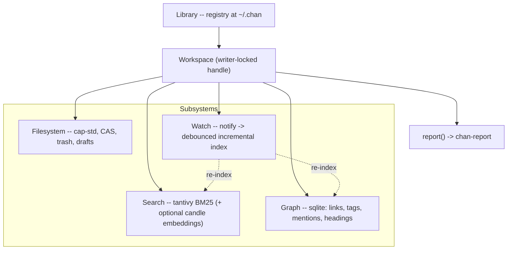
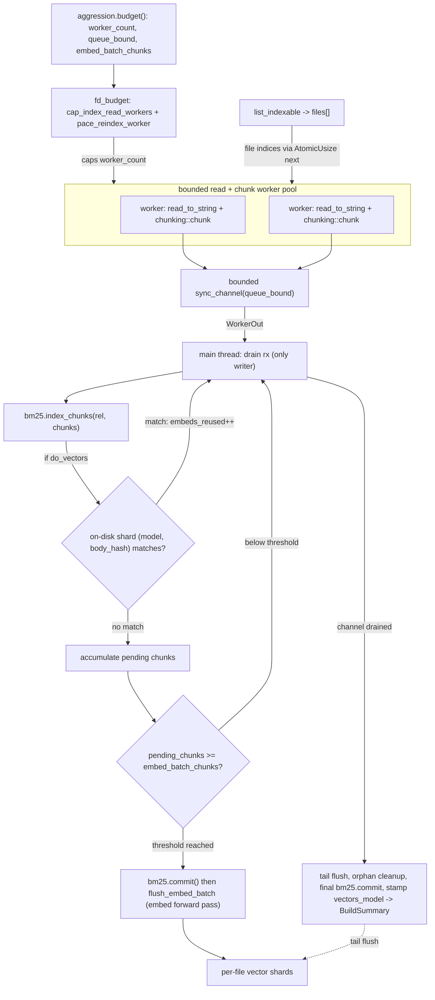
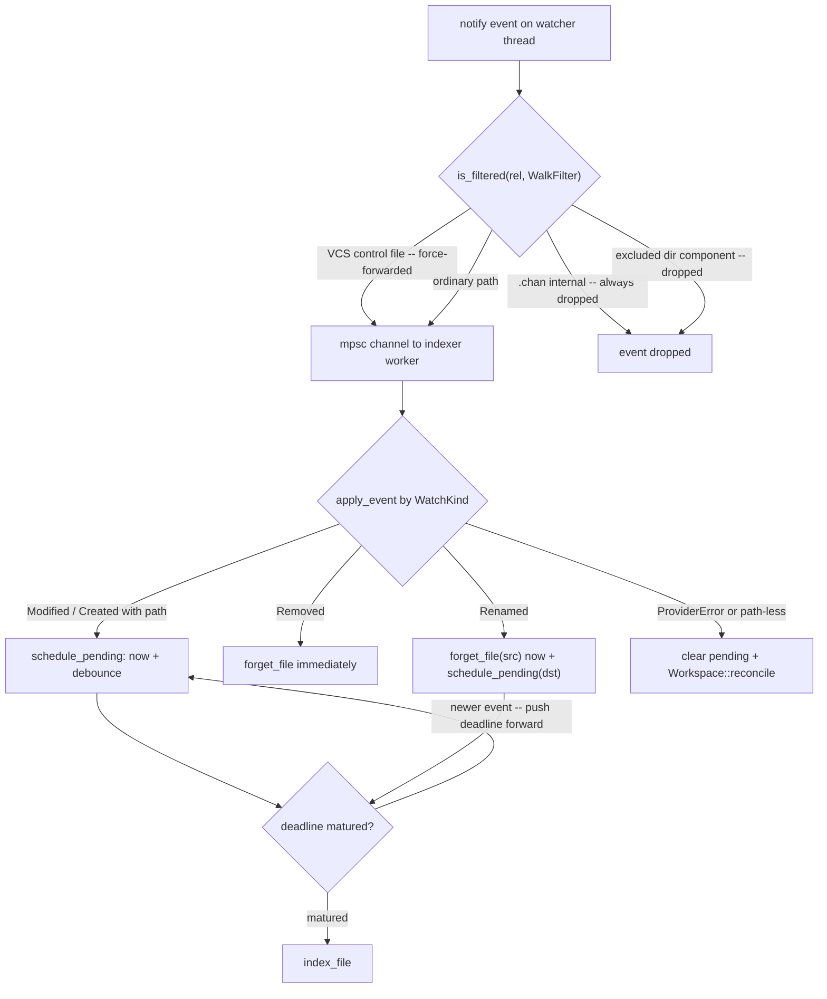
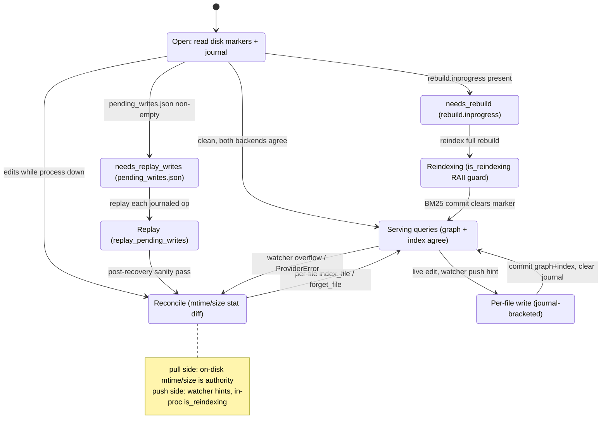

# chan-workspace design

Canonical design reference for `chan-workspace`. Update in the same commit as any change that affects the on-disk layout, the public API shape, the locking model, or the schema versions.

## 1. Problem and scope

`chan-workspace` is the local-first storage layer for a single-user markdown editor. It owns the per-machine registry of known workspaces, exposes a path-based sandboxed filesystem API rooted at each workspace, and wraps the per-workspace search index, link graph, and code/SLOC report. The same crate backs the `chan` CLI, chan-server, and the desktop app, and its API is shaped to survive a uniffi boundary for native iOS / Android shells.

In scope:

  - Filesystem primitives (`read` / `write` / `stat` / `list` / `rename` / `copy` / `remove` / `list_tree`) rooted at a workspace.
  - Workspace registry persisted to `~/.chan/config.toml` (or the OS sandbox equivalent on iOS / Android).
  - Per-workspace search index (tantivy 0.24, BM25; optional dense via candle + BGE-small for hybrid).
  - Per-workspace graph database (sqlite, single writer, r2d2 pool for readers).
  - Per-workspace code/SLOC report (chan-report `Index` kept current by the watcher, persisted as JSONL).
  - Filesystem watcher (callback-based, workspace-scoped, drops `.chan/` and walk-filtered noise) plus a built-in debounced graph indexer on top of it.
  - Cross-process advisory writer lock (fs4 / flock / LockFileEx).
  - Path-traversal sandboxing and an editable-text gate (extension classifier plus content sniff).
  - Atomic writes for every chan-workspace-managed file.
  - Cmd+N drafts as ordinary in-tree files under a configurable in-root directory.
  - Per-workspace blob storage for opaque host JSON: pane sessions. chan-workspace stores bytes keyed by a flat identifier; the schema is the host's choice.
  - Stat-only bootstrap snapshot of the tree shape for UIs that render before any index exists.
  - Export / import of the per-workspace sidecar metadata as a zstd-compressed tar archive.
  - VCS-parent detection (pure stat-walk; no `git` invocation).

Out of scope:

  - HTTP, WebSocket, frontend bundle. Those live in `chan-server` and the `chan` binary.
  - LLM tool dispatch, API key storage, prompt content, and agent transcript storage. `chan-llm` and app-level concerns.
  - Editor preferences (fonts, theme, keybindings, attachments dir). App-level; the consumer owns its own config file.
  - User authentication, multi-user collaboration, cloud sync of chan-workspace state. Single-user, single-machine, local-first.
  - Cross-workspace linking. One workspace at a time; explicit non-goal.

## 2. Architecture overview



  - `Library` is a per-machine handle. Apps construct one at startup and keep it alive. It owns the registry and the config-file path.
  - `Workspace` is one registered directory. Holds the writer lock for its lifetime; cheap reads (search query, graph traversal) do not contend. Lazily initializes search, graph, and report state on first use via `OnceLock`.
  - `WatchHandle` is an opaque return value; drop to stop watching. The underlying `notify::RecommendedWatcher` runs on its own thread and dispatches into the consumer's `WatchCallback`.
  - `GraphIndexer` is the built-in consumer of the watcher: a worker thread that debounces per-path events into `index_file` / `forget_file` / `reconcile` calls.

## 3. Components

### Library

Per-machine singleton-in-practice. Owns the `Registry` (`Mutex<Registry>` intra-process), the config-file path, and the directory-name blocklist for indexing walks. `open_workspace` looks up the registry row for the caller's path and constructs a `Workspace` keyed by the row's `metadata_key`, holding the cross-process writer lock for its lifetime.

Each registry row carries the canonical `root_path`, a stable `metadata_key`, and timestamps. The key is derived from the first registered path as a readable path slug plus an 8-hex sha256 suffix, and is preserved across `Library::move_workspace`. All per-workspace sidecar paths (graph DB, search index, sessions, tokens, trash, report) live under `~/.chan/workspaces/<metadata_key>/`. Consequences:

  - Moving the workspace directory (recorded via `move_workspace`) is a registry-only change, zero file motion on the sidecars.
  - Registering the same canonical path is idempotent and preserves the metadata key.
  - Deleting then re-creating a workspace at the same path uses the same deterministic key. `unregister_workspace` wipes chan-managed state so stale sidecars do not reappear by accident.
  - There is no user-managed workspace name in the registry. UIs derive labels from the path and show the full path where identity matters.

The registry also holds two global, hand-edited policy fields: `index_excluded_dirs` (directory basenames the indexing walks skip; see "Walk filter") and `drafts_dir` (the in-root drafts directory name, default `.Drafts`; see "Drafts").

`Library::sweep_orphans` reconciles the on-disk sidecar tree against the registry: any subdirectory under `~/.chan/workspaces/` whose name is not in the current metadata-key set is reclaimed. Used to clean up after unregisters that left state behind, or after a `move_workspace`-then-deleted-at-new-location workflow.

`reset_workspace` wipes per-workspace chan-managed state (search index, graph DB, session blobs, app tokens). It never touches the user's notes tree. The trash is preserved (it holds user-deleted files, recoverable user data, not chan-managed cache). The lock dir is preserved (cross-process coordination, no data). `ResetMode::Everything` additionally drops the registry entry so the next `open_workspace` against the path treats it as a fresh, never-seen workspace.

Precondition: caller must drop any open `Arc<Workspace>` for the target root first. `reset_workspace` acquires the writer lock to verify exclusive access; if any process (including the caller) holds it, the call fails with `WorkspaceLocked`. On Unix this is defense-in-depth (open files survive unlink); on Windows it is load-bearing because removing files-in-use fails. Skeleton recreation happens lazily on the next `open_workspace` plus first `index()` / `graph()` access; no explicit init step.

Registration is idempotent: re-registering an existing workspace only updates `last_seen_at` and preserves the metadata key.

`unregister_workspace` is `reset_workspace(Everything)` plus a `false` return when the workspace wasn't in the registry. It drops the registry row AND wipes per-workspace state in one call so a re-register at the same path starts from a clean sidecar even when the row's metadata key is deterministic. The trash is preserved (recoverable user data, owned by the user even after the workspace is forgotten). Preconditions match `reset_workspace`: any open `Arc<Workspace>` for the root must be dropped first, otherwise the call fails with `WorkspaceAlreadyOpen`.

`move_workspace(old, new)` records a moved workspace directory: it rewrites the registry row's `root_path` while preserving the metadata key, so every sidecar follows the move with zero file motion. Refuses when the source is unregistered, when `new` doesn't exist, when `new` is already a different workspace, or when the source is open.

### Workspace

One registered directory. All `rel` arguments are POSIX-style relative paths. Path traversal (`..`, absolute roots, Windows workspace prefixes) is rejected via `fs_ops::resolve_safe`, then `fs_ops::resolve_safe_strict` adds a canonical-form check that the deepest existing ancestor stays under the canonical workspace root (catches mid-path symlinks escaping the sandbox).

Two gates guard the text-class APIs:

  - **Editor gate** (`fs_ops::is_editable_text` plus `Workspace::sniff_is_text`): a file the editor can round-trip through a UTF-8 buffer. The extension classifier accepts markdown-class `.md` / `.txt` plus the wider `FileClass::Text` set (source code, configs, shell scripts, well-known no-extension files). Paths the classifier refuses get a content-sniff fallback: read up to `fs_ops::TEXT_SNIFF_BYTES` (8 KiB) and apply `fs_ops::looks_like_text`, which is what lets the editor open `.zshrc`, `*.service`, `Kconfig`, and other extensionless or odd-suffix text files. A file that cannot be sampled (I/O error, non-regular) stays non-editable. The classifier stays a pure, I/O-free path predicate so hot index walks never pay the sniff; only the per-file read/write path does. Used by `read_text` / `read_text_with_stat` / `read_text_with_stat_chunked` / `write_text` / `write_text_if_unchanged`.
  - **Indexer gate** (`fs_ops::is_indexable_text`): true only for `FileClass::EditableText` (markdown-class `.md` / `.txt`). Used by the indexer, graph rebuild, link-rewrite on rename, and reindex-after-restore. A `.py` is editable but **not** indexable so `#include` doesn't read as a `#tag`. Within the indexable set, `fs_ops::is_markdown_file` narrows `#tag` / `@@mention` token extraction to `.md` only: `.txt` indexes for full-text, headings, and links, but incidental prose in a plain note never becomes a graph tag.

Binary I/O (`read` / `write_bytes`) routes around both gates: attachments and the future media browser still need it.

#### Supported file types

A workspace is the user's directory tree, untouched. Adding a workspace registers a root and walks everything under it (skipping `.git/` and `.chan/`); chan-workspace never restricts what can sit on disk. What changes by class is how each file is handled by the API. `fs_ops::classify(rel)` is the single predicate; consumers (this crate, chan-server, the editor) should switch on `FileClass` rather than re-deriving extension rules.

  Class           Extensions / names
  --------------  ----------------------------------------------
  EditableText    .md, .txt
  Text            .py, .rs, .c, .cpp, .h, .go, .java, .js, .ts, .json, .yaml, .toml, .ini, .sh, .html, .css, .csv, .sql, .rst, ...; plus well-known basenames (Makefile, Dockerfile, LICENSE, .gitignore, ...)
  Image           .png, .jpg, .jpeg, .gif, .webp, .svg, .avif
  Pdf             .pdf
  Other           everything else

Behaviour by class:

  - **EditableText**: full read / write through `read_text` and `write_text`. Indexed by tantivy (BM25 + dense vectors when embeddings are enabled). Parsed for graph edges, headings, tags, mentions. The CAS pair `read_text_with_stat` + `write_text_if_unchanged` is available for editor-style optimistic concurrency. Large editor opens can use `read_text_with_stat_chunked` to receive the same open-handle stat before the UTF-8 body chunks.
  - **Text**: full read / write through `read_text` and `write_text` (same UTF-8 gate as EditableText). **Not** indexed and **not** a graph node: the indexer parses markdown semantics that source-class text doesn't carry, and treating `#include` as a `#tag` would pollute the graph. Text-class files are walkable + editable + byte-readable but opaque to search.
  - **Image**: opaque bytes via `read` / `write_bytes`. Not indexed and not a graph node, but markdown embeds (``) emit edges pointing at the image so `backlinks("media/foo.png")` returns the notes that embed it. The editor renders previews inline; rename / remove are supported.
  - **Pdf**: same I/O contract as Image. Held as a distinct class because the editor / inspector pane renders PDFs through a dedicated viewer.
  - **Other**: opaque bytes via `read` / `write_bytes`. Walkable, visible in `list_tree`, renameable, removeable into Trash. Unknown-extension files whose leading bytes sniff as text additionally pass the editor gate (see above). Not indexed and not a graph node.

`rename`, `copy`, and `remove` operate on every class. Link rewriting in `rename_with_link_rewrite` only touches `EditableText` bodies (Text-class files, images, and other binaries have no markdown links to rewrite); the graph edge `dst` gets updated regardless of target class. `resolve_free_name` computes a collision-free destination name for copy / promote flows.

Typed markdown frontmatter is resolved through a `chan.kind` registry. In YAML, that means a nested `chan:` map with `kind:` inside it:

```yaml
---
chan:
  kind: contact
---
```

The dotted `chan.kind` form is the documented path, not a flat top-level `kind: chan.contact` key. The only supported entry today is `contact`, which stamps a graph node as `Contact` and gives server/web callers the `contact` renderer hint; unknown kinds stay ordinary markdown files. Semantic reference tokens are markdown-only: `#tag` and `@@mention` graph edges are extracted from `.md` files and intentionally ignored in `.txt`, so plain notes remain searchable/editable without turning incidental prose into graph entities.

Extension matching is ASCII case-insensitive. Files whose extension is unknown fall back to a basename check against well-known textual filenames (Makefile, Dockerfile, LICENSE, ...), then to the content sniff on the read/write path.

`read_text_with_stat` and `write_text_if_unchanged` are the optimistic-concurrency pair the editor uses to detect external edits. The editor reads `(content, stat)`, the user types, and the save round-trips through `write_text_if_unchanged(rel, Some(stat.mtime_ns), new_content)`. The token is the nanosecond mtime so two edits within the same wall-clock second still conflict on filesystems with sub-second mtime. If another process (terminal, sync daemon, second pane) has since modified the file, the write fails with `WriteConflict { current_mtime_ns }` and the editor prompts to reload, merge, or overwrite. `write_text` (no CAS) remains for chan-workspace's own reindex helpers, bulk imports, and LLM-tool calls where last-write-wins is the intent. Residual race: between the mtime check and the atomic rename a foreign write can land; the watcher event for the foreign change fires on the next dispatch and the editor re-prompts.

`read_text_with_stat_chunked` is the streaming form for large editor opens. It applies the same editable-text gate, sandbox resolution, regular-file refusal, symlink refusal, and open-handle stat semantics as `read_text_with_stat`. Events are ordered as `Meta(&FileStat)`, zero or more UTF-8 `Chunk(&str)` events, then `Done`. UTF-8 code points are never split across chunk events; an invalid byte sequence fails the read. If the callback returns false, the read stops early with `Ok(())` so transports can stop work after client disconnect.

`remove` is a soft-delete: it moves the entry into the per-workspace Trash. Recursive directory removal is allowed because the operation is reversible; the foot-gun guard against accidental recursive-rm is satisfied by the restore path. Symlinks, FIFOs, sockets, and char/block devices are rejected with `SpecialFile`; the trash format only models regular files and directories, and chan-workspace never creates the other types itself.

### Drafts

Cmd+N scratch work lives in-tree as a real hidden directory at the workspace root, named by `Registry::drafts_dir` (default `.Drafts`). Each draft is a directory (`.Drafts/<name>/draft.md` plus companions such as pasted images) so attachments travel with the note. The directory is created lazily on the first Cmd+N; an untouched workspace has no `.Drafts/`.

Drafts are ordinary relpaths, so search, graph, watcher, and the MCP tools see them through the normal machinery: no virtual namespace, no separate cap-std handle, no separate watch root, and no synthesized graph node. Users who do not want drafts tracked by SCM add `.Drafts/` to their `.gitignore`. `.Drafts` is deliberately NOT on the walk filter: drafts are real in-tree content and index and graph like any other file.

The `drafts` module is the filesystem primitive layer; `Workspace` wraps it as `create_draft_dir`, `list_drafts`, `inspect_draft`, `promote_draft`, `discard_draft`, `draft_preflight`, and `next_untitled_draft_name`. Promotion moves the draft's contents to a destination in the main tree and reports the mode (`File` for a lone `draft.md`, `DirectoryCreated` / `DirectoryMerged` when companions exist). Discard routes through the Trash, with the trash entry's origin label prefixed `.Drafts` so a trashed draft is distinguishable from a trashed workspace file. `draft_preflight` reports broken drafts (e.g. a draft dir missing its `draft.md`) without failing the listing.

### Trash

The Trash gives the editor and the LLM tool sandbox a safe delete: every `remove` is reversible until either the user explicitly purges or the retention window elapses.

```rust
pub struct TrashEntry {
    pub id: String,            // opaque, monotone
    pub original_path: String, // POSIX rel from workspace root
    pub deleted_at: i64,       // unix seconds
    pub is_dir: bool,
    pub size: u64,             // file len, or summed for dirs
}
```

  - **Location**: `~/.chan/workspaces/<metadata_key>/trash/<id>/{payload[/], meta.json}`. Trash lives outside the user's workspace directory because chan-workspace stores zero state inside the workspace (the drafts dir is the one deliberate exception). Trade-off: the trash does not sync via iCloud / Dropbox / git. Acceptable; trash is per-machine recovery, not collaboration. A recorded `Library::move_workspace` preserves `metadata_key`, so trash follows the moved workspace without moving files.
  - **Atomicity**: same-fs path is one atomic `rename` from workspace root into the trash payload. Cross-fs path falls back to `copy + remove`, writing `meta.json` AFTER the copy and BEFORE the source removal, so a remove failure leaves a complete trash entry plus a partial source the user can clean up.
  - **Restore conflicts**: refused with `TrashOccupied`. The caller renames the live entry first, or `trash_purge` to give up. We never silently overwrite live content.
  - **Auto-expiration**: lazy GC. Workspace open and every `trash_*` call sweep entries older than `TRASH_RETENTION_SECS` (30 days, `30 * 24 * 60 * 60`). No background thread; matches the codebase's sync-only rule.
  - **Crash recovery**: a half-written entry has no `meta.json`. Sweep treats meta-less entries as junk and reclaims them.

Deliberately not included:

  - Cross-workspace trash. Each workspace has its own.
  - Sync to cloud storage (trash is local-only state).
  - Background timer (lazy GC is enough for an editor that opens workspaces sporadically).
  - Configurable retention. Hardcoded 30 days.

### Search index

`tantivy` 0.24 backs the per-workspace index at `~/.chan/workspaces/<metadata_key>/index/`. BM25 over `path`, `filename`, `headings`, and `body`. Schema version lives in `<index_dir>/config.toml` as the `schema_version` field of the `IndexConfig` struct (alongside the embedding model id and the chunking strategy). Mismatched versions trigger a wipe and full rebuild on next open; user data is unaffected.

`<index_dir>/config.toml` doubles as the per-workspace settings store. Beyond the index fields it persists `semantic_enabled` (hybrid-search opt-in, default false), `reports_enabled` (chan-report opt-in, default on for newly created workspaces), `excluded_dirs` (per-workspace walk-filter additions), and the screensaver settings (`screensaver_enabled`, timeout, theme, and a base64-encoded PIN hash that is stored without interpretation and never echoed back over the wire). `Workspace` exposes typed accessors for all of these; writes go through the same atomic-write path as the rest of the config.

Two additional config fields, `vectors_model` and `vectors_dim`, describe the model that produced the vectors currently on disk. They are stamped at the end of every successful embed pass. On `Index::open`, if `vectors_model` is set and differs from `model` (the user-configured target), the embeddings dir is wiped and the tracking fields cleared; BM25 segments are preserved because BM25 is model-independent. This closes the silent-corruption window where a hand-edited or upgraded `model` field would otherwise mix vectors from two different models in the same store. A schema-version bump still wipes everything and clears both tracking fields.

With the `embeddings` feature on (default), the index also stores per-chunk dense vectors via candle + BGE-small (`DEFAULT_MODEL = "BAAI/bge-small-en-v1.5"`). `SearchMode` is `Bm25` (default), `Semantic`, or `Hybrid`; hybrid runs BM25 and dense in parallel, then fuses with reciprocal-rank fusion. Dense search is a per-workspace opt-in (`semantic_enabled`); on builds where the embedder is unavailable (`--no-default-features`, currently iOS) or the model is not downloaded, semantic and hybrid queries degrade to BM25-only and the result's `mode` field says so.

Chunking is configurable per-index via `Chunking` (`Headings`, `WholeDoc`, `Fixed { chars }`). The default is `Headings` (one chunk per ATX section, files without headings collapse to a single whole-doc chunk).

`reindex` is synchronous and blocking. It runs on the calling thread; the caller decides whether to spawn a worker. `reindex_with` accepts a progress callback driven by `ProgressStage` events; `reindex_with_aggression` additionally takes a `SearchAggression`. All flavors return `BuildSummary`. This keeps the API uniffi-clean and avoids leaking an async runtime through the FFI boundary.

`Index::build_all` runs the per-file read + markdown chunking on a bounded thread pool. Worker count comes from `SearchAggression`: `Conservative` pins one reader, `Balanced` (the default) uses `available_parallelism - 2` clamped to [1, 6], `Aggressive` uses `available_parallelism - 1` clamped to [1, 8]. The file-descriptor budget (`fd_budget`) can cap the count further and paces workers when the process is near its `nofile` limit: the crate runs inside the editor process, where macOS commonly starts with a soft limit of 256, and an eager SQLite pool plus Tantivy fanout can otherwise exhaust the table during first boot on a large workspace. Workers ship parsed chunks to the main thread over a bounded `sync_channel` (workers * 4); the main thread is the only writer into tantivy and the only producer of embed batches, so writer-mutex contention and embed ordering stay simple. Cores are held back so the server's tokio runtime and the OS UI thread keep breathing during a reindex of a large workspace. Progress ticks remain monotonic from the consumer's perspective even when worker completions land out of order.



*build_all fans file reads across an fd-budget-capped, SearchAggression-sized worker pool, funnels parsed chunks through a bounded sync_channel to the single main-thread writer that commits BM25 per flush and runs EMBED_BATCH embed passes into per-file vector shards.*

#### Embed-phase checkpointing

Embedding dominates the wall-clock cost of a full rebuild on real workspaces (BM25 is a tantivy commit per chunk, cheap; embedding scales linearly with chunk count and waits on the model). To avoid throwing that work away on a crash, the per-file vector shard carries a `body_hash` field (sha256 over the canonical `(chunk_id, body)` sequence) stamped at write time. On the next `build_all`, the per-file path re-chunks from disk, computes a fresh `body_hash`, and asks the on-disk shard for its `(model, body_hash)` pair; on match the file skips the embed queue (the vectors are still valid because identical chunks under the same model deterministically produce identical embeddings). The count of files that took the skip path surfaces as `BuildSummary.embeds_reused`, so the CLI and tests can observe partial-rebuild resumption rather than infer it.

Each per-file shard under `embeddings/` carries its own `FORMAT_VERSION` (currently 2), checked per shard in `load_all`; a mismatch drops the shard silently and the next `build_all` re-embeds that file. This is intentionally independent of the schema-version wipe path: a shard-format bump should NOT invalidate BM25 segments or other shards, only the shards that actually need re-encoding. The `--no-default-features` build excludes the entire embed path including the skip check; the `embeds_reused` field stays in `BuildSummary` and reads zero.

#### Embed batch cadence and the CPU backend

`build_all` accumulates parsed chunks across files and flushes them to the embedder in `EMBED_BATCH_CHUNKS`-sized groups (the value comes from `SearchAggression::budget()`: 64 / 128 / 256 chunks for Conservative / Balanced / Aggressive). Each flush first commits the BM25 writer, then runs one blocking forward pass over the batch and writes the resulting per-file vector shards. Committing per flush is what makes `indexed_vectors`, the `reindex_with` progress events, and the BM25→hybrid search upgrade advance incrementally as a long cold build runs, instead of landing only when the whole pass returns: a large cold reindex would otherwise report zero vectors and a frozen progress chip for the minutes the embed takes. The cadence is deliberately kept below a typical workspace's chunk count (chunks-per-file is usually ~10), so a cold build commits in several visible steps rather than one tail flush. The batch size is a flush/commit cadence only -- the embedder always runs `INFER_BATCH`-sized forward passes internally -- so it carries no embedding-throughput cost.

Embedding runs on CPU by default: the candle Metal backend exhausts GPU memory and stalls on large workspaces, so the GPU path is opt-in via `CHAN_ENABLE_GPU=1`. On macOS the CPU path links Apple's Accelerate framework as candle's BLAS backend -- the target-gated `accelerate` feature, wired alongside `metal` under `cfg(target_os = "macos")` -- routing bge-small's matmuls through Accelerate's `sgemm` for a measured ~1.5–2× cold-reindex speedup over candle's default SIMD-threaded `gemm` (modest because the default is already vectorized, and the forward pass also spends time in non-matmul ops). The feature pulls the Apple-only `accelerate-src`, so the static-musl Linux release binary structurally cannot pull it in.

#### Walk filter

`WalkFilter` (in `fs_ops`) is a caller-supplied list of directory basenames that the reindex walks should not descend into. The machine-wide baseline lives in `Registry::index_excluded_dirs` and is persisted to `~/.chan/config.toml` so CLI and desktop use the same policy (defaults: `.git`, `.hg`, `.svn`, `node_modules`, `target`, `__pycache__`, `.venv`, `venv`, `.tox`, `.pytest_cache`, `.mypy_cache`, `.ruff_cache`, `.cache`, `dist`, `build`). A per-workspace blocklist (`IndexConfig::excluded_dirs`, managed through the workspace settings API) is unioned on top: `Workspace::effective_excluded_dirs` is what the walks actually honor. Matching is exact basename at any depth, ASCII case-insensitive. `.git` and `.chan` stay hardcoded in `walk_workspace`: those are invariants of the on-disk layout, not policy.

`Registry::drafts_dir` (default `.Drafts`) is modeled the same way as `index_excluded_dirs`: a global field in `~/.chan/config.toml`, hand-edited, not exposed through any UI. It names the in-tree Drafts directory rather than a skip target, so it is deliberately NOT on the walk filter: drafts are real in-tree content and index and graph like any other file.

The filter is honored by the indexing pipeline, the bootstrap snapshot, the report walk, and the watcher feed (one ignore set, not several). The editor-visible APIs (`Workspace::list_tree`, `Workspace::list`, trash sweeps, restore) stay unfiltered so the user can still see and open files inside a blocked directory on demand; the `*_filtered_unified` tree listings exist for callers (the graph layer, the File Browser spine) that want the filtered default view.

### Graph

`sqlite` (rusqlite, bundled) backs the per-workspace graph at `~/.chan/workspaces/<metadata_key>/graph/graph.sqlite`. Schema lives in `nodes` (files), `edges` (links + tags + mentions), and `headings` (in-file anchors). A `nodes` row carries `rel_path`, `kind` (`file` / `contact`), `mtime`, `size`, `title`, `basename`, `emails` (lowercased addresses extracted from contact bodies), and `aliases` (top-level `aliases:` frontmatter, used by the mention resolver to map `@@<alias>` to a contact file without re-parsing frontmatter per query). Edge rows are `(src, dst, kind, anchor)` with the anchor in the primary key so one file can link the same target via two distinct anchors.

Single-writer semantics, multi-reader: the writer connection sits behind a `Mutex<Connection>` (sqlite's contract); reads pull from an `r2d2::Pool<SqliteConnectionManager>` so editor link-autocomplete queries do not queue behind a reindex write or another typeahead. WAL mode plus a uniform per-connection PRAGMA init keep the writer and the pool agreeing on `journal_mode`, `busy_timeout`, and `synchronous`.

`replace_file` inserts outgoing edges (links + tag/mention tokens) and headings with computed anchors. `forget_file` removes a file and all its edges; `forget_under` does the same for a directory prefix. `clear` wipes everything for a full rebuild. Full rebuilds parse into staging tables and swap atomically; see "Schema versioning" for the resumability model. Read surface: `neighbors`, `backlinks`, `tags`, `mentions`, `files_with_tag`, `files`, `files_with_stat`, `node_kind`, `headings_of`, `link_targets`, `contacts`, `contacts_filtered`.

#### Link resolution

Two path forms coexist in chan-workspace on purpose. The Workspace API (`read`, `write_text`, `list`, MCP tool `path` args, graph row keys) speaks one canonical form: a workspace-rooted POSIX rel path with no leading slash and no `..`. Inside markdown bodies the user (or an agent) writes hrefs in whatever form the renderer expects, which for GitHub-style markdown is "relative to the file that contains the link" so the document keeps rendering when viewed outside chan (GitHub web, Obsidian, a pasted preview). The normalizer below is the bridge: file bodies stay portable, the graph and queries see one canonical destination.

Markdown link hrefs and image embeds (`[label](href)`, ``) are run through `markdown::normalize_href` before the graph builder writes the edge `dst`. The normalizer is a pure function: input is `(href, source_dir)`, output is `Option<String>` (clean workspace-relative POSIX path; `None` for external schemes, fragment-only refs, empty hrefs, and lexical escapes past the workspace root).

Resolution rules, in order:

1. Fragment-only `#anchor` refs return `None` (intra-document).
2. URL schemes (`https:`, `mailto:`, `tel:`, ...) detected by a `:` ahead of any `/` `#` `?` return `None`.
3. Trailing `?query` and `#anchor` are stripped; the anchor is preserved separately on the edge's `anchor` column.
4. Hrefs starting with `/` are workspace-rooted (the leading slash is stripped); otherwise the href is joined to `source_dir`.
5. `.` / `..` segments collapse lexically. A `..` past the workspace root returns `None`; chan-workspace's no-symlink sandbox rules out symlink chasing here as well.

Wiki-link targets (`[[name]]`) keep the picker's existing workspace-rooted-by-default convention: bare `[[Contacts/Jane]]` resolves to `Contacts/Jane`, an explicit `[[/Contacts/Jane]]` likewise. Targets prefixed with `./` or `..` opt into source-relative resolution (`[[../foo]]` from `notes/x.md` walks up to `foo`).

The same normalizer ships as a hand-port to TS for the editor's click handler so on-disk edges and in-editor navigation agree on the resolved path.

#### Link autocomplete (`[[`)

`link_targets` backs the editor's `[[` typeahead: the user types a fragment and gets back files plus headings to anchor a wiki link to. The graph DB is the source of truth (`nodes` for files, `headings` for in-file anchors); BM25 over filename and heading text in the search index serves a parallel purpose for free-text search but is not used for the picker.

```rust
pub enum LinkTargetKind { File, Heading }

pub struct LinkTarget {
    pub kind: LinkTargetKind,
    pub path: String,            // rel path of the file (both kinds)
    pub title: Option<String>,   // file title; None for headings
    pub heading: Option<String>, // heading text; None for files
    pub anchor: Option<String>,  // heading anchor; None for files
    pub level: Option<u8>,       // heading depth 1..=6; None for files
    pub mtime: Option<i64>,      // file mtime; None for headings
}
```

  - **Empty `q`**: most-recently-edited files first, up to `limit`. Useful as the picker's initial state before any keystroke.
  - **Non-empty `q`**: four-tier ASCII case-insensitive match.

      rank 1  basename starts with q   ("carb" -> "carbonara.md")
      rank 2  basename contains q      ("bona" -> "carbonara.md")
      rank 3  title contains q         (h1 / frontmatter title hit)
      rank 4  heading text contains q  (in-file anchor target)

    Within a rank, files sort by `mtime DESC NULLS LAST,
    rel_path ASC`; headings sort by `rel_path, ord`. Heading
    hits are capped at `limit / 2` so a single TOC-heavy file
    cannot drown out file matches.

  - **Wildcard escaping**: `%`, `_`, and `\` in `q` are escaped against SQLite's LIKE engine so a filename "100%off.md" is not matched by a raw `%` query.
  - **Case folding**: ASCII only. SQLite's `LOWER` does not fold Unicode without ICU; non-ASCII queries match case-sensitively. Acceptable for a single-user picker; revisit if a Unicode-aware backend becomes a priority.

After picking a file, the editor calls `GraphView::headings_of(rel)` to populate the `[[file#` second phase from that file alone.

### Watcher

`Workspace::watch` returns a `WatchHandle`; drop to stop. The underlying `notify::RecommendedWatcher` runs on its own thread and calls into the consumer's `WatchCallback`.

Callback-based on purpose: the Swift / Kotlin shell implements the trait by passing an `Arc<dyn WatchCallback>` (uniffi generates a wrapper around a foreign object). No closures cross the FFI.

The dispatch filter mirrors the walk's pruning so the watcher feed and the walks honor one ignore set, with two watcher-specific deviations:

  - `.chan/` is always dropped via `is_chan_internal`, regardless of the configurable filter: it is chan's own state, an invariant the user cannot un-exclude.
  - Paths with a walk-filtered directory component (`node_modules`, `target`, `.git`, ...) are dropped, EXCEPT VCS control files (`.git/HEAD`, `.git/index`, `.hg/dirstate`): those are forwarded because the indexer keys checkout-storm detection off them, while the walks prune `.git` wholesale.

When the report subsystem is active, the same watcher fan-outs each event into the report's incremental index before the user's callback runs (see "Report").

### Built-in graph indexer

`Workspace::start_graph_indexer(debounce_ms)` returns a `GraphIndexer` handle that owns a watcher subscription and one worker thread, so consumers (CLI, chan-server, native shells) do not each reinvent the same queue. `DEFAULT_DEBOUNCE_MS` is 150.

  - Debouncing is per-path, trailing-edge: the first event for a path schedules a deadline at `now + debounce`; further events push it forward; the deadline maturing triggers `index_file`.
  - `Removed` events and the source side of `Renamed` skip the debounce: a stale graph row pointing at a missing file is the user-visible failure mode, so deletions flush immediately.
  - `ProviderError` and path-less events (the watcher's "scope unknown" signal) clear the pending map and trigger a full `Workspace::reconcile`, the same convergence path used for cold-open catch-up.
  - Counters (`pending_count`, `indexed_total`, `forgotten_total`, `reconciles_total`) back the status surface. Drop the handle (or call `stop()`) to tear down synchronously: watcher first (closing the channel), then the worker joined.



*notify events pass one shared ignore set (.chan dropped, VCS control files force-forwarded), then the indexer worker per-path trailing-edge debounces edits, flushes Removed/rename-source immediately, and clears pending plus full-reconciles on ProviderError/path-less events.*

### Bootstrap snapshot

`Workspace::bootstrap()` returns a lightweight structural snapshot (directory tree shape, file counts, byte sizes) that the UI can render immediately on open, before any index or report job runs. It is a STAT-ONLY walk: no file content is read, no graph edge is parsed, so it does not pressure the fd budget the way the index / report jobs do. It honors the same `WalkFilter` as the indexer (one ignore policy), while the on-demand listing APIs stay unfiltered. The root response carries the first level eagerly (root files + dirs, each dir with recursive subtree stats) plus whole-workspace aggregates; deeper levels load lazily via `Workspace::bootstrap_dir(rel)` on File Browser expand or Graph depth-increase.

### Report

The per-workspace code/SLOC/COCOMO report wraps `chan-report`'s incremental `Index`. chan-workspace owns the persisted JSONL (`~/.chan/workspaces/<metadata_key>/report/report.jsonl`), the load-else-rescan open path (any load error -- missing file, schema mismatch, partial write -- falls back to a full scan that replaces the bad file on the next flush), and a dedicated writer thread that debounces flush signals (500 ms window) and atomic-writes the JSONL. Watch events fan into the in-memory index before the user's callback runs, so a handler that immediately calls `Workspace::report()` sees the change; `Unchanged` outcomes do not schedule a write. The walk applies the same excluded-dirs policy as the index walk so a source-tree workspace doesn't roll up its dependency trees.

Public surface: `report()` (whole tree), `report_for_prefix`, `report_for_files`, `report_for_dir` (O(1) cached directory roll-up; `None` for untracked dirs so HTTP can 404), and `report_jsonl_path`. The subsystem is gated by the per-workspace `reports_enabled` flag and activated by `Workspace::boot()`, which consumers call after open to kick off the optional layers (reports; semantic search initializes lazily through the index accessor).

### Contacts

Imports a third-party contact dump (Google Contacts CSV) as one markdown note per contact.

On-disk shape: slim YAML frontmatter holding only top-level `aliases` plus the chan-internal `chan:` block (`kind: contact`, `provider`, `imported_at`, `frontmatter_version`, optional `remote_id`); contact data (emails, phones, organizations, labels) lives in the body as bullet items so a chan editor that doesn't strip frontmatter shows a friendly note rather than a YAML dump.

Indexer reads the frontmatter in `parse_for_graph` to tag the corresponding `nodes` row as `kind = 'contact'`. Same row, different kind: backlinks, link-autocomplete, and forget_file all keep working unchanged because they key on `rel_path`, not `kind`. Downstream consumers (`Workspace::contacts`, editor `@` picker, `GET /api/contacts`) filter on `kind = 'contact'` to surface contacts as a distinct UI surface.

The contacts module splits into pure parser/emitter/slug helpers behind one orchestrator. The import orchestrator is exposed as `Workspace::import_contacts` (and `import_contacts_with` for progress reporting) so the import flow inherits the path sandbox, editable-text gate, and atomic-rename rules. One bad contact does not abort a batch: per-file errors land in `ImportSummary` as `Failed` outcomes.

Imported notes are user-owned the moment they land. chan does not re-edit them. Re-importing either skips existing files or overwrites them (per `ImportOpts.overwrite`); there is no merge.

Filename strategy: derive from `display_name`, fall back to first email local-part, then `phone-<digits>`, then `unnamed-N`. Sanitize path separators / control chars / Windows-reserved chars to `_`. Trim to 120 bytes UTF-8-safely. On collision within a batch, append ` (2)`, ` (3)`, etc. before the `.md`.

Non-goals: OAuth, API integration, two-way sync, on-disk cache, other provider formats. Contact notes ARE the source of truth; the existing markdown indexer covers read.

Contact-aware filtering for the editor `@` picker and `GET /api/contacts` lives at the SQL layer: `GraphView::contacts_filtered(query, limit)` runs a case-insensitive `LIKE` against `title`, `basename`, and the `emails` column with the limit applied inside SQLite, so per-keystroke calls stay O(limit) instead of O(N). A typed `alice` finds both "Alice Anderson" and a contact whose only `alice` is in `alice@example.com`; the deduplicated email list comes back so the picker can render a secondary line under the contact's name. `GraphView::contacts()` is a convenience wrapper for callers that want the full list.

The `emails` column is populated as contacts are parsed during a walk: the indexer's first pass over a fresh workspace fills it in for every contact-kind file, and per-file edits update it through `replace_file`. Contacts that lack an email body section keep `emails IS NULL` and simply don't match email-substring queries. The `aliases` column is populated the same way from top-level frontmatter and serves the `@@<alias>` mention resolver.

Discovery is content-driven, not directory-driven. Any `.md` file whose frontmatter has nested `chan: { kind: contact }` is classified as `NodeKind::Contact` regardless of where it sits in the workspace. A user who hand-rolls a contact note in their own directory and drops it in is picked up by the next indexer pass; the `Contacts/` directory is just the importer's default destination, not a discovery requirement.

The chan-llm tool sandbox (and the MCP server it backs) does not expose a contacts-aware tool, by design. Agents reach contacts through the existing `read_file` / `list_files` / `search_content` tools: contact files carry nested `chan: { kind: contact }` frontmatter plus the contact's data as readable bullets in the body, and any note that wiki-links to a contact creates a graph edge the agent can follow via `read_file` on the linked path. Adding a dedicated `list_contacts` / `find_contact` tool would just duplicate `Workspace::contacts_filtered` over a wire the model already has the primitives to traverse.

### Metadata archive

`metadata_archive` exports and imports the per-workspace sidecar state as a zstd-compressed tar so search/graph/report caches and session blobs can move between machines (or serve as a backup) without re-deriving them. Layout inside the archive: `chan-metadata-v1/manifest.json` plus `chan-metadata-v1/payload/<path_key>/...`, where the path key uses the same canonical-path slug + sha256 scheme as the metadata key. Included subtrees: `index`, `graph`, `report`, `sessions`. Excluded: `locks` (coordination, no data), `tokens` (machine-local secrets), `trash` (user data, not cache), and transient staging/temp/`*.shm` files. Entry paths are validated on both sides (`validate_archive_entry_path`) so a crafted archive cannot write outside the payload root. The manifest records the archive format version, the producing chan version, and per-workspace identity so import can match payloads to registry rows.

### Teams config

`teams` is a schema-only module: `TeamConfig` (team name, host name/handle, terminal tab group, `@`-prefix policy, MCP-env opt-in) plus `Member` / `Position`. The struct is persisted to a `config.toml` next to the team's working files and consumed by chan-server's `/api/team-config` route; chan-workspace owns the shape so serialization stays uniform across consumers, but no team behavior lives here.

## 4. Public API surface

### Library

```rust
Library::open() -> Result<Self>
Library::open_at(config_path: PathBuf) -> Result<Self>

Library::list_workspaces() -> Vec<KnownWorkspace>
Library::drafts_dir() -> String

Library::register_workspace(root: &Path) -> Result<KnownWorkspace>
Library::unregister_workspace(root: &Path) -> Result<bool>
Library::move_workspace(old: &Path, new: &Path) -> Result<bool>

Library::open_workspace(root: &Path) -> Result<Arc<Workspace>>

Library::reset_workspace(root: &Path, mode: ResetMode) -> Result<ResetReport>
Library::reset_workspace_with(root, mode, progress) -> Result<ResetReport>
Library::sweep_orphans() -> Result<SweepReport>

Library::workspace_paths_for(root: &Path) -> Option<WorkspacePaths>

Library::set_walk_filter(filter: WalkFilter)
Library::walk_filter() -> Arc<WalkFilter>
```

### Workspace: filesystem

```rust
Workspace::root() -> &Path
Workspace::paths() -> &WorkspacePaths
Workspace::walk_filter() -> &WalkFilter

Workspace::read(rel: &str) -> Result<Vec<u8>>
Workspace::sniff_is_text(rel: &str) -> bool
Workspace::read_text(rel: &str) -> Result<String>                  // gated
Workspace::read_text_with_stat(rel: &str)                          // gated
    -> Result<(String, FileStat)>
Workspace::read_text_with_stat_chunked(rel, chunk_size, on_event)  // gated
    -> Result<()>
Workspace::write_text(rel: &str, content: &str) -> Result<()>      // gated
Workspace::write_text_if_unchanged(rel: &str,                      // gated, CAS
    expected_mtime_ns: Option<i64>,
    content: &str,
) -> Result<()>
Workspace::write_bytes(rel: &str, content: &[u8]) -> Result<()>

Workspace::exists(rel: &str) -> bool
Workspace::stat(rel: &str) -> Result<FileStat>
Workspace::list(rel: &str) -> Result<Vec<DirEntry>>
Workspace::list_tree() -> Result<Vec<TreeEntry>>
Workspace::list_tree_prefix(prefix: &str) -> Result<Vec<TreeEntry>>
Workspace::list_tree_unified() / list_tree_prefix_unified(prefix)
Workspace::list_tree_filtered_unified()
Workspace::list_tree_prefix_filtered_unified(prefix)
Workspace::create_dir(rel: &str) -> Result<()>
Workspace::remove(rel: &str) -> Result<()>                 // soft-delete to trash
Workspace::rename(from: &str, to: &str) -> Result<()>
Workspace::rename_with_link_rewrite(from, to) -> Result<RenameOutcome>
Workspace::copy(from: &str, to: &str) -> Result<CopyOutcome>
Workspace::resolve_free_name(dest_dir: &str, name: &str) -> Result<String>

Workspace::resolve_physical_path(rel: &str) -> Result<PathBuf>
Workspace::resolve_physical_dir(rel: &str) -> Result<PathBuf>
Workspace::physical_path_to_virtual(path: &Path) -> Option<String>

Workspace::bootstrap() -> Result<BootstrapTree>
Workspace::bootstrap_dir(rel: &str) -> Result<BootstrapTree>

Workspace::trash_list() -> Result<Vec<TrashEntry>>
Workspace::trash_restore(id: &str) -> Result<()>
Workspace::trash_purge(id: &str) -> Result<()>
Workspace::trash_empty() -> Result<()>

Workspace::drafts_dir() -> &Path
Workspace::drafts_dir_name() -> &str
Workspace::create_draft_dir(name: &str) -> Result<DraftRef>
Workspace::list_drafts() -> Result<Vec<DraftRef>>
Workspace::inspect_draft(name: &str) -> Result<DraftInspection>
Workspace::promote_draft(...) -> Result<DraftPromoteReport>
Workspace::discard_draft(name: &str) -> Result<()>
Workspace::draft_preflight() -> Result<Vec<DraftIssue>>
Workspace::next_untitled_draft_name() -> Result<String>

Workspace::put_session(key: &str, content: &[u8]) -> Result<()>
Workspace::get_session(key: &str) -> Result<Option<Vec<u8>>>
Workspace::list_sessions() -> Result<Vec<String>>
Workspace::delete_session(key: &str) -> Result<()>

Workspace::import_contacts(dir: &str,
    contacts: Vec<Contact>,
    opts: ImportOpts,
) -> Result<ImportSummary>
Workspace::import_contacts_with(..., progress) -> Result<ImportSummary>
Workspace::contacts() -> Result<Vec<ContactNode>>
Workspace::contacts_filtered(query: Option<&str>, limit: usize)
    -> Result<Vec<ContactNode>>
```

`TEXT_WRITE_LIMIT` (2 MiB) caps a single text write for new files; existing files may be rewritten up to their current size. `BYTES_WRITE_LIMIT` (50 MiB) caps `write_bytes`. Callers exceeding them get `ChanError::WriteTooLarge`. Tree listings cap at `LIST_TREE_LIMIT` (500k entries) and per-dir listings at `LIST_DIR_LIMIT` (50k); exceeding callers get `ListingTooLarge`.

### Workspace: search, graph, report

```rust
Workspace::search(query: &str, opts: &SearchOpts) -> Result<SearchResult>
Workspace::reindex(cancel: Option<&AtomicBool>) -> Result<BuildSummary>
Workspace::reindex_with(cancel: Option<&AtomicBool>,
    progress: &dyn ProgressCallback) -> Result<BuildSummary>
Workspace::reindex_with_aggression(cancel, progress, aggression)
    -> Result<BuildSummary>
Workspace::index_file(rel: &str) -> Result<()>
Workspace::forget_file(rel: &str) -> Result<()>
Workspace::num_indexed() -> Result<u64>
Workspace::index_stats() -> Result<IndexStats>
Workspace::indexed_paths() -> Result<Vec<String>>
Workspace::needs_rebuild() -> bool
Workspace::is_reindexing() -> bool
Workspace::needs_replay_writes() -> bool
Workspace::pending_writes() -> Vec<(String, &'static str)>
Workspace::replay_pending_writes() -> Result<usize>
Workspace::reconcile() -> Result<ReconcileReport>
Workspace::link_targets(q: &str, limit: u32) -> Result<Vec<LinkTarget>>
Workspace::resolve_link(target: &str) -> Option<ResolvedLink>

Workspace::boot() -> Result<()>          // activate opted-in layers

// Per-workspace settings (persisted in <index_dir>/config.toml).
Workspace::semantic_enabled() / set_semantic_enabled(bool)
Workspace::semantic_model() / set_semantic_model(&str)
Workspace::reports_enabled() / set_reports_enabled(bool)
Workspace::excluded_dirs() / set_excluded_dirs(Vec<String>)
Workspace::global_excluded_dirs() / effective_excluded_dirs()
Workspace::screensaver_enabled() / timeout_secs() / theme() /
    pin_hash() (+ setters)

Workspace::graph() -> Result<&GraphView>
GraphView::neighbors(rel: &str) -> Result<Vec<Edge>>
GraphView::backlinks(rel: &str) -> Result<Vec<Edge>>
GraphView::tags() -> Result<Vec<Tag>>
GraphView::mentions() -> Result<Vec<Mention>>
GraphView::files_with_tag(tag: &str) -> Result<Vec<String>>
GraphView::files() / files_with_stat() / node_kind(rel)
GraphView::replace_file(record: FileRecord<'_>) -> Result<()>
    // FileRecord: rel, title, mtime, size, node_kind, outgoing,
    // headings, emails, aliases
GraphView::forget_file(rel: &str) -> Result<()>
GraphView::forget_under(prefix: &str) -> Result<()>
GraphView::link_targets(q: &str, limit: u32) -> Result<Vec<LinkTarget>>
GraphView::headings_of(rel: &str) -> Result<Vec<HeadingRow>>

Workspace::report() -> Result<Report>
Workspace::report_for_prefix(prefix: &str) -> Result<Report>
Workspace::report_for_files(paths: &[String]) -> Result<Report>
Workspace::report_for_dir(dir: &str) -> Result<Option<Report>>
Workspace::report_jsonl_path() -> Result<PathBuf>
```

### Workspace: watch and indexer

```rust
Workspace::watch(cb: Arc<dyn WatchCallback>) -> Result<WatchHandle>
Workspace::start_graph_indexer(debounce_ms: u64) -> Result<GraphIndexer>

trait WatchCallback: Send + Sync {
    fn on_event(&self, event: WatchEvent);
}

GraphIndexer::pending_count() / indexed_total() / forgotten_total()
    / reconciles_total() / stop()
```

### Workspace: progress and indexing status

Long-running operations (reindex, rename with link rewrite, contacts import, workspace reset, embedding model load) report progress through one umbrella callback type. The same sink shape carries every stage, so a consumer (chan-server's WebSocket fan-out, the CLI's progress bar, future native shells) wires one listener instead of one per op.

```rust
trait ProgressCallback: Send + Sync {
    fn on_progress(&self, event: ProgressEvent);
}

struct ProgressEvent {
    stage: ProgressStage,
    current: u64,
    total: u64,                // 0 means "indeterminate"
    label: Option<String>,
    eta_secs: Option<u64>,     // seconds remaining, linear-rate estimate
}

enum ProgressStage {
    GraphRebuild,    // one event per editable-text file walked
    IndexFile,       // one event per file before BM25 enqueue
    EmbedBatch,      // one event per cross-file embedding flush
    RenameRewrite,   // one event per source file rewritten
    Import,          // one event per contact written
    Reset,           // one event per subsystem wiped
    ModelLoad,       // phase boundaries: resolve, download, load
    Heartbeat,       // sparse keep-alive for silent internal phases
}

// In-process pull side of the same signal.
Workspace::is_reindexing(&self) -> bool
Workspace::needs_rebuild(&self) -> bool

// Helpers for consumers that don't need a full type.
fn progress_fn<F: Fn(ProgressEvent) + Send + Sync + 'static>(f: F)
    -> Arc<dyn ProgressCallback>
struct NoProgress;                       // discards every event

// Coarse ETA helper used by producers that count items.
fn eta_secs_from(started: Instant, current: u64, total: u64)
    -> Option<u64>
```

`eta_secs` is a hint from the producer. It is computed from `elapsed_since_start * (total - current) / current`, so it trends down smoothly with average rate rather than the instantaneous one (no zig-zag from a hot stretch of small files or a cold stretch hitting an embed batch). Producers leave it `None` until the first item completes and on stages where rate is meaningless (`ModelLoad`, `Heartbeat`). Consumers must treat the field as advisory.

`ProgressEvent` and `ProgressStage` derive `Serialize` / `Deserialize`. The wire shape is the field names verbatim with `stage` serialized as its PascalCase variant name (`"IndexFile"`, `"GraphRebuild"`, etc.). `label: None` serializes as JSON `null`. Pinned by `tests/progress_events.rs::progress_event_serializes_for_the_wire`, so a future change to the wire shape is an explicit edit, not silent breakage of every connected client.

Push vs. pull, and how the signals relate:

  - `ProgressCallback::on_progress` is the push side: zero or more events per long-running call, fired on the producer's thread. Events are best-effort hints, not a stream contract; a slow consumer may drop ticks. The on-disk state is the authority.
  - `Workspace::is_reindexing()` is the pull side: true while a `reindex_with` is in flight in this process, cleared on every exit path (success, error, cancellation, panic) via a RAII guard. A Web App / WebSocket client uses this on first connect to render "indexing..." without waiting for the next push.
  - `Workspace::needs_rebuild()` is orthogonal: set at workspace open when a stale `rebuild.inprogress` marker from a prior crashed reindex is found, cleared after the next successful `reindex_with` commits. Survives across process restarts, which the in-memory `is_reindexing()` cannot.
  - `Workspace::reconcile()` is the diff-based recovery path. Walks the live tree, compares each editable-text file's mtime against the graph row, and emits journal-bracketed `index_file` / `forget_file` calls only for the deltas. Unchanged files are skipped, so reconcile costs O(N) stat + the per-file embed only for changed files. Use cases: cold open after offline edits, watcher-overflow recovery (inotify `IN_Q_OVERFLOW` / FSEvents coalesce-loss), post-`replay_pending_writes` sanity. The diff compares `(mtime, size)` tuples against the graph's stamped row; a same-mtime-different-size rewrite is caught via the size delta. Rows that carry `size = NULL` (stamped before a size was recorded) fall back to mtime-only for that row, and a subsequent `index_file` backfills size.
  - `Workspace::needs_replay_writes()` is the per-file companion: set at workspace open when a non-empty `pending_writes.json` journal exists under `graph_dir/`. Each entry is a `(rel, op)` pair written by `index_file` / `forget_file` before either backend is touched and removed after both commit. A crash between the graph commit and the search-index commit leaves the entry behind; `Workspace::replay_pending_writes()` re-runs the journaled ops against the current on-disk truth and clears the journal. `Index` entries degrade to `forget` when the file no longer exists; `forget` entries are idempotent against an already-cleaned backend. All per-file mutation paths serialize through an internal `write_serial` mutex so the journal never disagrees with the in-flight backend state.



*Open-time recovery signals and the in-process vs on-disk convergence paths: persisted markers/journal drive pull-side rebuild/replay/reconcile while the watcher pushes incremental hints, with the live filesystem stat as authority.*

Cardinality is per-file for `IndexFile` / `RenameRewrite` / `GraphRebuild` and per-batch for `EmbedBatch`; on a 10k-file workspace a full reindex can push tens of thousands of events. Consumers that fan out over a transport (chan-server WebSocket, native FFI bridge) should coalesce or rate-limit upstream of the socket; the producer side does not throttle.

### Contacts

```rust
contacts::google::parse_google_csv(rdr: impl Read) -> Result<Vec<Contact>>
contacts::emit::render_markdown(c: &Contact, ctx: &EmitContext) -> String
contacts::slug::SlugAllocator::new(dir: &str,
    on_disk: &dyn Fn(&str) -> bool) -> SlugAllocator
contacts::slug::SlugAllocator::slug_for(&mut self, c: &Contact)
    -> String  // owns the batch's taken-set + unnamed counter

ProviderKind::{Google}
ProviderKind::as_str(self) -> &'static str
ProviderKind::parse(s: &str) -> Option<Self>

ImportOpts { overwrite: bool }
ImportOutcome::{Wrote, Overwrote, Skipped, Failed}
ImportSummary { outcomes: Vec<ImportOutcome> }
ImportSummary::counts(&self) -> ImportCounts

// Graph projection (see Components -> Contacts).
NodeKind::{File, Contact}
ContactNode { rel_path, basename, title }
```

### VCS detection

```rust
vcs::detect_parent_vcs(path: &Path) -> Option<VcsParent>
vcs::detect_workspace_vcs(root: &Path) -> Option<VcsKind>
vcs::is_vcs_control_path(rel: &str) -> bool

enum VcsKind { Git, Mercurial, Subversion }
impl VcsKind { fn as_str(&self) -> &'static str }       // "git" | "hg" | "svn"
struct VcsParent { kind: VcsKind, repo_root: PathBuf }
```

Pure stat-walk. `detect_parent_vcs` is used by `chan open` (and any future shell) to decide whether a workspace path is inside a Git / Mercurial / Subversion working tree and would be better served at the repo root instead of an arbitrary subdir. `detect_workspace_vcs` answers "is the root itself a checkout". `is_vcs_control_path` recognizes the control files the watcher forwards (`.git/HEAD`, `.git/index`, `.hg/dirstate`).

`detect_parent_vcs` algorithm:

  - Canonicalize the input. Skip the leaf (we report only strict ancestors so a user who picked the repo root sees `None`).
  - For each ancestor, check for `.git` (real directory OR real regular file; the file form covers worktrees and submodules), `.hg/`, `.svn/`. First match wins.
  - Marker checks use `symlink_metadata` (lstat) plus a file-type gate: symlinks, FIFOs, sockets, char/block devices at `.git` / `.hg` / `.svn` are rejected. Same "lstat, never stat, on user paths" invariant the rest of the crate enforces; a planted symlink or special file can't fool the suggestion.
  - Stop at: a mount boundary (`st_dev` change on Unix; skipped on Windows), at `$HOME` (never inspected; dotfiles-as-git is unrelated to workspace-root selection), or at the filesystem root.

The function never invokes `git`/`hg`/`svn` and never reads repository contents. The shell layer (`chan open`, desktop) is responsible for the user-facing decision (refuse and suggest the repo root, present a dialog, accept an explicit override).

### Public types (selected)

`SearchMode { Bm25, Semantic, Hybrid }`, `SearchAggression`, `SearchOpts`, `SearchResult`, `Hit`, `Chunking { Headings, WholeDoc, Fixed { chars } }`, `IndexConfig`, `IndexStats`, `BuildOptions`, `BuildSummary`. `ProgressCallback`, `ProgressEvent`, `ProgressStage`, `NoProgress`, `progress_fn`. `ResetMode { Cache, Everything }`, `ResetReport`. `KnownWorkspace`, `Registry`. `Edge`, `EdgeKind`, `Tag`, `Mention`, `HeadingRow`, `LinkTarget`, `LinkTargetKind`. `DraftRef`, `DraftInspection`, `DraftPromoteMode`, `DraftPromoteReport`. `BootstrapTree`, `BootstrapDir`, `BootstrapFile`, `SubtreeStats`. `MetadataExportOptions / Report`, `MetadataImportOptions / Report`, `MetadataManifest`. `TeamConfig`, `Member`, `Position`. `WatchEvent`, `WatchKind`, `WatchHandle`, `WatchCallback`. `VcsKind`, `VcsParent`. `ChanError`, `Result`.

All public types are owned (no lifetimes) and `Send + Sync`. `WatchEvent`, `WatchKind`, `ProgressEvent`, and `ProgressStage` derive `Serialize` / `Deserialize` so a consumer can forward them across a WebSocket / FFI bridge without an intermediate copy type.

## 5. Invariants and trust boundaries

### Sandbox and path resolution

  - Every Workspace entry point uses `fs_ops::resolve_safe_strict` (lexical sandbox plus a canonical-form check on the deepest existing ancestor). New entry points must do the same. The strict variant catches mid-path symlinks pointing outside the workspace.
  - `lstat`, never `stat`, on user paths: `read` / `write` / `stat` / `remove` use `fs_ops::ensure_regular_file` or `std::fs::symlink_metadata` so a symlink target can't mask the link. New ops touching user content must apply the same gate.
  - The editor gate (`is_editable_text` plus the content-sniff fallback) guards `read_text` / `write_text`; binary callers use `read` / `write_bytes`. The narrower `fs_ops::is_indexable_text(rel)` is the indexer gate: true only for `FileClass::EditableText` (.md / .txt), used by the search index, graph rebuild, and link-rewrite on rename.
  - The crate also uses `cap-std` / `cap-tempfile` for sandboxed Dir-relative reads and atomic writes on hot paths, closing the TOCTOU window between resolve and open by anchoring the open at a pre-validated `Dir` handle.
  - **Stat before read in `index_file`**: `Workspace::index_file_inner` stats the file (capturing `(mtime, size)`) BEFORE reading its content. A concurrent writer that lands in the window between the two then leaves the graph holding the older stat tuple with the newer content; `Workspace::reconcile`'s next pass sees `graph.stat != disk.stat` and re-runs the file. Read-then-stat would do the opposite, stamping the post-write tuple onto the pre-write content; reconcile's diff would match and the drift would persist until a full reindex. The stamped tuple is thus a strictly conservative lower bound on the freshness of the indexed state.

### Symlink and special-file policy

The Workspace entry points enforce three rules so the layer never accidentally hangs on, follows, or mutates a non-regular file:

1. **Mid-path symlinks**: rejected when their canonical target leaves the workspace. In-workspace symlinks (`alias -> ./real`) pass the path-resolve leg.
2. **Final-component symlinks**: rejected by every read / write op. Atomic rename would otherwise replace the link with a regular file (silently breaking the user's intentional alias), and reads would traverse the link off-disk. Users who want to write through a symlink delete the link first.
3. **FIFOs, sockets, char/block devices**: rejected by every op via the `lstat`-based gate. These types can't appear in a note workflow; if they do, it's either a misconfiguration or abuse of the read/write API. Without the gate, opening a FIFO blocks waiting for a writer; opening `/dev/zero` never returns; opening a device sends ioctl-shaped reads.

Walker invariants:

  - `walkdir::follow_links(false)` and `same_file_system(true)` so symlink loops can't occur and a misregistered workspace that spans onto a network mount won't drag the indexer into it.
  - Iteration drops non-regular non-dir entries, so the UI tree and the indexer only ever see real files and dirs.

What's NOT closed today:

  - Pure-libstd TOCTOU on cold paths: a path that passes the strict resolve could in principle be swapped for a symlink before a non-cap-std open syscall. The hot reader/writer paths use cap-std and so close this; cold paths rely on the strict resolve plus single-user threat model. Closing fully on Linux requires `openat2(2)` with `RESOLVE_BENEATH | RESOLVE_NO_SYMLINKS` (Linux 5.6+) or per-component `O_NOFOLLOW` on platforms without openat2.

### Atomic writes

Anything chan-workspace-managed (registry, sessions, blob storage, graph control records, atomic-write user files) routes through `fs_ops::atomic_write` (or its cap-std equivalent `atomic_write_in` for sandboxed writes): tmpfile in the same directory, fsync the file, rename into place, fsync the directory. Mode + xattrs (Finder tags on macOS, SELinux labels and capabilities on Linux) are captured from the existing target before the rename and restored on the new file. Never `std::fs::write` directly to the target. A crash mid-write must produce zero state for the writer plus an intact previous version.

### Locking model

```
register / open               read                          write
-----------------             -----------                   ------
Library::register_workspace       Workspace::read*                  Workspace::write_*
  Mutex<Registry> lock          fs_ops::resolve_safe          fs_ops::atomic_write
  atomic_write registry         (no lock)                     (no lock)

Workspace::open                   Workspace::search                 Workspace::reindex
  fs4::try_lock_exclusive       tantivy reader (no lock)      tantivy writer
  on writer.lock                                              (held by lock)

                              GraphView reads               GraphView writes
                                r2d2 pool                     Mutex<Connection>
                                (intra-process)               (intra-process)
```

Two distinct concurrency primitives:

  - `WorkspaceLock` (cross-process): held for the lifetime of `Workspace`. A second process opening the same workspace errors immediately with `ChanError::WorkspaceLocked`; we do NOT block. Callers handle the error explicitly (CLI prints a message and exits; desktop app falls back to opening another workspace).
  - `Mutex<Registry>`, `Mutex<Connection>` (graph writer), and the r2d2 pool (graph readers): intra-process. Cheap.

Reading does not take the cross-process lock. tantivy is multi-reader-safe by design; sqlite WAL mode plus the r2d2 reader pool lets concurrent readers proceed alongside the writer.

### Workspace-internal noise filter

Apart from the drafts directory (deliberate, user-visible, configurable), chan-workspace stores ZERO files inside the user's workspace directory. This makes it safe to drop a workspace inside an existing git repo, an iCloud / Google Drive / Dropbox directory, or anywhere else. A stray `.chan/` left over from an older install or created by a third-party tool is filtered out by `walk_workspace` and the watcher dispatch; chan-workspace never emits events for it or includes it in `list_tree`.

## 6. On-disk layout

### Per-machine state

```
~/.chan/                          (config_dir on desktop)
  config.toml                     workspace registry, index_excluded_dirs,
                                  drafts_dir
  workspaces/<metadata_key>/          per-workspace metadata root
    sessions/                     opaque session blobs
    graph/graph.sqlite            graph DB
    graph/                        graph sidecars: rebuild.inprogress
                                  marker, pending_writes.json journal,
                                  rename_log.json
    locks/writer.lock             cross-process coordination
    tokens/                       bearer-token store allocated for
                                  apps such as chan-server
    trash/<id>/                   per-workspace Trash. Each entry holds
      payload | payload/          the moved file or directory and
      meta.json                   a JSON sidecar (original_path,
                                  deleted_at, is_dir, size). meta is
                                  written last; sweep treats meta-
                                  less entries as crash leftovers.
    report/report.jsonl           chan-report cache
    index/                        tantivy segments + dense vectors +
                                  config.toml (index schema + per-
                                  workspace settings)
```

Drafts (the scratch namespace for Cmd+N) are NOT stored in this metadata tree. They live in-tree as a real hidden directory at the workspace root, named by `Registry::drafts_dir` (default `.Drafts`). See "Workspace contents" below.

`<metadata_key>` is the path slug plus an 8-hex hash of the canonical path at first registration. `Library::move_workspace` preserves it when the local path moves, so metadata follows without moving files on disk.

Per platform: desktop targets (macOS, Linux, Windows) use `~/.chan` (or the home-equivalent) for config, state, and cache alike -- one visible directory, easy to inspect and delete. iOS and Android collapse `config_dir` onto the app-sandbox state dir because the home dir inside the sandbox is not user-writable and the "brand-visible" argument for `~/.chan/` does not apply on mobile (the user cannot browse the sandbox anyway).

### Workspace contents

User content: markdown, attachments, whatever the user puts there. The one chan-managed subtree inside the workspace root is the Drafts directory (see "Drafts" in section 3): ordinary in-tree files, created lazily on the first Cmd+N, indexed and graphed like any other content. The walker still hard-skips `.git` and `.chan` and honors the effective excluded-dirs set; `.Drafts` is not on the skip list.

## 7. Error model

One umbrella `ChanError` enum so the Swift / Kotlin error type is a single tagged union. All foreign errors (`io`, `toml`, `rusqlite`, `notify`, `tantivy`) collapse into `ChanError::Io`, `::ConfigDecode`, `::Graph`, `::Watch`, `::Search` with their `Display` text preserved.

Variants intentionally do not carry rich nested types: uniffi can encode an enum with primitive payloads; nested error chains do not round-trip cleanly across the FFI.

Notable variants:

  - `WorkspaceLocked`: another process holds the writer lock.
  - `WorkspaceAlreadyOpen`: this process still holds a handle.
  - `WriteConflict { current_mtime_ns }`: CAS write lost the race.
  - `TrashOccupied`: restore would clobber a live entry.
  - `SpecialFile { kind, path }`: target is a symlink, FIFO, socket, or device.
  - `WriteTooLarge { kind, size, limit }`: write exceeds `TEXT_WRITE_LIMIT` / `BYTES_WRITE_LIMIT`.
  - `ListingTooLarge { observed, limit }`: listing exceeds `LIST_TREE_LIMIT` / `LIST_DIR_LIMIT`.
  - `NotEditableText`, `PathEscape`, `SymlinkEscape`: gate and sandbox refusals.
  - `DraftBroken { name, message }`: draft dir failed inspection.
  - `Cancelled`: a cancel flag stopped a reindex.

## 8. Schema versioning

  - **Graph DB**: `PRAGMA user_version`. Migrations are idempotent and applied on every `GraphView::open`. Current version: 6 (v2 added `basename`, v3 added `emails`, v4 added staging tables for resumable reindex, v5 added a `size` column on `nodes` + `staging_nodes` so `Workspace::reconcile` can detect same-mtime-different-content rewrites that a mtime-only diff would miss, v6 added `aliases` so the mention resolver can map `@@<alias>` to a contact without re-parsing frontmatter per query). Each `v < N` block wraps its schema change and the `PRAGMA user_version = N` bump in a single `unchecked_transaction` so a crash mid-migration leaves the DB at the previous version with intact data. A `column_exists` helper guards the `ALTER TABLE ADD COLUMN` calls so a crash before commit, which leaves the column physically added but `user_version` at the prior value, is safely re-run on the next open without `duplicate column name` errors.

  - **Reindex resumability** (v4 staging): `rebuild_graph` parses each file straight into `staging_nodes` / `staging_edges` / `staging_headings`. Each file's stage is its own committed transaction, so the parse cursor (`MAX(rel_path)` over `staging_nodes`) advances durably without holding a long-lived transaction. The atomic `swap_staging` at the end clears live tables and copies from staging in one transaction; readers (autocomplete, backlinks) see the previous live state until that single commit, then the new state. A crash mid-rebuild is detected at next open by the `rebuild.inprogress` marker plus a non-empty staging cursor; the resumed reindex calls `sanitize_staging` (purges staged rows for files deleted from disk between sessions) then walks files strictly greater than the cursor, so already-parsed files are not redone.
  - **Search index**: `IndexConfig.schema_version` field persisted at `<index_dir>/config.toml` alongside the embedding model id and chunking strategy. Current version: 3 (the indexer ingests every `FileClass::EditableText` extension, i.e. `.md` + `.txt`). Mismatched versions wipe `bm25/` + `embeddings/` and rebuild on next open. Model swaps force an embeddings rebuild because embedding dimensions and numerical drift differ.

  - **Vector shards**: each per-file file under `embeddings/` carries its own `FORMAT_VERSION` (currently 2; the format includes the `body_hash` checkpoint field for embed-phase skip on partial rebuilds). The version is checked per shard in `load_all`; a mismatch drops the shard silently and the next `build_all` re-embeds the file. This is intentionally independent of the schema-version wipe path: a shard-format bump should NOT invalidate BM25 segments or other shards, only the shards that actually need re-encoding.

  - **Report JSONL**: `chan-report`'s `SCHEMA_VERSION` (currently
    1) is checked on load; a mismatch (or any parse error) makes
    chan-workspace discard the cache and rescan.

A schema bump in any store is user-data-safe: only chan-managed cache is destroyed; the user's notes are untouched.

## 9. Consumers

`chan-workspace` is consumed by sibling crates in this repository.

### `chan`

The `chan` binary parses CLI args (clap) and dispatches subcommands (`add`, `list`, `remove`, `serve`, `shell`, `index`, `reports`, `search`, `graph`, `status`, `config`, `metadata`, `contacts`, `upgrade`, plus the hidden `__mcp` / `__mcp-proxy`). It depends on `chan-workspace` with `default-features = false`, then re-enables `embeddings` (and `metal` on macOS, `cuda` opt-in on Linux) through its own feature passthroughs so `--no-default-features` propagates end-to-end. It also depends on `chan-server` for the `serve` subcommand and on `chan-llm` (with `mcp`) for the in-process MCP server.

### `chan-server`

`chan-server` wraps `chan-workspace`'s `Library` / `Workspace` handles in axum routes and serves the embedded Svelte frontend (rust-embed). It exposes REST endpoints for filesystem ops, search, graph traversal, link autocomplete, contacts, reports, drafts, and trash management; a WebSocket channel for `WatchEvent`s and `ProgressEvent`s; session blob endpoints that proxy directly to `put_session`; and the in-process MCP bridge that hosts chan-llm's tool service over a Unix-domain socket.

It depends on `chan-workspace` with `default-features = false` and forwards `embeddings`, `metal`, `cuda` through its own feature gates. All HTTP filesystem ops route through `Workspace` so the sandbox, special-file refusal, atomic writes, and editable-text gate apply automatically; `chan-server` never reads or writes workspace contents directly. On WebSocket connect it answers a status probe with `Workspace::is_reindexing()` / `needs_rebuild()` / `index_stats()` so a freshly attached client can render indexing state without waiting for the next push.

### `chan-llm`

The MCP tool sandbox. Holds an `Arc<Workspace>` and dispatches every tool call (`read_file`, `write_file`, `list_files`, `resolve_path`, `search_content`, `repo_report`, graph tools, `read_media`) through the Workspace API so the sandbox and gates apply to agent-driven access.

### `chan-desktop`

The Tauri shell embeds chan-server and reuses the same `Library` / `Workspace` handles; the workspace lifecycle (open, serve handoff, registry) is identical to the CLI path.

### `fetch-models`

`fetch-models` is a build-time helper that pre-fetches the default embedding model (`chan_workspace::DEFAULT_MODEL`, `BAAI/bge-small-en-v1.5`) into `crates/chan-server/resources/models.tar.zst` so chan-server's rust-embed step bundles it into the release binary. It depends on `chan-workspace` with the `embeddings` feature explicitly enabled to reuse the same hf-hub + tokenizers stack the runtime uses, so a contributor's `cargo build` does not pay the model download unless `make models` (or `make build-release`) runs. It uses the embedder's fetcher entry point and does not open a `Workspace`.

### Future native shells (iOS / Android)

`chan-workspace`'s public API is shaped to survive a uniffi boundary: no lifetimes on public types, owned `String` / `PathBuf` only, `Arc`-able handles, one umbrella `ChanError` enum with primitive payloads, callback-based streaming through `Arc<dyn WatchCallback>` instead of `impl Stream` or channels. A native shell links the same crate and shares the atomic-write / sandbox / blob-storage semantics with the desktop chan-server without reimplementing them per platform. The `--no-default-features` build (BM25-only, no candle) is the expected starting point for iOS until candle-core builds cleanly for that target.
