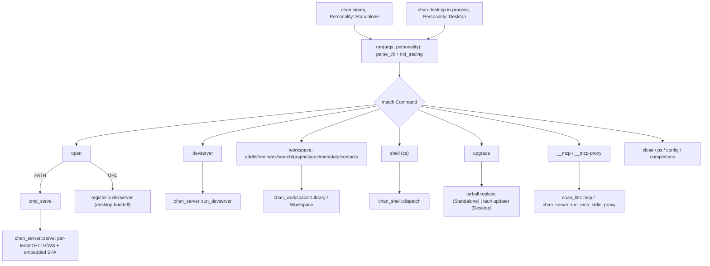
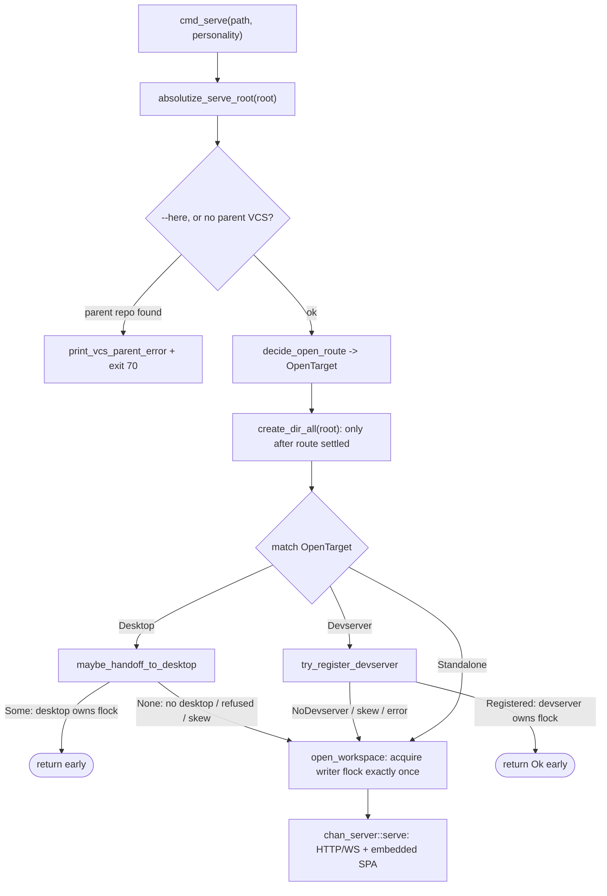

# chan: design

## 1. Problem and scope

`chan` is the binary crate at the top of the workspace: the CLI entrypoint, the subcommand dispatcher, and the place that mounts the embedded `chan-server` for a local serve. It owns argument parsing, tracing setup, the dispatch `match`, the per-subcommand handlers, and self-upgrade. It deliberately owns almost no domain logic of its own -- every registry mutation and workspace-content operation routes through `chan_workspace::Library` / `Workspace`, every HTTP / WebSocket / SPA concern routes through `chan-server`, every MCP concern routes through `chan-llm`, and the `cs` control surface lives in `chan-shell`. This crate is the thin seam that wires those libraries to a command line and to a process lifecycle.

In scope:

  - The `clap` surface: the top-level `Cli` / `Command` enums and their per-subcommand sub-enums, plus the help text that is the source of truth for options.
  - One async entry point, `run(args, Personality)`, dispatched in-process by both the standalone `chan` binary and `chan-desktop`.
  - The per-subcommand handlers (`cmd_*`), which are orchestration glue: resolve a workspace, call a library, print a result.
  - Mounting `chan-server` for `chan open {PATH}` (a local serve) and for `chan devserver` (the headless multi-workspace mode).
  - Self-upgrade: the startup update banner / probe and the `chan upgrade` tarball replacement, plus the Windows `--service` devserver supervision backend.

Out of scope (owned by the libraries this crate drives):

  - Filesystem sandbox, registry, search, graph, watcher (`chan-workspace`).
  - HTTP / WebSocket routes, SPA serving, the in-process MCP host, the devserver builder, the desktop / devserver handoff transports (`chan-server`).
  - MCP tool schemas and stdio server (`chan-llm`).
  - The `cs` clap actions and the control-socket client (`chan-shell`).
  - The native window, webview, and `tauri-plugin-updater` (`chan-desktop`).

The dispatcher is organized strictly by subcommand dispatch -- one `cmd_*` handler per branch of the `match`. This document stays at the dispatch level and does not enumerate every handler or every flag; the `_HELP` / `long_about` text in the clap structs is the authoritative reference for options.

## 2. Architecture overview

The whole CLI surface lives behind the same `run` function so two binaries can drive it: the standalone `chan` binary and `chan-desktop`, which dispatches `chan` in-process when it is invoked through a `~/.local/bin/chan` shim. The only behavioural fork between the two is the `Personality` value threaded into `run`.

The standalone binary builds one multi-threaded tokio runtime for the whole process (`serve` needs it; the sync subcommands run inline on it fine), `block_on`s `run`, and then calls `shutdown_background()` so the process can exit without waiting on `chan-workspace`'s uncancellable reindex pool after Ctrl-C. The runtime is built at the process edge because `run` is async and you cannot build a runtime from inside an async context.

## 3. Frontend boundary

This crate ships no frontend code. `chan open` serves the SPA through
`chan-server`'s build-time bundle, so the editor / terminal / launcher assets
reach the user without this crate owning web assets.

## 4. Subcommand dispatch

The CLI entry point parses arguments, sets up tracing from `-v` count, and dispatches the parsed `Command` to a handler. The top-level surface is intentionally narrow -- it carries the process-lifecycle and app-level verbs, while the registry and per-workspace content operations are grouped one level down under `chan workspace` so they do not crowd the verbs a user reaches for daily.

The real top-level set:

  - `open {PATH|URL}` -- polymorphic. A value containing `://` with a non-empty scheme and authority is a devserver URL and registers a devserver with the running desktop; anything else is a workspace path that gets registered and served. The discriminator is a small string check, not a URL crate: the desktop parses and validates the full URL when it dials.
  - `devserver` -- the headless multi-workspace mode, dispatched to `chan_server::run_devserver`; carries the per-OS `--service` supervision and the tunnel options.
  - `workspace {add,ls,rm,index,reports,search,graph,status,metadata,contacts}` -- the registry and content operations, every one routed through `chan_workspace::Library` / `Workspace` so the sandbox, atomic writes, special-file refusal, and the cross-process writer lock apply uniformly.
  - `shell` -- the `cs` control surface (`infer_subcommands`, so `cs o` / `cs g` resolve by first letter), dispatched to `chan_shell::dispatch`.
  - `close`, `ps`, `config`, `completions` -- per-workspace teardown, the served-workspace listing, persisted preferences, and shell-completion generation.
  - `upgrade` -- self-upgrade, forked by `Personality` (section 7).
  - `__mcp` and `__mcp-proxy` -- hidden, internal-only. `__mcp` runs the `chan-llm` MCP server on stdio against a registered workspace (`chan_llm::mcp::Server::serve_stdio`); `__mcp-proxy` bridges an agent subprocess's stdio to the MCP server hosted in-process by a running `chan open` (`chan_server::run_mcp_stdio_proxy`). The proxy exists so agent child processes reach the live workspace without trying to reopen it, which would deadlock against the per-workspace flock. Both are hidden because they are spawned by MCP clients, never typed by a user.

Each subcommand handler is orchestration only: it opens a `Library`, resolves a `Workspace` when needed, calls into the owning library, and prints text or `--json`. The handlers do not re-implement library invariants; they depend on them.

## 5. serve: mounting chan-server and the embedded frontend

`cmd_serve` is where `chan` becomes a running editor. It does more than bind a socket because a workspace has exactly one writer-lock holder, and `chan open` has to cooperate with whatever might already own that lock on the box. The order of operations encodes that single-writer invariant:

*cmd_serve resolves one open route, then every handoff path returns early so only the standalone tail acquires the writer flock.*

  1. **Absolutize and gate.** The serve root is made absolute against the CLI's cwd (the desktop handoff runs with cwd `/`, and the registry is keyed by canonical path, so a relative root must not leak). Unless `--here` is passed, a root inside a Git / Mercurial / Subversion working tree is refused with a structured marker on stderr and exit 70, so a wrapping shell can offer the repo root instead.
  2. **Desktop handoff.** When the `Desktop` personality is active (or `CHAN_DESKTOP_HANDOFF=1` forces it, which is how the Windows desktop bundle re-execs the standalone console binary into a handoff), a same-user `chan-desktop` in a GUI session is asked to open the workspace in a native window, and the CLI exits. The desktop then owns the flock; the CLI must not also open it.
  3. **Devserver registration.** Otherwise, unless opted out, a same-user local `chan devserver` is offered the workspace; if it mounts it, the CLI prints a note and exits, again leaving one flock owner. This path runs for the standalone binary too and needs no GUI, because devservers are exactly where SSH-only boxes live.
  4. **Standalone serve.** When no handoff takes the workspace, the CLI registers and opens it itself and calls `chan_server::serve(lib, workspace, config)`, which mounts the per-tenant HTTP / WebSocket app and the embedded SPA. The update banner and the background probe fire here, a non-loopback bind prints a plaintext-exposure warning, and a bind collision on the shared default port (`8787`) against an already-running devserver is recognized and turned into an actionable hint rather than a bare "address already in use".

Every handoff path returns early, so a successful handoff never double-opens, and every failure mode (no desktop, refused, stale socket, version skew, GUI absent) drops through to the standalone serve. `chan devserver` reuses the same `chan-server` machinery through `run_devserver` for the multi-workspace case.

## 6. The Personality split

`Personality` exists because the same CLI code runs from two binaries that must behave differently in exactly two places, and threading one enum is cheaper and clearer than two code paths or a build flag. `Standalone` is the `chan` binary from `install.sh` (and the `cs -> chan` symlink); `Desktop` is `chan-desktop` dispatching `chan` in-process through its shim. The forks:

  - **`chan open`** -- `Standalone` always runs its own server (or registers with a local devserver) and never hands off to a desktop; `Desktop` integrates with the running desktop, handing the workspace to a native window.
  - **`chan upgrade`** -- `Standalone` replaces the CLI tarball in place; `Desktop` drives the desktop's `tauri-plugin-updater` instead, since a desktop install is not a loose binary it can overwrite.

Everywhere else the two personalities run identical code. Keeping the fork down to one threaded value is the reason the desktop can share the entire subcommand surface without forking the dispatcher.

## 7. Self-upgrade

The self-upgrade path keeps the running CLI current without a package manager. It has three pieces, all pointed at hardcoded `chan.app` metadata URLs (self-hosted mirrors are not supported for the CLI path):

  - **Banner** -- on `chan open` startup, a one-line stderr notice is printed from a cached state file. No network access, so an air-gapped host pays nothing.
  - **Probe** -- a detached tokio task on `chan open` reads release metadata with short timeouts, refreshes the cache, and prints the banner inline when the fetched version is newer. Throttled to once per day across restarts; failures are swallowed at debug level. `CHAN_UPDATE_CHECK=0` disables the probe.
  - **`chan upgrade`** (`Standalone`) -- resolves the running binary via `current_exe`, reads metadata, downloads the target archive into a sibling temp file, verifies its SHA-256 against the metadata, extracts the `chan` binary, and atomically renames it over the running executable. Size-capped and proxy-aware via the standard `*_PROXY` env vars.

The self-managed `chan devserver --service=chan` backend is the cross-OS analog of the systemd user service on Linux and the launchd LaunchAgent on macOS, used where no OS supervisor exists (Windows, other Unix) and available as the explicit portable choice everywhere. Unlike systemd/launchd it runs the devserver in the FOREGROUND, guarded by a single-instance pidfile + flock (`daemon.json` + `daemon.lock`, the `chan-workspace` `daemon_lock` primitive): it serves in the launching process and is tied to that session, so closing the session stops the daemon -- what chan-desktop's connect-script form and the `ssh -L ... --service` case need (it is NOT detached and does not survive logout; that walk-away model stays systemd/launchd's). A chan-desktop connect script is the connection owner: when that foreground command exits, the desktop treats the devserver as disconnected, so long-running tunnel recipes should use `exec ssh -N ...` or an equivalent foreground command rather than daemonizing. `--stop` / `--restart` / `--status` act on the pidfile, signalling the recorded pid only when the flock confirms a live daemon (so a `kill -9`-leaked pidfile plus a reused pid never SIGTERMs an innocent process); a hard stop is safe because the devserver drains HTTP per request and the writer lock self-heals. `--service` with no value picks the best backend for the OS (`none` = systemd on Linux, launchd on macOS, the `chan` daemon on Windows + other Unix).
