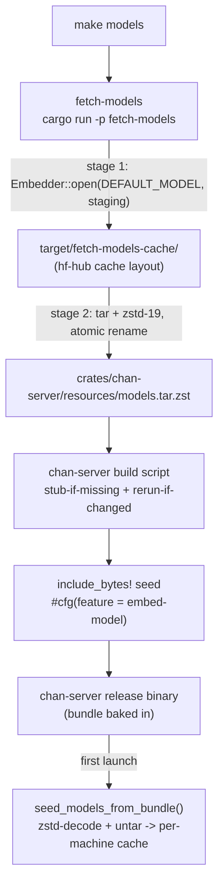

# fetch-models: design

## Cross-crate context

`fetch-models` is a build-only helper binary (`publish = false`). It is not
part of the runtime: it produces the embedded-model tarball consumed by
chan-server, and then exits. Two crates bracket it:

- `chan-workspace` (its only non-trivial dependency, pulled with `features = ["embeddings"]`): fetch-models reuses `chan_workspace::index::embeddings::Embedder::open` and the `chan_workspace::DEFAULT_MODEL` constant so the helper downloads the exact model id and hf-hub cache layout the runtime embedder will later load. The model id has one definition, in chan-workspace, not a copy here.
- `chan-server`: the consumer of the artifact. Its build script tracks the tarball for relink, and its embedded-model seed path bakes it into the binary with `include_bytes!` under the `embed-model` cargo feature. fetch-models writes the file; chan-server decides whether to embed it.

The helper is driven by the root `make models` target (`cargo run --release -p fetch-models`), never by a plain `cargo build`. That separation is the whole point of the crate, covered in section 5.

## 1. Problem and scope

chan's default hybrid search runs dense vectors from `BAAI/bge-small-en-v1.5` (BGE-small). chan-workspace's embedder fetches that model from HuggingFace on first use, a download on the order of 130 MB. A shipped release should be search-ready the moment it launches, with no network round-trip and no first-run stall, which argues for baking the model bytes into the binary via `include_bytes!`. But baking unconditionally would punish every contributor: a plain `cargo build` would have to pull ~130 MB and the dev binary would grow from roughly 26 MB to roughly 89 MB, for a capability most local builds never exercise.

fetch-models resolves that tension. It is the single place the model download happens, invoked explicitly, and the embed it feeds is a default-off cargo feature. A contributor's everyday `cargo build` touches neither the download nor the bundle; a release build runs `make models` first and gets the baked-in model.

In scope:

- Download the default embedding model into a stable on-disk staging cache, reusing chan-workspace's embedder so the layout matches what the runtime resolves.
- Encode that cache into a single zstd-compressed tarball at the path chan-server's `include_bytes!` reads.
- Stay idempotent: a re-run with the model already cached and the tarball already current is a fast no-op, so `make models` is cheap to put in front of `make build-release`.
- Honor `HTTPS_PROXY` / `HTTP_PROXY` for restricted networks (hf-hub's HTTP client picks them up).

Out of scope:

- The runtime embedding stack, the search index, and the model resolver. Those are chan-workspace.
- The compile-time embed and the first-launch extraction. Those are chan-server responsibilities.
- Any model other than the workspace default, and any per-workspace model override. fetch-models seeds one model, the one the binary ships with.

## 2. Architecture overview

The left-to-bottom spine is build-time and runs once per release; the bottom edge (`Bin -> Seed`) is runtime and runs once per machine. fetch-models owns only the top two arrows; everything from `Bundle` down is chan-server, included here so the handshake reads end to end.

## 3. The two-stage pipeline

fetch-models is intentionally a small two-stage helper with an idempotency gate between the stages.

Stage one downloads through the same embedder the runtime uses, pointed at a
stable staging cache. hf-hub populates that cache on a cold run and skips the
network when it is already populated. Reusing the runtime embedder rather than a
hand-rolled HTTP fetch is what guarantees the staged bytes land in the exact
hf-hub cache layout the seeder later validates. Stage two strips the redundant
blob store on the way into the tarball so the shipped archive contains only the
runtime-resolvable model snapshot.

Stage two encodes. It walks the staging tree, tar-archives it through a zstd
encoder at level 19, and atomically renames the temp file into place. Level 19
is the max-ratio-for-reasonable-encode-time point for a one-shot blob of this
size; higher levels buy roughly one percent for more than double the encode
time. The walk drops hf-hub bookkeeping and the redundant blob subtree because
tar follows the snapshot symlinks into the same bytes and keeping both would
double the archive. The write is to a sibling temp file then `rename`, so a
failed encode never leaves a half-written bundle that would confuse a subsequent
`cargo build`.

Between the stages sits an mtime gate: if the existing bundle is newer than every non-skipped file under staging, the slow zstd-19 re-encode is skipped and the run is a no-op. The gate mirrors the same skip filter the encoder uses, so a freshly arrived lockfile or `blobs/` entry does not force a needless rebuild. Forcing a rebuild is a matter of deleting the bundle or running `cargo clean`.

## 4. The embed-model handshake into chan-server

The artifact crosses into chan-server at two seams, and `embed-model` is the feature name that gates the real one.

At compile time, the embedded-model seed code is gated on the `embed-model`
feature. With the feature off (the default), the whole module compiles out, the
file's bytes never enter the binary, and the runtime falls back to
chan-workspace's model resolver plus on-demand download. With the feature on,
the tarball is baked in. `embed-model` implies `embeddings`, because bundling a
model is meaningless without the embedding code to use it.

chan-server's build script does not embed anything; it makes the embed correct.
When the bundle is absent, it writes an empty stub so that a feature-enabled
build still compiles without a prior `make models`. It then pins the link step
to the bundle's mtime so a later `make models` forces a relink instead of
silently shipping a stale or empty bundle. The seeder treats an empty bundle as
"no embedded model," so the stub is a valid, inert placeholder.

At runtime, `seed_models_from_bundle()` (also gated on `embed-model`) runs once on first server launch. It zstd-decodes and untars `MODEL_BUNDLE` into the per-machine model cache (`chan_workspace::index::embeddings::global_models_dir`), guarded by a content check that the default model's `refs/main` plus a complete `snapshots/<hash>/` (config, tokenizer, safetensors) are present, so subsequent launches skip the extraction. An empty bundle, a corrupt archive, or an extraction error never blocks startup: the path downgrades to the same HuggingFace fetch a dev build would use.

The net contract: `make models` writes the file, the `embed-model` feature decides whether it is baked, the build script keeps the link honest, and the seeder lays it down on the user's machine.

## 5. Why a separate crate, and the lean-dev invariant

The download and the embed are deliberately pried apart from the normal build graph, and the seam is a crate boundary plus a feature flag.

It is a separate binary crate, not a build-script step inside chan-server, because a build script runs on every `cargo build` of its package. Folding the fetch into chan-server's build script would drag the ~130 MB download into every contributor's first compile and every CI lane, which is exactly the cost the design exists to avoid. A standalone crate runs only when something names it: `cargo run -p fetch-models`, wrapped as `make models`.

The embed is a separate cargo feature, `embed-model`, default-off, because even with the bundle present on disk the dev binary should not carry it. Default `cargo build` produces the lean ~26 MB binary against the native per-OS search experience; `make build-release` runs `models` then builds `chan` with `--features embed-model` for the ~89 MB search-ready release. Two independent off switches -- the crate is not in the default build graph, and the embed is not in the default feature set -- enforce one invariant: a contributor who never asks for the model never pays for it, in download bytes, build time, or binary size.
