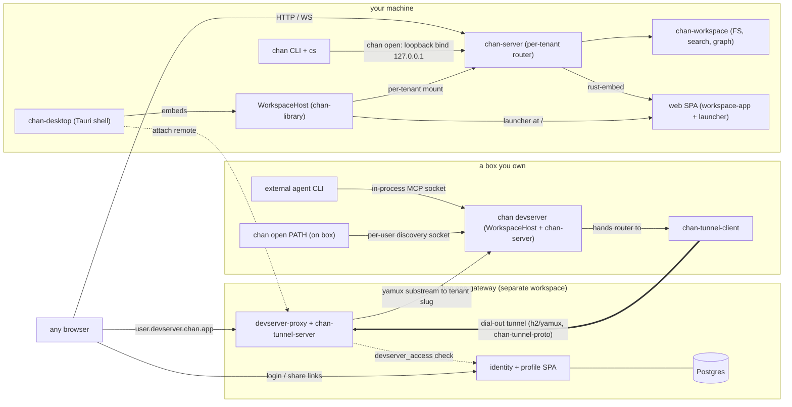
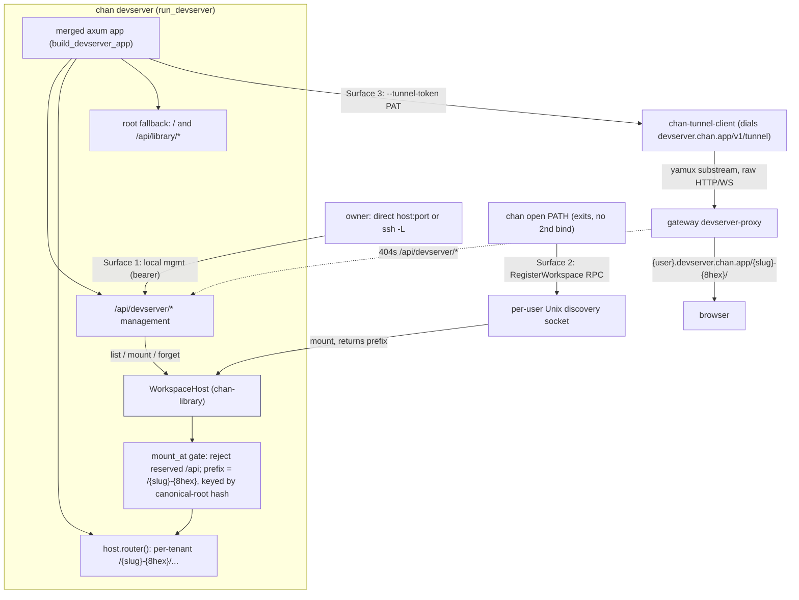

# chan: design

`chan` is an IDE for the modern engineer: a single binary that serves a hybrid workspace containing a terminal, editor, file browser, graph, and dashboard as tiling tabs and panes over a folder on disk. You drive projects in Markdown and put AI to work on them; multiple agents run in the terminal and coordinate through `cs` and the in-process MCP server. This document is the canonical design reference for the workspace. Update it in the same commit as any change that affects crate boundaries, server contracts, state ownership, or the frontend embed / serve story.

## Component architecture

The dependency direction keeps local-first workspace code independent from app and gateway concerns. `chan-workspace`
owns filesystem gates, search, graph, and workspace state. `chan-server` wraps one tenant in HTTP, WebSocket,
frontend serving, terminal, and MCP-bridge concerns. `chan-library` composes tenants into a multi-workspace host
and launcher surface. `chan` and `chan-desktop` are runtime drivers, while `chan-llm` exposes the same workspace
boundary to external agent CLIs over MCP.

The split is load-bearing:

- `chan-server` links only chan-shell's wire types (`ControlRequest` / `ControlResponse`), not its clap actions
  or transport.
- The gateway is a separate Cargo workspace with its own lockfile and dependency stack, so the core single-binary
  build never pulls in Postgres, OAuth, or proxy-only code. It consumes the in-repo tunnel crates through the
  tunnel protocol boundary. See [`gateway/README.md`](./gateway/README.md).
- The embedding-model bundler is an explicit release helper, not an implicit `cargo build` step.
- Naming traps: the launcher is the `web-launcher` package, devserver is a `chan-server` mode, and `chan-llm` is an
  MCP tool sandbox rather than a provider client.

### System architecture

The whole-chan view: your machine (the CLI plus the desktop shell that embeds the host, the
per-tenant server, the core, and the SPA), a box you own running a dial-out `chan devserver`, and
the chan.app gateway (identity + Postgres + the devserver-proxy).

Bottom-up layering: **chan-report** feeds **chan-workspace** (the core); chan-workspace is wrapped
per-tenant by **chan-server**, orchestrated multi-tenant by **chan-library**, and exposed to agents by
**chan-llm**; the **devserver** mode composes server + library + **chan-tunnel-client** (`-proto`
shared); **chan** (CLI) and **chan-desktop** are the drivers, **chan-shell** their control client. The
dependency direction is load-bearing for the inversion seams: chan-library holds the launcher's
`DevserverRegistry` trait + the `WindowTransfers` signal as `Arc<dyn ...>`/owned types, and chan-server
(which depends on chan-library) re-exports them and implements the routes -- the low-level crate
exposes the slot, the higher one fills it.

### The launcher: one SPA, three surfaces, reflecting the real library

The launcher (`web-launcher`) is served at `/` by the `chan-library` `WorkspaceHost` root fallback and
reached identically on the desktop loopback, a `chan devserver`, and the gateway-proxied root. Its registry
CRUD (workspaces **and** devservers) is the **live `/api/library/*` client** -- on the desktop loopback it
lists + mutates the user's real `~/.chan` workspaces and configured devservers (no mock).

- **Workspaces** ride `/api/library/workspaces` (list + add/on/off/rm); per-row **Open** mints a new
  workspace window, **Turn on** mounts an off workspace. Mutation is loopback-only; read-only over the tunnel.
- **Devservers** ride `/api/library/devservers` (list + add/edit/remove), backed by a **`DevserverRegistry`**
  bridge: chan-library defines the trait (held by `WorkspaceHost`, mirror of `workspace_overlay`),
  chan-desktop implements it over its config (URL-shaped entries; the bearer token is write-only --
  `has_token` reported, never echoed); the headless devserver/gateway surface installs none, so it serves an
  empty list and 404s mutation. A devserver entry is a single full URL (scheme included), the forward hook
  for the eventual devserver-proxy dial.
- **Windows** ride `/api/library/windows` (+ `/watch` WS) -- the authoritative `WindowRecord` feed the
  desktop, the launcher, and `cs window list` reconcile to; the clickable status dot toggles a window
  open/hidden, and `cs upload`/`cs download` surface a per-window transfer bubble whose in-flight count is
  reported over `/ws` (`WindowTransfers`) so closing a window mid-transfer prompts hold/cancel. `cs
  copy`/`cs paste` bridge the terminal's stdin/stdout to that window's clipboard (text, HTML, or a PNG
  image) over the same `pane_query`-style window round-trip: the server pushes a `clipboard_write` /
  `clipboard_read` window_command, parks a `WindowBus` oneshot, and blocks until the SPA replies through
  `POST /api/window/reply`. The SPA writes/reads via `navigator.clipboard`, or the desktop's native
  `arboard` IPC where WKWebView's async clipboard is gesture-gated.

## Crate responsibilities

### chan (binary)

Owns process-level CLI concerns: argument parsing, tracing initialization, startup/shutdown policy, self-upgrade,
and dispatch into lower layers. It does not own HTTP routes, LLM tool behavior, or filesystem policy. Workspace
registry and per-workspace operations go through `chan-workspace`; local and tunnel serving go through
`chan-server`; shell/window control goes through `chan-shell`.

`chan open` is the handoff point between a standalone loopback server and an already-running desktop/devserver
host. An explicit workspace path may auto-register with that host and exit; `--standalone` forces an independent
bind. Hidden MCP entrypoints are compatibility shims for external agent CLIs: one starts `chan-llm` over stdio for
a workspace, and one bridges stdio into the in-process MCP socket hosted by `chan-server`. Embedded terminals export
`CHAN_MCP_*` and control-socket discovery variables, leaving provider-specific env namespaces to the external tools.

### chan-server

Owns the per-tenant HTTP/WS runtime: launch-token auth, SPA fallback and embedded assets, API route composition,
watcher/indexer subscriptions, terminal PTY lifecycle, model-bundle seeding, and the in-process MCP socket bridge.
It delegates filesystem, search, graph, report, archive, and write semantics to `chan-workspace`, and MCP tool
semantics to `chan-llm`. Tunnel transport is composed around the same per-tenant router rather than changing tenant
request handling.

Stable contracts:

- Async handlers treat `chan-workspace` as a synchronous filesystem boundary: they snapshot the live workspace,
  return retryable busy responses during metadata swaps, and move blocking filesystem/index/report/archive/transfer
  work off the async executor.
- Per-launch auth gates every `/api/*` and `/ws` route. SPA fallback must not mask `/api/*` or `/ws` misses.
- Streaming reads use NDJSON on established `?stream=1` read/report/graph/backlink endpoints; clients must tolerate
  incremental records.
- `/api/devserver/*` is reserved local-only management surface; the gateway tunnel must 404 it publicly.
- `GET /ws` is the watcher and window-presence side channel; window tags are part of that presence contract.
- A terminal WebSocket's `session` frame carries optional `submit_agent`, derived from the current PTY incarnation's stored spawn command and `CHAN_AGENT`. Restart and reattach recompute it; shells and unknown commands omit it, so old clients and servers remain wire-compatible.

### chan-llm

Owns: the chan MCP server (`chan_llm::mcp::Server`), tool schemas exposed over MCP, embedded prompt text, and MCP key resolution. Tool reads / writes always go through `chan_workspace::Workspace` so the filesystem gates apply. MCP handlers also move synchronous chan-workspace work onto blocking threads. `read_file` and `write_file` cover editable UTF-8 text, including source and config files. `read_media` covers chan-workspace Image and Pdf classes: images return MCP image content, PDFs return MCP blob resources.

chan-llm is MCP-only: it has no in-app chat session, no CLI backends, and no tool loop of its own. External agent CLIs (claude, codex, gemini, opencode) connect to the chan MCP server by reading the `CHAN_MCP_*` environment variables the embedded terminal exports and translating them to their own MCP configuration. The crate also ships `chan-llm-mcp`, a standalone stdio MCP server binary any MCP client (Claude Desktop, Cursor, ...) can spawn for chan-workspace-sandboxed access to a workspace.

chan-server hosts the MCP server in-process behind a Unix-domain socket. External subprocesses connect via
`chan __mcp-proxy <socket>`, which is a stdio<->socket pipe. This sidesteps chan-workspace's per-workspace flock
that would otherwise reject a child's `Library::open_workspace`.

## Error model

The workspace shares one error convention rather than a shared error crate. Each request-handler crate owns its own `thiserror::Error` enum with an `IntoResponse` impl that maps every variant to a precise HTTP status; public-facing messages stay short and generic (`unauthorized`, `internal error`) while the detailed context goes to the `tracing` log. `anyhow::Error` is fine in startup paths; request handlers return explicit variants. chan-server's request error mapping is the root-side example; in the gateway, `profile`, `identity`, and `devserver-proxy` each carry their own.

Cross-service CLIENT errors -- the typed failures one service surfaces to another over HTTP -- live in a `*-common` crate as axum-free `thiserror`/`serde` types that each consumer maps into its own enum via `From`. The gateway's `gateway-common` holds these (the profile and devserver-control client errors, the devserver-gate error).

There is deliberately no error type spanning the Postgres-free core and the gateway: a shared enum would couple the static core binary to gateway concerns, which is the boundary the separate gateway workspace exists to hold. The tunnel crates reinforce the same discipline by flattening their errors to primitives on `Display`, so `h2::Error` and `serde_json::Error` never surface in a public API another crate must re-export.

## Frontend embed: build, serve, prefix

The frontend is a Svelte/Vite/Tailwind build artifact consumed by chan-server through rust-embed:

- Debug build: rust-embed reads the artifact from disk on every request. `make web` (or `npm run build` directly) is enough to see updates without a cargo rebuild.
- Release build: the artifact is baked into the binary at compile time, and re-bundling the frontend triggers a relink.

Vite is configured with `base: "./"` so asset URLs in the bundle are relative to whatever path the SPA shell is loaded from. That matters for two paths:

- `--prefix /seg`: a reverse proxy can mount many `chan open` instances under one host, e.g. `workspace.example.com/{user}/`. The router is `Router::new().nest(prefix, inner)`, and every `index.html` response gets a `<meta name="chan-prefix" content="/seg">` injected after the `<head>` tag (`static_assets::inject_chan_prefix`). The frontend reads that meta tag at boot and prepends the prefix to every fetch and WebSocket URL.
- Tunnel mode: a `chan devserver` carries its WHOLE library through one gateway registration. The proxy is segment-PRESERVING -- it forwards `{user}.devserver.chan.app/{workspace}/...` into the tunnel substream UNCHANGED (it does NOT strip the `{workspace}` segment). The devserver mounts each tenant at its public slug `/{workspace}`, and that tenant's SPA shell already carries `<meta name="chan-prefix" content="/{workspace}">`, so a multi-tenant devserver does not swap one prefix on connect: each tenant self-prefixes at its slug and the proxy forwards every API/WS URL under `/{workspace}/...` unchanged.

Single-page-app fallback: any path that isn't an `/api` route, a `/ws` upgrade, or a baked asset returns `index.html` so client-side routes work. Misses on `/api/*` and `/ws` return real 404s instead of the SPA shell so callers don't silently get HTML when they expected JSON.

## Bind vs tunnel

`chan open` always binds a local listener: `axum::serve(TcpListener, app)` on 127.0.0.1 (or `--host` / `-6`). A per-launch bearer token gates every `/api/*` and `/ws` route, accepted as `?t=TOKEN` or `Authorization: Bearer TOKEN`. No TLS; the loopback bind is the trust boundary. (Single-workspace remote serve was dropped: the gateway tunnel now carries a whole library through `chan devserver`, below, not one workspace per `chan open`.)

The gateway tunnel is `chan devserver --tunnel-token <PAT>` (`CHAN_TUNNEL_TOKEN`). When set, the devserver runs its local management server AND hands the same devserver router to `chan_tunnel_client::run`, which dials `devserver.chan.app/v1/tunnel` and serves yamux substreams. The model is per-DEVSERVER, not per-workspace:

- One devserver per user; the public host is `{user}.devserver.chan.app`. The registration is keyed on the DEVSERVER identity (`devserver_id`), which the gateway resolves backend-side from the token (the PAT's SHA-256) via the `Validated.devserver_id` the tunnel validator returns -- NOT a workspace name the client supplies. The client's `Hello.workspace` is an ignored `"devserver"` placeholder.
- Always authenticated; there is no anonymous-readable path (the `public` flag is gone). `{user}.devserver.chan.app` is the trust boundary: the gateway gates on one `devserver_access(owner, devserver, caller)` check (a grant is the whole devserver) and issues a host-only session cookie scoped `Path=/` over the whole host (no per-workspace path scope, since the grant is whole-devserver). The devserver's local management listener still uses its bearer token; tunnel-origin tenant requests bypass local bearer auth only after devserver-proxy authenticates the browser and forwards the request over the authenticated tunnel with a signed caller assertion.
- The path `{workspace}` segment is tenant routing only and never gates. The proxy forwards it unchanged (segment-preserving) and the devserver routes the tenant by it. The management API (`/api/devserver/*`) is local-only; the proxy 404s it on the public wildcard.

`build_app` produces the byte-identical axum app for the local bind; the devserver mounts each tenant through the same `WorkspaceHost` tenant builder, so request handling is identical across local serve, the devserver, and the tunnel.

Both paths install signal watchers (SIGINT / SIGTERM on Unix, Ctrl-C on Windows) that fire a single `tokio::sync::watch` channel the server future drains on. A side task uses the same channel to cancel any in-flight reindex so the runtime drop returns within at most one file's worth of work. After the signal fires, both paths race the server future against a 10-second grace timer and force exit on grace expiry. The local bind path centralizes this wiring in `signal::graceful_serve`, and the headless `chan devserver` (`run_devserver`) calls the same helper, so its SIGINT / SIGTERM drain and the 10-second grace force-exit behave identically; its reindex-cancel side task rides the same channel before the call.

## Devserver and the multi-workspace host

`WorkspaceHost` is an in-process owner that mounts several workspaces behind one runtime instead of one `chan open`
child per workspace. It is a thin owner around the existing per-workspace server: each mounted workspace builds its
own server state, watcher, indexer, MCP bridge, control socket, terminal registry, and route prefix, and the host
dispatches by URL prefix without sharing route state across tenants. chan-desktop embeds a `WorkspaceHost` for local
workspaces (see [`desktop/design.md`](desktop/design.md)); `chan devserver` binds one to a real address as a
headless multi-workspace aggregator for boxes reached over SSH or a LAN.

Three surfaces ride one `WorkspaceHost`: local management (bearer), the per-user discovery socket a `chan open` registers through, and the optional gateway tunnel.

The devserver wraps the host in two surfaces:

- A management HTTP/JSON API under the reserved `/api/devserver/*` namespace. It lists, mounts, and forgets
  workspaces and opens standalone terminals. Workspace tenants mount at their public slug, with `api` reserved and
  colliding workspace slugs rejected inside a devserver. Standalone terminal tenants keep opaque launcher-local
  prefixes rather than public workspace slugs.
- A per-user Unix discovery socket. When a devserver is running on a box, a `chan open PATH` there registers its
  workspace with the running devserver and exits instead of binding a second listener, so the devserver keeps the
  single-writer flock. Discovery is a well-known per-user endpoint, separate from per-process MCP/control sockets
  and from the desktop handoff. It is Unix-only; other targets resolve to "no devserver" and the CLI stays
  standalone. The registration handshake carries a protocol version, and a mismatch falls back to standalone rather
  than decoding an unknown shape. `chan open --standalone` forces a standalone bind and skips both handoff paths.

Optionally, `chan devserver --tunnel-token <PAT>` also publishes the whole library through the gateway (see "Bind vs tunnel"): the foreground devserver hands the SAME devserver router to `chan_tunnel_client`, registering ONE devserver at `{user}.devserver.chan.app`. The management API rides the same router but the proxy 404s `/api/devserver/*` on the public wildcard, so only tenant content (`/{slug}/...`) is reachable through the gateway; the owner manages the devserver over the direct (host:port / `ssh -L`) connection. Tunnel mode is foreground-only -- combined with `--service=systemd`/`--service=launchd` it is refused, since the supervised backend would have to persist the token in the unit file / launchd plist.

What was mounted survives a restart. The enabled workspace roots and the devserver bearer token persist in `~/.chan/devserver/config.json` (0600); the enabled set is re-mounted on the next start, and the reused token keeps a reconnecting client working. Per-window pane and tab layout is not persisted by the devserver: each tenant is a full workspace mount that stores its own per-window SPA session, so a reconnecting client re-hydrates its panes from the tenant. Terminal PTY contents reset across a restart because PTYs are fresh processes.

The `--service` flag picks the backend, and its behavior is driven by explicit action verbs rather than one overloaded default. `--service=none` (the default) runs in the FOREGROUND on `--bind`/`--port` with no supervision; `--service=chan` is the cross-OS self-managed foreground daemon (pidfile + flock), tied to the launching session. `--service=systemd` (Linux) and `--service=launchd` (macOS) are detached background services that outlive the launching shell, and each requires one verb: `--start` (create/refresh the unit, enable it on boot, start it, then return), `--stop` (stop **and** disable, so it does not come back on the next login/boot), `--restart` (rewrite the unit for the current binary + address, bounce it, return), `--status`, or `--join` (ensure it is running, then stay attached and block on the health watchdog until Ctrl-C -- the "bring it up and watch it" form connect scripts use). A bare `--service=systemd`/`--service=launchd` with no verb is rejected. On Linux the systemd **user** unit is `chan-devserver.service` and `--start`/`--join` ensure linger so it survives logout; on macOS the per-user **LaunchAgent** (`app.chan.devserver`) in the `gui/<uid>` domain outlives the shell and the GUI login session, but not a full logout (launchd has no per-user linger without a root LaunchDaemon). systemd follows the unit journal; launchd follows a log file (`~/.chan/devserver/devserver.log`), since launchd has no journal. A future Windows service backend slots in the same way.

The token-delivery contract is the load-bearing invariant shared by every supervision backend: the **supervisor process itself** prints the locked `CHAN_DEVSERVER_TOKEN=` marker (`chan_server::DEVSERVER_TOKEN_MARKER`) to its own stdout, reading the token from the persisted 0600 `~/.chan/devserver/config.json`. The chan-desktop control terminal scrapes that marker from the supervisor's stdout to acquire the bearer token and reconnect. Delivery does not depend on the supervised service's own stdout reaching the controlling terminal through the platform log stream: on systemd the supervisor also tails the unit journal for human-facing logs, but a host where the user has no readable journal (a uid below `SYS_UID_MAX`, or a user outside the `systemd-journal`/`adm` groups) still receives the token because the supervisor emits it directly. A `Type=simple` unit reports active before the service's first config persist, so the supervisor briefly polls the config until the token lands. If the token cannot be surfaced the supervisor exits non-zero rather than babysit a service no client can authenticate to; the service itself keeps running, so a later re-attach recovers it. The launchd backend follows the agent's log file rather than a journal but honors this same direct-emit-and-fail-loud contract; a future Windows backend must too, regardless of how that platform exposes service logs.

## State ownership

`chan-workspace` owns per-workspace state, the workspace registry, sandboxed user-file operations, and its own
persistence rules. See [`crates/chan-workspace/design.md`](crates/chan-workspace/design.md).

App-level state outside chan-workspace is intentionally narrow:

- Per-launch auth and process-scoped MCP/control sockets live with the server lifecycle and are removed on shutdown.
- App/server preferences and update-check throttle live at the application layer and mutate through config APIs.
- API key storage is optional; environment variables and OS keychain sources take precedence when available.
- Devserver supervision state carries the reused bearer token and enabled workspace set needed to re-mount after restart.

Bearer tokens and on-disk secrets are mode 0600 on Unix. App-layer writes use the same atomic-write and parent-dir
fsync discipline as workspace content, so durability semantics do not vary by storage owner.

## App-level vs chan-workspace

| Concern                            | Lives in    |
|------------------------------------|-------------|
| Filesystem ops (read/write/list)   | chan-workspace  |
| Path sandbox + special-file gates  | chan-workspace  |
| Workspace registry                 | chan-workspace  |
| Search (tantivy BM25 + embeddings) | chan-workspace  |
| Graph (sqlite)                     | chan-workspace  |
| Filesystem watcher                 | chan-workspace  |
| HTTP / WebSocket / SPA fallback    | chan-server |
| Per-launch auth token              | chan-server |
| Embedded frontend bundle           | chan-server |
| Editor preferences                 | chan-server |
| Server preferences                 | chan-server |
| Sessions / window layouts          | chan-workspace (storage), chan-server (HTTP) |
| Attachments dir                    | chan-server |
| Embedded terminal PTY              | chan-server |
| MCP server (in-proc + bridge)      | chan-llm + chan-server |
| Tunnel transport                   | chan-tunnel-client |
| Self-upgrade flow                  | chan binary |

The split keeps app-level concerns (HTTP, WebSocket, frontend bundle, editor preferences, terminal PTY) out of chan-workspace so native shells can link the workspace layer via uniffi without dragging in axum / reqwest / the rest of the HTTP stack. The Tauri desktop shell takes the other path: it embeds chan-server in-process and renders the same SPA in native webview windows -- see [`desktop/design.md`](desktop/design.md).
