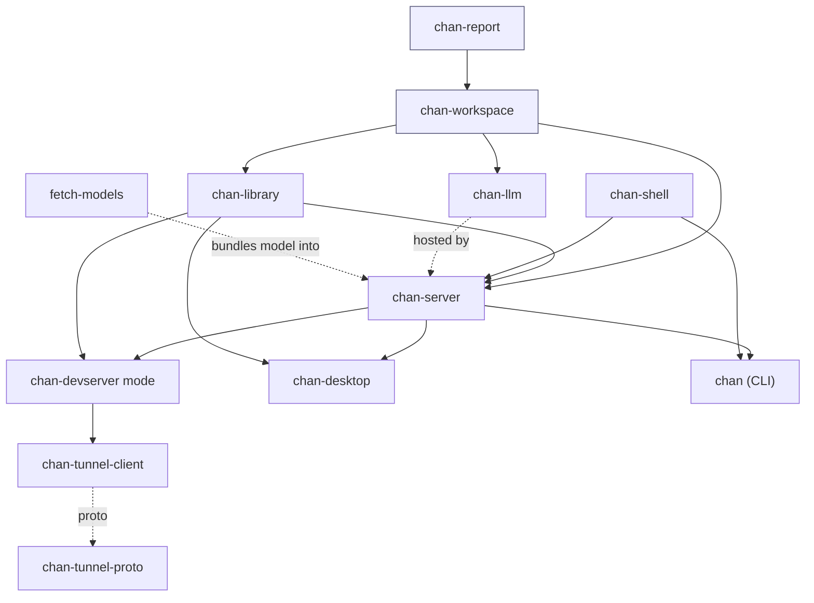
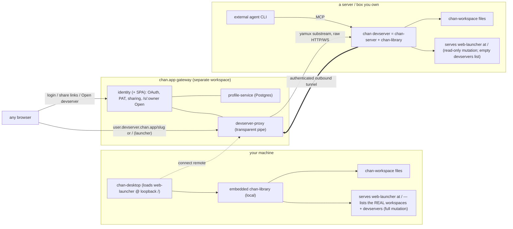

# chan: design

`chan` is the user-facing AI-native IDE for the modern engineer: a CLI plus an HTTP server that serves a hybrid workspace (editor, terminal, Team Work, file browser, graph, dashboard) of tiling tabs and panes over a folder on disk. You drive projects in Markdown and put AI to work on them; multiple agents run in the terminal and coordinate through `cs` and the in-process MCP server. This document is the canonical design reference for the workspace. Update it in the same commit as any change that affects crate boundaries, the module layout under `chan-server`, the on-disk layout, or the frontend embed / serve story.

## Workspace layout

```
crates/
  chan                  binary. CLI + dispatch into subcommands;
                        embeds the frontend via chan-server's
                        rust-embed bundle.
  chan-server           HTTP + WebSocket surface. Wraps chan-workspace
                        in axum routes; hosts the in-process MCP
                        server over a Unix-domain socket.
  chan-workspace            filesystem boundary, workspace registry, search
                        + graph indexer, watch, report engine.
  chan-llm              MCP-only library: chan MCP server, tool
                        schemas, embedded prompts, key resolution.
  chan-report           report engine shared with chan-workspace.
  chan-shell            the `cs` surface: clap actions, the
                        control-socket client, and the per-agent
                        submit-chord map. Rides the chan and
                        chan-desktop binaries; chan-server links only
                        its wire types (ControlRequest /
                        ControlResponse), not clap or the transport.
  chan-tunnel-{proto,
    client, server}     h2/yamux workspace tunnel: wire protocol, the
                        client chan-server dials, and the
                        standalone server hosted near the gateway.
  fetch-models          build helper. Pre-fetches the default
                        embedding model into chan-server's
                        resources/ so release builds bundle it.
                        Not invoked by `cargo build`.

web/                    Svelte frontend, embedded into the binary
                        at build time via rust-embed.

desktop/                Tauri shell (`chan-desktop`). Embeds
                        chan-server for normal local workspaces and
                        renders the editor in a webview window.
                        Remote workspaces are explicit attach modes,
                        not local fallback behavior. Per-window
                        state is keyed by `w=<window-label>`.
                        Desktop-only native bridges, such as File
                        Browser drag-out export, call existing
                        chan-server HTTP routes and stage temporary
                        OS payloads instead of reading workspace content
                        directly from Tauri filesystem code.

gateway/                Account / sign-in / reverse-proxy surface for
                        chan.app: profile + identity (id.chan.app) and
                        devserver-proxy (devserver.chan.app), plus the
                        admin CLI and shared gateway-common. A separate
                        nested Cargo workspace (own lock + deps),
                        Postgres-backed and linux amd64/arm64 only, so
                        it is NOT a member of the root workspace and the
                        core single-binary build never pulls in its
                        sqlx/oauth2 stack. Consumes the in-repo
                        chan-tunnel-* crates by path. See
                        gateway/design.md and per-crate design docs.
```

Every crate above is a member of this repo's root workspace (gateway/ is the one exception: a nested workspace of its own). The crate split keeps app-level HTTP / frontend concerns out of chan-workspace / chan-llm so native shells (iOS / Android, future) can link `chan-workspace` via uniffi without dragging in this repo's axum / tower / reqwest stack.

## Component architecture

A by-component map (this complements the by-concern prose in the rest of this document). Naming notes:
`chan-launcher` is not a crate — it is the **`web-launcher`** package; `chan-devserver` is not a crate —
it is a *mode* of `chan-server` (`run_devserver`); `chan-llm` is not a provider client — it is an **MCP
tool sandbox** (the model lives in an external agent CLI running in a terminal tenant); the **gateway** is
a separate Cargo workspace.

### Inventory

| Component | Kind | Role (one line) |
|---|---|---|
| `chan` | bin crate | the CLI + runtime entry point (`open`/`close`/`devserver`/`workspace`/`ps`/`__mcp`/`upgrade`) |
| `chan-workspace` | lib crate | **core** local-first storage: FS sandbox, search, link graph |
| `chan-report` | lib crate | per-file SLOC/language/COCOMO, incremental |
| `chan-llm` | lib crate | MCP tool sandbox over a workspace (for external agents) |
| `chan-library` | lib crate | multi-tenant host + the `/api/library/*` window feed + launcher root + the devserver-registry / window-transfer seams |
| `chan-server` | lib crate | per-tenant HTTP/WS app + SPA serving + MCP host + devserver builder + `/api/library/{workspaces,devservers,windows}` routes |
| `chan-shell` | lib crate | the `cs` control-socket client + shared wire types |
| `chan-tunnel-{proto,client,server}` | lib crates | tunnel wire protocol / outbound dialer / gateway terminator |
| `fetch-models` | bin crate | build-time embedding-model bundler |
| `chan-desktop` (`desktop/src-tauri`) | bin crate | native Tauri shell — macOS `.dmg`, Windows NSIS, Linux AppImage/deb/rpm |
| `web` (`chan-web`) | SPA | the main UI: editor/terminal/graph/file-browser, embedded as `web/dist` |
| `web-launcher` (`chan-web-launcher`) | SPA | the launcher (real workspace + devserver list + window feed); served at `/` across all 3 surfaces |
| `web-marketing` (`chan-web-marketing`) | static site | chan.app marketing + install + `/dl` metadata |
| `gateway/*` | separate workspace | account / sign-in / reverse-proxy for chan.app (`gateway-common`, `profile`, `identity`+SPA, `devserver-proxy`, `admin`) |

### Dependency / layering (who builds on whom)



Bottom-up: **chan-report** feeds **chan-workspace** (the core). chan-workspace is wrapped per-tenant by
**chan-server**, orchestrated multi-tenant by **chan-library**, and exposed to agents by **chan-llm**. The
**devserver** mode composes server+library + **chan-tunnel-client** (`-proto` shared). **chan** (CLI) and
**chan-desktop** are the drivers; **chan-shell** is their control client. The dependency direction is
load-bearing for the inversion seams: chan-library holds the launcher's `DevserverRegistry` trait + the
`WindowTransfers` signal as `Arc<dyn ...>`/owned types, and chan-server (which depends on chan-library)
re-exports them and implements the routes — the low-level crate exposes the slot, the higher one fills it.

### Runtime topology (your machine + a box + chan.app)



### The launcher: one SPA, three surfaces, reflecting the real library

The launcher (`web-launcher`) is served at `/` by the `chan-library` `WorkspaceHost` root fallback and
reached identically on the desktop loopback, a `chan devserver`, and the gateway-proxied root. Its registry
CRUD (workspaces **and** devservers) is the **live `/api/library/*` client** — on the desktop loopback it
lists + mutates the user's real `~/.chan` workspaces and configured devservers (no mock).

- **Workspaces** ride `/api/library/workspaces` (list + add/on/off/rm); per-row **Open** mints a new
  workspace window, **Turn on** mounts an off workspace. Mutation is loopback-only; read-only over the tunnel.
- **Devservers** ride `/api/library/devservers` (list + add/edit/remove), backed by a **`DevserverRegistry`**
  bridge: chan-library defines the trait (held by `WorkspaceHost`, mirror of `workspace_overlay`),
  chan-desktop implements it over its config (URL-shaped entries; the bearer token is write-only —
  `has_token` reported, never echoed); the headless devserver/gateway surface installs none, so it serves an
  empty list and 404s mutation. A devserver entry is a single full URL (scheme included), the forward hook
  for the eventual devserver-proxy dial.
- **Windows** ride `/api/library/windows` (+ `/watch` WS) — the authoritative `WindowRecord` feed the
  desktop, the launcher, and `cs window list` reconcile to; the clickable status dot toggles a window
  open/hidden, and `cs upload`/`cs download` surface a per-window transfer bubble whose in-flight count is
  reported over `/ws` (`WindowTransfers`) so closing a window mid-transfer prompts hold/cancel.

## Crate responsibilities

### chan (binary)

Owns: argument parsing (clap), tracing init, dispatch into subcommands. Calls `chan_workspace::Library` for registry mutations and `chan_workspace::Workspace` for per-workspace operations. Calls `chan_server::serve` for `chan open` and `chan_server::run_devserver` for `chan devserver` (which dials the gateway tunnel when `--tunnel-token` is set). Self-upgrade flow lives in `crates/chan/src/update.rs`. No HTTP routes, no LLM code, no filesystem access outside chan-workspace.

The binary also exposes two hidden MCP subcommands that external agent CLIs invoke through environment variables exported by the embedded terminal: `chan __mcp <workspace-root>` runs chan-llm's MCP server on stdio (used when no running `chan open` is reachable); `chan __mcp-proxy <socket>` is a stdio bridge into the in-process MCP server hosted by a running `chan open`. The embedded terminal exports `CHAN_MCP_SERVER_JSON` and companion `CHAN_MCP_*` discovery variables. Chan deliberately avoids CLI-owned env namespaces such as `CLAUDE_`, `CODEX_`, and `GEMINI_`; external tools can translate the `CHAN_` descriptor into their own MCP configuration.

Subcommand surface today:

```
chan workspace add PATH [--semantic-search] [--reports]
chan workspace ls [--json]
chan workspace rm PATH
chan workspace index <rebuild|status|set-model|download-model|list-models|
                     enable-semantic|disable-semantic>
chan workspace reports <...>        per-workspace code-report toggle
chan workspace search PATH QUERY [--limit N]
chan workspace graph PATH [--scope all|file|directory] [--target] [--depth]
chan workspace status [PATH] [--json]
chan workspace metadata <...>       metadata archive import/export
chan workspace contacts import csv FILE --into DIR
chan open PATH [--here] [--host|-4|-6] [--port] [--prefix]
           [--timeout] [--no-token] [--no-browser] [--standalone]
           [--no-settings] [--search-aggression]
chan open URL [--name NAME] [--script CMD]   register a devserver
chan devserver [--bind IP] [--port N] [--systemd] [--launchd]
           [--tunnel-url] [--tunnel-token]
chan close PATH [--remove]
chan ps                             which workspaces are served, by what
chan config <...>                   settings persisted outside the workspace
chan upgrade [-y] [--check] [--version V]
chan shell <action>                 the `cs` surface (see below)
chan completions SHELL
```

`chan open` requires an explicit workspace root: with no path it exits with a hint to pass one (there is no default-workspace serving). An explicit path auto-registers, so `chan open /some/dir` works without a prior `chan workspace add`. On Linux and macOS, if a devserver is running on the box, `chan open PATH` registers the workspace with it over the discovery socket and exits instead of binding its own listener; `--standalone` forces a standalone bind and skips both the devserver registration and the desktop handoff. `chan devserver` runs the aggregator those registrations attach to (see "Devserver and the multi-workspace host" below).

`chan shell` drives the chan window that spawned the current terminal through the server's control socket (`$CHAN_WINDOW_ID` + `$CHAN_CONTROL_SOCKET`). A user-created `cs -> chan` symlink on PATH is the short form: argv[0] rewriting maps `cs <action>` to `chan shell <action>`. The action surface (open, graph, dashboard, terminal, window, ...) lives in chan-shell.

`chan workspace contacts import csv` parses a Google Contacts CSV and writes one markdown note per contact under `--into` (workspace-relative). Notes carry `chan.kind: contact` frontmatter so the graph builder and editor `@` picker can classify them without a separate index. The orchestrator lives on `chan-workspace` (`Workspace::import_contacts`); this binary just plumbs flags and prints a per-row summary table. Re-running either skips existing files (default) or overwrites (`--overwrite`).

### chan-server

Owns: HTTP + WebSocket routes, per-launch token auth middleware, embedded-frontend serving (rust-embed), background indexer + watcher subscription, in-process MCP bridge over a Unix-domain socket, embedded terminal PTY (with MCP env exposure), model-bundle seeding. Depends on `chan-workspace` for filesystem + search
+ graph + watch primitives, on `chan-llm` for the MCP server,
and on `chan-tunnel-client` for tunnel transport.

Module layout (`crates/chan-server/src/`):

```
auth.rs              per-launch bearer token + axum middleware
bus.rs               watcher/progress bridge into the WS broadcast
config.rs            ServerConfig (server.toml)
control_socket.rs    first-party control socket for local `cs` helpers
devserver.rs         headless multi-workspace devserver runtime: binds a
                     WorkspaceHost, mounts the /api/devserver/* management
                     API + the CLI discovery socket, persists what is
                     mounted across restarts
devserver_api.rs     devserver management-API wire contract (versioned
                     HTTP/JSON a desktop client drives)
devserver_handoff.rs CLI-to-devserver workspace registration over a
                     well-known per-user Unix socket
embed_seed.rs        extract the baked-in model bundle on first launch
error.rs             Error + err_*() response builders
handoff.rs           macOS CLI-to-desktop workspace handoff (per-user
                     Unix-domain socket)
host.rs              in-process multi-workspace host runtime
indexer.rs           background search/graph indexer (boot + per-event)
mcp_bridge.rs        Unix-socket MCP server for external agent CLIs
preferences.rs       EditorPrefs (preferences.toml)
qr.rs                terminal QR for the launch banner
self_writes.rs       suppress watcher events that echo our own writes
signal.rs            SIGINT/SIGTERM + idle-timeout watchers; clock
state.rs             AppState, WorkspaceCell
static_assets.rs     WebAssets (rust-embed) + SPA fallback
store.rs             shared atomic load/save for TOML configs
submit_config.rs     runtime overrides for the per-agent submit chords
survey.rs            survey bus: blocked-transport side of
                     `cs terminal survey`
terminal_sessions.rs long-lived PTY session registry
tunnel_guard.rs      middleware refusing settings writes in
                     the --no-settings lockdown
util.rs              slug + opaque-JSON route helpers
window_bus.rs        window bus: blocked-transport side of `cs pane`
window_presence.rs   which window ids currently hold a /ws socket
lib.rs               ServeConfig, sanitize_prefix, build_app, serve,
                     run_devserver, router

routes/
  attachments.rs     POST /api/attachments (multipart upload)
  build_info.rs      GET /api/build-info
  contacts.rs        POST /api/contacts/import (multipart CSV)
  cs_link.rs         POST /api/preflight/cs-link (offer the `cs`
                     symlink when it is missing from PATH)
  drafts.rs          drafts surface (in-workspace .Drafts/)
  excluded_dirs.rs   GET/PUT /api/index/excluded-dirs (per-workspace
                     indexer blocklist)
  files.rs           /api/files, /api/files/*path, /api/move.
                     Editable file opens support JSON reads and
                     NDJSON streaming reads through
                     `GET /api/files/*path?stream=1`.
  fonts.rs           bundled-font download endpoint
  fs_graph.rs        GET /api/fs-graph (filesystem-shaped scopes)
  graph.rs           /api/links, /api/graph, /api/graph/languages,
                     /api/backlinks/*path, /api/link-targets,
                     /api/resolve-link, /api/headings. `/api/graph`
                     and `/api/backlinks/*path` also expose NDJSON
                     streams with `?stream=1`.
  health.rs          GET /api/health (per-process instance id; also
                     answers on workspace-less tenants)
  index.rs           per-workspace semantic-search state + enablement
  inspector.rs       inspector payloads shared by file browser,
                     graph, and search
  mentions.rs        GET /api/mentions (@-mention typeahead)
  metadata.rs        chan metadata archive routes
  preferences.rs     /api/server/config + /api/config (unified view)
  preflight.rs       GET /api/preflight + POST decision (first-boot
                     workspace readiness overlay)
  report.rs          /api/report/{file,prefix}. Per-file reports also
                     expose NDJSON with
                     `GET /api/report/file?path=...&stream=1`.
  reports_toggle.rs  per-workspace reports feature toggle
  screensaver.rs     per-workspace screensaver overlay state
  search.rs          /api/search/{files,content}, /api/index/*
  sessions.rs        /api/session* (per-window editor session blob)
  storage.rs         POST /api/storage/reset
  survey.rs          survey reply + `[F]` followup-file generator
  team_config.rs     Team Work config, persisted inside the workspace
  terminal.rs        PTY WebSocket + terminal control APIs (exports
                     CHAN_MCP_* and CHAN_CONTROL_SOCKET env)
  window.rs          window reply route (the SPA side of `cs pane`)
  windows.rs         GET /api/windows (this tenant's known windows:
                     {id, connected, saved})
  workspace.rs       GET/PATCH /api/workspace, GET /api/cloud-workspaces
  ws.rs              GET /ws (watcher side channel; ?w= window tag
                     feeds window presence)
```

Async HTTP handlers treat chan-workspace as a synchronous filesystem boundary. Routes snapshot the live `Arc<Workspace>` with `try_workspace()`, return a retryable workspace-busy response while metadata import has temporarily removed the workspace cell, and run filesystem, graph, report, search, archive, and upload/download work on blocking threads.

### chan-llm

Owns: the chan MCP server (`chan_llm::mcp::Server`), tool schemas exposed over MCP, embedded prompt text, and MCP key resolution. Tool reads / writes always go through `chan_workspace::Workspace` so the filesystem gates apply. MCP handlers also move synchronous chan-workspace work onto blocking threads. `read_file` and `write_file` cover editable UTF-8 text, including source and config files. `read_media` covers chan-workspace Image and Pdf classes: images return MCP image content, PDFs return MCP blob resources.

chan-llm is MCP-only: it has no in-app chat session, no CLI backends, and no tool loop of its own. External agent CLIs (claude, codex, gemini) connect to the chan MCP server by reading the `CHAN_MCP_*` environment variables the embedded terminal exports and translating them to their own MCP configuration. The crate also ships `chan-llm-mcp`, a standalone stdio MCP server binary any MCP client (Claude Desktop, Cursor, ...) can spawn for chan-workspace-sandboxed access to a workspace.

chan-server hosts the MCP server in-process behind a Unix-domain socket (`crates/chan-server/src/mcp_bridge.rs`). External subprocesses connect via `chan __mcp-proxy <socket>`, which is a stdio<->socket pipe. This sidesteps chan-workspace's per-workspace flock that would otherwise reject a child's `Library::open_workspace`.

## Frontend embed: build, serve, prefix

The frontend lives under `web/` (Svelte + Vite + Tailwind) and ships as a build artifact under `web/dist/`. It is consumed by chan-server through rust-embed:

- Debug build: rust-embed reads files from `web/dist/` on every request. `make web` (or `npm run build` directly) is enough to see updates without a cargo rebuild.
- Release build: the entire `web/dist/` tree is baked into the binary at compile time. `crates/chan-server/build.rs` emits `cargo:rerun-if-changed=...` for every file under `web/dist/` so a re-bundled frontend triggers a relink.

Vite is configured with `base: "./"` so asset URLs in the bundle are relative to whatever path the SPA shell is loaded from. That matters for two paths:

- `--prefix /seg`: a reverse proxy can mount many `chan open` instances under one host, e.g. `workspace.example.com/{user}/`. The router is `Router::new().nest(prefix, inner)`, and every `index.html` response gets a `<meta name="chan-prefix" content="/seg">` injected after the `<head>` tag (`static_assets::inject_chan_prefix`). The frontend reads that meta tag at boot and prepends the prefix to every fetch and WebSocket URL.
- Tunnel mode: a `chan devserver` carries its WHOLE library through one gateway registration. The proxy is segment-PRESERVING — it forwards `{user}.devserver.chan.app/{workspace}/...` into the tunnel substream UNCHANGED (it does NOT strip the `{workspace}` segment). The devserver mounts each tenant at its public slug `/{workspace}`, and that tenant's SPA shell already carries `<meta name="chan-prefix" content="/{workspace}">`, so a multi-tenant devserver does not swap one prefix on connect: each tenant self-prefixes at its slug and the proxy forwards every API/WS URL under `/{workspace}/...` unchanged.

Single-page-app fallback: any path that isn't an `/api` route, a `/ws` upgrade, or a baked asset returns `index.html` so client-side routes work. Misses on `/api/*` and `/ws` return real 404s instead of the SPA shell so callers don't silently get HTML when they expected JSON.

## Bind vs tunnel

`chan open` always binds a local listener: `axum::serve(TcpListener, app)` on 127.0.0.1 (or `--host` / `-6`). A per-launch bearer token gates every `/api/*` and `/ws` route, accepted as `?t=TOKEN` or `Authorization: Bearer TOKEN`. No TLS; the loopback bind is the trust boundary. (Single-workspace remote serve was dropped: the gateway tunnel now carries a whole library through `chan devserver`, below, not one workspace per `chan open`.)

The gateway tunnel is `chan devserver --tunnel-token <PAT>` (`CHAN_TUNNEL_TOKEN`). When set, the devserver runs its local management server AND hands the same devserver router to `chan_tunnel_client::run`, which dials `devserver.chan.app/v1/tunnel` and serves yamux substreams. The model is per-DEVSERVER, not per-workspace:

- One devserver per user; the public host is `{user}.devserver.chan.app`. The registration is keyed on the DEVSERVER identity (`devserver_id`), which the gateway resolves backend-side from the token (the PAT's SHA-256) via the `Validated.devserver_id` the tunnel validator returns — NOT a workspace name the client supplies. The client's `Hello.workspace` is an ignored `"devserver"` placeholder.
- Always authenticated; there is no anonymous-readable path (the `public` flag is gone). `{user}.devserver.chan.app` is the trust boundary: the gateway gates on one `devserver_access(owner, devserver, caller)` check (a grant is the WHOLE library) and issues a host-only session cookie scoped `Path=/` over the whole host (no per-workspace path scope, since the grant is whole-devserver).
- The path `{workspace}` segment is tenant routing only and never gates. The proxy forwards it unchanged (segment-preserving) and the devserver routes the tenant by it. The management API (`/api/devserver/*`) is local-only; the proxy 404s it on the public wildcard.

`build_app` produces the byte-identical axum app for the local bind; the devserver mounts each tenant through the same `WorkspaceHost` tenant builder, so request handling is identical across local serve, the devserver, and the tunnel.

Both paths install signal watchers (SIGINT / SIGTERM on Unix, Ctrl-C on Windows) that fire a single `tokio::sync::watch` channel the server future drains on. A side task uses the same channel to cancel any in-flight reindex so the runtime drop returns within at most one file's worth of work. After the signal fires, both paths race the server future against a 10-second grace timer and force exit on grace expiry. The local bind path centralizes this wiring in `signal::graceful_serve`, and the headless `chan devserver` (`run_devserver`) calls the same helper, so its SIGINT / SIGTERM drain and the 10-second grace force-exit behave identically; its reindex-cancel side task rides the same channel before the call.

## Devserver and the multi-workspace host

`WorkspaceHost` (`crates/chan-server/src/host.rs`) is an in-process owner that mounts several workspaces behind one runtime instead of one `chan open` child per workspace. It is a thin owner around the existing per-workspace server: each mounted workspace builds its own `AppState`, watcher, indexer, MCP bridge, control socket, terminal registry, and route prefix, and the host dispatches by URL prefix without sharing route state across tenants. Two embedders use it. chan-desktop embeds a `WorkspaceHost` for local workspaces (see [`desktop/design.md`](desktop/design.md)). `chan devserver` (`crates/chan-server/src/devserver.rs`, `run_devserver`) binds one to a real address as a headless multi-workspace aggregator for boxes reached over SSH or a LAN.

The devserver wraps the host in two surfaces:

- A management HTTP/JSON API under the reserved `/api/devserver/*` namespace; `devserver_api.rs` is the versioned wire contract. It lists, mounts, and forgets workspaces and opens standalone terminals. Workspace tenants mount at their PUBLIC slug `/{slug}` (top-level) — the path the gateway forwards as `{user}.devserver.chan.app/{slug}/` — so the explicit `/api/devserver/*` and `/api/library/*` management routes answer first and `/{slug}/...` falls through to the per-tenant router; `api` is the one reserved top-level slug, and two workspaces whose basename slugs collide are rejected at mount (slug uniqueness within a devserver). Standalone terminal tenants keep an opaque `/api/term-*` prefix (launcher-local, not public).
- A per-user Unix discovery socket (`devserver_handoff.rs`). When a devserver is running on a box, a `chan open PATH` there registers its workspace with the running devserver and exits instead of binding a second listener, so the devserver keeps the single-writer flock. Discovery is a well-known per-user endpoint (not the per-pid MCP / control sockets) and is a second endpoint alongside the macOS desktop handoff (`handoff.rs`); a box can run a devserver, a desktop, both, or neither. It is Unix-only: other targets resolve to "no devserver" and the CLI stays standalone. The registration handshake carries a protocol version, and a mismatch falls back to standalone rather than decoding an unknown shape. `chan open --standalone` forces a standalone bind and skips both the devserver registration and the desktop handoff.

Optionally, `chan devserver --tunnel-token <PAT>` also publishes the whole library through the gateway (see "Bind vs tunnel"): the foreground devserver hands the SAME devserver router to `chan_tunnel_client`, registering ONE devserver at `{user}.devserver.chan.app`. The management API rides the same router but the proxy 404s `/api/devserver/*` on the public wildcard, so only tenant content (`/{slug}/...`) is reachable through the gateway; the owner manages the devserver over the direct (host:port / `ssh -L`) connection. Tunnel mode is foreground-only — combined with `--systemd`/`--launchd` it is refused, since the supervised backend would have to persist the token in the unit file / launchd plist.

What was mounted survives a restart. The enabled workspace roots and the devserver bearer token persist in `~/.chan/devserver/config.json` (0600); the enabled set is re-mounted on the next start, and the reused token keeps a reconnecting client working. Per-window pane and tab layout is not persisted by the devserver: each tenant is a full workspace mount that stores its own per-window SPA session, so a reconnecting client re-hydrates its panes from the tenant. Terminal PTY contents reset across a restart because PTYs are fresh processes.

Two service-manager backends supervise the foreground devserver so it outlives the launching shell, each re-attaching when its service is already running. On Linux, `chan devserver --systemd` writes + starts a `chan-devserver.service` systemd **user** unit and ensures linger so it also survives logout. On macOS, `chan devserver --launchd` writes + bootstraps a per-user **LaunchAgent** (`app.chan.devserver`) in the `gui/<uid>` domain — it outlives the shell and the GUI login session, but not a full logout (launchd has no per-user linger without a root LaunchDaemon). systemd follows the unit journal; launchd follows a log file (`~/.chan/devserver/devserver.log`), since launchd has no journal. A future Windows service backend slots in the same way.

The token-delivery contract is the load-bearing invariant shared by every supervision backend: the **supervisor process itself** prints the locked `CHAN_DEVSERVER_TOKEN=` marker (`chan_server::DEVSERVER_TOKEN_MARKER`) to its own stdout, reading the token from the persisted 0600 `~/.chan/devserver/config.json`. The chan-desktop control terminal scrapes that marker from the supervisor's stdout to acquire the bearer token and reconnect. Delivery does not depend on the supervised service's own stdout reaching the controlling terminal through the platform log stream: on systemd the supervisor also tails the unit journal for human-facing logs, but a host where the user has no readable journal (a uid below `SYS_UID_MAX`, or a user outside the `systemd-journal`/`adm` groups) still receives the token because the supervisor emits it directly. A `Type=simple` unit reports active before the service's first config persist, so the supervisor briefly polls the config until the token lands. If the token cannot be surfaced the supervisor exits non-zero rather than babysit a service no client can authenticate to; the service itself keeps running, so a later re-attach recovers it. The launchd backend follows the agent's log file rather than a journal but honors this same direct-emit-and-fail-loud contract; a future Windows backend must too, regardless of how that platform exposes service logs.

## On-disk layout

`chan-workspace` owns the per-workspace state and registry. See [`crates/chan-workspace/design.md`](crates/chan-workspace/design.md).

App-level state that lives outside chan-workspace:

- Per-launch server token: `<state>/tokens/token` (mode 0600 on Unix). Atomic write through `chan_workspace::fs_ops::atomic_write`.
- API keys (when stored on disk): `<config>/chan/api-keys.toml`, mode 0600. Env var and OS keychain take precedence.
- Editor preferences (fonts, theme, pane widths, line spacing, date format): `<config>/chan/preferences.toml`. Loaded at boot, mutated through `PATCH /api/config`.
- Server preferences (attachments_dir, answers_dir): `<config>/chan/server.toml`. Loaded at boot, mutated through `PATCH /api/server/config` (or via the unified `PATCH /api/config`).
- Update-check state: `<config>/chan/update-check.json`. Throttle
  + last-known-latest tag for the self-upgrade banner.
- MCP socket: `/tmp/chan-mcp-<pid>-<8 hex>.sock`. Created at boot, unlinked when `serve()` returns.
- Control socket: `/tmp/chan-control-<pid>-<suffix>.sock`. The first-party `cs` transport; exported to embedded-terminal PTYs as `CHAN_CONTROL_SOCKET`. Same boot/teardown lifecycle as the MCP socket.
- Devserver state: `~/.chan/devserver/config.json`, mode 0600 (it holds the devserver bearer token). Written atomically through a temp file plus rename. Carries the reused bearer token and the enabled workspace roots so `chan devserver` re-mounts them on the next start.

Both TOML config files round-trip through `crate::store::{load_toml, save_toml}`, which write atomically through chan-workspace's `fs_ops` helper so the file + parent-dir fsync invariant matches user-content writes.

## App-level vs chan-workspace

| Concern                            | Lives in    |
|------------------------------------|-------------|
| Filesystem ops (read/write/list)   | chan-workspace  |
| Path sandbox + special-file gates  | chan-workspace  |
| Workspace registry (`<config>/chan/`)  | chan-workspace  |
| Search (tantivy BM25 + embeddings) | chan-workspace  |
| Graph (sqlite)                     | chan-workspace  |
| Filesystem watcher                 | chan-workspace  |
| HTTP / WebSocket / SPA fallback    | chan-server |
| Per-launch auth token              | chan-server |
| Embedded frontend bundle           | chan-server |
| Editor preferences                 | chan-server |
| Server preferences                 | chan-server |
| Sessions / window layouts          | chan-workspace (storage), chan-server (HTTP) |
| Attachments dir                    | chan-server |
| Embedded terminal PTY              | chan-server |
| MCP server (in-proc + bridge)      | chan-llm + chan-server |
| Tunnel transport                   | chan-tunnel-client |
| Self-upgrade flow                  | chan binary |

The split keeps app-level concerns (HTTP, WebSocket, frontend bundle, editor preferences, terminal PTY) out of chan-workspace so native shells can link the workspace layer via uniffi without dragging in axum / reqwest / the rest of the HTTP stack. The Tauri desktop shell (`desktop/`) takes the other path: it embeds chan-server in-process and renders the same SPA in native webview windows — see [`desktop/design.md`](desktop/design.md).
