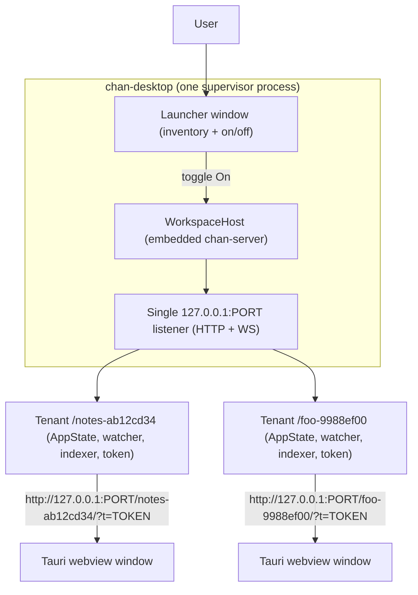
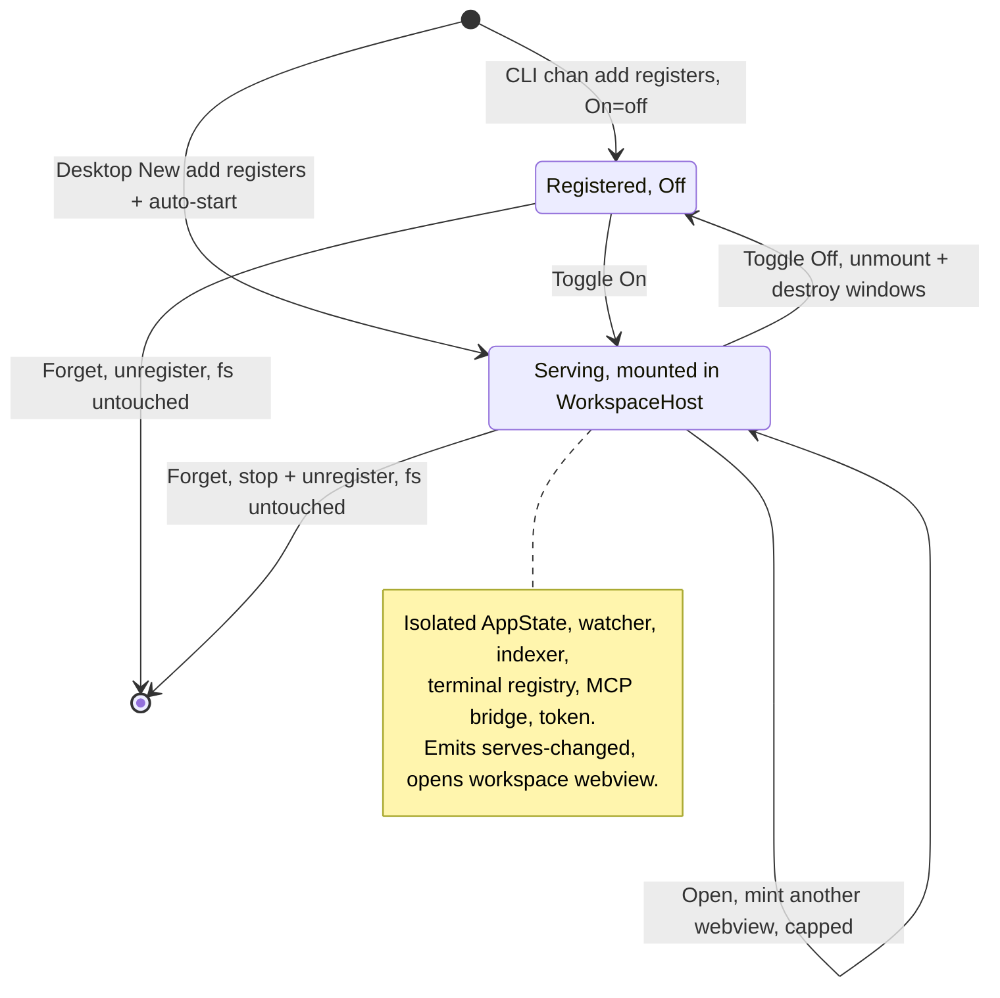
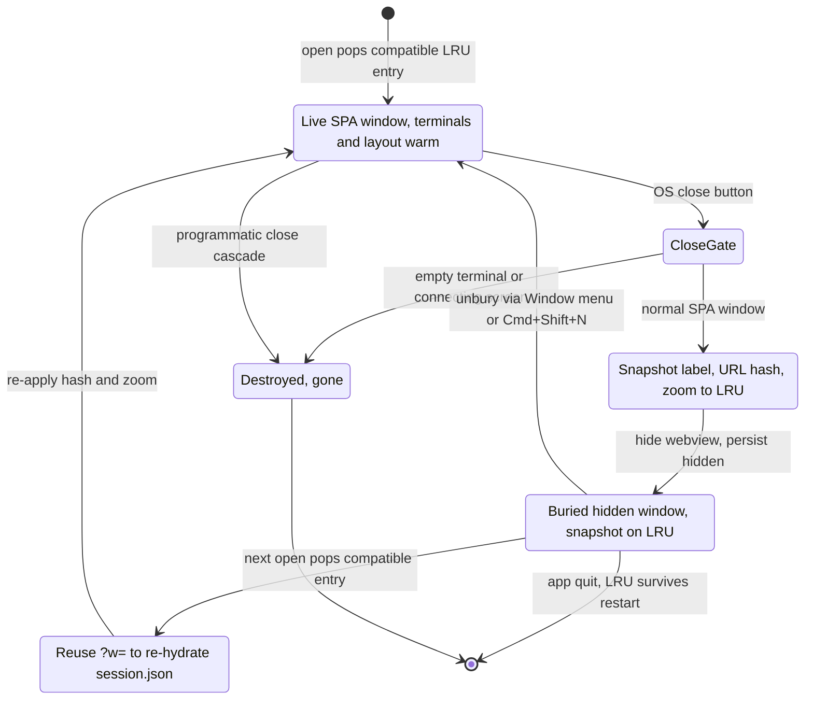

# chan-desktop design

This document is the source of truth for what chan-desktop is and is not. It is intentionally light on Rust / Tauri specifics and heavy on business logic. When the implementation drifts from this doc, fix one of the two.

## 1. Purpose

chan-desktop is the native desktop shell for chan. For normal local workspaces it embeds chan-server in the desktop process and serves the same Svelte editor on a loopback HTTP port. It links `chan-workspace` and `chan-server` directly, and registry mutations run in-process against the embedded `chan-workspace` `Library`. The same binary also IS the `chan` / `cs` command line: invoked through a `chan` or `cs` name (argv0, or `$ARGV0` inside an AppImage) it dispatches the CLI before any GUI init, and on boot it owns the `~/.local/bin/{chan,cs}` shims (section 7) -- so a desktop install ships the CLI *with* the app, nothing extra to download. The desktop app exists so that:

- a non-CLI user can install one signed bundle and open a folder through a familiar OS dialog instead of a terminal,
- multiple workspaces can be supervised at once, with one launcher window acting as the inventory and on/off control,
- local embedded workspaces and explicit remote attachments share the same editor window model.

Non-goals:

- chan-desktop is not a second editor. The editor is the web app served by chan-server. The desktop manages workspaces and opens the editor in Tauri webview windows.
- chan-desktop is not a general web browser. Workspace windows are dedicated Tauri webviews pointed at local or attached chan URLs.

## 2. Mental model

One desktop process hosts many running local workspaces:

*One supervisor embeds a WorkspaceHost that serves many local workspaces on a single 127.0.0.1 listener under per-path-hash prefixes, each opened in a Tauri webview via a tokened URL.*

There are two workspace attachment modes:

- **Local embedded**: a local registry entry opened by chan-desktop. The desktop mounts the workspace into its embedded `WorkspaceHost` and owns the runtime.
- **Remote outbound**: an already-running chan server that chan-desktop opens by URL. Example: the user runs `chan open /tmp/foo`, then adds that token-bearing URL as an outbound attachment. The desktop owns only the window, not the server.

There is no fallback serve mode. If a user wants to run `chan open` directly, that is a remote attachment, even when the server is on the same machine.

## 3. Workspace lifecycle

*Local-workspace lifecycle: desktop New auto-starts while CLI `chan add` stays Off; Toggle On mounts an isolated runtime, Toggle Off unmounts and destroys windows, Forget unregisters and leaves the filesystem untouched.*

### 3.0 Source of truth

The `chan` registry at `~/.chan/config.toml` is the single source of truth for the set of known workspaces. Desktop-driven mutations (add, remove) run in-process against the embedded host's shared `chan_workspace::Library` -- the same code path the CLI uses, without spawning it. Routing everything through the one shared `Library` is what keeps a freshly-added workspace openable immediately: mutating only the on-disk registry would leave the host's in-memory snapshot stale.

The desktop owns a small config of its own at `~/.chan/desktop/config.json` -- the same `~/.chan` home as the CLI registry, not a separate OS app-data directory. It holds desktop-only state: outbound URL attachments, the set of workspaces that were *on* (`workspaces`, the shared `{path, on}` overlay the devserver persists too), and the closed-window restore stack (section 6.3). The On column is still derived live from the in-memory map of active local runtimes, but that on-set is persisted on every toggle and on clean shutdown, so a restart re-serves the workspaces the user left running (the §3.2 boot matrix). Accepted trade-off: a crash with an entry persisted re-serves it next boot; a re-serve failure there surfaces a notice and is left off (it drops from the set on the next clean shutdown).

A filesystem watcher (`notify` + debounce) runs over `~/.chan/` for the lifetime of the process and emits a `registry-changed` Tauri event when the registry file itself changes (events are filtered to that file: `preferences.toml` churn from pane drags must not storm the launcher). The frontend reacts by re-fetching `list_workspaces` and re-rendering. Concrete consequence: if the user runs `chan add ~/notes` from a terminal, the row appears in the desktop window without any explicit refresh.

### 3.1 The launcher

The launcher (Tauri label `main`, title "Chan Desktop") is a singleton: it is never multiplied, its close button hides rather than destroys it, and reopening is instant. It renders one table with three columns:

| column  | meaning                                                  |
|---------|----------------------------------------------------------|
| On      | local rows: runtime toggle; remote rows: connection dot  |
| Where   | kind glyph + locator: house glyph + path (local), outbound glyph + URL/label (remote) |
| actions | Open split button (primary: in-app webview; caret menu: Open in Browser, Forget) |

Clicking a local row's Where cell reveals the folder in the OS file manager. Workspace names are read-only in the desktop; renames happen through the CLI and the watcher reflects them.

### 3.2 First launch and the [New] modal

A workspace is opt-in: chan-desktop never creates one on your behalf. There is no default workspace, no `~/Documents/Chan`, and no embedded manual seeded anywhere. Boot opens the launcher and then follows the matrix:

- **Nothing was on** (a fresh profile, or a registry whose workspaces are all off) -- the launcher shows its (possibly empty) list and a **standalone terminal window** opens. That terminal is the workspace-less `kind=terminal` window you also get from Cmd+T / Cmd+Shift+N (section 6.5) -- the "you always have a shell" floor.
- **Workspaces were on at the last clean shutdown** (`workspaces`, section 3.0) -- each is re-served and its window reopened; no standalone terminal opens (you already have windows). A workspace that fails to re-serve surfaces a system notice and is left off.

The user creates or opens a workspace only when they want one, through the [New] modal. The [New] button opens a single modal with a segmented two-way choice:

- **Local directory**: native folder picker, then Open registers the folder via `add_workspace` and immediately starts + opens it. There is deliberately NO desktop-side pre-flight scan or feature toggle here: chan's SPA owns first-boot readiness through its preflight overlay and the optional Semantic / Reports layers post-boot. A desktop scan dialog would duplicate and race the SPA boot surface.
- **Remote**: URL + optional name form (`add_outbound_workspace`); we dial out.

The auto-start on add is specific to the desktop UI: the user's intent there is "make this workspace usable now". `chan add` from a terminal only registers; the desktop shows the new row with On = off.

### 3.3 Toggle On (serve)

Toggling On opens the workspace through the embedded chan-server `WorkspaceHost`. The desktop owns one loopback listener for the whole process and mounts each workspace under a distinct path prefix (derived from the hash of the canonical path). Each mounted workspace gets isolated AppState, watcher, indexer, terminal registry, MCP bridge, control socket, and token state.

Embedded local serving keeps chan-server's bearer token gate enabled. The desktop webview receives the token-bearing URL and the SPA stores the token in sessionStorage.

The local runtime:

- stores the URL in `AppState.serves` in memory only,
- emits a `serves-changed` Tauri event so the row re-renders with the Open button enabled,
- opens one workspace webview automatically, with additional Open clicks opening more windows for the same runtime (capped per workspace),
- closes all of the workspace's windows when the runtime is toggled off.

A workspace already open in another chan process (a standalone `chan open`, or a second desktop) surfaces as a clear "open in another chan process" error and the toggle reverts; a quick off-then-on retries briefly so the previous handle can release its lock.

### 3.4 Toggle Off (stop)

Toggle Off closes the mounted workspace in WorkspaceHost and destroys its workspace windows. App exit runs the same stop path for every active local runtime.

### 3.5 Forget (remove)

Stops the serve (if running), then unregisters the workspace through `chan-workspace` in-process. The filesystem is untouched. The watcher fires and the row disappears. For outbound rows, Forget URL drops the attachment and closes its windows. There is no "delete workspace" action in the desktop UI.

### 3.6 External changes

Anything that mutates `~/.chan/config.toml` shows up in the UI: `chan add` / `chan remove` / `chan rename` from a terminal, a second chan-desktop process, or hand-editing the TOML.

For an external `chan open` the registry only records that the workspace exists, not that a serve is running: the local On toggle stays off and no URL appears. A user who wants that server in the desktop adds it as a remote outbound attachment.

## 4. Validation

The desktop avoids inventing durable validation rules. It defers to chan-workspace where that surface already owns a contract, so anything the desktop accepts is also accepted by every other chan surface.

- **Workspace name**: not validated by the desktop at all. Names are read-only in the UI; the only writer is `chan rename`, which enforces `chan_tunnel_proto::is_valid_workspace_name` itself.
- **Path**: canonicalised via `std::fs::canonicalize` before being registered or opened, so the registry key the desktop uses matches what the user sees. When canonicalisation fails (broken symlink, asleep network mount), the literal path is used.

## 5. Self-contained runtime

chan-desktop is self-contained. It links `chan-workspace` and `chan-server`
directly and embeds the web bundle at build time. No `chan` binary is shipped in
the app bundle, and none is required at runtime.

Local workspaces open through the embedded chan-server `WorkspaceHost`, which owns a single `chan_workspace::Library`. Every registry mutation runs in-process against that `Library`.

The single codesigned and notarised artifact is the chan-desktop app itself; there is no second binary to sign. External `chan open` processes are supported as explicit remote attachments (section 11), not as a local serving dependency.

## 6. Window model

### 6.1 Window kinds

Every window is a Tauri webview with a label prefix that encodes its kind, and Tauri capabilities are granted by label glob:

- `main` -- the singleton launcher (section 3.1). The `main-*` glob is also covered by the launcher capability so any launcher-class window inherits the same permission set.
- `workspace-<hash>-<seq>` -- local workspace windows. The hash identifies the workspace (it is also the embedded route prefix), the per-process `seq` makes every label unique so multi-window works; the stable prefix is what teardown and capability matching key on.
- `outbound-<hash>-<seq>` -- remote workspace windows, hashed from the attachment identity, namespaced apart from local labels.
- `terminal-win-<seq>` -- standalone terminal windows (section 6.5).
- `about` -- the bundled About window: singleton, same content on every platform (mirrors the SPA Dashboard About slide), and the target the macOS system About item is redirected to.

All embedded-SPA windows (workspace / outbound / terminal) load the SPA with `?w=<label>` so per-window session state (`session.json` panes/tabs) is keyed by the window, and get a " Window N" title suffix where N is the lowest free number among live windows sharing a base title, so the OS window switcher disambiguates.

### 6.2 Menus and the chord bridge

Workspace webviews get a native key bridge injected before any page script. It translates VS Code-style chords into the `chan:command` window event the SPA listens for, claiming each chord in capture phase so the SPA keymap cannot drift out from under it. The policy: chords whose actions are reachable through Pane Mode (Cmd+K) stay unbound; direct chords exist where Pane Mode is no substitute (tab close/reopen/jump/nav, find on page, search, splits, and the context-aware spawn family Cmd+T / Cmd+O / Cmd+P / Cmd+Shift+M). Cmd+R (reload) and Cmd+Opt+I (DevTools) bypass the SPA event bus and invoke Tauri IPC directly so a frozen SPA cannot lock the dev affordances away. Zoom chords (Cmd+= / Cmd+- / Cmd+0) ride the same IPC path; the level persists per window (section 6.3). Linux/Windows variants avoid stealing terminal chords (plain Ctrl+W / Ctrl+R reach the shell; close is Ctrl+Shift+W, reload Ctrl+Shift+R).

The native menus route by the focused window's kind:

- File ▸ New Terminal (Cmd+T): SPA window focused → dispatch `app.terminal.toggle`; launcher or nothing focused → open a standalone terminal window.
- File ▸ Close Window (Cmd+W): SPA window focused → `app.tab.close` (the connecting screen is the exception: Cmd+W cancels and really closes); other windows close natively.
- Window ▸ New Window (Cmd+Shift+N): opens another window of the workspace owning the focused window (unburying the family's most recent hidden window first). A focused standalone terminal opens another terminal window; the launcher (or nothing) focused opens a standalone terminal. Plain Cmd+N is deliberately left to the SPA's New Draft.
- Window ▸ Workspaces: shows the launcher.

Quitting prompts for confirmation once (running terminals and workspace runtimes die with the process); a confirmed quit tears down every runtime and listener.

### 6.3 Bury-on-close and window restore

*OS close buries an SPA window (snapshotting label, URL hash, and zoom onto the restore LRU); empty terminals, connecting screens, and programmatic closes destroy outright; the next open unburies or pops a compatible entry to re-hydrate `session.json`, hash, and zoom.*

The OS close button on an SPA window *buries* it instead of destroying it: the webview hides, live terminals and layout stay warm, and a notice dialog teaches the behaviour. Buried windows are listed in the Window menu and unburied from there or by Cmd+Shift+N on their family. Two cases really close: a standalone terminal window with no live shells, and a window still on the connecting screen (burying it would leave an unkillable hidden retry loop). Programmatic closes (the SPA's empty-window cascade, workspace-off teardown) destroy outright and never bury.

At bury time the desktop captures a restore snapshot -- window label, URL hash, zoom level -- onto a small LRU stack in the desktop config, keyed by workspace identity. The next open of that workspace pops a compatible entry and reuses the label (so `?w=` re-hydrates the panes/tabs from `session.json`), re-applies the URL hash (overlay state: file-browser path, search query, graph scope), and restores the zoom. The stack survives restarts, so "the window I had open" comes back across a quit, and entries whose label is still alive are skipped rather than popped (a buried window must keep its entry for the quit-while-buried case).

### 6.4 The connecting screen (outbound)

Outbound windows do not load the remote URL directly: a down remote would paint a blank white webview (WKWebView never finishes navigating). They load a bundled connecting/retry page instead, which shows the attempt log, probes the remote through the `probe_url` IPC (any HTTP response counts as up; only transport failures retry), and on success navigates the same window to the fully-assembled target URL -- `?w=` and restored hash included -- so it becomes a normal workspace window in place. The page cannot probe the remote itself: the strict CSP blocks cross-origin fetches, and Rust owns the per-attempt timeout. Cmd/Ctrl+W and the close button on the connecting screen cancel and really close.

### 6.5 Standalone terminal windows

Standalone terminal windows host the SPA in terminal-only mode (`kind=terminal`: no workspace fetch, terminal panes only). All of them load the ONE shared `/terminal` tenant of the embedded server, mounted on first use and never torn down per window: PTYs live in a single registry, so a terminal tab moved between windows keeps its live PTY, and orphaned PTYs idle-prune. There is no registry entry and no On-toggle lifecycle. Sessions inherit chan-server's terminal contract, including the `cs` control socket, so `cs` works inside a desktop terminal exactly as under a standalone `chan open`. The close button buries the window while shells are live and really closes it when none are left.

### 6.6 Remote windows

Remote-backed connections (outbound attachments) own their window state server-side. The desktop polls each connection's `GET /api/windows` and lists the reopenable rows (`saved` but not `connected`) in the Window menu; choosing one builds a webview with that exact label so the remote re-hydrates that window's session. The poll refreshes when remote-backed windows open or close.

## 7. Power users and the CLI tool

Non-goal: chan-desktop installation should be "drag Chan.app to /Applications". No installer, no scripts.

chan-desktop is also the `chan` / `cs` command line: on boot it owns `~/.local/bin/{chan,cs}` shims that resolve to the running desktop binary, so a desktop install gives you `chan open` and the shell-first workflows with nothing extra to download. A standalone `chan` (the `chan.app/install.sh` installer or a release tarball) is still available and independent; the two share the same `~/.chan` registry, so a workspace added by one shows up in the other.

The shims are installed on boot per package kind: a macOS `.app` or Linux
deb/rpm gets real symlinks to the installed binary; a Linux AppImage gets tiny
`exec -a` wrapper scripts, because `current_exe()` inside an AppImage is the
ephemeral mount. Both names resolve to the same binary, and the argv[0] stem
dispatch (`chan_shell::invoked_arg0`, which prefers `$ARGV0` over `argv[0]` so
an AppImage that lost argv[0] to `AppRun` still reaches the inner CLI instead of
the GUI) selects the CLI / control-client / GUI path. Best-effort, idempotent,
and self-healing: a shim we wrote is re-pointed or rewritten on the next launch
when it goes stale (the binary moved, the AppImage updated), and a `chan` / `cs`
the user installed themselves is never clobbered.

## 8. Distribution

The download entry point is https://chan.app/install. Desktop artifacts are
built by the release workflow; the branch dry-run lane exercises the same
artifact matrix:

- macOS arm64: notarised DMG containing `Chan.app`. Drag to /Applications. Signed and notarised in CI with the Developer ID identity imported from secrets.
- Linux: `.AppImage` plus distro packages (`.deb`, `.rpm`), unsigned.

Windows desktop builds are deferred. The bundler config still carries a Windows target, but no Windows artifact is built or published, and the Authenticode signing lane is not open; Windows returns as a distribution channel when that lane lands.

Cargo install (`cargo install chan-desktop`) builds the self-contained desktop from source, for contributors and packagers rather than end users. The README points end users at chan.app.

### 8.1 Linux AppImage GUI stack

The AppImage bundles its own GUI stack (libgtk-3, libwebkit2gtk-4.1) and the GL/EGL/gbm libraries `linuxdeploy-plugin-gtk` pulls in, built on the Ubuntu CI runner. On a host whose Mesa is newer than the bundle (rolling distros such as CachyOS / Arch on an AMD radeonsi iGPU), the bundled libgtk cannot create an EGL display against the host Mesa and the webview aborts at creation with `EGL_BAD_PARAMETER`. No single bundled GTK/Mesa works across every distro indefinitely; the host's GTK and Mesa are always built against each other.

The Linux GUI-stack bootstrap runs before webview creation. It prefers the host
GUI stack, falling back to the bundle:

- It runs only inside an AppImage (keyed on `cs_install::appimage_path()`) and is a no-op on macOS / Windows / `.deb` / `.rpm` / `cargo run`.
- Presence gate: only when BOTH `libgtk-3.so.0` AND `libwebkit2gtk-4.1.so.0` resolve in the host `ldconfig -p` cache does it shadow the bundle (a partial shadow is worse than either stack alone).
- It discovers the host lib dir from `ldconfig -p` (correct on Arch `/usr/lib`, Fedora `/usr/lib64`, Debian/Ubuntu multiarch, x86_64 and arm64), prepends it to `LD_LIBRARY_PATH`, and re-execs the binary once. A re-exec is required because `libgtk` / `libEGL` are already loaded by the time `main()` runs, so rewriting the loader path only takes effect in a fresh process. The GTK module env the AppImage `AppRun` exported is inherited across the exec, so only the library path is rewritten.
- A `CHAN_LINUX_SYSTEM_GUI_APPLIED=1` marker set across the re-exec guards against a loop.
- Independent fallback: under an AppImage it defaults `WEBKIT_DISABLE_DMABUF_RENDERER=1` (the dma-buf renderer is the path that aborts) unless the user already set it, so a host WITHOUT the system stack still launches on the bundle.

The `CHAN_LINUX_SYSTEM_GUI` env knob selects the policy:

- `auto` (default): prefer the host stack when present, else the bundle.
- `system`: force the host stack; exit with an error if it is unavailable.
- `bundled`: keep the bundle-first behavior, for debugging.

## 9. Self-upgrade

chan-desktop updates itself through `tauri-plugin-updater`, gated by the `updater:*` capabilities. A fire-and-forget check runs once per launcher process launch.

- Update bundles are verified with a minisign signature. The production public key is embedded in `src-tauri/tauri.conf.json` under `plugins.updater.pubkey`; the matching private key lives outside the repo in the release owner's secret store.
- The client probes a single static manifest at `https://chan.app/dl/desktop/latest.json`, generated at release time and deployed to GitHub Pages with the rest of chan.app; there is no dynamic `/dl` server. The manifest carries a top-level `version` plus a `platforms` map keyed by `{os}-{arch}` (e.g. `darwin-aarch64`); Tauri picks the running target's entry and compares `version`.
- One executable to upgrade. The desktop binary IS `chan` (section 1), so there is no second CLI to update -- the `~/.local/bin/{chan,cs}` shims point at the one binary. `chan upgrade` from the desktop-dispatched binary (`Personality::Desktop`) does NOT replace a tarball: it delegates over the well-known handoff socket to the running desktop, which drives this same `tauri-plugin-updater` (check → download → install → `restart()`). If no desktop is running the CLI launches one first; after a successful install the desktop re-affirms the shims (so they keep pointing at the upgraded binary). `chan upgrade --check` reports availability synchronously without installing. The standalone `chan` (install.sh) is the only path that still self-upgrades by replacing its CLI tarball in place.

Key rotation and updater-payload signing/verification are documented in `.agents/desktop.md` ("Auto-upgrade signing") and the [`updater-bridge.md`](./updater-bridge.md) runbook.

## 10. Settings and developer controls

chan owns the Settings surface per workspace. The desktop menu item dispatches `app.settings.toggle` into the focused workspace webview; it is a no-op when focus is not inside a workspace window.

Maintainer controls stay native:

- Cmd+R (macOS) / Ctrl+Shift+R (Linux/Windows) reloads the focused workspace webview.
- Cmd+Opt+I / Ctrl+Alt+I opens webview DevTools (enabled in release builds via the `devtools` Cargo feature).
- `CHAN_LINUX_SYSTEM_GUI` (`auto` | `system` | `bundled`) selects the Linux AppImage GUI-stack policy; see 8.1.

Future global settings additions are deferred until they have concrete demand. Tunnel publishing belongs in the workspace attachment surface rather than a generic app settings page.

## 11. Remote workspaces

Remote workspaces are explicit attachments. They are not a fallback for failed embedded local serving.

### 11.1 Outbound URL attach

Outbound attach means the server already exists and chan-desktop opens it by URL.

The user copies the printed URL, including the bearer token, into the [New] modal's Remote form. The desktop opens that URL in a workspace webview (through the connecting screen, section 6.4) and does not try to start, stop, reclaim, or inspect the server process. This works whether the URL points at another machine or at `127.0.0.1` on the same machine.

## 12. Native file integrations

- **Download**: the SPA's Download action fetches the bytes over its existing loopback connection (XHR, so the in-app indicator gets progress) and hands them to a Tauri command that writes into the OS Downloads folder and returns the saved path -- WKWebView/WebView2 have no download-manager UI, so `<a download>` would silently do nothing.
- **Export to PDF** (macOS): `window.print()` is a no-op in WKWebView, so the desktop drives the real macOS print pipeline (`printOperationWithPrintInfo:`) silently to a file, which honours `@page`, auto-pagination, and explicit page breaks exactly like the browser's print-to-PDF path. The frontend gates the call to macOS desktop.
