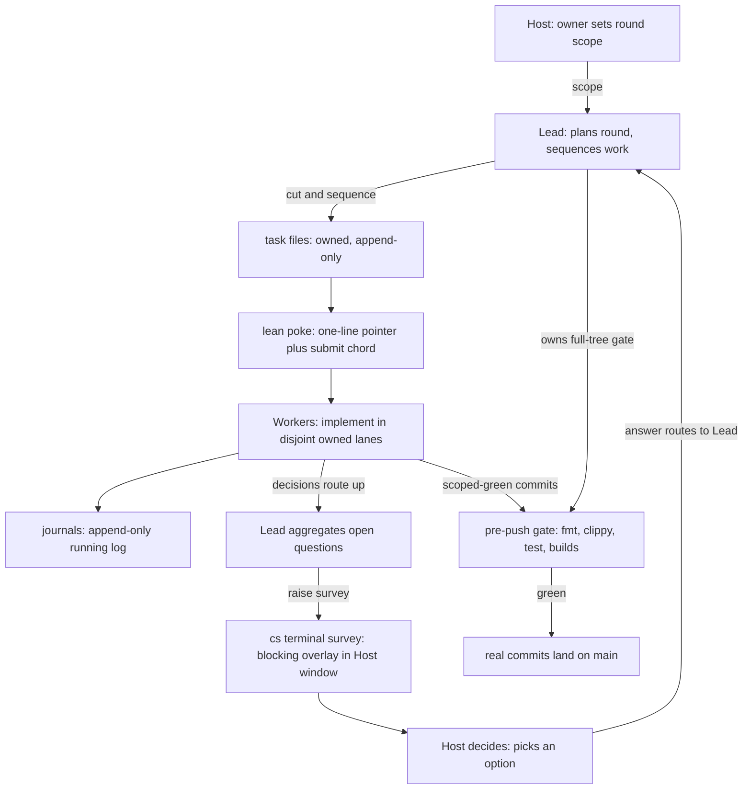

# How chan is developed

If you've landed here from a PR or just browsing the repo, this doc explains the multi-agent development pattern behind the consolidated release reports in [`team/`](../team/). It's not a user-facing document; it's an explainer for outside contributors and curious readers.

## TL;DR

chan is built by small teams of AI coding assistants coordinated by the project owner, using chan's own Team Work tooling: each assistant runs in an embedded terminal tab, and the team coordinates through task files, append-only journals, and one-line pokes on disk. The owner sets scope, reviews, and is the source of strategic decisions. The work lands as real commits on `main`.

This is unusual enough that it can look confusing without context. Hence this doc.

## Roles

A team has three role types:

* **Host**: the project owner. Sets scope, answers decision surveys, tests releases, and is the only one who acts outside the team.
* **Lead**: plans the round, cuts tasks, sequences the work, runs the integration gate, and aggregates the workers' questions into focused surveys for the host.
* **Workers**: each owns a code surface (for example the core workspace, the desktop shell, or the gateway). They pick up task files from the lead, implement, and report back the same way.

Teams are provisioned by the `cs terminal team` tooling: a config declares the members, and a generated `bootstrap.md` carries the process so every member starts from the same page. Members are identified by `@@`-prefixed tab handles; the handles are per-team and carry no meaning outside it.

## How work flows

Phases organize the year-scale roadmap; a phase closes with a consolidated report in `team/` and usually a release tag. Within a phase, a round runs on a small set of on-disk artifacts in the team's working directory:

1. **A scope** - the owner's high-level ask for the round.
2. **Task files** (`tasks/task-{from}-{to}-{n}.md`) - what each member is asked to do. Owned by the recipient, append-only; once work starts, new asks become new tasks, not amendments.
3. **Journals** (`journals/journal-{member}.md`) - each member's append-only running log.
4. **Pokes** - one-line pointers typed into the recipient's terminal ("read this task file"). Context lives in the files, not the poke.
5. **Surveys** - when a decision needs the owner, the lead raises a blocking survey in the owner's window (`cs terminal survey`); the answer routes back to the lead.

The round at a glance: the owner's scope flows down through the lead into owned task lanes, decisions route back up as surveys, and only gate-green work lands on `main`.

## Why this pattern

* **Append-only journals**: nothing gets rewritten under another member. If a decision changes, a new dated section appends; the prior section stays as the audit trail.
* **Lane boundaries**: members own disjoint file surfaces. Cross-lane work routes through the lead, so two members never edit the same file in parallel without coordination.
* **The owner decides**: scope calls and trade-offs route to the host as focused surveys with concrete options; workers don't improvise project decisions.
* **Real commits, real CI**: every member's work lands in `main` with normal commit hygiene, behind the same pre-push gate a human contributor runs.

## What you'll see in the repo

* `team/release-*.md` - one consolidated report per release era: its roadmap, rounds, and retrospective. The front door to the project history.
* `.agents/` - the operational playbook the assistants work from: coordination, gating, verification, and commit discipline.
* While a round is active, its working directory (config, bootstrap, tasks, journals) is the live coordination bus; it is distilled into the phase report at close.

## What this doc is not

It's not a contributing guide (see [`../CONTRIBUTING.md`](../CONTRIBUTING.md)) or a code of conduct (see [`../CODE_OF_CONDUCT.md`](../CODE_OF_CONDUCT.md)). It's just context, so the history makes sense.

## Getting involved

Contributions follow the standard GitHub PR flow as documented in `CONTRIBUTING.md`. You don't need to participate in or care about the multi-agent pattern. It's an internal coordination protocol, not a project requirement. PRs are reviewed the same way regardless of whether they come from a human contributor or an agent working on the project.
