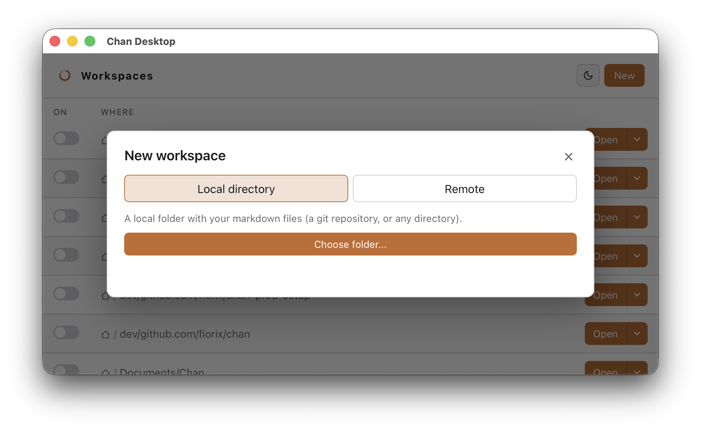

# Creating Or Opening A Workspace

A workspace is a directory that contains markdown and related files. Chan treats the workspace root as the filesystem boundary for editing, search, graph, and terminal work.

## Desktop

On launch, Chan Desktop opens an empty workspaces window and a standalone terminal; it never creates a workspace for you (no `Chan` folder under Documents, no seeded manual). From the workspaces window, open an existing folder, attach a running `chan open` URL, or receive a remote workspace through the listener.



## Terminal

Open a local project in chan-desktop, from the terminal:

```sh
chan open ~/my-git-repo
```

The workspace path is required: `chan open` with no path exits with an error asking you to pass one (for example `chan open .`).

`chan workspace add PATH` registers a workspace without serving it; `chan workspace ls` and `chan workspace rm` manage the registry. `chan close PATH` tears the server back down (releasing the writer lock); `chan close --remove PATH` also forgets the workspace from the registry.

A devserver URL takes the place of a path, e.g.: `chan open http://127.0.0.1:8787 --name=lima --script='limactl shell default chan devserver --port=8787 --systemd'` registers that devserver with Chan Desktop (the same entry the launcher's devserver form writes). It needs a running Chan Desktop to register into.

`chan --help` documents the full flag surface.

## Many workspaces on one box: `chan devserver`

On a box you reach over SSH or a LAN, `chan devserver` runs one server that hosts many workspaces behind a single port:

```sh
chan devserver --bind 127.0.0.1 --port 8787
```

With a devserver running, a `chan open PATH` on that same box registers its workspace with the devserver and exits instead of binding its own port, so one process owns each workspace. `chan open --standalone PATH` opts out and binds its own server as before. The devserver remembers which workspaces were mounted and brings them back when it restarts.

There is no TLS and only a bearer-token gate, so keep the bind on loopback and reach a remote devserver over an `ssh -L` tunnel rather than binding it on a public interface. Chan Desktop attaches to a devserver and lists its workspaces in their own group (see [Chan Desktop](desktop.md)). For keeping a Linux devserver running across logout (`--systemd`) and reaching it from the desktop at `localhost` through a lima VM, an sdme container, or `ssh -L`, see [Devserver](devserver.md).

## Workspace contents

Chan watches the workspace tree for external edits. The files are still yours: edit them with another program, commit them to git, or move the folder as a normal directory.


## File transfers

From standalone terminals and workspaces, you can use `cs upload` and `cs download` in addition the File Browser inspector to upload and download files and directotories to and from workspaces, local or remote.

Graph inspectors expose the same actions for file and directory nodes where the action applies.

- For a file, Upload replaces the selected file. Text-class paths reject uploaded bytes that are not valid UTF-8.
- For a directory, Upload adds the selected files inside that directory. Existing target paths are refused.
- Download retrieves the selected file as-is. Downloading a directory retrieves a tar archive rooted at that directory name.
