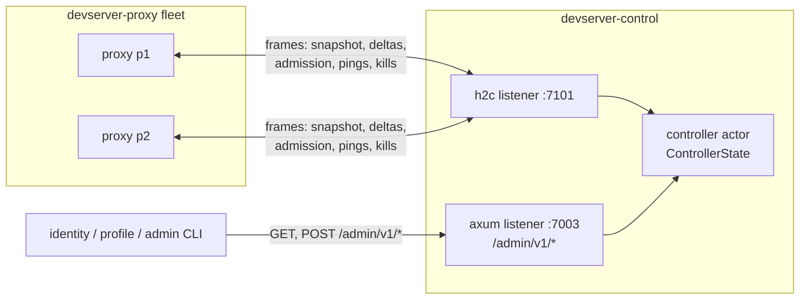

# devserver-control: design

## Problem

A devserver-proxy node keeps its registrations in a process-local registry. That works for one node; it breaks the moment the fleet has two:

1. No component can answer fleet-wide questions: which proxy holds the tunnel for `(user, devserver_id)`, how many distinct devservers a user runs across nodes, or which proxies are alive.
2. The per-user devserver cap is unenforceable: each proxy only sees its own registrations.
3. Operator actions (evict one devserver, drop every tunnel of a blocked user) would need query-time fan-out, which has no safe answer when one proxy is unreachable: a partial read presented as fleet truth.

A shared database does not fix this. A database cannot serialize a yamux handle, the owning proxy process is the only authority that can refresh the row, and rows retained after a process failure report stale ownership as truth. The fleet needs one owner for the dynamic directory that treats the view as a liveness signal, plus a command channel back to the proxies that hold the actual tunnels. The full decision record, including the rejected alternatives, is [ADR-0002](../../docs/adr/0002-control-plane-owns-proxy-fleet-state.md); this document describes the chosen design as built.

## Architecture

devserver-control is a singleton, database-free controller. One process, two listeners, one actor:

- `PROXY_BIND_ADDR` (default `127.0.0.1:7101`): raw h2c. Each devserver-proxy node opens `POST /v1/proxies/connect` with a Bearer token and holds the response stream for the life of its control session. The stream carries length-prefixed JSON frames in both directions (see Control transport).
- `BIND_ADDR` (default `127.0.0.1:7003`): plain axum HTTP. `/healthz` and `/readyz` unauthenticated; the `/admin/v1/*` aggregate tree gated by `DEVSERVER_ADMIN_TOKEN` (constant-time compare).

All fleet state lives in `ControllerState`, owned by a single actor task. Mutations arrive over a bounded mpsc channel (capacity 1024) from the session tasks and the HTTP handlers; reads go through oneshot request-replies or through `tokio::sync::watch` snapshots that the actor republishes after every applied change. There are no locks: the actor is the only task that touches the state, so no lock is ever held across an `.await`. State transitions return `Effect` values (send a frame, retire a session, settle a kill waiter) that the actor applies after the transition, which keeps the state machine synchronous and unit-testable.

The controller carries metadata and commands only. Tenant HTTP and WebSocket traffic never crosses it; proxies keep owning the yamux handles and the whole data path. A control session loss therefore never strands data-plane capacity by itself; it stops new admission on the affected proxy and starts that proxy's reconnect grace.

## Control transport

One h2 stream per connection, `application/x-chan-devserver-control+json; version=1`, Bearer `DEVSERVER_PROXY_TOKEN` compared in constant time. Each frame is a u32 big-endian length prefix followed by a JSON body, capped at 1 MiB. The frame types, limits, and id/origin validators live in `devserver-control-proto` so client and server cannot drift.

The first frame must be `ClientHello { protocol_version, package_version, proxy_id, proxy_base_url, boot_id }`. Three checks run before the session exists:

- `protocol_version` must equal `PROTOCOL_VERSION` (1).
- `package_version` must equal the controller's own package version. All gateway services and proxies run the same package version, so a mismatched deploy fails loudly at the handshake instead of corrupting the fleet view.
- `proxy_base_url` must equal `DEVSERVER_PROXY_BASE_URL_TEMPLATE` expanded with the presented `proxy_id` (exactly one `{proxy_id}` placeholder; canonical origin comparison, default ports stripped). A proxy cannot claim an origin that does not match its provisioned id.

On pass the controller answers `ServerHello { protocol_version, package_version, heartbeat_seconds: 5, dead_seconds: 15, grace_seconds: 30 }`. Server-to-proxy frames are `SnapshotAccepted`, `FleetReady`, `AdmissionDecision`, `KillRegistrations`, `ResyncRequired`, `Ping`, `Shutdown`. Proxy-to-server frames are `ClientHello`, `SnapshotStart` / `SnapshotChunk` (128 rows per chunk, 100,000 rows per snapshot) / `SnapshotEnd`, `TunnelUp`, `TunnelDown`, `AdmissionRequest`, `AdmissionCancel`, `CommandResult`, `Pong`.

Connection hygiene: the h2 handshake, first stream, and `ClientHello` each have a 10s deadline; the initial or resync snapshot has an absolute 30s deadline; at most 1024 connections are in flight; a connection that opens extra streams gets 409 per stream and is shut down after 16 of them. One framed-reader task owns the inbound side of the stream for the whole session because a length-prefixed read is not cancellation-safe mid-frame.

## Session lifecycle

A session is `(proxy_id, incarnation)`. `begin_session` assigns a fresh incarnation and replaces any existing session for the same proxy id, retiring it; a reconnect with a different `boot_id` is logged at error level but still replaces, because the newest connection is the only one that can carry commands.

The session then moves through two states:

- **Joining**: the session has connected but its registry view is not part of the aggregate. The proxy stages a snapshot: `SnapshotStart`, any number of `SnapshotChunk`s, `SnapshotEnd` with the matching `base_generation`. Chunks are checked for duplicate registration ids and the running total is capped at 100,000 rows. Staged rows are invisible to the aggregate until the snapshot completes.
- **Active**: the snapshot was accepted and, once reconciliation finishes, the controller sends `FleetReady`. Only Active, fleet-ready sessions participate in admission and own aggregate rows.

After the snapshot, the proxy publishes deltas. Every delta carries a generation number that must extend the session's current generation by exactly one. A gap, a duplicate registration id seen anywhere in the fleet, a down for an unknown registration, or any frame illegal in the current phase triggers `ResyncRequired { expected_generation }`: the controller retracts the session's rows, drops it back to Joining, clears its fleet-ready flag, and waits for a fresh snapshot on the same stream. Generation contiguity is what lets the controller apply deltas without a round trip; any doubt costs one resync instead of a corrupt aggregate. A `TunnelUp` for a key that is already live on another session evicts the previous registration with a kill to its owning session, so a key never has two owners.

One relaxation exists: when the controller confirms a kill, it remembers the killed registration ids (bounded at 4096 per session), because the proxy still publishes its own contiguous `TunnelDown` for each confirmed eviction. Without that memory the expected down would look like corruption and force a resync that retracts every other row of the session. Past the bound the only cost is that resync.

## Fleet admission

Admission is synchronous and controller-owned: the tunnel listener on the proxy holds the handshake after token validation while the control session asks, bounded by the tunnel server's 10s admission timeout, and the client sees `HelloAck::Ok` only after an `admit` decision. The decision vocabulary is `Admit`, `AtCapacity`, `ControlWarming`, `Stale`; the proxy maps `AtCapacity` to the `too_many_workspaces` tunnel error and the other refusals to `control_unavailable`.

The rules, in order:

1. The controller must be ready and the asking session Active and fleet-ready; otherwise `ControlWarming`.
2. A re-request of the exact same claim (same session, request id, registration id) refreshes the claim and re-answers `Admit`, so a proxy that lost the first answer can retry idempotently.
3. Reconnect neutrality: a key that is already live or already claimed does not count against the cap. A proxy reconnecting its existing tunnels after a controller restart can never be refused for capacity it already holds.
4. Capacity: `MAX_DEVSERVERS_PER_USER` (default 100, 0 disables) bounds the number of distinct devserver ids per user across live rows plus pending claims. At or over the cap: `AtCapacity`.
5. A different pending claim for the same `(user, devserver_id)` key is superseded: the old claim holder gets `Stale` and the new claim wins.
6. On `Admit` the controller records a pending claim with a 15s TTL. The matching `TunnelUp` must arrive with that claim's registration id; a `TunnelUp` without a matching claim is killed through the unclaimed-row path. An `AdmissionCancel` (proxy-side handshake failure after the decision) drops the claim early.

Claims are what make the cap and the single-owner rule atomic: the decision and the reservation happen in the same state transition, so two proxies racing the same key cannot both pass.

## Reconciliation

Snapshots can disagree with the aggregate: two proxies may report rows for the same `(user, devserver_id)` key, or a snapshot may push a user over capacity. Reconciliation picks winners and commands the losers down before the new view becomes visible. Only one reconciliation runs at a time; a snapshot that arrives during one is refused and its proxy reconnects.

**Routine join (live-first).** While the controller is ready, a joining snapshot reconciles against the live aggregate, and every live row is an immutable winner: those rows were admitted during this controller lifetime, so their recency is known and a joining snapshot must never outrank it. Joining rows that duplicate a live key lose, each user's live rows are reserved against the capacity limit first, and only novel keys that fit the remaining slots are admitted. Competing rows inside one snapshot resolve by registration id, an ordering local to that snapshot; proxy id is never treated as recency on a routine join. If any loser kill fails or times out, the joining session is removed and its proxy reconnects and retries the whole join.

**Initial restart (deterministic).** After a controller restart the aggregate is empty and recency is genuinely unavailable: every snapshot is equally old. The controller waits a 30-second convergence window (starting at the first accepted snapshot) so the fleet can report in, then elects winners deterministically: duplicates resolve to the lexicographically smallest `(proxy_id, registration_id)`, and capacity trims sort by `(devserver_id, proxy_id, registration_id)`. Losers are commanded down, and readiness flips only after every loser is confirmed gone. If a loser kill fails or times out, the window restarts instead of publishing a view with known conflicts.

Reconciliation loser kills and routine eviction kills are the same mechanism: one `KillRegistrations` command per owning session, with a 5-second command timeout, and a `CommandResult` that must account for every targeted registration exactly once across `killed`, `missing`, and `failed`.

## Failure semantics

- **Heartbeat.** The controller sends `Ping` every 5 seconds (at most 8 nonces outstanding). Any inbound frame counts as activity; a session with no activity for 15 seconds is dead: its rows are retracted, its claims dropped, and its stream closed.
- **Readiness.** The controller is unready from boot until initial reconciliation completes. While unready, `/readyz` answers 503, every admin read and watch answers 503, and every admission request answers `ControlWarming`. If the last Active session is lost, the controller drops back to unready and clears the aggregate: a view with no live sources is worth nothing.
- **Fail-closed proxies.** `ServerHello` announces `grace_seconds: 30`. A proxy whose control session is down refuses new admissions immediately and evicts every local tunnel when the 30-second grace expires; recovery requires a fresh snapshot and `FleetReady`. A reconnect that completes a fresh snapshot cancels the grace. These behaviors live in devserver-proxy; the controller's side is to never admit for, or publish rows of, a session that is not current.
- **Bounded queues close sessions.** The per-session outbound queue (1024 frames) is written with `try_send`; a full or closed queue retires the session. The inbound frame queue (1024) overflow closes the session with `Shutdown`. The actor queue is 1024 commands. A slow or stuck proxy costs its own session, never the fleet view.
- **Command settlement.** A kill command settles as `Confirmed { killed, missing }`, `Failed` (proxy reported failures or an invalid report), `TimedOut` (5 seconds), or `SessionLost` (owning session ended first). Runtime kills report the outcome to the waiting admin request; reconciliation kills feed the reconciliation's success or retry.

## Admin tree

All routes are Bearer-gated by `DEVSERVER_ADMIN_TOKEN` (constant-time compare). Reads come from the actor's watch snapshots, so they never block the actor loop.

| Method | Path                                         | Behavior          |
|--------|----------------------------------------------|-------------------|
| GET    | `/admin/v1/tunnels`                          | aggregate tunnels |
| GET    | `/admin/v1/users/{user}/tunnels`             | one user's rows   |
| GET    | `/admin/v1/proxies`                          | proxy directory   |
| POST   | `/admin/v1/tunnels/{user}/{devserver_id}/kill` | exact kill; 204 |
| POST   | `/admin/v1/users/{user}/tunnels/kill`        | user-wide kill    |
| GET    | `/admin/v1/tunnels/watch`                    | SSE snapshots     |
| GET    | `/admin/v1/proxies/watch`                    | SSE snapshots     |

The tunnel snapshot sorts by `(user, devserver_id)` and each row carries its owning `proxy_id` and `proxy_base_url`; the proxy directory carries each node's status, package version, boot id, and tunnel count. The per-user read returns `[]` for a well-formed user with nothing live rather than a 404, so callers do not special-case the steady state.

Kills address aggregate keys but execute by registration UUID, read at issue time: a delayed command cannot kill a successor registration for the same key. The exact kill issues one command to the owning session and awaits it; any outcome short of `Confirmed` is a 502 partial kill, because the proxy may have executed the kill without the controller learning of it. The user-wide kill first cancels the user's pending admission claims, then fans out as one command per owning proxy and awaits every confirmation. It answers 200 with the confirmed count (`killed` plus already-`missing` rows), or 502 `{"error": "partial kill", "killed": n}` when any proxy fails to confirm, so the count is the number actually gone. Both kills are idempotent: a retry with nothing left to kill is a success (`{"killed": 0}`), and a retry after a 502 kills whatever survived.

A malformed username on the per-user routes answers the same 404 shape as an unknown target, so the admin tree does not distinguish "no such user" from "invalid name" to a prober.

The watch routes stream server-sent events: a full snapshot on connect, a full snapshot on every change, 15-second keep-alives, and stream termination the moment the controller leaves readiness. Watches require readiness at connect (503 otherwise), so a consumer never mistakes an empty warming view for an empty fleet.

## Key decisions

### Singleton, database-free controller

Fleet state is a liveness view that is worthless when stale, and the owning proxy process is the only authority that can refresh it; durability would preserve exactly the rows that should not survive. The trade-off (fleet-wide admission stops when the controller is down, recovery is the convergence window) is settled in ADR-0002 and accepted: controller HA, durable control state, leader election, and cross-region replication are out of scope.

### Proxies keep the data path

The controller carries metadata and commands only; it never proxies a byte of tenant traffic. Its cost is one small stateless process, and its failure cannot strand capacity that is otherwise healthy: existing tunnels keep serving through the grace window.

### One actor, effects instead of locks

`ControllerState` is a plain synchronous state machine mutated by one task. Side effects are returned as values and applied after the transition, and kill waiters are registered before the send effect runs, so a command that settles immediately still resolves its waiter. The HTTP handlers and session tasks never touch shared state directly; this is why the system has no lock ordering to get wrong.

### Version-locked handshake

The control session refuses a peer with a different protocol version or package version, and refuses an origin that does not match the proxy id's template expansion. The fleet view is only meaningful if every node speaks the same semantics; a partial upgrade fails at connect time, loudly, instead of drifting.

### Synchronous admission with claims

Holding the tunnel handshake for one controller round trip makes the cap and single-owner decisions atomic, at the cost of coupling admission availability to the controller. That coupling is deliberate: a proxy that cannot ask must not guess (fail closed, no local-admission fallback). The 15-second claim TTL bounds how long an abandoned reservation can hold a key.

### Reads are watch snapshots

Admin reads and SSE watches are served from republished `watch` snapshots rather than querying the actor per request. Read load from dashboards and CLIs scales without adding pressure on the single actor, and every reader of a watch sees the same coherent sequence of full snapshots.

## Invariants

- Aggregate rows are published only from Active sessions; `ResyncRequired` and session removal retract a session's rows before its status can leave Active.
- Kills route by the registration UUID read at issue time, never by key; a delayed command cannot kill a successor registration.
- A joining session's staged rows are invisible to every read and watch until its reconciliation completes.
- Admission decisions and their capacity reservations happen in one state transition; claims expire after 15 seconds.
- One reconciliation runs at a time.
- Readiness implies at least one Active session; losing the last one retracts the whole aggregate.
- The actor holds no locks and performs no blocking I/O; bounded queues (actor 1024, session 1024, inbound 1024) close or retire the session that fills them.
- Bearer comparisons (admin token, proxy token) run at constant time.
- Every frame is bounded: 1 MiB per frame, 128 rows per snapshot chunk, 100,000 rows per snapshot, 4096 remembered confirmed-down ids per session, 8 outstanding ping nonces.

## Error model

`StateError` is session-scoped. Only `NotReady` has an HTTP mapping; the rest reject the offending frame and close or resync the control session.

| Variant                    | Surface | Effect                                |
|----------------------------|---------|---------------------------------------|
| `NotReady`                 | admin   | 503 on reads, watches, kills          |
| `StaleSession`             | session | frame rejected; superseded session    |
| `ProxyNotJoining`          | session | snapshot on a non-joining session     |
| `SnapshotTooLarge`         | session | snapshot exceeds 100,000 rows         |
| `DuplicateRegistration`    | session | duplicate registration id in snapshot |
| `ReconciliationInProgress` | session | snapshot refused; proxy retries       |
| `InvalidPong`              | session | pong nonce not outstanding            |

`ActorError::Stopped` (the actor is gone) and any admin-side read failure map to 503 and are logged at warn level. While the controller warms, the entire admin tree fails closed at 503; there is no partial view. Kill outcomes map as above: `Confirmed` to 204 or 200, every shortfall to a 502 partial kill with the confirmed count, no match to 404. On the proxy listener, handshake failures answer plain HTTP statuses before the stream is established (405 wrong method, 404 wrong path, 401 bad bearer, 415 wrong content type); everything after that is a `Shutdown` frame with a reason string.

## What is not wired

- Controller HA, durable control state, leader election, cross-region replication (ADR-0002 consequences)
- Any tenant data path (the controller never proxies tenant traffic)
- mTLS (auth is Bearer only, on both listeners)
- Per-proxy admission policy or per-user overrides (one fleet-wide cap)
- Delta-based watch streams (watches carry full snapshots)
