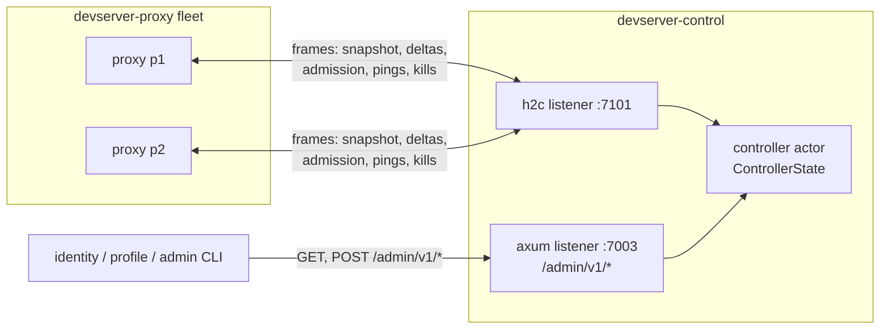

# devserver-control: design

## Problem

A devserver-proxy node keeps its registrations in a process-local registry. That works for one node; it breaks the moment the fleet has two:

1. No component can answer fleet-wide questions: which proxy holds the tunnel for `(user, devserver_id)`, how many distinct devservers a user runs across nodes, or which proxies are alive.
2. The per-user devserver cap is unenforceable: each proxy only sees its own registrations.
3. Operator actions (evict one devserver, drop every tunnel of a blocked user) would need query-time fan-out, which has no safe answer when one proxy is unreachable: a partial read presented as fleet truth.

A shared database does not fix this. A database cannot serialize a yamux handle, the owning proxy process is the only authority that can refresh the row, and rows retained after a process failure report stale ownership as truth. The fleet needs one owner for the dynamic directory that treats the view as a liveness signal, plus a command channel back to the proxies that hold the actual tunnels. The full decision record, including the rejected alternatives, is [ADR-0002](../../docs/adr/0002-control-plane-owns-proxy-fleet-state.md); this document describes the chosen design as built.

## Architecture

devserver-control is a singleton, database-free controller. One process, two listeners, one actor:

- `PROXY_BIND_ADDR` (default `127.0.0.1:7101`): raw h2c. Each devserver-proxy node opens `POST /v1/proxies/connect` with a proxy-id-scoped rotating Bearer credential and holds the response stream for the life of its control session. The stream carries length-prefixed JSON frames in both directions (see Control transport).
- `BIND_ADDR` (default `127.0.0.1:7003`): plain axum HTTP. `/healthz` and `/readyz` are unauthenticated; `/admin/v1/*` uses separate rotating operator, identity, and profile credentials with route-level scopes.

All fleet state lives in `ControllerState`, owned by a single actor task. Mutations arrive over a bounded mpsc channel (capacity 1024) from the session tasks and the HTTP handlers; fleet reads use coalesced `tokio::sync::watch` snapshots (published at most once per one-second actor tick), while owner reads use a maintained owner index and materialize only that owner's rows. There are no locks: the actor is the only task that touches the state, so no lock is ever held across an `.await`. State transitions return `Effect` values (send a frame, retire a session, settle a kill or revocation waiter) that the actor applies after the transition, which keeps the state machine synchronous and unit-testable.

The controller carries metadata and commands only. Tenant HTTP and WebSocket traffic never crosses it; proxies keep owning the yamux handles and the whole data path. A control session loss therefore never strands data-plane capacity by itself; it stops new admission on the affected proxy and starts that proxy's reconnect grace.

## Control transport

One h2 stream per connection, `application/x-chan-devserver-control+json; version=1`, with `DEVSERVER_PROXY_CREDENTIALS` assigning one or two non-reused visible-ASCII Bearers to each exact proxy id. Credentials are compared in constant time. Each frame is a u32 big-endian length prefix followed by a JSON body, capped at 1 MiB. The frame types, limits, signed admission-lease contract, and id/origin validators live in `devserver-control-proto` so client and server cannot drift.

The first frame must be `ClientHello { protocol_version, package_version, proxy_id, proxy_base_url, boot_id }`. Three checks run before the session exists:

- `protocol_version` must equal `PROTOCOL_VERSION` (1).
- `package_version` must equal the controller's own package version. All gateway services and proxies run the same package version, so a mismatched deploy fails loudly at the handshake instead of corrupting the fleet view.
- `proxy_base_url` must equal `DEVSERVER_PROXY_BASE_URL_TEMPLATE` expanded with the presented `proxy_id` (exactly one `{proxy_id}` placeholder; canonical origin comparison, default ports stripped). A proxy cannot claim an origin that does not match its provisioned id.

On pass the controller answers `ServerHello { protocol_version, package_version, heartbeat_seconds: 5, dead_seconds: 15, grace_seconds: 30 }`. Server-to-proxy frames include snapshot/fleet readiness, admission decisions, registration kills, browser-session revocations, resync, heartbeat, and shutdown. Proxy-to-server frames include snapshots and deltas, admission request/cancel, signed lease refresh, command and revocation results, and pong. Snapshots are capped at 128 rows per chunk, 2,048 rows and 2 MiB per session; aggregate state is capped at 16,384 rows and 64 MiB.

Connection hygiene: the h2 handshake, first stream, and `ClientHello` each have a 10s deadline; the initial or resync snapshot has an absolute 30s deadline; at most 128 connections are in flight; a connection that opens extra streams gets 409 per stream and is shut down after 16 of them. One framed-reader task owns the inbound side because a length-prefixed read is not cancellation-safe mid-frame. Its queue is 64 frames and the established session accepts at most 32 frames in any one-second sliding window. A full maximum snapshot needs only 18 frames, so a compromised authenticated proxy is disconnected before it can continuously monopolize the shared actor queue.

## Session lifecycle

A session is `(proxy_id, incarnation)` plus the process `boot_id`. A second live connection for the same proxy id is rejected rather than replacing the incumbent. Disconnected authority is retained by `(proxy_id, boot_id)` through the convergence window; a changed-boot reconnect cannot make the prior unreachable authority disappear. Once ready, a changed boot may join empty but a non-empty snapshot is quarantined until prior authority is settled, because connection recency is not proof that the old process and its tunnels are gone. Live sessions are capped at 128, live-plus-disconnected authorities at 256, and remembered boot ids at 1,024.

The session then moves through two states:

- **Joining**: the session has connected but its registry view is not part of the aggregate. The proxy stages a snapshot: `SnapshotStart`, any number of `SnapshotChunk`s, `SnapshotEnd` with the matching `base_generation`. Chunks are checked for duplicate registration ids and the running total is capped at 2,048 rows and 2 MiB. Staged rows are invisible to the aggregate until the snapshot completes.
- **Active**: the snapshot was accepted and, once reconciliation finishes, the controller sends `FleetReady`. Only Active, fleet-ready sessions participate in admission and own aggregate rows.

After the snapshot, the proxy publishes deltas. Every delta carries a generation number that must extend the session's current generation by exactly one. A gap, a duplicate registration id seen anywhere in the fleet, a down for an unknown registration, or any frame illegal in the current phase triggers `ResyncRequired { expected_generation }`: the controller retracts the session's rows, drops it back to Joining, clears its fleet-ready flag, and waits for a fresh snapshot on the same stream. Generation contiguity is what lets the controller apply deltas without a round trip; any doubt costs one resync instead of a corrupt aggregate. A `TunnelUp` for a key that is already live on another session evicts the previous registration with a kill to its owning session, so a key never has two owners.

One relaxation exists: when the controller confirms a kill, it remembers the killed registration ids (bounded at 4096 per session), because the proxy still publishes its own contiguous `TunnelDown` for each confirmed eviction. Without that memory the expected down would look like corruption and force a resync that retracts every other row of the session. Past the bound the only cost is that resync.

## Fleet admission

Admission is synchronous and controller-owned: the tunnel listener on the proxy holds the handshake after token validation while the control session asks, bounded by the tunnel server's 10s admission timeout, and the client sees `HelloAck::Ok` only after an `admit` decision. The decision vocabulary is `Admit`, `AtCapacity`, `ControlWarming`, `Stale`; the proxy maps `AtCapacity` to the `too_many_workspaces` tunnel error and the other refusals to `control_unavailable`.

The rules, in order:

1. The controller must be ready and the asking session Active and fleet-ready; otherwise `ControlWarming`.
2. A re-request of the exact same claim (same session, request id, registration id) refreshes the claim and re-answers `Admit`, so a proxy that lost the first answer can retry idempotently.
3. Reconnect neutrality: a key that is already live or already claimed does not count against the cap. A proxy reconnecting its existing tunnels after a controller restart can never be refused for capacity it already holds.
4. Capacity: positive `MAX_DEVSERVERS_PER_USER` (default 100; zero is rejected) bounds the number of distinct devserver ids per owner across live rows, staged rows, retained disconnected authority, and pending claims. At or over the cap: `AtCapacity`.
5. A different pending claim for the same `(user, devserver_id)` key is superseded: the old claim holder gets `Stale` and the new claim wins.
6. On `Admit` the controller records a pending claim with a 15s TTL. The matching `TunnelUp` must arrive with that claim's registration id; a `TunnelUp` without a matching claim is killed through the unclaimed-row path. An `AdmissionCancel` (proxy-side handshake failure after the decision) drops the claim early.

Each request also carries a short-lived identity-signed admission lease bound to `(owner_user_id, user, devserver_id, registration_id, proxy_id)`. The controller verifies the lease before reserving capacity, again on snapshots/deltas, and at refresh. A live tunnel refreshes by re-presenting its PAT to identity over a dedicated yamux stream; the proxy forwards only the resulting signed lease to the controller. The controller never receives the PAT, and an expired or unrefreshable lease closes the tunnel. Claims make capacity and single ownership atomic; leases make the immutable identity authority independently verifiable and time-bounded.

This limits honest retention and controller authority; it does not make an assigned proxy a trusted execution environment. A fully compromised proxy can capture the transient PAT during validation or refresh and reuse it until identity revokes it or it expires. Node isolation and PAT rotation/revocation remain the incident boundary.

## Reconciliation

Snapshots can disagree with the aggregate: two proxies may report rows for the same `(user, devserver_id)` key, or a snapshot may push a user over capacity. Reconciliation picks winners and commands the losers down before the new view becomes visible. Only one reconciliation runs at a time; a snapshot that arrives during one is refused and its proxy reconnects.

**Routine join (live-first).** While the controller is ready, a joining snapshot reconciles against the live aggregate, and every live row is an immutable winner: those rows were admitted during this controller lifetime, so their recency is known and a joining snapshot must never outrank it. Joining rows that duplicate a live key lose, each user's live rows are reserved against the capacity limit first, and only novel keys that fit the remaining slots are admitted. Competing rows inside one snapshot resolve by registration id, an ordering local to that snapshot; proxy id is never treated as recency on a routine join. If any loser kill fails or times out, the joining session is removed and its proxy reconnects and retries the whole join.

**Initial restart (deterministic).** After a controller restart the aggregate is empty and recency is genuinely unavailable: every snapshot is equally old. The controller waits a 30-second convergence window (starting at the first accepted snapshot) so the fleet can report in, then elects winners deterministically: duplicates resolve to the lexicographically smallest `(proxy_id, registration_id)`, and capacity trims sort by `(devserver_id, proxy_id, registration_id)`. Losers are commanded down, and readiness flips only after every loser is confirmed gone. If a loser kill fails or times out, the window restarts instead of publishing a view with known conflicts.

Reconciliation loser kills and routine eviction kills are the same mechanism: one `KillRegistrations` command per owning session, with a 5-second command timeout, and a `CommandResult` that must account for every targeted registration exactly once across `killed`, `missing`, and `failed`.

## Failure semantics

- **Heartbeat.** The controller sends `Ping` every 5 seconds (at most 8 nonces outstanding). Any inbound frame counts as activity; a session with no activity for 15 seconds is dead: its rows are retracted, its claims dropped, and its stream closed.
- **Readiness.** The controller is unready from boot until initial reconciliation completes. While unready, `/readyz` answers 503, every admin read and watch answers 503, and every admission request answers `ControlWarming`. If the last Active session is lost, the controller drops back to unready and clears the aggregate: a view with no live sources is worth nothing.
- **Fail-closed proxies.** `ServerHello` announces `grace_seconds: 30`. A proxy whose control session is down refuses new admissions immediately and evicts every local tunnel when the 30-second grace expires; recovery requires a fresh snapshot and `FleetReady`. Snapshot acceptance may replace that deadline with a hard 45-second convergence deadline, and only `FleetReady` cancels it. These behaviors live in devserver-proxy; the controller's side is to never admit for, or publish rows of, a session that is not current.
- **Retained disconnected authority.** A disconnected proxy's rows stop being published but continue to consume row/byte/capacity authority through the 30-second row convergence window. Its `(proxy_id, boot_id)` authority marker remains for 60 seconds after the latest disconnect, which exceeds the proxy's longest 45-second retained-authority path. Every same-boot disconnect extends the marker, and only successful same-boot convergence through `FleetReady` clears it early. Admin session revocation reports that proxy unreachable while this marker exists. This prevents a same-id reconnect, a second disconnect before `FleetReady`, or an empty current view from being mistaken for proof that stale data-plane authority is gone.
- **Bounded queues and rates close sessions.** The per-session outbound queue and actor queue are 1024; a full outbound queue retires that session. The inbound queue is 64 and each session is limited to 32 frames per sliding second. A slow, stuck, or flooding proxy costs its own session, not the fleet actor.
- **Command settlement.** A kill command settles as `Confirmed { killed, missing }`, `Failed` (proxy reported failures or an invalid report), `TimedOut` (5 seconds), or `SessionLost` (owning session ended first). Runtime kills report the outcome to the waiting admin request; reconciliation kills feed the reconciliation's success or retry.

## Admin tree

All routes are Bearer-gated with constant-time comparison. Operator credentials may use the whole tree; identity can read owner rows and issue kills/revocations; profile can additionally read redacted fleet views. Credentials are distinct across scopes and each scope accepts at most two rotation values.

| Method | Path                                         | Behavior          |
|--------|----------------------------------------------|-------------------|
| GET    | `/admin/v1/tunnels`                          | aggregate tunnels |
| GET    | `/admin/v1/owners/{owner_user_id}/tunnels`    | one owner's indexed rows |
| GET    | `/admin/v1/proxies`                          | proxy directory   |
| POST   | `/admin/v1/tunnels/{user}/{devserver_id}/kill` | exact kill; 204 |
| POST   | `/admin/v1/owners/{owner_user_id}/tunnels/kill` | owner-wide kill |
| POST   | `/admin/v1/sessions/revoke`                  | exact/subject browser-session revoke |
| GET    | `/admin/v1/tunnels/watch`                    | SSE snapshots     |
| GET    | `/admin/v1/proxies/watch`                    | SSE snapshots     |

The tunnel snapshot sorts by `(user, devserver_id)` and each row carries its owning `proxy_id` and `proxy_base_url`; the proxy directory carries each node's status, package version, boot id, and tunnel count. The per-user read returns `[]` for a well-formed user with nothing live rather than a 404, so callers do not special-case the steady state.

Kills address aggregate keys but execute by registration UUID, read at issue time: a delayed command cannot kill a successor registration for the same key. The exact kill issues one command to the owning session and awaits it; any outcome short of `Confirmed` is a 502 partial kill, because the proxy may have executed the kill without the controller learning of it. The owner-wide kill first cancels pending claims, then fans out by owning proxy and awaits every confirmation. Both are idempotent and expose only confirmed counts.

Session revocation fans out to every active or warming proxy and refuses to report complete when controller authority is warming or any retained proxy authority is unreachable. A proxy lookup-deactivates matching opaque sessions, force-aborts their registered HTTP/WebSocket bridge tasks, and acknowledges only after those tasks have drained under a bounded deadline. A timed-out drain remains as a lookup-dead tombstone, including across control-loss cleanup, so a retried command cannot mistake an undrained transport for an empty match. Control-loss cleanup suspends browser-session issuance in the same critical section and only `FleetReady` reopens it, closing an in-flight entry exchange that captured a registry row before tunnel eviction. Inability to prove drain disconnects/retries the control session instead of producing a false success. This acknowledgement covers sessions that already exist at the proxy. A signed entry credential minted before revocation remains exchangeable for its 30-second lifetime plus clock skew, so account-deletion settlement keeps the HTTP operation pending, waits that window, and performs a second acknowledged revocation before treating the operation as final.

A malformed owner UUID on owner-scoped routes answers the same 404 shape as an unknown target, so the admin tree does not distinguish invalid identifiers from absent authority to a prober.

The watch routes stream server-sent events: a full snapshot on connect, a full snapshot on every change, 15-second keep-alives, and stream termination the moment the controller leaves readiness. Watches require readiness at connect (503 otherwise), so a consumer never mistakes an empty warming view for an empty fleet.

## Key decisions

### Singleton, database-free controller

Fleet state is a liveness view that is worthless when stale, and the owning proxy process is the only authority that can refresh it; durability would preserve exactly the rows that should not survive. The trade-off (fleet-wide admission stops when the controller is down, recovery is the convergence window) is settled in ADR-0002 and accepted: controller HA, durable control state, leader election, and cross-region replication are out of scope.

### Proxies keep the data path

The controller carries metadata and commands only; it never proxies a byte of tenant traffic. Its cost is one small stateless process, and its failure cannot strand capacity that is otherwise healthy: existing tunnels keep serving through the grace window.

### One actor, effects instead of locks

`ControllerState` is a plain synchronous state machine mutated by one task. Side effects are returned as values and applied after the transition, and kill waiters are registered before the send effect runs, so a command that settles immediately still resolves its waiter. The HTTP handlers and session tasks never touch shared state directly; this is why the system has no lock ordering to get wrong.

### Version-locked handshake

The control session refuses a peer with a different protocol version or package version, and refuses an origin that does not match the proxy id's template expansion. The fleet view is only meaningful if every node speaks the same semantics; a partial upgrade fails at connect time, loudly, instead of drifting.

### Synchronous admission with claims

Holding the tunnel handshake for one controller round trip makes the cap and single-owner decisions atomic, at the cost of coupling admission availability to the controller. That coupling is deliberate: a proxy that cannot ask must not guess (fail closed, no local-admission fallback). The 15-second claim TTL bounds how long an abandoned reservation can hold a key.

### Reads are watch snapshots

Admin reads and SSE watches are served from republished `watch` snapshots rather than querying the actor per request. Read load from dashboards and CLIs scales without adding pressure on the single actor, and every reader of a watch sees the same coherent sequence of full snapshots.

## Invariants

- Aggregate rows are published only from Active sessions; `ResyncRequired` and session removal retract a session's rows before its status can leave Active.
- Kills route by the registration UUID read at issue time, never by key; a delayed command cannot kill a successor registration.
- A joining session's staged rows are invisible to every read and watch until its reconciliation completes.
- Admission decisions and their capacity reservations happen in one state transition; claims expire after 15 seconds.
- One reconciliation runs at a time.
- Readiness implies at least one Active session; losing the last one retracts the whole aggregate.
- The actor holds no locks and performs no blocking I/O; bounded queues (actor 1024, outbound session 1024, inbound session 64) and the 32-frame/s session limit close or retire the offender.
- Bearer comparisons (admin token, proxy token) run at constant time.
- Every frame and aggregate is bounded: 1 MiB per frame, 128 rows per chunk, 2,048 rows/2 MiB per session snapshot, 16,384 fleet rows/64 MiB resident state, 4,096 remembered confirmed-down ids per session, 8 outstanding ping nonces.

## Error model

`StateError` is session-scoped. Only `NotReady` has an HTTP mapping; the rest reject the offending frame and close or resync the control session.

| Variant                    | Surface | Effect                                |
|----------------------------|---------|---------------------------------------|
| `NotReady`                 | admin   | 503 on reads, watches, kills          |
| `StaleSession`             | session | frame rejected; superseded session    |
| `ProxyNotJoining`          | session | snapshot on a non-joining session     |
| `SnapshotTooLarge`         | session | snapshot exceeds 2,048 rows or 2 MiB  |
| `DuplicateRegistration`    | session | duplicate registration id in snapshot |
| `ReconciliationInProgress` | session | snapshot refused; proxy retries       |
| `InvalidPong`              | session | pong nonce not outstanding            |

`ActorError::Stopped` (the actor is gone) and any admin-side read failure map to 503 and are logged at warn level. While the controller warms, the entire admin tree fails closed at 503; there is no partial view. Kill outcomes map as above: `Confirmed` to 204 or 200, every shortfall to a 502 partial kill with the confirmed count, no match to 404. On the proxy listener, handshake failures answer plain HTTP statuses before the stream is established (405 wrong method, 404 wrong path, 401 bad bearer, 415 wrong content type); everything after that is a `Shutdown` frame with a reason string.

## What is not wired

- Controller HA, durable control state, leader election, cross-region replication (ADR-0002 consequences)
- Any tenant data path (the controller never proxies tenant traffic)
- In-process TLS or mTLS. Both listeners must bind loopback unless `CHAN_GATEWAY_INTERNAL_TRANSPORT=overlay-encrypted` explicitly asserts a protected deployment overlay; Bearers authenticate peers but do not make h2c confidential.
- Per-proxy admission policy or per-user overrides (one fleet-wide cap)
- Delta-based watch streams (watches carry full snapshots)
