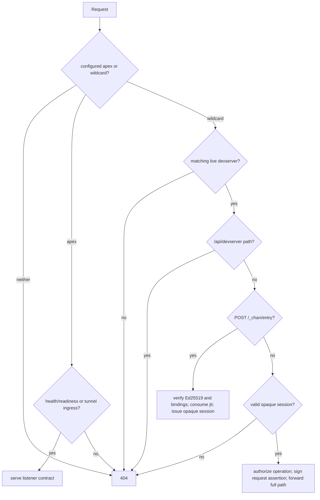

# devserver-proxy: design

## Responsibility

`devserver-proxy` is the public data-plane edge for tunneled `chan devserver`
instances. It has four jobs:

1. validate a tunnel PAT and obtain an identity-signed admission lease;
2. hold the tunnel handshake until `devserver-control` admits the exact
   immutable owner, devserver, registration, and proxy tuple;
3. exchange a short-lived identity credential for a revocable, proxy-local
   browser session; and
4. forward authenticated HTTP and WebSocket traffic to the exact live tunnel,
   with a per-request assertion the devserver independently verifies.

The service has no database, SPA, OAuth credential, profile policy, or local
admin API. Identity owns entry decisions, profile owns durable denial and
revocation jobs, and devserver-control owns fleet state and command routing.

## Listeners and routing

One process owns two listeners and one in-memory registry:

- `BIND_ADDR` is the public HTTP listener. The configured tunnel apex serves
  `/healthz` and `/readyz`; node wildcard hosts serve authenticated devserver
  content. `/readyz` is healthy only after the current control session reaches
  `FleetReady`.
- `TUNNEL_BIND_ADDR` is raw h2c tunnel ingress for `POST /v1/tunnel`. A TLS
  edge exposes that path with h2 in production. Cleartext is supported only on
  loopback or when the deployment explicitly asserts an authenticated,
  encrypted overlay.

The wildcard host is `{owner}--{disc}.<node-base>`, where `disc` is the first
12 lowercase hex characters of the devserver id. A bare owner host remains a
bounded compatibility path: ordinary requests may resolve one live devserver,
but entry exchange is refused unless the route is unambiguous. The full
`/{workspace}/...` path is tenant routing owned by chan-server; the proxy never
uses the workspace segment as an authorization key.

Public wildcard routing is deliberately small:

- `POST /_chan/entry` exchanges a body-only entry credential;
- `/api/devserver/*` is always 404 because that management API is local-only;
- an ordinary path requires a valid opaque `devserver_gate` cookie;
- unauthenticated bare `/` redirects to the identity dashboard; and
- every other unauthenticated or mismatched request returns the same 404 shape.

The aggregate `/admin/v1/*` tree exists only on devserver-control.

## Tunnel registration and admission

The tunnel listener runs
`CapturingValidator -> ThrottlingValidator -> IdentityValidator` before
controller admission. Identity validation returns immutable `owner_user_id`,
canonical username and devserver id, a short-lived admission lease bound to
the proposed registration and proxy, and the per-tunnel assertion authority.
The raw PAT is used only during validation and lease refresh; it is never sent
to devserver-control or retained as a proxy-wide credential.

The listener generates the registration UUID. The control session sends the
lease and exact registration tuple to devserver-control and waits. Only an
`Admit` decision permits `HelloAck::Ok` and registry insertion. `AtCapacity`
maps to `too_many_workspaces`; warming, stale, or unavailable authority maps to
`control_unavailable`. There is no local admission fallback.

The registry keys live rows by immutable owner plus devserver identity and
retains the controller registration UUID. Snapshot and contiguous delta events
feed the control session. Controller kills address registration UUIDs, so a
predecessor teardown cannot remove its successor.

Admission leases expire unless the client re-presents its PAT over the
dedicated refresh stream and identity returns a fresh signed lease. A proxy
may forward the lease but cannot renew one from a proxy-held fleet secret.

## Browser entry exchange

Identity performs the binary owner-or-grantee access check and signs a
30-second Ed25519 entry credential. The claims bind:

- purpose `chan.devserver.entry`, protocol version, issuer, and type;
- immutable caller `sub` and immutable `owner_user_id`;
- exact devserver id, canonical audience, and provisioned proxy id;
- a random single-use `jti`;
- the relative clean navigation path; and
- exact 30-second lifetime with five seconds of clock skew.

The browser or Desktop posts one URL-encoded `credential` field to the fixed
exchange path. The proxy requires exactly one canonical content type, a body
of at most 8 KiB, and exactly one `Origin` equal to identity's configured
public origin. Credentials in query strings are not accepted.

The proxy verifies the signature under a one-or-two-key rotation ring and
checks every binding against the live tunnel and inbound host. It atomically
retains the `jti` through `exp + skew`; replay or replay-cache pressure fails
closed. Replay state is bounded globally and to 64 unexpired entries per
subject. It is process-local, so restart clears it, but the credential's
maximum acceptance window remains 40 seconds.

Successful exchange returns 303 to the signed relative path and sets:

- `devserver_gate=<random 256-bit id>; Path=/; HttpOnly; Secure; SameSite=Lax`
- `devserver_csrf=<random 256-bit value>; Path=/; Secure; SameSite=Lax`

Both cookies are host-only. The entry credential never appears in browser
history, a redirect, or the clean URL.

## Opaque sessions and revocation

The gate cookie is an opaque lookup key, not a self-contained authorization
token. A session record contains the immutable caller, owner, devserver and
audience plus creation time, absolute expiry, a cancellation token, and the
set of active bridge tasks admitted under it.

Bounds are fail-closed:

- `SESSION_MAX_ACTIVE` limits the process, default 10,000;
- one subject may hold at most 64 sessions;
- one exact subject/owner/devserver/audience principal may hold at most 16;
- `SESSION_LIFETIME_SECS` defaults to and cannot exceed one hour; and
- proxy restart clears every session.

`RevokeSessions` has exact `(subject, owner, devserver)` and subject-wide
forms. The proxy first makes matching records lookup-dead, cancels their HTTP
and WebSocket tasks, and waits for every registered operation guard to drop
before acknowledging. A drain timeout leaves a tombstone in the store, so a
retried command cannot observe zero records and falsely confirm. New session
issuance is suspended during control-loss cleanup and resumes only after a
fresh `FleetReady`.

Profile persists revocation work transactionally with each grant delete,
block, PAT revoke, or account delete. Its first confirmed fleet cut starts a
40-second quiet window covering entry lifetime and symmetric skew; a later
same-generation cut settles the job. The controller reports partial failure
while any connected proxy has not confirmed or any disconnected proxy
authority marker remains. Absolute one-hour expiry is the final backstop after
the bounded retry window is exhausted and audited.

## Request authorization

For an ordinary request the proxy resolves the opaque session against the
exact live tunnel and canonical audience. Lookup is repeated for every HTTP
request and WebSocket upgrade. An expired, cancelled, wrong-host, wrong-owner,
or wrong-devserver record returns the indistinguishable 404 path.

Before transport starts, the request registers an operation guard with the
session. No operation may register after revocation. Every forwarded request
also carries `X-Chan-Gateway-Assertion`, a 60-second HMAC assertion containing
only immutable caller, owner, audience, and devserver authority. Its key is
derived independently from the tunnel PAT by the client and proxy validation
path. chan-server verifies it against its configured tunnel origin and owner;
missing assertion authority fails closed.

This is intentionally not owner-equals-caller authorization. A grantee's
`sub` differs from `owner_user_id`, while the exact owner/devserver/audience
bindings confine that caller to the one accepted share.

## Browser boundaries

All methods except `GET`, `HEAD`, and `OPTIONS` require `X-Chan-CSRF` to match
the readable CSRF cookie with a timing-safe comparison. This includes
extension methods such as `PROPFIND` and `TRACE`. The header and all inbound
cookies are stripped before the tunnel hop.

A cookie-authenticated WebSocket additionally requires exactly one `Origin`
equal to the canonical externally visible origin. Missing, multiple, opaque,
wrong-scheme, wrong-port, and sibling origins are rejected before a substream
opens. The bridge closes on session cancellation, absolute session expiry, or
300 seconds with no frame in either direction. Revocation waits for the bridge
task to stop before command acknowledgement.

Every credentialed response receives `Cache-Control: private, no-store`,
`X-Content-Type-Options: nosniff`, `Referrer-Policy: no-referrer`, and a CSP
`frame-ancestors 'none'` directive. Upstream cookies with a `Domain`
attribute, or names reserved for the gateway session and CSRF cookies, are
dropped.

## Reverse-proxy hygiene

The proxy strips the fixed RFC hop-by-hop set on both legs and every header
named by every `Connection` field value. It removes inbound `Host`, `Cookie`,
`Authorization`, `X-Chan-CSRF`, and any client-supplied gateway assertion.
`X-Forwarded-Host` and `X-Forwarded-Proto` are recomputed from the routed host
and configured edge scheme; inbound forwarded host/scheme headers are never
routing authority.

HTTP request and response bodies default to 100 MiB bounds. The default
60-second request deadline covers headers and streaming response body, and
dropping or timing out a response aborts its upstream connection task. The
full inbound path and query are forwarded unchanged except that the fixed
entry exchange is handled locally.

The proxy opens a fresh yamux substream for each HTTP request or WebSocket.
WebSockets perform their handshake directly on that substream and share one
both-directions idle deadline; traffic in either direction refreshes it.

## Control failure semantics

The proxy has one authenticated h2 control session using its provisioned
per-proxy credential. It refuses new admissions immediately when that session
is unavailable, while existing authority has bounded retention:

- a normal healthy-session disconnect arms a 30-second grace;
- if a reconnect snapshot is accepted but `FleetReady` has not arrived, a
  distinct hard 45-second convergence deadline applies;
- a disconnect in that state cannot reset or extend authority indefinitely;
- grace expiry atomically suspends session issuance, evicts tunnels, cancels
  sessions, and waits for admitted bridges to drain; and
- only `FleetReady` cancels cleanup and resumes admission/session issuance.

The controller retains disconnected `(proxy_id, boot_id)` authority for 60
seconds, longer than every proxy-side retention path. Session revocation
therefore cannot report full confirmation during the double-disconnect window
where a proxy could still serve old authority.

## Trust boundary and residuals

A proxy node is credential-poor relative to identity and profile, but it is
still a data-plane trust boundary. A fully compromised assigned proxy can see
a transient PAT during validation and can mint per-request assertions for
tunnels currently assigned to it. The protocol prevents that node from
joining as another provisioned proxy, fabricating an identity-signed admission
or entry credential, or turning one node credential into fleet authority. Node
isolation, deprovisioning, and PAT rotation remain the incident response for a
compromised assigned node; this design is not a trusted execution environment.

The replay cache, opaque sessions, registry, and controller fleet view are
memory-only by design. Restart fails tunnels and sessions closed. Controller
HA, durable fleet state, automatic DNS/certificate provisioning, and
proxy-to-proxy traffic are outside this component.

## Invariants

- No tunnel enters the registry before identity validation and synchronous
  controller admission of its signed immutable tuple.
- Entry credentials are body-only, single-use, short-lived, and bound to the
  exact proxy, audience, owner, devserver, caller, and clean path.
- Browser sessions are opaque, bounded, revocable, lookup-checked on every
  request, and expire absolutely within one hour.
- Revocation acknowledgement means every registered matching transport has
  stopped; timeouts remain visible to retries.
- Every tunnel-bound HTTP request and WebSocket carries a fresh per-tunnel
  gateway assertion; the client cannot supply one.
- Unsafe browser methods require CSRF and cookie-authenticated WebSockets
  require exact Origin.
- The public wildcard never exposes `/api/devserver/*` or an admin route.
- Request paths remain segment-preserving; chan-server is the sole workspace
  tenant router.
- Control loss cannot retain data-plane authority past its hard deadline, and
  controller disconnected-authority markers outlive proxy retention.
