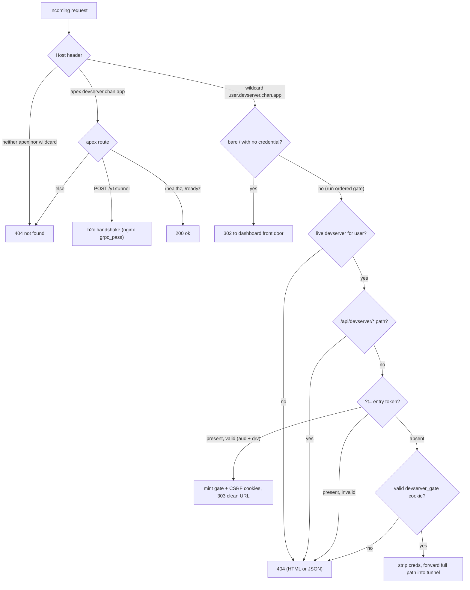
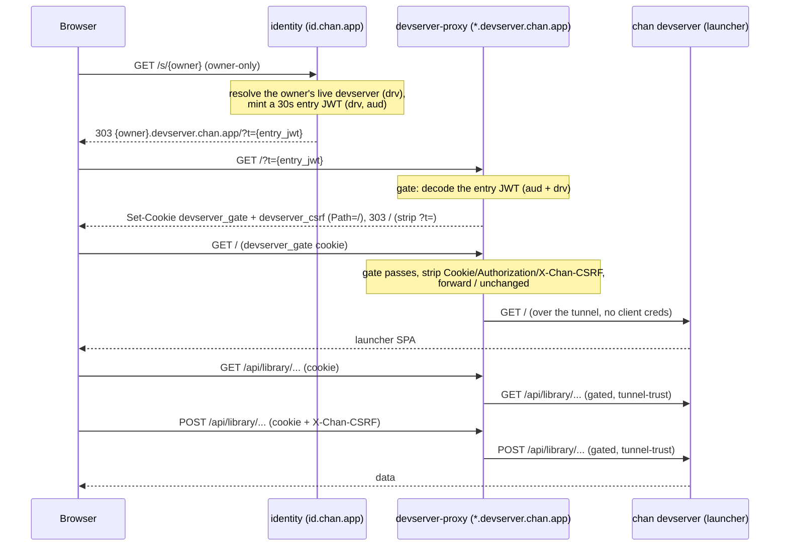

# devserver-proxy: design

## Problem

`chan devserver` instances register over chan-tunnel and live until the peer disconnects. The gateway needs a service that:

1. Accepts the tunnel registration handshake, gated on a synchronous admission decision from devserver-control.
2. Reverse-proxies HTTP and WebSocket traffic into the registered workspace.
3. Gates devservers behind a token minted by identity-service. devserver-proxy writes a host-only gate cookie plus a host-only readable CSRF cookie for unsafe browser writes.
4. Reports its own liveness and control readiness, and nothing else: the aggregate admin API (snapshots, evictions, watches) lives in devserver-control.

The workspace list, sign-in surface and every piece of user-facing UI live in identity-service. devserver-proxy has no SPA and no public `/api/*` of its own.

## Architecture

Two public hostnames pointed at the same process:

- `devserver.chan.app` (apex): tunnel ingress + health/readiness only.
  - `POST /v1/tunnel` -- raw h2c, handled by `chan-tunnel-server` on a separate internal listener (`TUNNEL_BIND_ADDR`). nginx `grpc_pass`es this path; everything else on the apex hits the axum HTTP listener.
  - `/healthz` -- liveness.
  - `/readyz` -- 200 only after the controller session reaches `FleetReady`.
  - Anything else -- 404.

- `*.devserver.chan.app` (wildcard): the devserver's own content -- the launcher SPA at the root and tenant workspaces under `/{workspace}`. A user can hold many live devservers (bounded by the fleet-wide per-user cap the controller enforces at admission); `{user}--{disc}.devserver.chan.app` addresses one by the first 12 hex chars of its devserver id, and the bare `{user}` host resolves through the gate credential. The `{workspace}` path segment is tenant routing, never a gate key.
  - `/` with no `devserver_gate` cookie and no `?t=` -- 302 to `https://id.chan.app/workspaces` (the dashboard front door; the proxy renders no UI of its own).
  - `/` or `/?t=<jwt>` carrying a gate credential -- gated like a tenant path and forwarded to the devserver root, where the launcher SPA is served.
  - `/api/devserver/*` -- 404 (the devserver's local-only management API is never proxied; the gateway carries tenant content only).
  - `/{workspace}/?t=<jwt>` -- entry: validate the entry token, set the `devserver_gate` and `devserver_csrf` cookies, 303 to the clean URL.
  - `/{workspace}/...` -- gate on the resolved devserver (drv + aud), then forward the FULL path unchanged into the tunnel. Anything else -- 404.

A single axum router serves both apex and wildcard via a Host-keyed dispatch. The wildcard label before `.devserver.chan.app` is parsed out of the request's `Host` header as `{user}` or `{user}--{disc}` (`--` cannot appear in a valid username, so the split is unambiguous; a disc tail that is not exactly 12 lowercase hex chars 404s). A disc host resolves the unique live devserver id with that prefix (zero or ambiguous -- 404). A bare host with one live devserver resolves to it; with several, the gate tries each live id as the credential's `drv` and routes to the one that verifies, so pre-disc links and cookies keep working.

Host-keyed apex/wildcard dispatch, then the ordered auth gate on the wildcard path; the textual rules below carry the exact contract.

The tunnel listener runs `chan-tunnel-server` raw h2 on `TUNNEL_BIND_ADDR`, with the validator chain `CapturingValidator -> ThrottlingValidator -> IdentityValidator`. On a successful handshake the registry caches `(username -> user_id)`. Registration itself is controller-admitted: the listener holds the handshake after token validation while the control session asks devserver-control, and the client sees `HelloAck::Ok` only after an admit decision; a refusal carries the stable `control_unavailable` or `too_many_workspaces` code.

The `Registry` is the in-process map from `(username, devserver_id)` to the live `TunnelHandle` plus the username cache. The second key is the devserver id (the registration name), not a workspace slug. The proxy resolves a disc host through `get_user_devserver_by_prefix` (unique 12-hex-prefix match over the user's live ids) and a bare host by iterating `live_devserver_ids` against the gate credential's `drv` claim. The control session reads the same registry to publish its snapshot and delta stream to the controller, and applies controller kill commands to it by registration UUID.

## Devserver gate

devserver-proxy reads no `tower_sessions` cookie. Authentication for the proxy path uses a JWT minted by identity-service, signed with `DEVSERVER_GATE_SECRET` (HMAC-SHA256). The secret is shared between identity (mints both shapes) and devserver-proxy (verifies, mints the session shape).

The gate is per-DEVSERVER: one devserver, one access check, addressed by its disc host (`{user}--{disc}.devserver.chan.app`) or resolved from the bare `{user}` host via the credential's `drv` claim. A grant gives the whole devserver, so the `{workspace}` path segment never gates. Two tokens are involved:

- **Entry token**: 30s exp, carried in `?t=` on the first hit. Issued by identity after a `devserver_access(owner, devserver, caller)` check. Claims: `{iss: "id.chan.app", sub: user_id, drv: <devserver id>, aud: "<host>", typ: "entry", iat, exp}` plus optional `name` / `email` identity claims (see Auth gate trust model).

- **Session cookie**: 24h hard exp, written as `Set-Cookie: devserver_gate=<jwt>; HttpOnly; Secure; SameSite=Lax; Path=/`. Minted by devserver-proxy on entry-token validation. Same claim envelope, `typ: "session"`. Stateless: no server-side store.
- **CSRF cookie**: random 32-byte hex value, written beside the session as `Set-Cookie: devserver_csrf=<hex>; Secure; SameSite=Lax; Path=/`. It is intentionally readable by same-origin launcher JS and is not a credential by itself.

`Path=/` (whole host) is safe because the grant is whole-devserver: every path on `{user}.devserver.chan.app` is content the cookie-holder is already authorized to reach, so there is no non-granted sub-tenant to isolate. The remaining isolation axis is user-to-user, carried by the host-only cookie + the `aud` claim: `alice.devserver.chan.app` and `bob.devserver.chan.app` are distinct origins, and a token's `aud` binds it to one host.

The shared JWT type and signing helpers live in `gateway_common::devserver_gate`.

Unsafe HTTP methods (`POST`, `PUT`, `PATCH`, `DELETE`) require `X-Chan-CSRF` to match the `devserver_csrf` cookie with a timing-safe compare before the request is forwarded. Safe reads and WebSocket upgrades do not require the header. The proxy strips both `Cookie` and `X-Chan-CSRF` before the tunnel hop, so the local devserver never sees gateway cookies or CSRF material.

## Whole-devserver open (launcher)

The owner opens their whole devserver -- landing on the launcher served at the devserver root -- through identity's `GET /s/{owner}`, which mints an entry token the same way the per-workspace landing does. The proxy exchanges it for the gate cookies and forwards `/` to the launcher:

## Gateway contracts

### Tunnel registration (apex only)

`POST /v1/tunnel` on `devserver.chan.app:443`. nginx routes this exact path to the h2c tunnel listener (`grpc_pass`, `TUNNEL_BIND_ADDR`, default `:7100`); everything else on the apex `proxy_pass`es to the axum listener on `:7002`. The h2c handler in `chan-tunnel-server` validates the Bearer PAT via identity-service `/internal/v1/tokens/validate`, then asks devserver-control for an admission decision over the control session before writing `HelloAck::Ok`; only an admitted registration enters the shared registry.

### Reverse proxy (wildcard host)

Auth gate for `*.devserver.chan.app/{workspace}/...`, in order:

1. No live devserver registration for `{user}` -> 404.
2. `/api/devserver/*` (the local-only management API) -> 404.
3. Request carries `?t=<jwt>` -> verify signature + exp + aud + drv (= the live devserver id) match. On success: mint a session JWT, write `devserver_gate` and `devserver_csrf` cookies scoped to `Path=/`, 303 to the clean URL.
4. Request carries `devserver_gate` cookie -> verify signature + exp + aud + drv against the user's live devserver. Pass through.
5. Anything else (no cookie, expired cookie, bad signature, wrong devserver) -> 404.

The gate always runs: every devserver is authenticated, there is no un-gated pass-through. On pass, unsafe HTTP methods must also carry `X-Chan-CSRF` matching the readable host-only `devserver_csrf` cookie. On pass, the FULL inbound path (only `?t=` stripped) is forwarded into the tunnel; the devserver routes the `{workspace}` tenant internally.

The wildcard root `/` follows the same gate. An unauthenticated `/` (no `?t=`, no `devserver_gate` cookie) 302s to the dashboard, but a `/` carrying a credential falls through to the gate and is forwarded to the devserver root, where the launcher SPA is served (`proxy::handle` is segment-preserving, so `/` forwards unchanged). The launcher's same-origin `/api/library/*` calls ride the same cookie gate; unsafe writes also mirror `devserver_csrf` in `X-Chan-CSRF`. Note the proxy strips every inbound client credential before forwarding -- `?t=`, `Cookie`, `Authorization`, and `X-Chan-CSRF` -- so the devserver authenticates a proxied request by trusting the gated tunnel, not a forwarded bearer; the gate at the proxy edge is the sole authorization for tenant content.

The 404 path checks `Accept: text/html`; browsers get the styled "workspace not found" page, everything else gets the JSON `{"error":"not found"}` shape. Owners returning after the 24h cookie expires bounce through `id.chan.app/workspaces`; a bookmark to a devserver URL is not a session.

### Hop-by-hop hygiene

`HOP_BY_HOP_NAMES` lists the RFC 7230 6.1 hop-by-hop headers: `Connection`, `Keep-Alive`, `Proxy-Authenticate`, `Proxy-Authorization`, `TE`, `Trailer`, `Transfer-Encoding`, `Upgrade`. In addition, `connection_listed_headers` parses the inbound `Connection` value and strips every header it names (also RFC 7230 6.1). Applied on both legs.

Inbound `Host`, `Cookie`, `Authorization`, and `X-Chan-CSRF` are dropped. `X-Forwarded-For` is recomputed as `<existing chain>, <peer ip>`. `X-Forwarded-Proto` is set from `FORWARDED_PROTO` (default `https`, configured to match the terminator that fronts this listener). `X-Forwarded-Host` is set from the inbound `Host` header devserver-proxy itself routed on. Inbound `X-Forwarded-{Host,Proto}` are NOT trusted: they are client-controllable and an upstream that builds absolute URLs from XFH/XFProto would otherwise be steerable from outside.

The `dispatch` handler likewise reads the raw `Host` header directly rather than going through axum's `Host` extractor, which consults `Forwarded` and `X-Forwarded-Host` before `Host` and would let a hostile client route into a different tenant's wildcard surface by spoofing those headers.

### HTTP upstream

`hyper::client::conn::http1::handshake` over a yamux substream wrapped in `tokio_util::compat::FuturesAsyncReadCompatExt`. `with_upgrades()` keeps the substream alive past 101 so WebSocket can ride the same path. For pure HTTP the connection future ends when the response body finishes.

Request bodies are wrapped in `http_body_util::Limited` at `MAX_REQUEST_BYTES` (default 100 MiB). Response bodies are wrapped at `MAX_RESPONSE_BYTES` (default 100 MiB). Either `0` disables the cap. A total per-request deadline (`REQUEST_TIMEOUT_SECS`, default 60s) covers both the `send_request` future AND the response body stream: the response body is wrapped in `DeadlineBody`, which holds a `tokio::time::Sleep` anchored at the deadline and errors out the stream if the upstream slow-drips past it. `DeadlineBody` also owns the upstream conn task's `AbortHandle` and aborts on drop so a client that bails mid-response does not strand the yamux substream. On the headers-side miss the proxy returns 504. WebSocket requests bypass the total-timeout and run under per-half idle timeouts instead (see below).

### WebSocket upstream

`tokio_tungstenite::client_async` runs the WS handshake directly on the yamux substream. Two halves run inside a `tokio::select!`. Each half has a 300s idle timeout: if neither side sends a frame within the window, the half drops, the other half falls out of scope, and the substream closes. Without this, an idle peer could pin a yamux window indefinitely.

### Control session

One authenticated h2 control session to devserver-control carries the full lifecycle: the proxy publishes a registry snapshot on connect and deltas as registrations come and go, answers heartbeats, and applies kill commands by registration UUID. Readiness (`/readyz`) is 200 only once the controller reports `FleetReady` on the current session; while disconnected the proxy refuses new admissions (`control_unavailable`) but keeps serving existing tunnel traffic for a 30-second reconnect grace. A reconnect that completes a fresh snapshot cancels the grace eviction; if the grace expires first, the proxy evicts every local tunnel and clears the username cache, staying unready until a fresh snapshot reaches `FleetReady`.

The aggregate admin tree (fleet snapshots, per-user views, kills, watches) lives in devserver-control, which owns the fleet-wide view across all proxies. The proxy keeps no operator API of its own.

## Key decisions

### One process, two listeners, one registry

The h2c tunnel listener and the axum HTTP listener share the in-process `Registry`. A registration on the tunnel listener is visible to the proxy handler on the very next request with no out-of-band sync. Horizontal scale runs as multiple proxy processes, each with its own in-process registry; devserver-control aggregates the fleet from the per-proxy control sessions, so no shared store is needed.

### No cookie session for the proxy path

devserver-proxy reads nothing from `tower_sessions`. The browser never sends an `.chan.app`-scoped cookie to `*.devserver.chan.app` because no such cookie exists; id.chan.app's cookie is host-only on id.

This is load-bearing for cross-tenant isolation:

- Malicious tenant content at `evil.devserver.chan.app` can run JS, but the only cookies it can access are its own host-only ones. The browser will not auto-attach an id.chan.app cookie to a fetch on `evil.devserver.chan.app`.
- The `devserver_gate` and `devserver_csrf` cookies are host-only and whole-host (`Path=/`). The gate cookie is safe because a grant is whole-devserver: there is no non-granted sub-tenant on the same host to isolate from. The CSRF cookie is readable but cannot authorize a request without the HttpOnly gate cookie.
- Cross-user attacks are blocked by browser origin separation; each user has their own subdomain.

### CSRF for unsafe writes

`SameSite=Lax` is site-based, not origin-based. Sibling `*.devserver.chan.app` origins therefore need a second check before browser-cookie-backed writes are accepted. devserver-proxy uses the double-submit shape: the entry exchange mints a readable host-only `devserver_csrf` cookie, the launcher and desktop client copy it into `X-Chan-CSRF` for unsafe HTTP methods, and the proxy requires an exact timing-safe match. The header is stripped before forwarding so local devserver routes do not gain a second auth surface.

### JWT, HS256, two-token

Entry tokens have 30s exp so a leak (referer, browser history, ops log) closes in under a minute. Session cookies have 24h exp so day-to-day navigation is one click from the dashboard. Both signed with `DEVSERVER_GATE_SECRET` (HS256, no "alg: none" path; the validator hard-requires HS256). The crate is `jsonwebtoken`.

There is no sliding session-cookie expiry and no server-side revocation (revoked-jti set); rotation of `DEVSERVER_GATE_SECRET` is the only immediate invalidation knob.

### Username cache populated on handshake

The tunnel validator returns `(user_id, username)`. `CapturingValidator` records that pair in the registry on every successful handshake. The proxy gate does not compare `owner_id` against the token's `sub` (that comparison would lock grantees out of shared workspaces); the cache exists as metadata for admin tooling and as a defense-in-depth signal for future enforcement that needs to correlate the live tunnel with a specific account. A cache miss reads as "unknown registration" -> 404 because tunnel presence is what the registry tracks.

### Auth gate trust model

The auth assertion on the wildcard path is the entry JWT, not "sub matches owner". identity-service calls `profile.devserver_access(owner, devserver, caller)` before minting any entry token, so a valid signature plus the right `aud` (= the inbound host, which is `{owner}.devserver.chan.app`) plus the right `drv` (= the live devserver id) proves the caller was authorized at mint time. identity owns the access-control policy; devserver-proxy verifies the signed assertion. The session cookie minted on entry-token validation carries the entry's `sub` unchanged so the upstream attribution chain knows whether the request belongs to the owner or a grantee. The entry's optional identity claims (`name`, `email`, resolved by identity at mint) propagate the same way, session cookie included, and are copied into every per-request gateway assertion so the devserver can render participant display strings; the proxy never looks them up itself and they are never an authorization input. Tokens minted without them (older gateways) decode to `None` and the assertion simply omits them.

User-to-user isolation is enforced by `aud`. A token minted for one subdomain (`alice.devserver.chan.app`, disc hosts included) cannot be replayed on another (`bob.devserver.chan.app`) because `decode` rejects on `aud` mismatch. The canonical audience is the lowercase host with default ports stripped; explicit non-default ports remain for local/dev deployments. The `drv` claim binds the token to one devserver: a cookie minted for a rotated/old devserver id no longer matches any of the user's live registrations and 404s (re-share required after rotation). On a bare host with several live devservers the gate tries each live id as `drv`, so the loop is bounded by the user's live set (itself bounded by the fleet-wide per-user cap the controller enforces at admission). There is no separate "this user is the owner" check, and intentionally so: requiring it would prevent accepted grantees from reaching the devserver they have been granted.

Known collateral, accepted for now: PAT revoke drops ALL of a user's tunnels (a user-wide kill through the controller; the tunnel server does not track token-to-tunnel). Devservers on non-revoked PATs reconnect on their own. A single devserver is killed by targeting its registration UUID through the controller's exact kill.

### Tunnel handshake throttles by token fingerprint

`ThrottlingValidator` keeps an in-process map of fingerprint -> token bucket (SipHash of the candidate token, 4 rps refill, 16-burst capacity, 4096-entry cap with LRU eviction). Guesses at a specific PAT are bounded regardless of attacker source-IP diversity. A twin of this throttle lives in identity-service's `/internal/v1/tokens/validate` handler as defense in depth: if the internal bearer leaks and someone hits identity directly, the identity-side throttle catches it. Either throttle alone is enough to make a guess loop glacial.

### Segment-preserving forward

`{user}` lives in the host, not the path. The wildcard router does NOT peel a segment: it forwards the full inbound `/{workspace}/...` path (only `?t=` stripped) into the tunnel, and the devserver mounts each tenant at its public `/{workspace}/` slug and routes internally. Getting half of this wrong (proxy strips but the devserver expects the public segment, or vice versa) yields 404s that look like an auth bug; this is the highest-leverage correctness seam and the joint client-to-gateway smoke catches it.

### Admin tree on the controller

The aggregate admin tree lives on devserver-control, not on the proxy apex. The controller is the only component with a fleet-wide view: every proxy publishes its registrations over its control session, so snapshots, kills, and watches aggregate correctly across nodes. The proxy apex serves only health/readiness and tunnel ingress, and the wildcard never proxies admin routes, so tenant content has no path to any admin surface on the proxy.

### Node origins are explicit config

The proxy derives its hostnames from two required origins rather than a shared domain var: `DEVSERVER_TUNNEL_ORIGIN` (the public origin of the tunnel listener) supplies the apex host, and `DEVSERVER_PROXY_BASE_URL` (the exact public origin of this node's wildcard listener) supplies the wildcard suffix. `DASHBOARD_URL` is the required sign-in redirect target. Each proxy node sets its own base URL and announces it in the control session handshake, so the controller's aggregate view can attribute every registration to the exact node that serves it. The devserver-gate JWT `aud` is the inbound host, so the configured origins must match what clients actually dial.

## Invariants

- Every registered tunnel has a known `owner_id`.
- Tunnel registrations are ephemeral; they vanish when the peer disconnects, via a controller kill command, or when the control-loss grace expires.
- The proxy path reads no `tower_sessions` cookie. The only cookies it reads or writes are the host-only, whole-host (`Path=/`) `devserver_gate` and `devserver_csrf`.
- Bearer comparisons run at constant time.
- Unsafe HTTP methods require `X-Chan-CSRF` to match `devserver_csrf` before forwarding.
- Hop-by-hop headers are stripped on both legs of every request, including every header named by the inbound `Connection` value.
- Reverse-proxy paths forward the full inbound path to the tunnel unchanged (only the `?t=` entry token is stripped); the `{workspace}` segment is preserved.
- `/api/devserver/*` is never proxied on the public wildcard; the gateway carries tenant content only.
- Request and response bodies are bounded by the configured caps.
- HTTP requests are bounded end-to-end by `REQUEST_TIMEOUT_SECS`.
- WebSocket halves are bounded by a 300s idle timeout each.

## Error model

`devserver_proxy::Error`:

| Variant       | HTTP | Notes                                     |
|---------------|------|-------------------------------------------|
| Unauthorized  | 401  | not used on the proxy path; the 404       |
|               |      | path is preferred so existence does not   |
|               |      | leak                                      |
| NotFound      | 404  | unknown workspace, invalid or missing gate    |
|               |      | token, wrong user                         |
| BadRequest    | 400  | input or proxy precondition failure       |
| Upstream      | 502  | tunnel disconnected, h1 handshake failed  |
| Anyhow        | 500  | startup or unexpected                     |
| Reqwest       | 502  | identity-service unreachable              |

devserver-proxy carries no `Conflict` variant: nothing on this surface PATCHes a unique-constrained row.

## What is not wired

- A SPA: no frontend bundle or static-file handler in this crate
- Sessions: no `tower_sessions` integration anywhere
- Per-tunnel labels (the workspace slug is the default; `Hello` carries no separate label)
- Per-PAT scopes (tunnel scope is implicit on validated PATs)
- A local admin API (fleet snapshots, kills, and watches live in devserver-control)
- Server-side session revocation (24h cookie exp is the only knob; rotating `DEVSERVER_GATE_SECRET` is the nuclear option)
- Sliding session-cookie expiry
