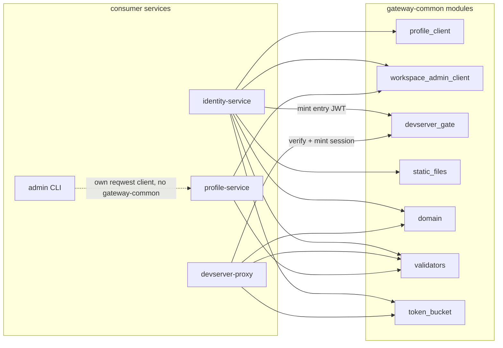

# gateway-common: design

## Problem

identity-service, devserver-proxy and profile-service need the same plumbing in several places:

- a `ProfileClient` calling profile-service over HTTP;
- a `WorkspaceAdminClient` calling devserver-proxy admin (used by identity on revoke / delete / dashboard reads and by profile on admin block);
- the JWT shape used by the devserver-gate handoff between identity (mint) and devserver-proxy (verify + mint sessions);
- the public-hostname derivation both public services must agree on;
- username validation rules that profile, identity and devserver-proxy all enforce;
- the token-bucket primitive both validate throttles wrap.

Per-crate copies would risk drift and make cross-cutting choices (timeouts, error mapping, MIME guessing, signing claims, throttle limits) live in multiple places.

## Architecture

Library crate of small, mostly independent modules. The data-layer types carry no axum / `IntoResponse` coupling: axum is a dependency only because `static_files::serve` returns `axum::response::Response`, and `profile_client`, `workspace_admin_client` and `devserver_gate` know nothing of axum.

*Which services share which modules; the admin CLI deliberately keeps its own reqwest client rather than depend on gateway-common.*

Module names and signatures are self-explanatory; the parts that are not are the contracts each module carries:

- `profile_client`: one reqwest client with a 10-second per-request timeout, the bearer token held inside (the `Debug` impl elides it). Idempotent GETs on the dashboard / OAuth-callback read path retry once after 100 ms on connect error, timeout, or 5xx (`send_idempotent`); writes never retry. `User` is the superset of every field profile-service returns, so consumers ignore the fields they do not need.
- `workspace_admin_client`: one reqwest client for the apex admin tree with a 5-second timeout, the bearer held inside and elided in `Debug`.
- `devserver_gate`: `Claims` is the entry / session JWT envelope (`iss`, `sub`, `drv`, `aud`, `typ`, `iat`, `exp`). HS256 is hard-required -- no `alg: none` path exists and no asymmetric algorithm is enabled -- and `decode` verifies `aud` / `drv` / `typ`.
- `domain`: `Domains` derives every public hostname (`base`, `id_host`, `devserver_apex`, `devserver_wildcard_suffix`) from one base (`CHAN_DOMAIN`, default `localtest.me`). identity and devserver-proxy derive from the same env, so the hosts cannot drift and the devserver-gate `aud` is the inbound host.
- `token_bucket`: per-fingerprint bucket over a bounded, LRU-evicting map. A new fingerprint starts at one token, not a full burst, so rotating fingerprints can't bank capacity; `fingerprint` is a SipHash-64 of the candidate token. `DEFAULT_REFILL_PER_SEC` / `DEFAULT_CAPACITY` / `DEFAULT_MAP_CAP` (4 rps, 16 burst, 4096 entries) are single-sourced so the two validate throttles cannot drift.
- `validators`: `valid_username` requires 3-32 chars, `[a-z0-9-]`, no boundary hyphens; `MAX_USERNAME_EDITS` is the lifetime rename cap (4).
- `static_files`: `serve<R: RustEmbed>` is the SPA fallback handler -- it tries the requested path, falls back to `index.html` for paths without an extension, serves the consumer's banner as 503 (so a missing bundle surfaces to monitoring) if no `index.html` is embedded, else 404. Why it is generic and why the banner stays per-consumer: Key decisions.
- `shutdown`: `shutdown_signal()` completes on the first of SIGTERM (Unix) or Ctrl-C; every service binary gates its graceful shutdown on it.

## Public surface

`profile_client::ProfileClient` exposes one method per profile-service endpoint -- user CRUD, feature flags, workspaces and grants -- each named for what it does. The rows whose semantics are not obvious from the name:

| Method               | Semantics                                              |
|----------------------|-------------------------------------------------------|
| `upsert_by_identity` | atomic find-or-create-or-link in one call             |
| `update_username`    | rename; consumes one of the `MAX_USERNAME_EDITS` slots |
| `workspace_access`   | per-request access gate -- returns the `role` or 404   |
| `claim_grants`       | claim pending grants by the user's verified emails    |

Reads on the dashboard / OAuth-callback path go through `send_idempotent` (one retry; see Architecture); writes do not.

`workspace_admin_client::WorkspaceAdminClient`:

| Method                    | Purpose                    |
|---------------------------|----------------------------|
| `kill_user_tunnels(user)` | bulk evict; returns count  |
| `list_user_tunnels(user)` | snapshot for the dashboard |

`devserver_gate`:

| Function                                | Purpose                     |
|-----------------------------------------|-----------------------------|
| `encode_entry(secret, sub, drv, aud)`   | identity mints (30s exp)    |
| `encode_session(secret, sub, drv, aud)` | devserver-proxy mints (24h) |
| `decode(secret, token, typ, aud, drv)`  | verify; returns `Claims`    |

## Key decisions

### No axum coupling in the data-layer types

`ProfileError`, `WorkspaceAdminError`, `DevserverGateError` and `Claims` are plain thiserror / serde types. Each consumer maps the error onto its local request-handler error via a `From` impl. Keeps gateway-common free of HTTP-framing decisions and lets each consumer decide whether a given variant is a distinct status or folds into another.

### `User` is the superset

`User` carries every field profile-service returns: `username_edits`, `avatar_url`, `blocked_at`, `block_reason`, `display_name`, `email`. Consumers ignore the fields they do not need. Splitting into per-consumer sub-structs would force parallel maintenance for negligible benefit.

### Shared devserver_gate

Both identity and devserver-proxy depend on the same JWT envelope and the same HS256 verification config (hard-required alg, no fallback). One module here is the canonical place for both; the secret is shared between the two services via env var (`WORKSPACE_GATE_SECRET`).

### `static_files::serve` is generic over `RustEmbed`

`rust_embed` resolves `#[folder = "web/dist/"]` relative to the crate that has the derive. Each consumer owns its own `Assets` struct; the shared crate cannot derive once and share the embedded bytes. The function takes the `R: RustEmbed` type parameter and calls `R::get(path)`; the consumer site is two lines of declaration plus one call.

Only identity-service ships an SPA, so it is the module's only consumer; the module stays generic in case a future service grows a UI.

### Banners stay per-consumer

Each consumer's "frontend not built" banner names the right crate and its right `npm run build` directory. Parameterising the banner template would obscure that; each consumer ships its own `&'static [u8]` constant.

## Invariants

- `gateway_common` does not pull axum or any HTTP-routing framework into its data-layer surface. axum is a dependency only because `static_files::serve` returns `axum::response::Response`; nothing in `profile_client`, `workspace_admin_client` or `devserver_gate` knows axum exists.
- Bearer tokens passed to `ProfileClient::new` or `WorkspaceAdminClient::new` live inside the client; the `Debug` impl deliberately elides the token.
- `devserver_gate` enforces `alg: HS256` on every decode. No "alg: none" is ever accepted; no asymmetric algorithm is enabled.
- HTTP calls run through one reqwest client per type with a fixed timeout (10s for profile, 5s for workspace-admin). New methods reuse the existing builder.

## Error model

`ProfileError`:

| Variant       | Construction                               |
|---------------|--------------------------------------------|
| `NotFound`    | upstream returned 404                      |
| `BadRequest`  | upstream returned 400 (body in payload)    |
| `Conflict`    | upstream returned 409 (body in payload)    |
| `Upstream`    | any other non-success status               |
| `Reqwest`     | `From<reqwest::Error>` for transport       |

`WorkspaceAdminError`:

| Variant       | Construction                               |
|---------------|--------------------------------------------|
| `Upstream`    | non-success status with body               |
| `Reqwest`     | `From<reqwest::Error>`                     |

`DevserverGateError`:

| Variant          | Construction                                     |
|------------------|--------------------------------------------------|
| `Decode`         | malformed token, unsupported alg, or HMAC verify failed |
| `Expired`        | `exp` in the past                                |
| `WrongAudience`  | `aud` claim does not match                       |
| `WrongWorkspace` | `drv` claim does not match                       |
| `WrongType`      | `typ` did not match expected value               |

Consumers map these into their local axum errors.

## What's wired

- `reqwest` runs both clients with the `rustls-tls` and `json` features.
- `domain`, `validators` and `token_bucket` are std-only (SipHash via `DefaultHasher`), so the cross-cutting primitives carry no third-party surface. Only `static_files` reaches for axum (response types only), `mime_guess` and `rust-embed`, and only `devserver_gate` reaches for `jsonwebtoken`.

## What is not wired

- Caching of profile responses (every call hits the upstream)
- Connection pooling beyond reqwest defaults
- Retries beyond the single idempotent-GET retry in `send_idempotent` (callers decide whether a write failure is fatal or fire-and-forget)
- Asymmetric JWT (HS256 is the only algorithm enabled)
- An axum middleware that rewrites client errors into responses directly (consumers do the mapping in their own `IntoResponse`)
