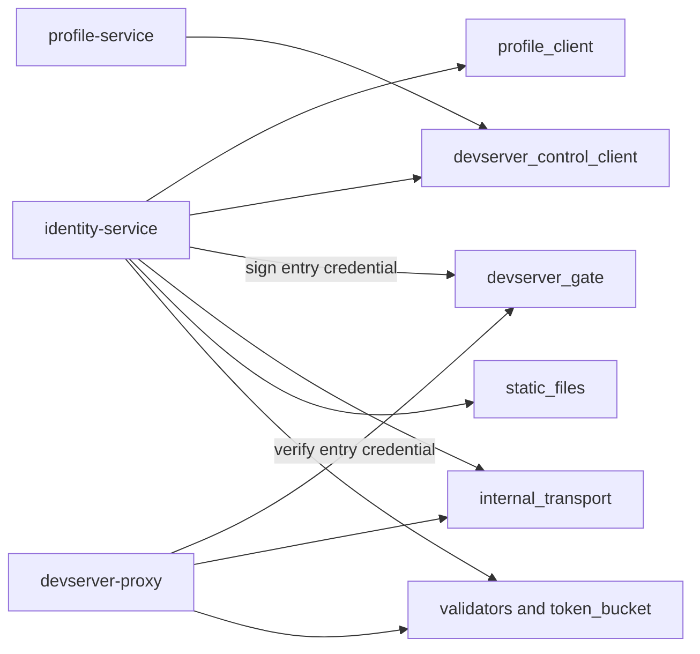

# gateway-common: design

## Problem

The gateway services need one implementation of the contracts they share:

- typed clients for profile-service and devserver-control;
- Ed25519 entry credentials for the identity-to-proxy browser handoff;
- controller admission-lease verification at identity boundaries;
- protected internal-transport validation;
- username validation, throttling, static-file serving, and shutdown plumbing.

Keeping these contracts here prevents security-sensitive wire shapes, timeouts,
and validation rules from drifting between services.

## Architecture

`gateway-common` is an internal library. Its HTTP clients and credential types
do not depend on axum response semantics; consumers map errors at their own API
boundaries.

The important module contracts are:

- `profile_client`: a typed reqwest client with a 10-second request timeout.
  Its bearer is redacted from `Debug`. Idempotent reads retry once after 100 ms
  on connection failure, timeout, or 5xx; writes do not retry.
- `devserver_control_client`: a typed client with a 5-second request timeout and
  a 2-second connect timeout. Each service constructs it with its own
  scope-specific controller bearer. Tunnel rows include their signed admission
  lease and owning proxy identity.
- `devserver_gate`: identity signs a 30-second Ed25519 credential. Claims bind
  the immutable caller, owner, devserver, exact audience, target proxy, signed
  clean path, purpose/version, and random single-use `jti`. The target proxy
  verifies through a one- or two-key public-key ring and consumes the `jti`
  before creating an opaque proxy-local browser session.
- `internal_transport`: rejects public cleartext internal service URLs and
  listeners. Loopback cleartext remains valid for a single-host deployment;
  non-loopback deployments must use a protected overlay or HTTPS.
- `token_bucket`: a bounded per-fingerprint bucket shared by both PAT-validation
  throttles. New fingerprints begin with one token rather than a full burst.
- `validators`: the canonical username shape and lifetime rename cap.
- `static_files`: the generic embedded-SPA fallback used by identity-service.
- `shutdown`: the common SIGTERM/Ctrl-C graceful-shutdown future.

## Key decisions

### Asymmetric, single-use browser handoff

Identity alone holds `DEVSERVER_ENTRY_SIGNING_KEY`. Proxy nodes receive only
`DEVSERVER_ENTRY_VERIFYING_KEYS`, with a maximum two-key rotation overlap. A
credential is accepted only at the fixed body-only `POST /_chan/entry` endpoint
from the exact configured identity Origin. It is never a standing browser
session and never appears in the URL.

The target proxy stores only an opaque random cookie in the browser. Session
authorization state stays proxy-local, has a one-hour absolute maximum, and can
be cancelled immediately by an exact or subject fleet revocation.

### Admission leases are verified at the consumer boundary

Controller tunnel rows are not trusted as unsigned routing data. Identity
verifies the Ed25519 admission lease and its immutable owner, devserver,
registration, proxy, and expiry bindings before a row can authorize an entry or
appear in the Desktop roster.

### Scoped controller clients

The operator CLI, identity-service, and profile-service use different
controller bearer rings. Possession of one service credential does not grant
another service's admin surface.

### Internal transport fails closed

An internal bearer authenticates the caller but does not make plaintext traffic
private. Startup validation therefore permits cleartext only on loopback and
requires HTTPS or an explicitly protected network for non-loopback service
traffic.

## Invariants

- Entry credentials use Ed25519 only; there is no HMAC or algorithm fallback.
- Entry credentials have an exact 30-second lifetime and at most five seconds
  of clock skew.
- The signed purpose, version, issuer, type, proxy, owner, devserver, audience,
  and clean path are all verified before exchange.
- Entry verifier rings contain one or two distinct canonical public keys.
- Bearers held by typed clients are omitted from `Debug` output.
- Internal cleartext HTTP cannot be configured on an unprotected non-loopback
  boundary.

## Error model

`ProfileError` distinguishes not found, bad request, conflict, other upstream
status, and transport failures. `DevserverControlError` distinguishes upstream
status and transport failures. `DevserverGateError` collapses malformed wire or
signature failures into `Decode`, while retaining explicit expiry, binding,
owner, proxy, and context mismatches for local handling and tests. Public proxy
responses still collapse authorization failures to 404.

## Deliberate limits

- Profile responses are not cached.
- Client pooling uses reqwest defaults.
- Writes are not automatically retried by the shared clients; durable mutation
  retry belongs to profile's revocation outbox.
- Consumers own their response mapping and operational retry policy.
