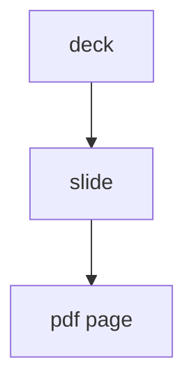

---
chan:
  kind: slides
  slides:
    aspect_ratio: "4:3"
---

# Classic deck

Slide one carries text and an image.

# Diagram slide

```mermaid
flowchart TD
  A[deck] --> B[slide]
  B --> C[pdf page]
```

# Excalidraw slide

