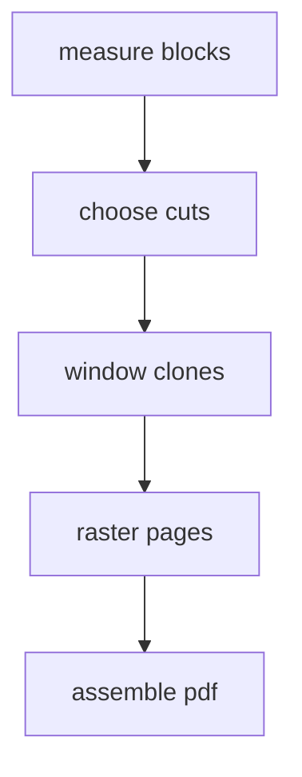

# Long pagination corpus

This document is deliberately long and non-repeating: every sentence has a unique marker, so any ink that appears on two pages is an engine bug, not repeated copy. It mixes prose, lists, tables, quotes, tall code blocks, a diagram, and an image across many page boundaries.

## Section 1: boundary stress one

Marker 001: the inliner shifts the block rectangles under the fixed content width (37 units). Marker 002: the composer bounds the content stream before the next page begins (74 units). Marker 003: the composer walks the page background before the next page begins (111 units).

Marker 004: the auditor shifts the page background inside the clipped clone (148 units). Marker 005: the composer walks the content stream before the next page begins (185 units).

### Bullet cascade

- Marker 006: the auditor bounds the content stream under the fixed content width (222 units).
- Marker 007: the composer bounds the page background inside the clipped clone (259 units).
- Marker 008: the composer shifts the page background inside the clipped clone (296 units).
- Marker 009: the paginator walks the page background under the fixed content width (333 units).
- Marker 010: the paginator clamps the page background inside the clipped clone (370 units).
- Marker 011: the paginator shifts the block rectangles under the fixed content width (407 units).
- Marker 012: the auditor shifts the block rectangles inside the clipped clone (444 units).
- Marker 013: the composer walks the block rectangles before the next page begins (481 units).
- Marker 014: the paginator walks the page background under the fixed content width (518 units).
- Marker 015: the composer bounds the content stream before the next page begins (555 units).
- Marker 016: the composer bounds the block rectangles before the next page begins (592 units).
- Marker 017: the paginator bounds the content stream under the fixed content width (629 units).
- Marker 018: the paginator walks the content stream inside the clipped clone (666 units).
- Marker 019: the auditor shifts the block rectangles before the next page begins (703 units).
- Marker 020: the paginator shifts the content stream before the next page begins (740 units).
- Marker 021: the composer bounds the page background inside the clipped clone (777 units).
- Marker 022: the composer shifts the block rectangles inside the clipped clone (814 units).
- Marker 023: the paginator walks the content stream inside the clipped clone (851 units).

Marker 024: the paginator walks the page background inside the clipped clone (888 units). Marker 025: the auditor walks the block rectangles inside the clipped clone (925 units). Marker 026: the composer walks the content stream inside the clipped clone (962 units). Marker 027: the composer shifts the content stream under the fixed content width (999 units).

Marker 028: the paginator walks the content stream under the fixed content width (1036 units). Marker 029: the auditor walks the page background before the next page begins (1073 units).

## Section 2: boundary stress two

Marker 030: the paginator bounds the content stream before the next page begins (1110 units). Marker 031: the paginator walks the block rectangles under the fixed content width (1147 units). Marker 032: the paginator shifts the block rectangles under the fixed content width (1184 units).

Marker 033: the composer bounds the page background before the next page begins (1221 units). Marker 034: the auditor walks the block rectangles under the fixed content width (1258 units).

```text
line 01 | Marker 035: the auditor shifts the content stream inside the clipped clone (1295 units).
line 02 | Marker 036: the paginator bounds the content stream under the fixed content width (1332 units).
line 03 | Marker 037: the paginator walks the page background inside the clipped clone (1369 units).
line 04 | Marker 038: the composer shifts the content stream inside the clipped clone (1406 units).
line 05 | Marker 039: the auditor walks the page background before the next page begins (1443 units).
line 06 | Marker 040: the auditor bounds the page background before the next page begins (1480 units).
line 07 | Marker 041: the auditor shifts the block rectangles before the next page begins (1517 units).
line 08 | Marker 042: the auditor shifts the page background inside the clipped clone (1554 units).
line 09 | Marker 043: the auditor walks the content stream before the next page begins (1591 units).
line 10 | Marker 044: the auditor bounds the page background under the fixed content width (1628 units).
line 11 | Marker 045: the paginator shifts the block rectangles before the next page begins (1665 units).
line 12 | Marker 046: the auditor bounds the block rectangles under the fixed content width (1702 units).
line 13 | Marker 047: the composer bounds the content stream before the next page begins (1739 units).
line 14 | Marker 048: the paginator bounds the content stream before the next page begins (1776 units).
line 15 | Marker 049: the composer bounds the content stream inside the clipped clone (1813 units).
line 16 | Marker 050: the composer shifts the page background under the fixed content width (1850 units).
line 17 | Marker 051: the paginator shifts the block rectangles before the next page begins (1887 units).
line 18 | Marker 052: the auditor bounds the block rectangles inside the clipped clone (1924 units).
line 19 | Marker 053: the paginator walks the block rectangles under the fixed content width (1961 units).
line 20 | Marker 054: the auditor walks the page background under the fixed content width (1998 units).
line 21 | Marker 055: the composer walks the block rectangles before the next page begins (2035 units).
line 22 | Marker 056: the clipper shifts the page background inside the clipped clone (2072 units).
line 23 | Marker 057: the composer walks the block rectangles before the next page begins (2109 units).
line 24 | Marker 058: the auditor bounds the block rectangles before the next page begins (2146 units).
line 25 | Marker 059: the paginator shifts the content stream under the fixed content width (2183 units).
line 26 | Marker 060: the composer shifts the block rectangles inside the clipped clone (2220 units).
line 27 | Marker 061: the auditor walks the block rectangles inside the clipped clone (2257 units).
line 28 | Marker 062: the auditor bounds the page background under the fixed content width (2294 units).
line 29 | Marker 063: the paginator bounds the content stream inside the clipped clone (2331 units).
line 30 | Marker 064: the auditor bounds the content stream under the fixed content width (2368 units).
line 31 | Marker 065: the auditor bounds the block rectangles under the fixed content width (2405 units).
line 32 | Marker 066: the paginator walks the block rectangles under the fixed content width (2442 units).
line 33 | Marker 067: the paginator shifts the content stream inside the clipped clone (2479 units).
line 34 | Marker 068: the auditor walks the page background under the fixed content width (2516 units).
line 35 | Marker 069: the paginator walks the content stream under the fixed content width (2553 units).
line 36 | Marker 070: the auditor walks the block rectangles inside the clipped clone (2590 units).
line 37 | Marker 071: the composer shifts the block rectangles under the fixed content width (2627 units).
line 38 | Marker 072: the paginator shifts the page background before the next page begins (2664 units).
line 39 | Marker 073: the auditor bounds the content stream before the next page begins (2701 units).
line 40 | Marker 074: the auditor walks the content stream inside the clipped clone (2738 units).
line 41 | Marker 075: the paginator walks the block rectangles inside the clipped clone (2775 units).
line 42 | Marker 076: the auditor walks the block rectangles before the next page begins (2812 units).
line 43 | Marker 077: the paginator shifts the page background under the fixed content width (2849 units).
line 44 | Marker 078: the paginator bounds the page background under the fixed content width (2886 units).
line 45 | Marker 079: the paginator shifts the page background before the next page begins (2923 units).
line 46 | Marker 080: the composer shifts the block rectangles inside the clipped clone (2960 units).
line 47 | Marker 081: the composer shifts the block rectangles before the next page begins (2997 units).
line 48 | Marker 082: the paginator shifts the block rectangles under the fixed content width (3034 units).
line 49 | Marker 083: the composer shifts the content stream inside the clipped clone (3071 units).
line 50 | Marker 084: the auditor shifts the content stream inside the clipped clone (3108 units).
line 51 | Marker 085: the auditor shifts the page background under the fixed content width (3145 units).
line 52 | Marker 086: the paginator shifts the block rectangles before the next page begins (3182 units).
line 53 | Marker 087: the paginator bounds the page background under the fixed content width (3219 units).
line 54 | Marker 088: the paginator shifts the block rectangles before the next page begins (3256 units).
line 55 | Marker 089: the composer shifts the content stream before the next page begins (3293 units).
```

Marker 090: the composer walks the page background before the next page begins (3330 units). Marker 091: the paginator bounds the page background under the fixed content width (3367 units). Marker 092: the auditor walks the page background inside the clipped clone (3404 units). Marker 093: the composer shifts the block rectangles under the fixed content width (3441 units).

Marker 094: the paginator walks the content stream inside the clipped clone (3478 units). Marker 095: the composer walks the block rectangles inside the clipped clone (3515 units).

## Section 3: boundary stress three

Marker 096: the paginator walks the block rectangles before the next page begins (3552 units). Marker 097: the auditor bounds the content stream under the fixed content width (3589 units). Marker 098: the auditor shifts the page background inside the clipped clone (3626 units).

Marker 099: the auditor bounds the block rectangles inside the clipped clone (3663 units). Marker 100: the composer shifts the page background under the fixed content width (3700 units).

> Marker 101: the composer shifts the page background before the next page begins (3737 units). Marker 102: the composer walks the content stream inside the clipped clone (3774 units).

| Step | Marker | Note |
| --- | --- | --- |
| 1 | M900 | Marker 103: the auditor walks the block rectangles before the next page begins (3811 units). |
| 2 | M901 | Marker 104: the composer walks the content stream inside the clipped clone (3848 units). |
| 3 | M902 | Marker 105: the composer walks the page background before the next page begins (3885 units). |
| 4 | M903 | Marker 106: the composer shifts the page background under the fixed content width (3922 units). |
| 5 | M904 | Marker 107: the paginator bounds the content stream under the fixed content width (3959 units). |
| 6 | M905 | Marker 108: the composer shifts the block rectangles before the next page begins (3996 units). |
| 7 | M906 | Marker 109: the paginator walks the block rectangles inside the clipped clone (4033 units). |
| 8 | M907 | Marker 110: the paginator bounds the page background before the next page begins (4070 units). |
| 9 | M908 | Marker 111: the auditor bounds the page background inside the clipped clone (4107 units). |
| 10 | M909 | Marker 112: the auditor walks the content stream inside the clipped clone (4144 units). |
| 11 | M910 | Marker 113: the paginator bounds the block rectangles before the next page begins (4181 units). |
| 12 | M911 | Marker 114: the paginator walks the block rectangles under the fixed content width (4218 units). |

Marker 115: the auditor bounds the block rectangles under the fixed content width (4255 units). Marker 116: the paginator walks the page background inside the clipped clone (4292 units). Marker 117: the paginator walks the content stream before the next page begins (4329 units). Marker 118: the composer shifts the content stream under the fixed content width (4366 units).

Marker 119: the auditor bounds the block rectangles before the next page begins (4403 units). Marker 120: the auditor walks the content stream at exactly one page each (4440 units).

## Section 4: boundary stress four

Marker 121: the composer shifts the page background inside the clipped clone (4477 units). Marker 122: the composer bounds the content stream before the next page begins (4514 units). Marker 123: the composer walks the block rectangles before the next page begins (4551 units).

Marker 124: the paginator walks the block rectangles before the next page begins (4588 units). Marker 125: the paginator bounds the page background before the next page begins (4625 units).



Marker 126: the composer walks the page background under the fixed content width (4662 units). Marker 127: the paginator walks the content stream inside the clipped clone (4699 units). Marker 128: the composer bounds the content stream before the next page begins (4736 units).

Marker 129: the paginator bounds the content stream under the fixed content width (4773 units). Marker 130: the auditor shifts the content stream under the fixed content width (4810 units). Marker 131: the composer shifts the page background under the fixed content width (4847 units). Marker 132: the auditor bounds the page background inside the clipped clone (4884 units).

Marker 133: the paginator walks the content stream under the fixed content width (4921 units). Marker 134: the composer bounds the page background before the next page begins (4958 units).

## Section 5: boundary stress five

Marker 135: the composer walks the content stream under the fixed content width (4995 units). Marker 136: the paginator shifts the content stream under the fixed content width (5032 units). Marker 137: the auditor shifts the content stream before the next page begins (5069 units).

Marker 138: the composer shifts the content stream under the fixed content width (5106 units). Marker 139: the auditor bounds the block rectangles inside the clipped clone (5143 units).


Marker 140: the composer shifts the content stream under the fixed content width (5180 units). Marker 141: the composer walks the page background before the next page begins (5217 units).

@pagebreak

### After the forced break

Marker 142: the auditor walks the content stream inside the clipped clone (5254 units). Marker 143: the composer walks the page background before the next page begins (5291 units). Marker 144: the composer shifts the page background inside the clipped clone (5328 units).

Marker 145: the auditor walks the content stream before the next page begins (5365 units). Marker 146: the composer bounds the content stream under the fixed content width (5402 units). Marker 147: the composer shifts the page background inside the clipped clone (5439 units). Marker 148: the composer shifts the page background before the next page begins (5476 units).

Marker 149: the paginator shifts the page background inside the clipped clone (5513 units). Marker 150: the composer shifts the block rectangles under the fixed content width (5550 units).

## Section 6: boundary stress six

Marker 151: the paginator shifts the block rectangles inside the clipped clone (5587 units). Marker 152: the auditor bounds the content stream inside the clipped clone (5624 units). Marker 153: the paginator shifts the content stream under the fixed content width (5661 units).

Marker 154: the paginator shifts the content stream before the next page begins (5698 units). Marker 155: the paginator shifts the content stream before the next page begins (5735 units).

```text
tail 01 | Marker 156: the paginator shifts the page background before the next page begins (5772 units).
tail 02 | Marker 157: the composer shifts the block rectangles inside the clipped clone (5809 units).
tail 03 | Marker 158: the composer bounds the page background before the next page begins (5846 units).
tail 04 | Marker 159: the paginator bounds the page background under the fixed content width (5883 units).
tail 05 | Marker 160: the paginator walks the page background inside the clipped clone (5920 units).
tail 06 | Marker 161: the auditor bounds the content stream before the next page begins (5957 units).
tail 07 | Marker 162: the auditor bounds the page background inside the clipped clone (5994 units).
tail 08 | Marker 163: the composer walks the block rectangles under the fixed content width (6031 units).
tail 09 | Marker 164: the paginator shifts the block rectangles before the next page begins (6068 units).
tail 10 | Marker 165: the paginator shifts the content stream inside the clipped clone (6105 units).
tail 11 | Marker 166: the paginator walks the block rectangles before the next page begins (6142 units).
tail 12 | Marker 167: the paginator bounds the block rectangles under the fixed content width (6179 units).
tail 13 | Marker 168: the paginator shifts the content stream inside the clipped clone (6216 units).
tail 14 | Marker 169: the composer shifts the content stream under the fixed content width (6253 units).
tail 15 | Marker 170: the composer walks the content stream inside the clipped clone (6290 units).
tail 16 | Marker 171: the auditor bounds the content stream under the fixed content width (6327 units).
tail 17 | Marker 172: the composer bounds the block rectangles inside the clipped clone (6364 units).
tail 18 | Marker 173: the composer walks the content stream before the next page begins (6401 units).
tail 19 | Marker 174: the paginator walks the block rectangles before the next page begins (6438 units).
tail 20 | Marker 175: the auditor walks the block rectangles under the fixed content width (6475 units).
tail 21 | Marker 176: the composer shifts the page background under the fixed content width (6512 units).
tail 22 | Marker 177: the auditor shifts the block rectangles before the next page begins (6549 units).
tail 23 | Marker 178: the composer walks the content stream under the fixed content width (6586 units).
tail 24 | Marker 179: the auditor shifts the content stream before the next page begins (6623 units).
tail 25 | Marker 180: the composer shifts the block rectangles before the next page begins (6660 units).
tail 26 | Marker 181: the composer shifts the page background inside the clipped clone (6697 units).
tail 27 | Marker 182: the composer shifts the content stream inside the clipped clone (6734 units).
tail 28 | Marker 183: the auditor walks the page background before the next page begins (6771 units).
tail 29 | Marker 184: the paginator splits the page background inside the clipped clone (6808 units).
tail 30 | Marker 185: the auditor walks the content stream inside the clipped clone (6845 units).
tail 31 | Marker 186: the auditor walks the content stream inside the clipped clone (6882 units).
tail 32 | Marker 187: the composer shifts the content stream under the fixed content width (6919 units).
tail 33 | Marker 188: the auditor bounds the block rectangles inside the clipped clone (6956 units).
tail 34 | Marker 189: the auditor walks the page background before the next page begins (6993 units).
tail 35 | Marker 190: the composer shifts the content stream inside the clipped clone (7030 units).
tail 36 | Marker 191: the auditor shifts the page background inside the clipped clone (7067 units).
tail 37 | Marker 192: the composer shifts the content stream inside the clipped clone (7104 units).
tail 38 | Marker 193: the composer shifts the page background under the fixed content width (7141 units).
tail 39 | Marker 194: the auditor walks the block rectangles inside the clipped clone (7178 units).
tail 40 | Marker 195: the paginator walks the block rectangles inside the clipped clone (7215 units).
tail 41 | Marker 196: the paginator bounds the block rectangles before the next page begins (7252 units).
tail 42 | Marker 197: the auditor walks the block rectangles inside the clipped clone (7289 units).
tail 43 | Marker 198: the paginator shifts the content stream under the fixed content width (7326 units).
tail 44 | Marker 199: the paginator bounds the page background inside the clipped clone (7363 units).
tail 45 | Marker 200: the composer walks the page background inside the clipped clone (7400 units).
tail 46 | Marker 201: the auditor shifts the block rectangles before the next page begins (7437 units).
tail 47 | Marker 202: the composer shifts the block rectangles under the fixed content width (7474 units).
tail 48 | Marker 203: the paginator shifts the content stream inside the clipped clone (7511 units).
```

Marker 204: the composer walks the block rectangles under the fixed content width (7548 units). Marker 205: the auditor shifts the block rectangles before the next page begins (7585 units).

Marker 206: the composer bounds the content stream before the next page begins (7622 units). Marker 207: the paginator bounds the block rectangles inside the clipped clone (7659 units). Marker 208: the auditor walks the block rectangles under the fixed content width (7696 units). Marker 209: the auditor shifts the page background inside the clipped clone (7733 units).

Marker 210: the auditor bounds the page background before the next page begins (7770 units). Marker 211: the paginator shifts the block rectangles before the next page begins (7807 units).

## Closing section

Marker 212: the auditor shifts the content stream inside the clipped clone (7844 units). Marker 213: the paginator shifts the content stream before the next page begins (7881 units). Marker 214: the paginator bounds the content stream under the fixed content width (7918 units).
