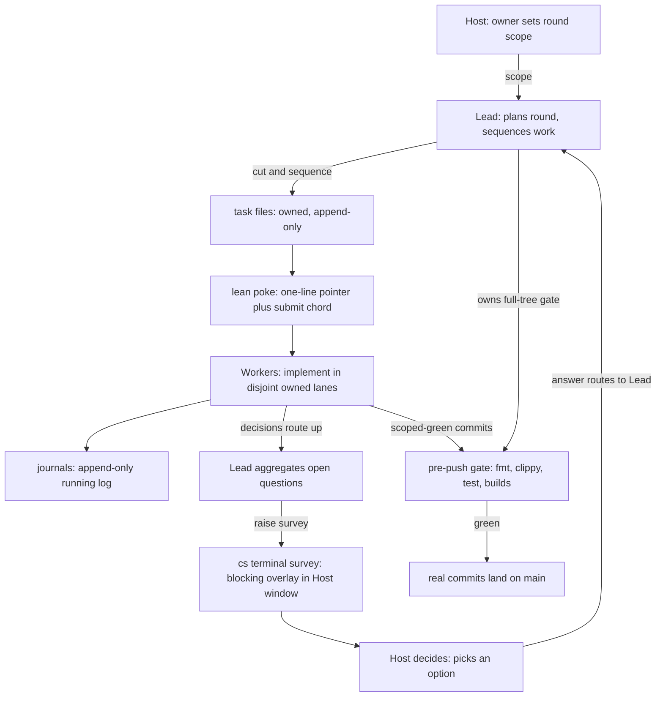

# How chan is developed

This is the front door to how chan is built: the development process, who does what, and how a problem becomes a shipped release. If you landed here from a PR or are just browsing, it explains the multi-agent pattern behind the consolidated reports in [`release/`](release/README.md) and the active scope in [`roadmap/`](roadmap/README.md). It is not a user-facing document, and it is not the contributing guide (see [`../CONTRIBUTING.md`](../CONTRIBUTING.md)) or the code of conduct (see [`../CODE_OF_CONDUCT.md`](../CODE_OF_CONDUCT.md)).

## TL;DR

chan is built by small teams of AI coding assistants coordinated by the project owner, using chan's own Team Work tooling: each assistant runs in an embedded terminal tab, and the team coordinates through task files, append-only journals, and one-line pokes on disk. The owner sets scope, reviews, and is the source of strategic decisions. The work lands as real commits on `main`, behind the same gate a human contributor runs.

This is unusual enough that it can look confusing without context. Hence this doc.

## Roles

A team has three role types:

* **Host**: the project owner. Sets scope, answers decision surveys, tests releases, and is the only one who acts outside the team.
* **Lead**: plans the round, cuts tasks, sequences the work, runs the integration gate, and aggregates the workers' questions into focused surveys for the host.
* **Workers**: each owns a code surface (for example the core workspace, the desktop shell, or the gateway). They pick up task files from the lead, implement, and report back the same way.

Teams are provisioned by the `cs terminal team` tooling: a config declares the members, and a generated `bootstrap.md` carries the process so every member starts from the same page. Members are identified by `@@`-prefixed tab handles; the handles are per-team and carry no meaning outside it.

## The development lifecycle

Work moves from a single concrete problem to a shipped release along one path. The roadmap tree ([`roadmap/README.md`](roadmap/README.md)) holds accepted scope; the release tree ([`release/README.md`](release/README.md)) holds the history; the executable release procedure lives in the release skill ([`../.agents/skills/release/SKILL.md`](../.agents/skills/release/SKILL.md)). This guide does not restate the skill's command-level release steps, which change; it points at them.

1. **Investigate and accept scope.** Start from one concrete problem and investigate it against the live tree, usually with one agent, until the result is either an analysis or an implementation-ready proposal (simple problems combine both). An accepted proposal becomes `roadmap/vX.Y.Z/{item}.md`. Moving a raw draft does not, by itself, make it accepted scope.
2. **Prepare the delivery team.** Once a version has enough coherent scope, one lead uses `cs terminal team` to provision file-disjoint lanes and rounds: a team config, a branch and worktree map, lane ownership, a dependency graph, and a validation matrix. Each lane gets only the access it needs (headless browsers, macOS or Windows hosts, Lima or WSL Linux guests, sdme distro containers, the root and gateway Cargo workspaces, desktop packaging, COPR, Launchpad, local gateway services). Secret values never enter roadmap, task, journal, or release files.
3. **Implement and validate in lanes.** Each lane owns a disjoint surface and reports a scoped-green commit. The lead resolves overlap before intake and gates the committed state from an isolated gate worktree. An existing implementation branch is a valid intake candidate; it receives the same review, tests, and smoke requirements as newly written work, not a reimplementation.
4. **Open and iterate the RC.** The release owner opens the candidate by bumping every version pin in one commit and pushing a tag-free RC branch, then dispatches a `publish=false` dry-run build and validates its artifacts. Accepted candidates rebase onto that branch and merge provisionally. Fixes cut a new candidate and repeat the dry run. The release skill owns the exact pins, dispatch, and invariants.
5. **Close roadmap and release in the GA commit.** The single GA commit adds the release report and its index entry, resolves every item under `roadmap/vX.Y.Z/` (each completed or withdrawn item moves to `roadmap/done/` with an honest status line linking back to the report), carries the CHANGELOG and every version pin, and is the commit that receives the `vX.Y.Z` tag. After it, no `roadmap/vX.Y.Z/` directory remains.

One landing barrier governs the whole scheme: a process or contract change that reshapes these paths must reach `main` before the technical work that depends on it, and parallel branches rebase onto it before intake.

## How a round works

Within a round, work runs on a small set of on-disk artifacts in the team's working directory:

1. **A scope** - the owner's high-level ask for the round.
2. **Task files** (`tasks/task-{from}-{to}-{n}.md`) - what each member is asked to do. Owned by the recipient, append-only; once work starts, new asks become new tasks, not amendments.
3. **Journals** (`journals/journal-{member}.md`) - each member's append-only running log.
4. **Pokes** - one-line pointers typed into the recipient's terminal ("read this task file"). Context lives in the files, not the poke.
5. **Surveys** - when a decision needs the owner, the lead raises a blocking survey in the owner's window (`cs terminal survey`); the answer routes back to the lead.

The round at a glance: the owner's scope flows down through the lead into owned task lanes, decisions route back up as surveys, and only gate-green work lands on `main`.

## Why this pattern

* **Append-only journals**: nothing gets rewritten under another member. If a decision changes, a new dated section appends; the prior section stays as the audit trail.
* **Lane boundaries**: members own disjoint file surfaces. Cross-lane work routes through the lead, so two members never edit the same file in parallel without coordination.
* **The owner decides**: scope calls and trade-offs route to the host as focused surveys with concrete options; workers don't improvise project decisions.
* **Real commits, real CI**: every member's work lands in `main` with normal commit hygiene, behind the same pre-push gate a human contributor runs.

The operational lessons behind these rules, each cited to the release that taught it, are in [`../.agents/playbook.md`](../.agents/playbook.md).

## External contributors

You do not need to join the agent team. Contributions follow the standard GitHub branch and PR flow documented in [`../CONTRIBUTING.md`](../CONTRIBUTING.md), and PRs are reviewed the same way regardless of whether they come from a human or an agent. If your change is substantial, the same shape helps it land: an investigation or proposal that states the problem and desired contract, validation evidence for the surfaces you touched, and a candidate report map cleanly onto the roadmap and RC intake described above. The multi-agent pattern is an internal coordination protocol, not a project requirement.

## What you'll see in the repo

* [`roadmap/`](roadmap/README.md) - active development scope by target version, plus a flat `done/` archive of closed items.
* [`release/`](release/README.md) - one consolidated report per release era: its roadmap, rounds, and retrospective. The front door to the project history.
* `../.agents/` - the operational playbook the assistants work from: coordination, gating, verification, commit discipline, and the executable release skill.
* While a round is active, its working directory (config, bootstrap, tasks, journals) is the live coordination bus; it is distilled into the release report at close.
