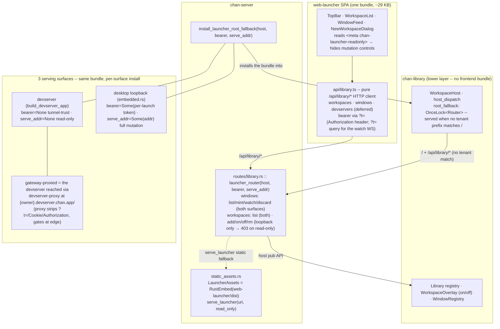
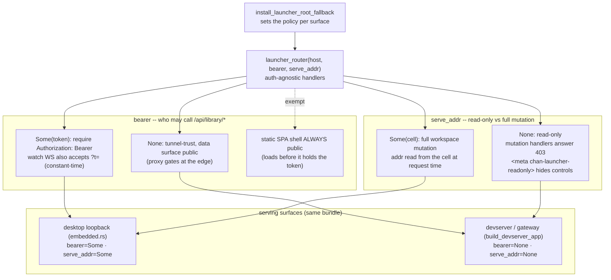

# web-launcher: the launcher SPA and its three-surface serving

How the launcher is built and reached. The [`README`](README.md) covers the
stack and the dev loop; this file is the design of record for *where* the
launcher is served and *how* its `/api/library/*` surface is authorized. Ground
every change here against `src/api/library.ts` (the wire),
`crates/chan-server/src/routes/library.rs` (the bundle + handlers),
`crates/chan-server/src/static_assets.rs` (`LauncherAssets`/`serve_launcher`),
and `crates/chan-library/src/host.rs` (the `WorkspaceHost` root-fallback hook).

## Diagram

## What the launcher is

The launcher is a pure `/api/library/*` HTTP client (`src/api/library.ts`): it
never opens native windows, never dials a devserver, and never parses an opaque
window or workspace id. Every type mirrors a struct the library serializes -- the
field names *are* the wire, pinned by server byte-tests. It is served at the
devserver/library root `/`, and because `vite.config.ts` sets `base: "./"` its
relative assets resolve under any mount. It renders three registries: workspaces,
windows, and devservers (deferred -- see below).

## The `/api/library/*` surface

- **workspaces** -- `GET` list (`{workspace_id, path, label, on}`, where
  `workspace_id` is the route prefix without its leading slash: a single legible
  segment the client treats as opaque), `POST {path}` add,
  `POST /{id}/{on|off}` toggle, `DELETE /{id}` remove.
- **windows** -- `GET` list, `POST {kind, workspace_path?}` mint,
  `GET …/windows/watch` (a WebSocket that pushes the full window set on every
  change), `DELETE /{id}` discard.
- **devservers** -- CRUD, deferred. The registry is desktop-side config; a
  devserver-served launcher correctly shows an empty list.

The SPA reads its bearer from `?t=` in its own URL and presents it as
`Authorization: Bearer` on fetch and as `?t=` on the watch WebSocket (a browser
WebSocket cannot set headers).

## Three-surface serving via the `WorkspaceHost` root fallback

`host_dispatch` matches only workspace-tenant prefixes, so the root `/` returned
404. `WorkspaceHost` carries an install-once `root_fallback: OnceLock<Router>`
that `host_dispatch` serves when no tenant prefix matches a request. chan-library
defines the slot; chan-server fills it with the launcher bundle (`serve_launcher`
plus the `/api/library/*` routes) through `install_launcher_root_fallback`. The
direction matters: chan-server depends on chan-library, so the launcher bundle --
a frontend artifact -- lives in chan-server and is injected down into the host,
never the reverse. The same bundle is installed on each surface:

1. **devserver** (`build_devserver_app`) -- served over the tunnel to the gateway
   proxy and on the box's `127.0.0.1` bind;
2. **desktop loopback** (`desktop/src-tauri/src/embedded.rs`, `host.router()`);
3. **gateway-proxied** -- the devserver reached through `devserver-proxy` at
   `{owner}.devserver.chan.app/`.

## Per-surface auth and the read-only / mutation split

*The two policy knobs the installer sets per surface: `bearer` (who may call
`/api/library/*`) and `serve_addr` (read-only vs full mutation).*

`launcher_router(host, bearer, serve_addr)` is auth-agnostic in its handlers; the
installer sets the policy per surface:

- **`bearer`** gates `/api/library/*`. `Some(token)` requires
  `Authorization: Bearer` (the watch WebSocket also accepts `?t=`), constant-time
  compared; `None` is tunnel-trust. The static SPA shell is always public so it
  loads before it holds the token.
- **`serve_addr`** (`Option<Arc<OnceLock<SocketAddr>>>`) is both the
  read-only/full discriminator and the mount enabler. `Some(cell)` is the
  loopback: workspace mutation is served, and the mount path reads the listen
  address from the cell, which the embedder fills *after* it binds, so it is read
  at request time rather than install time. `None` is the tunnel-trust surface:
  workspaces are read-only -- the mutation handlers answer `403`, and the shell is
  served with `<meta name="chan-launcher-readonly">` so the SPA hides those
  controls (the New-workspace button, the row checkboxes and bulk bar, and the
  on/off toggle, which becomes a static state badge) and shows a
  "manage from the desktop app or the CLI" hint instead of buttons that fail.

Mutation is loopback-only because on the gateway surface the proxy strips every
client credential (`?t=`, `Cookie`, `Authorization`) and is the sole gate, so
`bearer=None` cannot distinguish a grantee from the owner -- a collaborator
holding a `devserver_gate` cookie must not unmount or remove the owner's
workspaces. Window mint/discard stay on both surfaces (per-view state,
low-risk). Owners manage a headless devserver's workspaces over the bearer-gated
`/api/devserver/*` management API and `cs`/CLI.

Off is a plain unmount: the launcher's `setWorkspaceOn` sends no `force`, so the
devserver's confirm-before-off (a `409` carrying the live-terminal count) stays a
`/api/devserver/*` and UI concern rather than a wire status on this surface.

## Build-wiring

`LauncherAssets` is a `RustEmbed` over `web-launcher/dist/`, mirroring `WebAssets`
for `web/dist`. `web-launcher/dist` is a gitignored build artifact, so
`crates/chan-server/build.rs` `create_dir_all`s it and emits `rerun-if-changed`
(a fresh checkout or isolated gate worktree compiles, and a rebuilt launcher
relinks). A `make web-launcher` target (`npm install`, build, stamp) is a
prerequisite of `web` and `web-check`, so every consumer that funnels through the
root `make web` -- the `chan` CLI, `desktop/Makefile`, `packaging/linux`, and
`release.yml` -- builds the launcher with no per-consumer edit.

## Deferred

- **Devservers CRUD bridge** (`/api/library/devservers*`). The devserver registry
  is desktop-side config, so the mutating surface pairs with the desktop bridge;
  a devserver-served launcher shows an empty devservers list until then.
- **Proxy-injected signed role header.** The path to owner-only mutation over the
  gateway (and to gating the devserver's `127.0.0.1` bind) is a signed
  caller/role header the proxy injects after its gate, which the devserver
  validates -- a new gateway↔devserver shared secret, not yet built.
