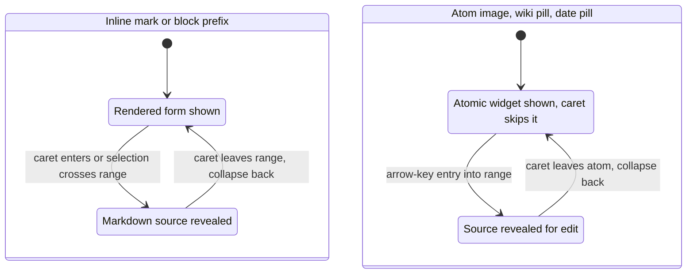

# Editor UX

How the WYSIWYG editor in `web/` is meant to behave. This document is the source of truth for the live-preview interaction model. Match it when reading or changing the editor; flag deviations explicitly.

## Core principle

The editor is **live-preview**: any line or inline element shows its rendered form when the cursor is elsewhere, and reveals its markdown source when the cursor enters it. Moving the cursor away hides the source again. This is the default surface for renderable files.

This mirrors Obsidian's Live Preview model. The user types markdown freely; the editor renders it on the fly and re-shows the markers as soon as the user needs to edit them.

*The reveal cycle: marks render when the caret is away and reveal their source when it enters; atoms render as a widget the caret skips and reveal source on arrow-key entry -- both collapse back on exit.*

A whole-document **Source view** is also available -- the "Show Source Code" toggle (Cmd/Ctrl+E, or the tab's right-click menu) flips to the raw text in a plain CodeMirror editor. The toggle is gated to files that have a rendered surface: markdown ↔ `wysiwyg`, JSON ↔ `pretty`, CSV/TSV ↔ `table`. A plain source file (`.rs`, `.py`, `.toml`, `Makefile`) has only the source view, so the toggle is a no-op there -- it never forces an invalid markdown render on non-markdown text.

## Per-element behavior

### Headings

- WYSIWYG: large/bolded heading line, fold chevron on the left.
- Cursor on the line: `#`, `##`, ... prefix appears in a muted color at the start of the line. Chevron stays.
- Cursor leaves: prefix hides again.
- Typing/erasing `#` characters works as plain text edit; the heading level follows the marker count.

### Wiki links `[[...]]`

- WYSIWYG: rendered as a styled pill with the target's display label.
- Cursor enters: `[[` and `]]` brackets become visible around the label; the label inside stays editable.
- Typing inside the brackets reopens the SAME search popup that opens when the user originally types `[[` in a paragraph. Result list, preview, and `Type # / Type ^ / Type |` hint row are identical.
- If the user breaks a marker (e.g. deletes one `]`), the editor serializes the literal text and renders it broken. No auto-repair.

### Tags `#tag`

- Same flow as wiki links: typing `#` opens a search popup over the workspace's existing tags, ranked by frequency (top tags surface first).
- WYSIWYG: rendered as a styled pill.
- Cursor on the pill: reveals the `#` and lets the label edit.
- Click on a `#tag` pill: opens the graph view filtered to that tag.

### Mentions `@contact`

- Same flow as wiki links and tags: typing `@` opens a search over the contacts API.
- WYSIWYG: rendered as a styled pill.
- Cursor on the pill: reveals `@` and lets the label edit.
- Click on an `@mention` pill: opens the graph view focused on the contact (mirrors `#tag` click behavior).

### Images ``

- Typing `` at the caret.
- WYSIWYG rendering, when an image shares the line with text (e.g. `foo  bar`): image bottom-aligned with the text baseline, so the text sits on the image's bottom edge.
- Optional width is encoded in the URL fragment: `#w=N` (pixels). Other renderers ignore the fragment.

### Image interactions

- Click on an image: shows two action buttons floating on the rendered image: "zoom" and "edit".
- Cursor navigation (arrow keys) onto an image: jumps directly to the "edit" state, not "zoom". The image is treated as a single cursor position; arrowing past it deselects.
- "Edit": reveals the image's markdown inline (``), places the caret at the start of the markdown, and selects the block. Moving the caret deselects. The markdown stays revealed while the caret is inside it; leaving collapses back to the image.
- Editing the `alt` text is plain text editing.
- Editing the `src` opens a search dropdown anchored to the markdown with image-result previews (same shape as the insert flow). When the path doesn't resolve, render an inline error row under the markdown: `"<path>" could not be found.`

### Date macros `@today`, `@date`

- Typed verbatim as reserved macro words. Committing the trigger (press **Space** or **Enter**) rewrites it as a date string in the user's default format (`workspace.info.preferences.date_format`, falling back to ISO); the committing space / newline is consumed, not inserted (so the flow is "type `@today`, hit Space, see the date, keep typing"). The freshly-written date is then auto-detected by the date matcher and rendered as a date **pill** (clicking the pill opens the calendar / format popover).
  - `@today`: bakes today's date and moves on -- no popover.
  - `@date`: same insertion, then opens the calendar / format popover anchored at the date so the user can navigate to a different day or switch format without selecting one first.
- `today` / `date` are also reserved by the contact-bubble trigger detection, so typing `@today` / `@date` does not steal Enter for an `@`-mention commit.
- Dates are an editor-only convenience: they insert a plain date string, never a special marker. They are never indexed -- no graph edges, no FTS column, no per-date search. (See the chan-workspace task at the bottom.)

### Page-break macros `@pagebreak`, `@break`

- Typed as reserved macro words like the date macros. Committing the trigger rewrites it into a page-break atom -- an `
` line -- rendered as an atomic page break (caret motion skips it in one keystroke). The macro words `@pagebreak`, `@break` (alongside `@today`, `@date`) suppress the contact bubble so the `@` does not open an `@`-mention search.

### Lists `- item`, `1. item`, `- [ ] task`

- WYSIWYG: source markers (`-`, `*`, `+`, `1.`, `1)`) stay visible on every list line. Task items render the GFM checkbox via the `Task` widget; the `[ ]` / `[x]` source is replaced by a clickable box and reappears when the caret enters the line.
- Enter at end of a list line: inserts a fresh marker on the next line. Bullets reuse the line's marker char; ordered lists increment the number and keep the original `.` / `)` separator; task items always start as `- [ ] ` regardless of the source line's checked state.
- Enter on an empty list item (just the prefix, no content): strips the prefix entirely. This is how the user exits the list.
- Enter mid-line on a non-empty item: falls through to a literal newline. Auto-continuing mid-sentence would split a paragraph with a stray bullet.
- Tab on a list line: nests the item one level, landing exactly on the content column of the nearest list line above at the same or shallower indent (its previous sibling). Fixed-width steps are wrong here: an ordered item indented into the gap between the sibling band and the sibling's content column parses as lazy paragraph continuation and loses its list rendering. Multi-line selections shift every list line in range by the anchor line's delta (subtree shape preserved); non-list lines in the range stay untouched. On a list line the key is always consumed, even as a no-op (first item of a level has nothing to nest under).
- Shift-Tab: outdents one level, back to the own indent of the nearest shallower list line above (the parent), or to column 0 with no parent; no-op at the top level (never strips the marker).

### Inline formatting `**bold**`, `*italic*`, `~~strike~~`

- WYSIWYG: rendered with the appropriate style.
- Cursor enters the span: the `**` / `*` / `~~` markers become visible around the styled text. Markers stay until the cursor leaves.
- Cmd/Ctrl + B, I work as today. **No underline.**

## Cross-cutting rules

- **One bubble pattern.** Wiki, tag, mention, and image bubbles share the same keyboard model (Arrow Up/Down to navigate, Enter to commit, Esc to dismiss, click to commit). Each bubble owns its own results / preview content, but the interaction is uniform. Anchored under the caret; flips above when out of room.
- **Broken markdown is preserved.** If the user deletes part of a marker, the source keeps what the user typed; the renderer just fails to recognize the construct and shows the text plainly. Never auto-repair.
- **Last-line `---`.** When the file's last line is `---`, the user must still be able to land the caret on it (revealing `---` per the principle) and press Enter to create a new line below. The current renderer traps the caret above; this needs to be fixed.

## Out of scope (intentional)

- No underline.
- No date indexing, date search, or date graph edges. Dates are an editor convenience for typing absolute dates fast.

## Companion task: chan-workspace date tokens

There is residual date-extraction code in chan-workspace that can be removed now that dates are an editor-only convenience (see above). Referenced by symbol (line numbers drift):

- `crates/chan-workspace/src/markdown/tokens.rs` -- the date-token header doc, the `Token::Date { iso }` enum variant, its date pattern match + token emission, and the date tests.
- `crates/chan-workspace/src/workspace.rs` -- the explicit `Token::Date { .. } => {}` skip in `build_edges`.

The skip already prevents date tokens from polluting the graph, so no behavior changes in production today. Delete the variant + tests when convenient to drop the carrying cost.
