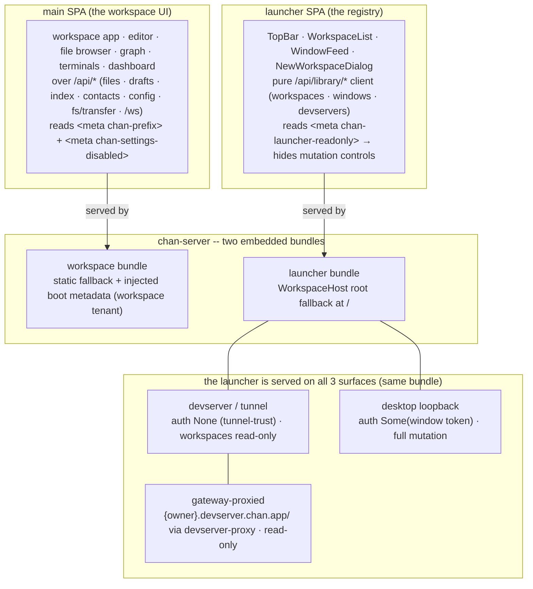
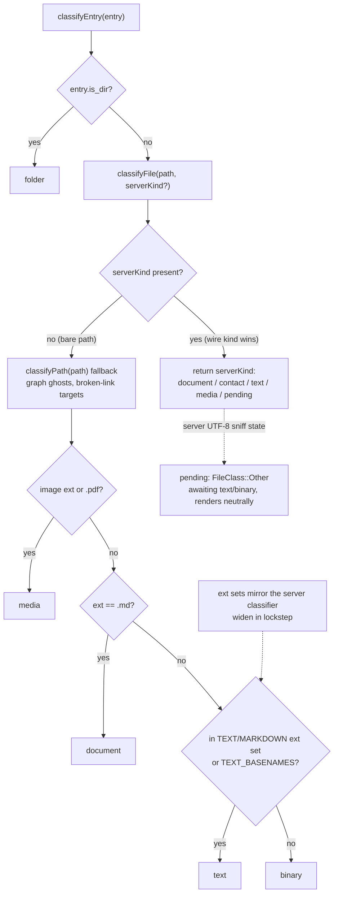

# chan web frontend

Design reference for the chan web frontend: first the two web SPAs and how each
is served, then the color system both share. Update this file with changes to the
frontend serving topology, palette variable model, editor theme contract, syntax
highlight palette, or kind taxonomy.

## Two web frontends

chan ships **two** Svelte 5 + Vite web SPAs, both embedded into chan-server as
bundles and both built on the color system below:

- **The main SPA** is served as the workspace tenant fallback. The server stamps
  boot metadata for the URL mount prefix and whether Settings is disabled, so a
  reverse-proxied instance builds correct `/api` URLs and can grey restricted
  controls.
- **The launcher SPA** is served at the host/library root `/` through the
  `WorkspaceHost` root fallback. It reads `<meta chan-launcher-readonly>` to hide
  mutation controls on read-only surfaces. The launcher is reached on **all three
  surfaces** -- devserver/tunnel, gateway-proxied
  (`{owner}.devserver.chan.app/`), and desktop loopback -- the same bundle
  per-surface installed, with per-surface auth (None tunnel-trust / Some loopback
  window token) and a read-only-gateway vs full-loopback workspace-mutation
  split. Its serving and auth contract is documented in the launcher design doc.

The two are complementary: the launcher is the cross-workspace registry (pick / add / toggle a workspace, mint a window), and opening a workspace window lands the user in the main SPA. Both honor the theme axes + canonical palette below, so a launcher served over a tunnel and the workspace UI on loopback read identically.

## Colors and themes

The rest of this document is the single reference for the chan frontend color system: two theme axes, one canonical semantic palette, and a fixed syntax-highlight palette for code.

## Two theme axes

The frontend has two independent theme dimensions. Both can change at runtime.

1. **Color scheme** (`data-theme="light"` or `data-theme="dark"`). Controls the entire CSS-variable palette: backgrounds, text, accents, pill hues, graph node hues, etc. The dark scheme is the default variable block and light is an override block. App state applies the resolved choice to `<html>`. Because the blocks key off the *attribute* (not the `html` element), a Hybrid surface can re-apply a scheme to its own subtree: each surface root (editor, browser, graph, terminal, dashboard) sets `data-theme={surfaceThemeOverride(kind)}` from the `hybrid_surface_themes` preference, overriding the global pick for just that surface.

2. **Editor theme** (`data-editor-theme="github"`, `"google_docs"`, or `"word"`). Controls the editor surface only: body font, heading scale, code font, link color, code-block slab bg, table borders, blockquote rule. It is expressed as `--chan-editor-*` variables with neutral defaults and per-theme overrides. Dark variants must support both root-level and descendant `data-theme="dark"` selectors so a per-surface dark override restyles the editor too. App state applies the editor-theme attribute to `<html>` (default `github`); the preference (`editor_theme`) lives server-side and propagates to every open window via the WS `config_changed` event. The picker is the editor surface's config flip-side.

The axes are orthogonal. Any combination of color scheme by editor theme is valid (6 combinations total). Only the color-scheme axis affects app chrome (panes, status bar, file tree, panels, modals); the editor-theme axis is scoped to the editor surface.

A third, fixed dimension is the **syntax-highlight palette**. It is GitHub Primer
(light or dark, branched off the color scheme) and is shared across all three
editor themes, so a python snippet reads identically regardless of which document
chrome is active. It paints fenced code blocks (per-language packs lazy-load) and
whole files in Source mode. One deliberate Primer divergence is part of the
contract: plain identifiers get no color because Primer's orange collides with
chan's brand orange.

## Canonical semantic palette

Each concept gets one hue across surfaces (graph node, file-tree row, info-pane accents, editor pill). Picking a hue per concept means the same item reads the same color whether you see it in the graph, the editor, or the inspector.

Concept hues are stable across surfaces: document orange, media purple, tag
green, contact/warning yellow, date/folder neutral grey, broken/error red,
source royalblue, binary dark grey, language pink, and drafts yellow tint.

## Resolved values per surface

Graph nodes, file-tree icons, and editor pills read from the same concept
palette rather than inventing local hues. Some concepts have no representation
on a given surface (for example tags do not have file-tree icons, and folders do
not have editor pills).

There is no dedicated `--g-contact` token; the graph reads `--warn-text` directly for contact and mention nodes. Add one only if the graph ever needs to diverge from the warning hue.

`--chan-color-language` is the source token for the language hue; `--g-language` and `--chan-color-code` alias it.

Pill backgrounds (`--pill-*-bg`) are alpha tints of the concept hue (~0.15-0.20 dark, ~0.10-0.14 light). Foregrounds split by scheme: dark mode uses `var(--text)` for every pill (the tinted background alone carries the hue); light mode uses the deep hue as ink (`#c25a1f` wiki, `#7a4cd8` image, `#2f9444` tag, `#9a6700` contact, `#6c6c70` date, `#c93232` broken). Wiki and tag pills also define `--pill-*-bg-hover` because they are click targets.

## Kind taxonomy

The frontend defines one unified taxonomy used by every chip, tree icon, and
inspector header glyph. Three families:

- **FileKind**: things that exist as files in the workspace. `document` | `contact` | `text` | `media` | `binary` | `pending`.
- **EntityKind**: graph-only entities (tokens extracted from markdown bodies, no file backing). `tag` | `mention` | `date`.
- **ContainerKind**: `folder` (directory rows in the file tree).

`classifyEntry`/`classifyFile` resolve a workspace entry to one kind:

`classifyEntry(entry)` / `classifyFile(path, serverKind?)` is the single classifier. The server projects a `kind` discriminator on every regular file it lists, and that wire value wins whenever present. The path-only fallback runs only for bare paths held outside a tree listing (graph ghost rows, broken-link targets): images + PDFs are `media`, `.md` is `document`, `.txt` plus the source/config/shell extension set and well-known basenames (Makefile, LICENSE, ...) are `text`, everything else is `binary`. The extension sets mirror the server classifier and must be widened in lockstep. `pending` is a server-side state for unknown extensions awaiting the UTF-8 content sniff; it only reaches the SPA from the recursive whole-tree listing and renders neutrally.

One chip component renders every kind. Inspector headers pass `block` (flex:1
fill); the search results list passes `compact` (smaller font + fixed-width
column). `ghost` and `dim` modify opacity for graph ghost rows and search
filename-match rows respectively. Passing `onClick` renders the chip as a button
(the "scope the graph to this file" affordance).

### Per-kind mapping

Documents and source-like text share the document hue family but use different
icons and labels. Contacts and mentions share the warning/contact palette; media,
binary, tags, dates, and folders each use their corresponding concept hue and
glyph.

`text` aliases the document orange in `colorVarFor` -- the two share the hue family and the visual distinction is icon + label, not color. The graph's source-file nodes use `--g-source` royalblue; the graph renderer owns that mapping, not the chip.

A `mention` shares the contact palette by design: a resolved mention points at a contact file, an unresolved mention is the same concept without a backing file. Distinguishing the two is the role of the inspector, not the chip.

## Functional and chrome variables

The color-scheme axis owns app chrome: surfaces, text, lines, hover/selection
states, functional colors, buttons, bubbles, shadows, and drafts tint. The
editor-theme axis owns document chrome: body, headings, code, inline links, and
block elements. Keep the axes separate so a color-scheme change does not imply a
document-theme change.

## Axis intersection

Slab bg and the H1/H2 hairline rule track the editor theme; the syntax palette only tracks the color scheme.

## Adding a new concept

1. Pick a hue family. Try to reuse an existing one (document orange, media purple, tag green, contact yellow, source royalblue, language pink, neutral grey, error red) before introducing a new hue. Each new hue has to defend its hue distance from those already in use.
2. Add the dark + light hex to the color-scheme palette blocks under domain-specific variable names (`--<concept>-fg`, `--<concept>-bg`, etc.).
3. Pipe the new variable into every surface that should display the concept (graph node, file tree row, info accents, editor pill, etc.). Each surface reads its own variable name so a future hue swap is a one-line palette edit.
4. Add the row(s) to this document.

## Adding a new editor theme

1. Add a named editor-theme stylesheet. Override only the `--chan-editor-*`
   tokens that should diverge from the neutral base; missing tokens fall through
   to the color-scheme palette.
2. Light goes under `:root[data-editor-theme="<name>"]`; dark goes under
   `:root[data-editor-theme="<name>"][data-theme="dark"]` plus the descendant
   `[data-theme="dark"]` form for per-surface overrides.
3. Register the stylesheet with app startup.
4. Add the value to the API type contract and register the option in the editor
   config picker.
5. Decide whether the theme wants the GitHub-style H1/H2 rule; opt in by setting `--chan-editor-h{1,2}-border-bottom` and `--chan-editor-h{1,2}-padding-bottom` (the neutral base defaults these to `none` / `0`).

The new theme inherits the GitHub Primer syntax-highlight palette automatically; it is not part of the editor-theme contract.

## Change discipline

Palette, editor-theme, syntax-highlight, serving-topology, and kind-taxonomy
changes update this document in the same commit. When widening text/source
extension handling, update the server classifier and frontend fallback together.
