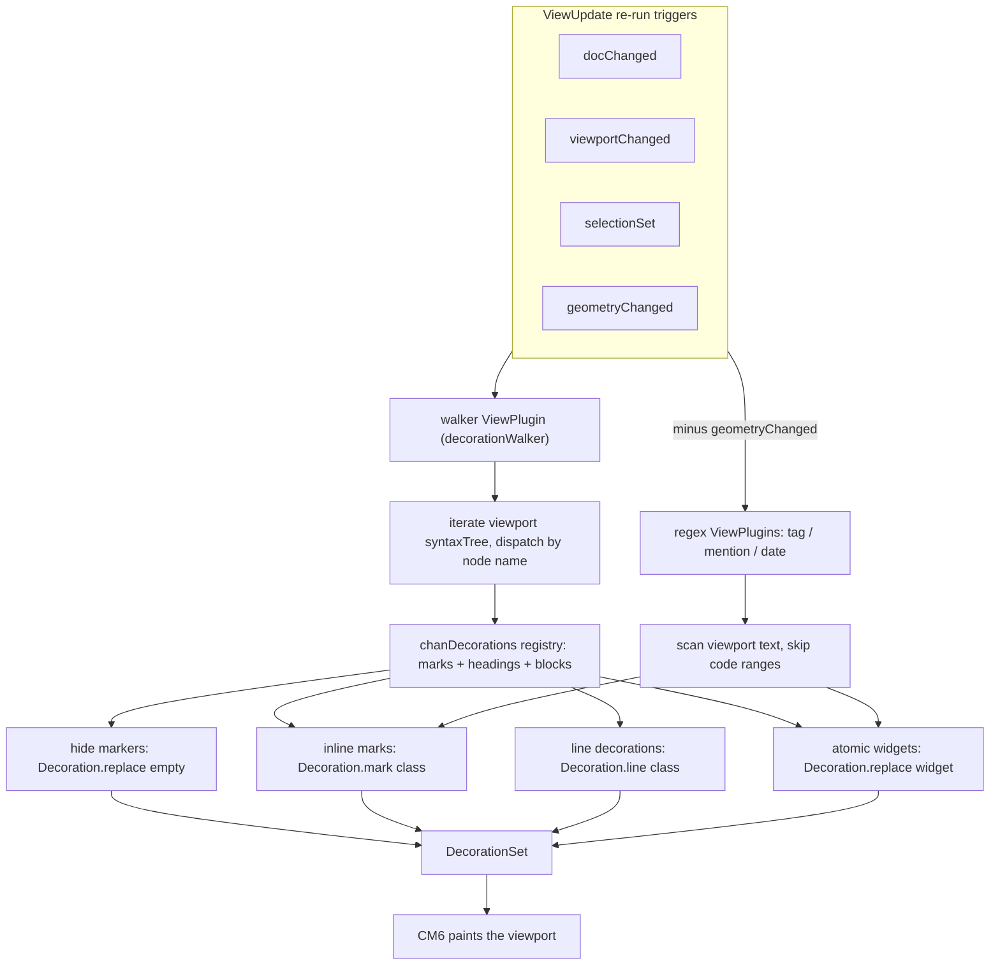
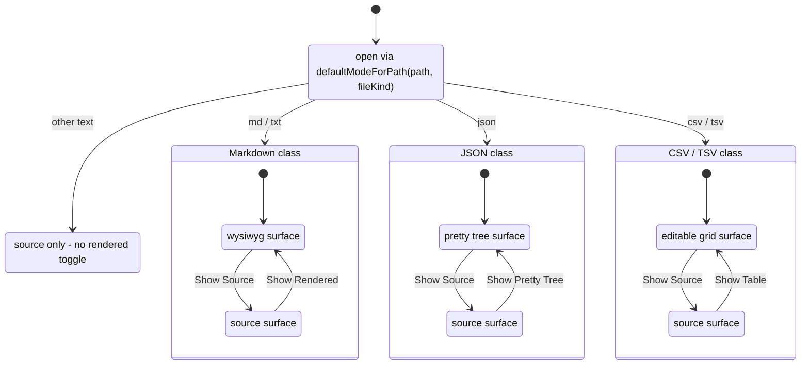
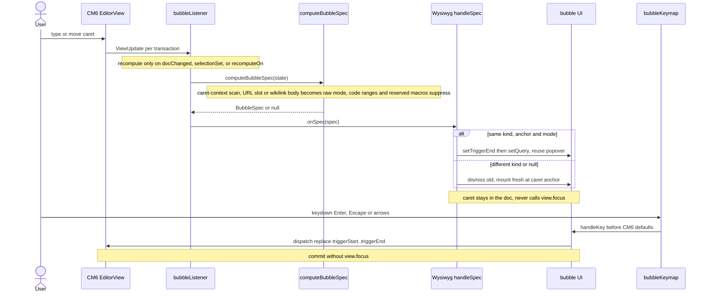
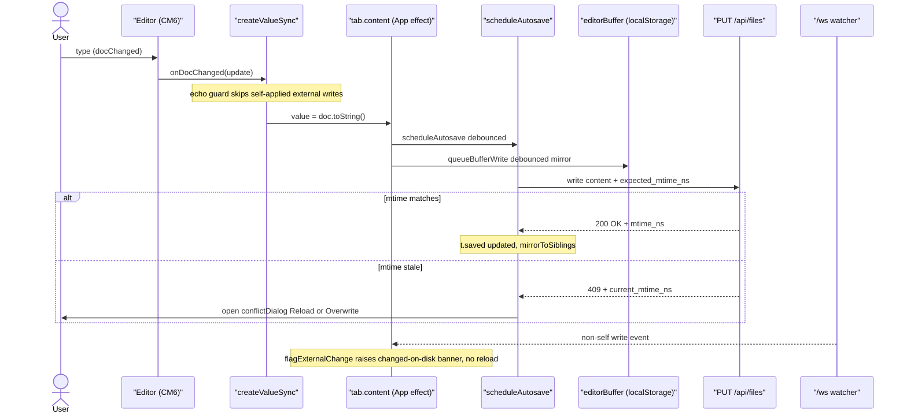

# chan editor (CM6) - design

Load-bearing reference for the chan editor. Mirrors the workspace design doc's
role for the editor surface.

## Model

The document text IS the markdown source. `view.state.doc.toString()` is the file on disk; there is no separate rendered tree and no serialization layer. The editor decorates the source in place (hide markers, render widgets) so it reads like rendered markdown while every character stays editable. This is the Live Preview model, the same architecture as Obsidian's.

Because the source is the single source of truth, the editor sidesteps a class of structural bugs a rendered-tree model is prone to: editing 1-char marks like `*a*`, flickering pending-mark heuristics, and markdown round-trip escape gymnastics. See "Why 1-char marks work" below.

## The contract (10 invariants)

1. **Doc invariant.** `view.state.doc.toString()` is the markdown source. Always. No transform layer. Autosave writes it directly.

2. **Token detection.** `syntaxTree(state).iterate({from, to, enter})` from `@codemirror/lang-markdown` + GFM, extended with two custom lezer parsers: `[[wikilink]]` (inline) and YAML frontmatter (block-start, so headings inside `---...---` are not promoted). Fenced code bodies parse with lazy-loaded per-language packs. Tokens that are not lezer nodes - `#tag`, `@@mention`, dates - are matched by regex in their own ViewPlugins, skipping code ranges.

3. **Decoration taxonomy.**
   - **Hide markers**: `Decoration.replace({})` over `*`, `**`, `~~`, `` ` ``, `[`, `](`, `)`, and `# ` heading prefixes. Blockquote `>`, list markers, `---` rules, and ```` ``` ```` fences are NOT hidden: the marker is the visual cue (Obsidian convention) and hiding `---` / fences makes the block structure harder to edit.
   - **Inline marks**: `Decoration.mark({class})` over the *content* between markers - emphasis, strong, strike, inline-code, link-label.
   - **Line decorations**: heading levels (`cm-md-h1..6`), list lines, blockquote lines, fence opener/content/closer rows - CSS paints size, indent, borders, slab background.
   - **Atomic widgets**: `Decoration.replace({widget})` over the *whole* range - wikilink/internal-link pill, image, date pill, GFM table grid, mermaid diagram, page break. `EditorView.atomicRanges` registered for each so caret motion skips them in one keystroke. The task checkbox is a replace widget over just the `[ ]` / `[x]` marker (not atomic; the click toggles the source).

4. **Visibility rule (per token kind).**
   - **Marks** (bold/italic/strike/code/link markers): hide unless the active selection intersects the OUTER token range `[from, to]`. Equality at the boundary counts as intersection, and the outer-range rule (not per-marker) means a caret near `*a*` reveals both `*` together instead of `*a` then `a*`.
   - **Heading prefixes** (`# `): hide unless the caret line intersects the heading's line. Selection-intersect alone causes flicker as the caret crosses the prefix mid-line.
   - **Atom widgets**: show widget unless selection intersects the source range; on intersect, suppress the widget and reveal source so the user can edit literally.
   - **Always-visible markers** (`>`, list markers, `---`, fences): styled via marks/line decorations, never hidden.

5. **Atom strategy (split by token type).**
   - **Wikilinks (`[[note|alias#anchor]]` and `[label](path)` where `path` is internal)**: atomic pill widget. Pill kind (file / contact / image / broken) resolves via `GET /api/resolve-link`, cached per target. Editing means caret-adjacent reveals raw text, OR click pill -> wiki bubble.
   - **External markdown links `[label](https://...)`**: hide markers only (`[`, `](`, `)`); `link` mark on label; URL editable in place.
   - **Naked URLs**: mark only, no hide.
   - **Tables**: read-only grid widget; click drops the caret at the source start, which reveals the pipe form for editing.
   - **Mermaid**: a closed ```` ```mermaid ```` fence renders as a diagram atom while the caret is outside; caret inside reveals source. The mermaid library is dynamic-imported on first render.
   - **Tag `#word` / mention `@@{name}` pills**: mark-based (no replace), with click handling delegated through one content-DOM listener.

6. **Selection rule for ranges.** A non-empty selection that crosses any token's range reveals all of those tokens uniformly. No special cases.

7. **Bubbles** (`[[`, `![`, `@@`, `@`, `#`) open/close from `computeBubbleSpec`, which inspects the doc text around `state.selection.main.head` on every transaction via `bubbleListener`; the editor host mounts/reuses the bubble UI. Triggers also fire in "raw" mode when the caret sits inside an existing Link/Image URL slot or `[[...]]` body, so commit replaces the right range. Triggers never fire inside code ranges, and the reserved macro words (`@today`, `@date`, `@pagebreak`, `@break`) suppress the contact bubble. The bubble keymap intercepts before CM6's defaults via a high-precedence `keymap.of`. Bubbles must NOT call `view.focus()` mid-flow - the caret stays in the document and the popover runs alongside it.

8. **Find** uses one shared `scanMatches` pipeline. The `findField` and `FindAdapter` shape are shared by both Source and WYSIWYG modes.

9. **Fold** uses `@codemirror/language` `foldService` with a heading-level-aware computer: line `^#{n} ` folds end-of-line -> start of next `#{<=n}` line (or doc end). The chevron gutter is custom (headings only): `foldGutter()` would chevron every foldable block because lang-markdown marks paragraphs, quotes, and fences foldable too.

10. **Autosave** writes `view.state.doc.toString()` on `update.docChanged` to the bindable `value` prop. The echo guard prevents prop write-back from clobbering the caret, and the debounced autosave pipeline owns the server write. No serialize step. The CAS contract on `PUT /api/files` (`expected_mtime_ns`, 409 + `current_mtime_ns` on conflict) is the conflict gate; a watcher event for a non-self write flags a "changed on disk" banner instead of auto-reloading. A debounced localStorage mirror keyed by path is kept for hang-recovery.

## Decoration pipeline

Every ViewUpdate re-walks the viewport syntax tree and merges the four decoration kinds, plus the regex tag/mention/date plugins, into the one DecorationSet CM6 paints.



## Why 1-char marks work

`*a*` is three real characters in the doc: `*`, `a`, `*`. The `*` markers at `[0, 1]` and `[2, 3]` get hide-decorations whenever the selection does NOT intersect them. A caret at offset 1 (between `*` and `a`) intersects both `[0, 1]` (caret == to) and `[2, 3]` (caret == from), so both markers reveal. No special case. Backspace deletes a real `*` character the user can see, and round-trip is the identity function. A rendered-tree model that represents `*a*` as a single marked node has no integer caret position satisfying `from < caret < to` when `to - from == 1`, which is the structural reason that model needs a per-pattern boundary patch and this one does not.

## Modes

The file editor host owns a per-tab mode: `wysiwyg` | `source` | `pretty` |
`table`. Markdown-class files (.md/.txt) pair WYSIWYG with source; JSON opens
as a collapsible tree and CSV/TSV as an editable grid, each with source as the
toggle. Any other text-kind file is source-only - source IS the sensible surface
for a .py / .toml / Makefile. Source mode highlights by extension via the same
lazy language packs.

`FileEditorTab` picks the initial mode by file class, then toggles source against the single rendered surface each class pairs with; plain text is source-only.



## Bubbles

Each transaction recomputes the bubble spec; the host mounts or reuses one popover and commits a range replace through a high-precedence keymap, never stealing focus from the document.



## Server contract

The editor relies on three server contracts: file reads/writes with optimistic
CAS, picker/classification lookups for links, contacts, tags, headings, and
images, and a watch stream whose self-write filtering keeps autosave from
reloading the buffer it just wrote.

## Autosave and conflicts

A keystroke flows through the echo guard and debounced autosave to a CAS `PUT /api/files`; a stale mtime returns 409 and opens the conflict dialog, while a non-self `/ws` event only raises the changed-on-disk banner.



## Implementation notes

- List continuation and indent/outdent match the current line with a regex, not
  the syntax tree, so the edit stays cheap and local.
- Heavy or optional modules load lazily on first use: mermaid (diagram render), turndown (HTML-paste -> markdown), HEIC -> WebP conversion before image upload, and the per-language code packs (one vite chunk each).

## Out of scope

- In-cell table editing: the grid atom is read-only; edits happen in the revealed pipe/dash source.
- YAML highlighting inside frontmatter: the block is isolated and dimmed, the body is unstyled.
- Collaborative editing is not implemented.
